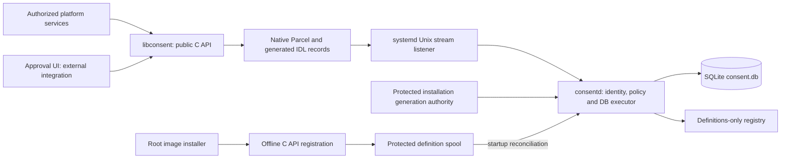

# consent / consentd

A consent framework for Tizen system services. `libconsent` provides a public C
API for registering consent definitions, requesting user approval, checking
authorization, and managing the lifetime of session data. `consentd` authenticates
callers and serializes policy decisions and durable state.

## Project status

The framework has executable C API scenarios, GBS packages, and emulator
verification for the implemented workflows. The [verification record](docs/guides/07-verification.en.md)
identifies tested snapshots, failure scenarios, and remaining limits.

Product integration is still required for trusted service identities, the
Installer's durable transaction lifecycle, and product approval UI integration.
Production role configuration starts empty and denies unenrolled callers. An
isolated .NET Consent UI proof of concept is included, with GBS-built TPKs and
separate service mocks. See the [PoC guide](docs/guides/08-consent-ui-poc.en.md)
for installation and interactive scenarios.
The [original design proposal](docs/design/01-consent-framework.md)
remains a proposal, with adopted choices recorded in the
[decision log](docs/design/05-decisions.en.md).

## Capabilities

- Explicit package/app registration, package-wide removal, revision checks, and
  retry identifiers tied to installation generations.
- Synchronous and asynchronous request/check APIs. `QUERY` observes policy;
  authoritative `AUTHORIZE` checks atomically consume one-time grants.
- Localized approval messages with bounded typed templates and responses bound
  to the displayed prompt, policy, and session generation.
- Feature selections bound to exact provider, scope, purpose, recipient and
  period. The opt-in approval contract displays only missing permissions while
  retaining the complete requirement set for final evaluation.
- Logical sessions, data-use permits, provenance, expiry, revocation, and holder
  cleanup acknowledgements. Stored metadata does not include conversation bodies.
- SQLite recovery and definitions-only reconciliation. Recovery never rebuilds
  user approvals from package definitions.
- Explicit root-only offline registration through the public C API, using a
  protected spool and daemon startup reconciliation. A staged definition is not
  an active registration or an approval.

## Components



Clients use `/run/.consentd.sock`. Systemd owns the endpoint and passes its
listener to the daemon for both boot startup and socket activation. The daemon
runs as the verified platform `security_fw` account; a separate root helper
prepares protected storage. Caller roles require kernel credentials, SMACK
identity, executable verification, and explicit policy enrollment.

## Repository layout

```text
src/
  consent/inc/          Public C headers; consent.h is the umbrella
  consent/              C API implementation and client
  consentd/             Daemon, identity, policy and storage
  common/               Shared bounded codecs and utilities
  protocol/             Shared Parcel IDL
  tools/                IDL compiler, provisioning tools and API scenarios
  tests/                Unit and integration test sources
  examples/             Executable C API integration examples
  consent-ui/           .NET Settings, approval popup and negative identity probe
  mocks/                Separate argo, CM, CE, holder and Installer participants
  poc-tools/            PoC app launcher and socket identity diagnostic
packaging/              RPM spec, SMACK manifest and systemd units
scripts/                Emulator and verification orchestration
docs/
  design/               Numbered proposal, architecture and implementation decisions
  guides/               Numbered English/Korean development and integration guides
```

## Build and start development

Use a configured Tizen GBS SDK and a development emulator accessible through
`sdb`. The build requires CMake 3.12+, Python 3, C11/C++17 toolchains, and target
development packages for GLib/GIO, SQLite, libsystemd, pkgmgr-info,
capi-base-common, and native Tizen `parcel`. Python generates the protocol during
the build and is not a dependency of the production runtime packages.

Discover the device architecture first. The command below uses the locally
verified `tizen_10_1_emulator` profile and x86_64 architecture; select the profile
and architecture that match your SDK and target.

```sh
sdb devices
CONSENT_DEVICE='selected-development-emulator-serial'
sdb -s "$CONSENT_DEVICE" shell 'uname -m; systemctl --version'
gbs build -A x86_64 -P tizen_10_1_emulator --include-all \
  -B /var/tmp/consent-gbs-root
```

The default RPM configuration builds `consent`, `consentd`, `consent-devel`,
`consent-tests`, and the separate `consent-poc` package. The PoC adds a GBS
.NET SDK/NuGet build dependency and compiles its TPKs from source. Follow the [development guide](docs/guides/01-development.en.md) for package
installation, identity provisioning, and isolated emulator scenarios. Recovery
tests use explicit isolated state and include destructive DB operations.

Consumers include `<consent.h>` and compile against installed metadata:

```sh
cc consumer.c -o consumer $(pkg-config --cflags --libs consent)
```

The [C API guide](docs/guides/02-c-api.en.md) includes executable examples,
parameter/result ownership, callbacks, and authorization semantics. Use
[offline registration](docs/guides/04-offline-registration.en.md) when an image
installer must register definitions without a running daemon; online errors
never implicitly enable offline writes.

## Interactive approval PoC

The [Consent UI guide](docs/guides/08-consent-ui-poc.en.md) describes the .NET NUI
popup, GBS-built TPK installation and separate mock participants. The popup uses
the public C API through a dedicated worker, supports English/Korean messages,
and requires an explicit allow or deny choice. Allowing requires every page to
be reviewed; changing language resets that
review. Closing the popup never approves a request. The PoC has its own systemd
socket, daemon, storage and observed package identity; production role enrollment
remains a separate integration task.

The [feature approval guide](docs/guides/10-feature-approval.en.md) adds a TV-oriented
flow: select understandable features in Settings, approve the current task's
missing permissions together, and reuse permitted results in the same
conversation. Settings offers this conversation or 30 minutes; an explicit
task-only choice uses ONCE without changing saved selections. Users review the
actual task target and effect even when an existing grant avoids another popup.

A separate argo mock owns the catalog and submits requests through the public C
API. Settings receives no argo role. Each provider action still requires
AUTHORIZE and a current selection check immediately before it starts. The mock
calendar and device participants demonstrate execution and holder cleanup;
they do not access a user's calendar or control physical devices. Later catalog
permissions never silently join an earlier selection.

The [storage maintenance guide](docs/guides/09-storage-maintenance.en.md) explains
bounded metadata compaction and the retry/cleanup records it preserves. Loss of
the independent definitions registry still blocks startup; an automatic reset
would not establish that old registrations or execution outcomes are current.

## Documentation

Start with the [documentation index and reading order](docs/README.md), which
links each English guide to its Korean counterpart.

| Topic | English | 한국어 |
| --- | --- | --- |
| Development and deployment | [Guide 01](docs/guides/01-development.en.md) | [가이드 01](docs/guides/01-development.ko.md) |
| Architecture and trust boundaries | [Design 02](docs/design/02-architecture.en.md) | [설계 02](docs/design/02-architecture.ko.md) |
| Installer integration contract | [Guide 06](docs/guides/06-installer-integration.en.md) | [가이드 06](docs/guides/06-installer-integration.ko.md) |
| Verification and remaining scope | [Guide 07](docs/guides/07-verification.en.md) | [가이드 07](docs/guides/07-verification.ko.md) |
| Feature selection and task approval | [Guide 10](docs/guides/10-feature-approval.en.md) | [가이드 10](docs/guides/10-feature-approval.ko.md) |

Contributors and coding agents should also read [AGENTS.md](AGENTS.md).

## License

Licensed under the [Apache License 2.0](LICENSE). Source files retain the full
copyright and license notices used by the Tizen appfw reference projects.
