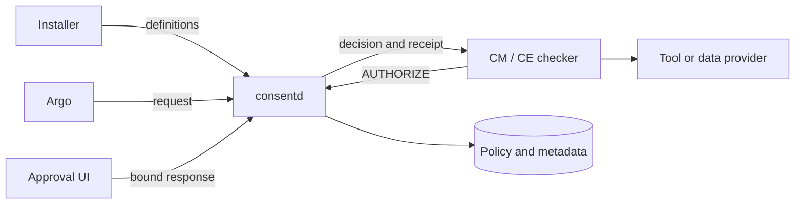

# Consent

Consent lets Tizen services ask for user approval before executing a tool or
reading data. `libconsent` is the public C API; `consentd` authenticates
callers, evaluates policy and stores decisions. Definitions describe
permissions and
localized messages. Grants record approved access. Tool results and context
bodies stay with their providers, outside the consent database.

## How approval works

1. An authenticated Installer registers definitions for a package and app.
2. Argo requests approval for a subject, profile and exact requirement tuple:
   capability, operation, scope, purpose, recipient and policy version.
3. The approval UI displays the bound request and submits the user's choice.
4. The CM or CE checker calls `AUTHORIZE` immediately before the protected
   action. It requires status 0, ALLOWED and a receipt, then prevents duplicate effects.

`QUERY` only observes policy. It never opens UI or authorizes execution.
Access grant duration and acquired-data retention are separate policies.


```mermaid
flowchart LR
  I[Installer] -->|definitions| D[consentd]
  A[Argo] -->|request| D
  U[Approval UI] -->|bound response| D
  E[CM / CE checker] -->|AUTHORIZE| D
  D -->|decision and receipt| E
  E --> P[Tool or data provider]
  D --> DB[(Policy and metadata)]
```

## Current status

The framework has GBS packages, executable C API scenarios and isolated
emulator verification. The .NET NUI example includes a compact popup and an
opt-in always-allow choice. The repository's UI runner verifies actual screen
interaction and synthetic CM/CE effects over real consent IPC.

Product CM/CE adapters, trusted UI/argo deployment, sessiond profile mapping
and privileges, and physical holder cleanup still need integration. Each
plugin owns Installer hooks and must use authenticated publication and
protected package/app generations. Production roles start empty and deny
unenrolled callers. See [verification status](docs/guides/07-verification.en.md)
and the [integration
checklist](docs/guides/16-maintenance-and-integration.en.md).

## Start here

| Task | Guide |
| --- | --- |
| Build and deploy | [Development](docs/guides/01-development.en.md) |
| Call the C API | [First C client](docs/guides/api/01-start.en.md) |
| Register tool/data policy and request approval | [Concrete inputs](docs/guides/13-tool-examples.en.md) |
| Connect mock CM/CE services | [Mock service examples](docs/guides/14-mock-services.en.md) |
| Run the actual native UI smoke | [One-command UI verification](docs/guides/17-native-ui-smoke.en.md) |
| Provision profiles | [Profile authority](docs/guides/15-profile-authority.en.md) |

The [documentation index](docs/README.md) links every English/Korean pair,
architecture document and historical record. The original CEP remains a
proposal; the decision log identifies adopted contracts.

Use a configured Tizen GBS SDK and a development emulator reachable through
`sdb`. Select the profile and architecture for that target; these commands
illustrate the verified x86_64 emulator profile:

```sh
sdb devices
CONSENT_DEVICE='selected-development-emulator-serial'
sdb -s "$CONSENT_DEVICE" shell 'uname -m; systemctl --version'
gbs build -A x86_64 --profile tizen_10_1_emulator --include-all
```

The default build includes the separate PoC package and its .NET SDK inputs.
Guide 01 explains dependencies and package installation. Destructive recovery
checks must use isolated state on a selected development emulator.

In a compatible Tizen SDK or on a target with matching development packages,
consumers include `<consent.h>` and use installed pkg-config metadata:

```sh
cc consumer.c -o consumer $(pkg-config --cflags --libs consent)
```

The production client connects to the systemd-owned `/run/.consentd.sock`.
The daemon runs as `security_fw`; roles require verified credentials, SMACK
labels and executable identities. Offline image registration is explicit and
stages definitions only. It does not create approvals or silently replace
failed online calls.

## Repository

Production libraries, daemon, UI and tools are under `src/`. Tests are under
`tests/`, packaging under `packaging/`, and runners under `scripts/`.
Read [AGENTS.md](AGENTS.md) before contributing.

## License

Licensed under [Apache License 2.0](LICENSE). Source copyright and license
notices are retained.
