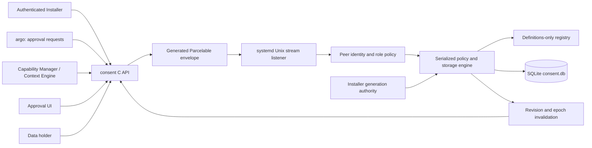
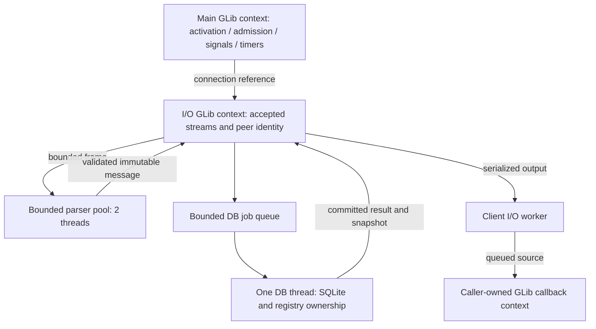
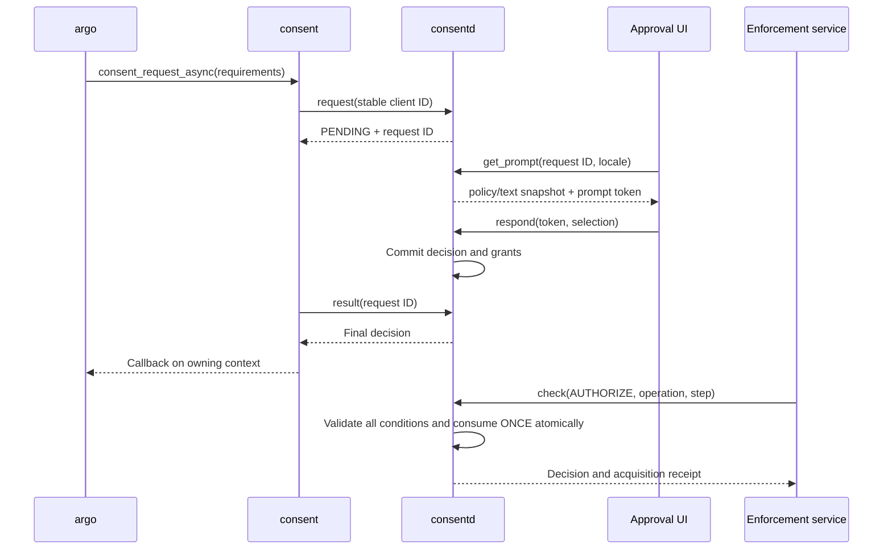
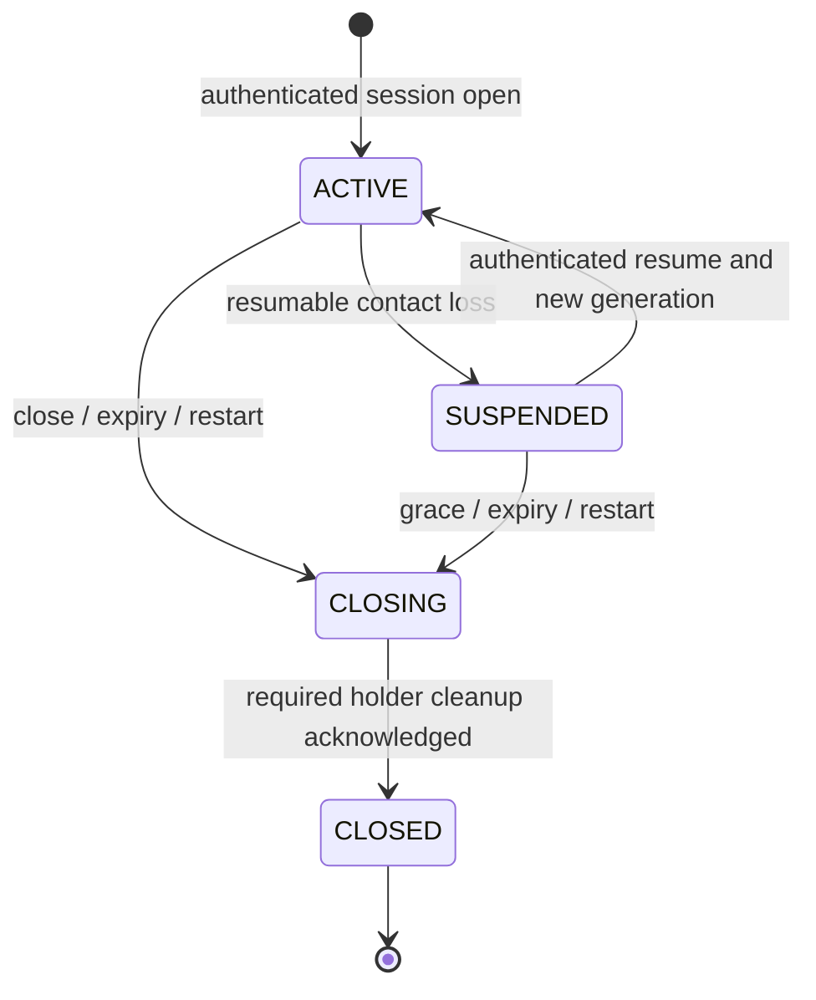
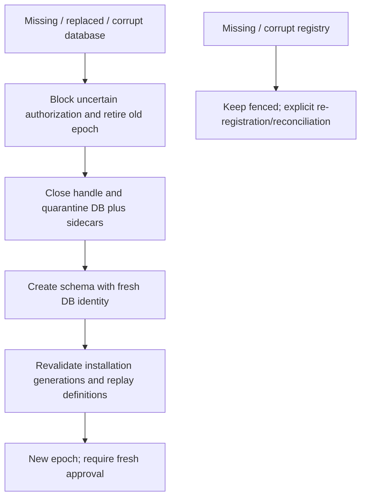

# Architecture and trust boundaries

This guide describes the implementation in this repository. The CEP defines the
intended framework; [implementation decisions](decisions.en.md) record adopted
choices. [Storage design](storage-design.en.md) and [wire protocol](protocol.en.md)
describe the respective formats. Platform integration and test evidence are
reported separately from isolated tests.

## Components

The public C API uses opaque parameter/result objects and a C++ implementation.
Both package name and app ID are explicit registration arguments. Removal takes
package name, an operation ID, and the expected installation generation; it never
requires an app ID. Multiple apps can share a package generation. A stable
operation ID is bound to the payload so a retry cannot silently change its scope.

The compiler reads `src/protocol/consent.idl.json` and generates native
`tizen_base::Parcelable` classes at build time. The public C API does not expose
Parcel classes. Four-byte big-endian length framing surrounds the native Parcel
payload; bounded reads validate it before protocol dispatch. DB/registry metadata
uses a separate versioned canonical representation, not the wire encoding.

## Execution and ownership

The initial limits are 64 connections, 128 parsing jobs, 128 DB jobs, 32
in-flight requests per connection, 64 KiB payloads, and 256 KiB output queues.
There is a per-UID connection quota with additional room for authenticated
control roles. These are engineering defaults, not measured product capacity
claims. Parser and DB work never wait for user input. The client polls an accepted
pending request by request ID; an approval does not occupy a daemon worker.

Only the I/O thread changes connection buffers and sources. SQLite and the
registry belong to the DB executor. Results include the daemon/DB epoch and
revision. Before publication, the server compares the reply epoch to the current
snapshot, so recovery cannot relabel an old `ALLOWED` result as a new decision.
Storage uncertainty invalidates client synchronization. Shutdown stops admission,
closes connections, drains accepted DB jobs, persists session/cleanup state, then
joins workers while callback contexts remain alive.

Each client has a bounded I/O worker and short mutex-protected state. Async calls
are made on the thread owning the specified GLib callback context; callbacks are
queued after return, never invoked while holding the client mutex. Local wait
timeout does not cancel a remote request. A forked child cannot use inherited
handles or deliver parent callbacks and must create a new client.

## Identity and installation

A role is derived from kernel `SO_PEERCRED`, kernel `SO_PEERSEC`, the protected
absolute executable path and device/inode, and a root-owned allowlist. The daemon
checks process start time, UID and executable identity again before processing
and sending results. Root UID, process basename, and protocol role claims grant
no authority. `subjects`, `profiles`, `packages`, and enforcement delegation are
separate allowlist dimensions.

The inspected emulator runs kernel 4.4.35. The fallback uses start-time checks and
cannot eliminate every race between socket connection and the first process
lookup. Conditional pidfd support on newer kernels is additional evidence, not a
claim that the old target supplies it. The production configuration starts with
no trusted role entries. Actual argo, UI and Installer deployment remains an
integration task; an existing executable with a similar name is not enrolled.

Production registration verifies the app/package relationship with pkgmgr-info
and compares `expected_generation` with a separately protected Installer
authority. `consent-installation-authority` provides begin/attach/commit/remove
operations with durable updates, retry fingerprints and tombstones. A pending or
removed generation cannot activate definitions. This provisioning contract does
not imply that an existing platform Installer lifecycle hook is already wired.
See [installation authority](installation-authority.en.md).

Test daemons and clients are separate compiled targets with an isolated endpoint,
role configuration and persistent state. They retain executable/UID/SMACK role
checks and replace only package inventory lookup with the explicit test authority.
There is no production runtime switch or environment variable to bypass identity.

## Approval and data lifecycle

QUERY is advisory; AUTHORIZE is required at the actual access boundary. All
requirements must pass before any ONCE grant is consumed. Repeated operation/step
calls require the same fingerprint and current validity. Approval UI tokens bind
the displayed policy/text to a live UI instance. Approval UI rendering itself is
external; the repository implements its authenticated protocol.

Access grants and retained-data permissions are distinct. Receipts bind acquired
scope to the holder and session; artifacts record metadata and provenance only.
Derived artifacts inherit parent restrictions. Session close blocks access before
holder cleanup completes. A failed or missing ACK cannot turn CLOSING into a
successful CLOSED state. Actual data, prompts, history and model caches remain
the responsibility of the integrated holders; this daemon cannot erase another
process's memory.

## Recovery boundary

The definitions registry is desired-state authority. Registry fsync/rename happens
before the SQLite projection transaction; they are not a cross-file atomic
transaction. Durable independent DB identity detects replacement by an older valid
DB. Recovery never copies user decisions or usage from the registry. Existing
cleanup metadata can be lost with the whole DB; holders must treat a new epoch as
invalidation and reconcile, not assume physical deletion succeeded.
