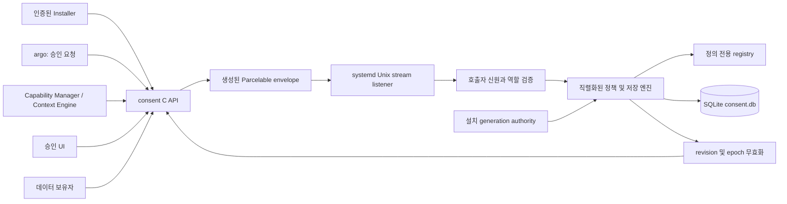
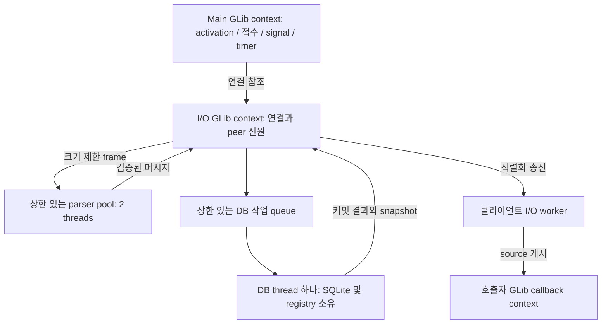
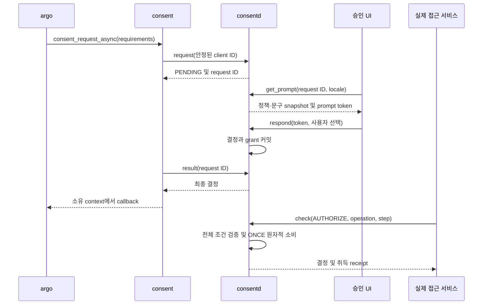
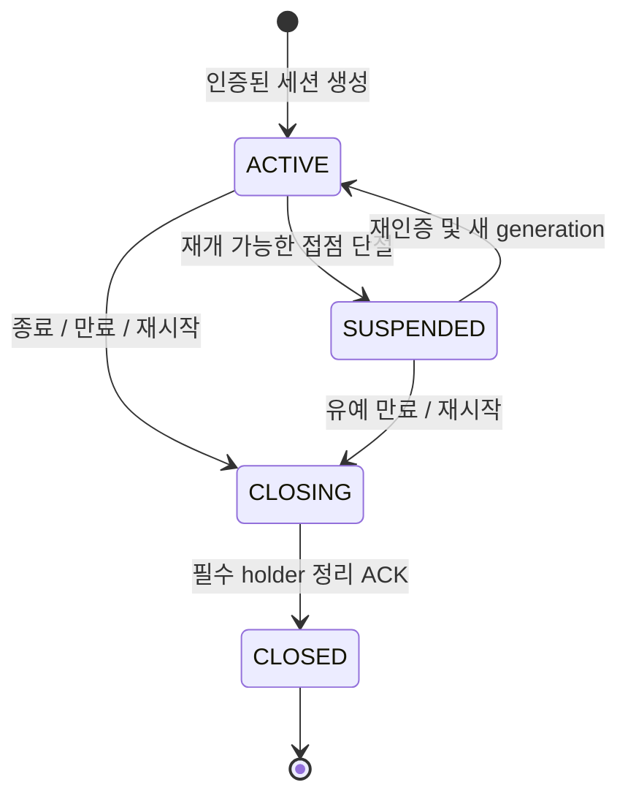
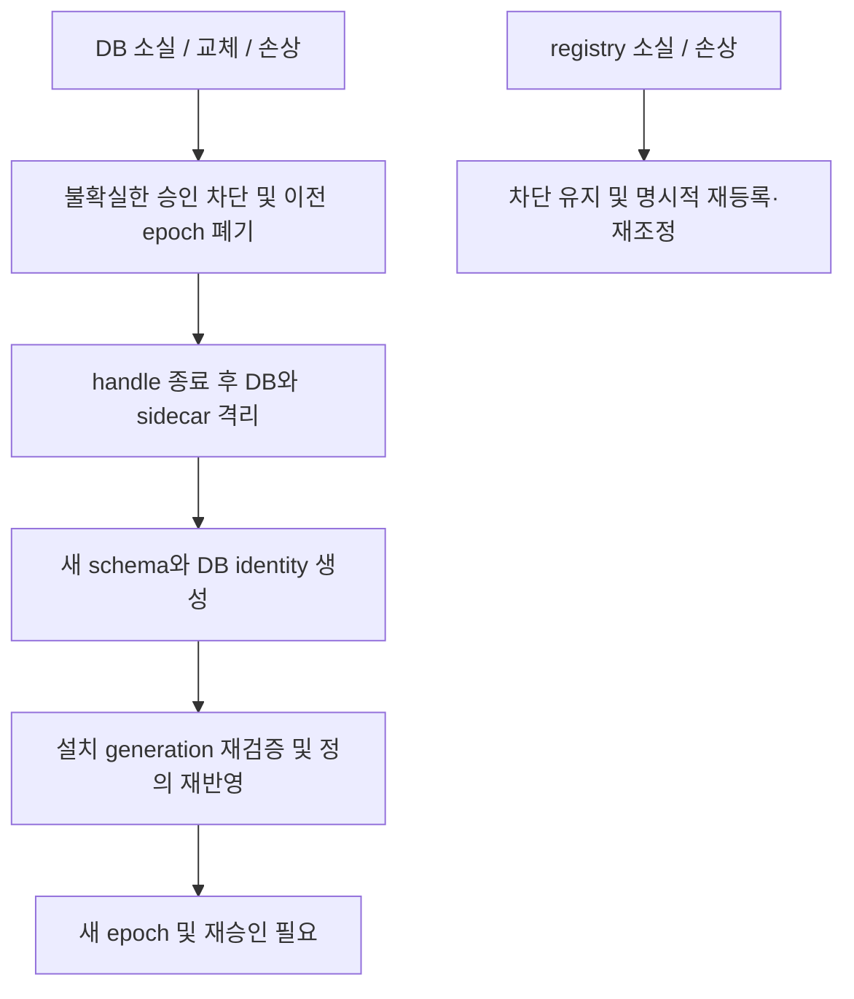
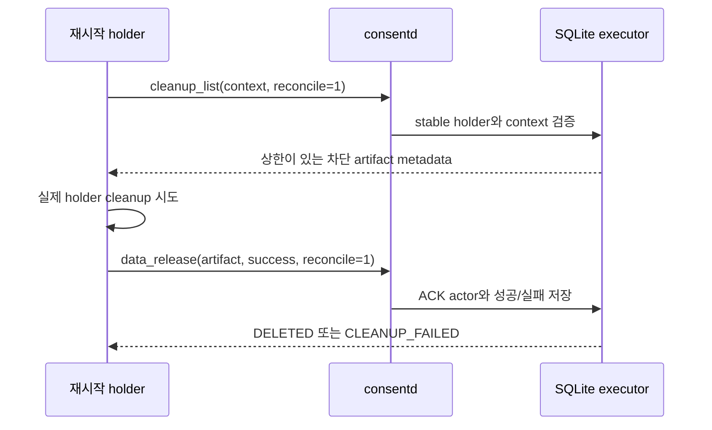
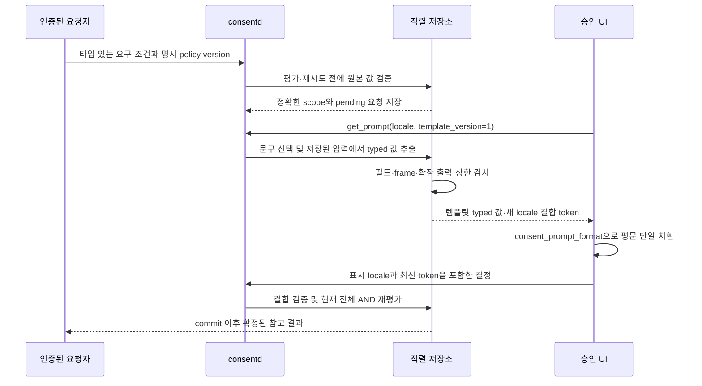
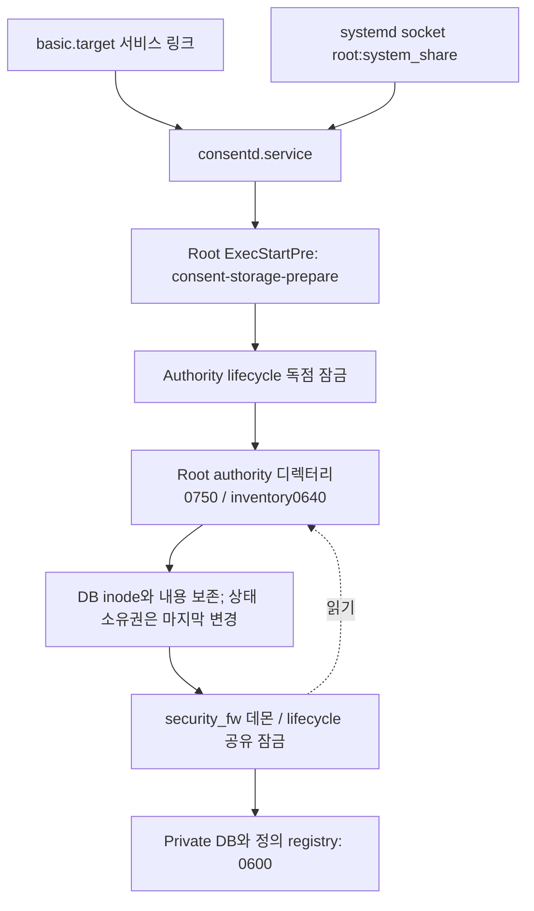

# 구조와 신뢰 경계

이 문서는 저장소의 구현 구조를 설명합니다. CEP는 목표 설계이며,
[구현 결정](decisions.ko.md)은 채택한 선택을 기록합니다.
[저장소 설계](storage-design.ko.md)와 [통신 규격](protocol.ko.md)은 각각의
형식을 설명합니다. 격리 시험 결과와 실제 플랫폼 연동 결과를 구분합니다.

## 구성 요소

공개 C API는 opaque 파라미터·결과 객체를 사용하며 내부는 C++입니다. 등록에는
패키지명과 app ID를 명시적으로 전달합니다. 삭제에는 패키지명, 안정된 operation
ID, 예상 설치 generation을 전달하며 app ID는 필요하지 않습니다. 한 패키지의
여러 앱은 같은 설치 generation을 공유합니다. 재시도 ID는 요청 내용과 결합하여
같은 ID로 삭제 범위가 바뀌지 않도록 합니다.

컴파일러는 `src/protocol/consent.idl.json`에서 빌드 시점에 실제
`tizen_base::Parcelable` 클래스를 생성합니다. 공개 C API에는 Parcel 클래스를
노출하지 않습니다. 4바이트 big-endian 길이 뒤에 native Parcel payload가 오며,
크기를 제한한 읽기와 검증을 거친 후 요청을 처리합니다. DB·registry 내부
메타데이터는 wire와 독립된 버전 및 정규화 형식을 사용합니다.

## 실행 영역과 소유권

초기 상한은 연결 64개, parser 작업 128개, DB 작업 128개, 연결당 진행 요청
32개, payload 64 KiB, 송신 queue 256 KiB입니다. UID별 연결 상한과 인증된 제어
역할의 추가 여유를 둡니다. 이는 구현 기본값이며 제품 용량 실측 결과가 아닙니다.
parser와 DB 작업은 사용자 응답을 기다리지 않습니다. 클라이언트가 접수된 요청
ID로 결과를 조회하므로 승인 대기가 데몬 worker를 점유하지 않습니다.

연결 버퍼와 source는 I/O thread만 변경하고 SQLite 및 registry는 DB executor가
소유합니다. 결과에는 daemon/DB epoch와 revision을 포함합니다. 서버는 게시 전
최신 snapshot의 epoch를 다시 비교하여 복구 전 ALLOWED 결과가 새 DB의 승인으로
전달되지 않게 합니다. 저장소 상태가 불확실하면 클라이언트 동기화를 무효화합니다.
종료 시 접수를 중지하고 연결을 닫은 뒤 이미 받은 DB 작업과 세션·정리 상태를
저장하고, callback context의 수명을 유지하면서 worker를 합류시킵니다.

클라이언트별로 상한 있는 I/O worker와 짧은 mutex 구간을 사용합니다. ASYNC는
지정한 GLib context의 소유 thread에서 호출하며 callback은 함수 반환 뒤에
게시되고 잠금 밖에서 실행됩니다. 로컬 대기 timeout은 원격 요청 취소가 아닙니다.
fork 자식은 부모 handle이나 callback을 사용할 수 없고 새 client를 생성해야 합니다.

## 신원과 설치

역할은 커널 `SO_PEERCRED`, 커널 `SO_PEERSEC`, 보호된 절대 실행파일 경로와
device/inode, root 소유 allowlist로 결정합니다. 처리 및 응답 전에 프로세스
starttime·UID·실행파일을 재검증합니다. root UID, basename, payload 역할 주장은
권한이 아닙니다. subject, profile, package 및 enforcement 위임을 별도로 검사합니다.

확인한 emulator 커널은 4.4.35입니다. starttime을 검사하는 fallback은 연결과
최초 프로세스 조회 사이의 모든 경쟁을 제거하지는 못합니다. 새 커널의 조건부
pidfd 지원은 추가 근거이며 구형 target이 지원한다고 주장하지 않습니다. 운영
설정에는 신뢰 역할을 기본 등록하지 않습니다. 실제 argo·UI·Installer 배포는
별도 연동 사항이며 이름이 비슷한 실행파일만으로 역할을 부여하지 않습니다.

운영 등록은 pkgmgr-info로 app/package 관계를 확인하고 별도로 보호된 Installer
authority의 generation과 `expected_generation`을 비교합니다.
`consent-installation-authority`는 begin/attach/commit/remove, 내구성 있는 갱신,
재시도 fingerprint 및 tombstone을 제공합니다. pending·removed generation으로
정의를 활성화하지 않습니다. 이 도구가 기존 Installer lifecycle hook 연동 완료를
뜻하지는 않습니다. [설치 authority](installation-authority.ko.md)를 참고하세요.

시험용 데몬과 클라이언트는 endpoint·설정·영속 상태가 분리된 별도 빌드 target입니다.
실행파일·UID·SMACK 검증은 유지하고 package inventory 조회만 명시적인 시험
authority로 대체합니다. 운영 binary에는 인증을 우회하는 runtime 옵션이나
환경변수가 없습니다.

## 승인과 데이터 수명

QUERY는 사전 조회이고 실제 접근에는 AUTHORIZE가 필요합니다. 모든 필수 조건이
충족될 때만 ONCE를 소비합니다. 같은 operation/step 재시도는 동일 fingerprint와
현재 유효성을 요구합니다. UI token은 표시한 정책·문구를 살아 있는 UI 인스턴스에
결합합니다. 실제 화면 렌더링은 외부 UI의 책임이며 이 저장소는 인증된 UI 통신을
제공합니다.

접근 grant와 조회 결과의 보관·사용 허가는 구분합니다. receipt는 취득 범위와
holder·session을 결합하고 artifact에는 메타데이터와 출처만 저장합니다.
파생 artifact는 부모 제한을 상속합니다. 세션 종료는 정리 완료 전에 접근부터
차단하며 ACK 실패·미수신을 CLOSED 성공으로 바꾸지 않습니다. 실제 데이터,
history, prompt 및 모델 cache는 연동된 holder가 정리해야 합니다. 데몬이 다른
프로세스 메모리를 직접 삭제할 수 있다는 의미가 아닙니다.

## 복구 경계

정의 registry가 desired state의 원본입니다. registry fsync/rename 뒤 SQLite
projection transaction을 수행하며 두 파일이 하나의 원자적 transaction이라고
간주하지 않습니다. 독립적으로 저장한 DB identity로 과거의 유효 DB 교체도
검출합니다. registry에는 사용자 결정·사용 기록이 없으므로 복구 시 되살리지
않습니다. DB 전체 소실 시 정리 메타데이터도 사라질 수 있습니다. holder는 새
epoch에서 사용을 차단하고 재조정해야 하며 물리 삭제가 완료됐다고 추정하면 안 됩니다.

## Holder 재시작 후 정리

새 holder는 위임된 subject/profile과 reconcile=1로
consent_cleanup_get_pending을 호출해 차단된 데이터를 발견합니다. stable holder
신원을 이전 process instance와 별도로 검증하며 cleanup만 허용합니다. 사용/등록은
기존 소유 instance와 유효한 provenance가 계속 필요합니다. Schema2는 artifact
소유자를 덮어쓰지 않고 인증된 ACK actor를 별도 기록합니다.

## 타입 있는 문구와 승인 범위

Template v1은 등록 정의에 상한 있는 표시 스키마를 추가한다. 변수는 기존
요구 조건의 `scope`, `purpose`, `recipient`, `operation` 또는 정의의
`retention_ms`에서 값을 가져온다. 호출자가 독립적인 표시 인자 map을 보내지
않는다. 최근 30일 조회는 정확한 정수 scope `30`에 결합하며 결과 보관기간은
별도의 밀리초 값이다. policy version이 스키마·제약을 grant, 재시도, cache,
receipt 및 데이터 permit과 결합한다.

Formatter는 치환값의 중괄호·퍼센트·markup을 재해석하지 않는다. v1 정수는
정규 십진 표기이며 복수형·날짜·언어별 숫자 서식은 별도 플랫폼 연동 범위다.
다시 표시할 때마다 이전 token을 교체한다. 지원 버전·출력 예산 오류는 기존
활성 token과 grant를 변경하지 않는다. 스키마 변경에는 policy version 증가,
번역/fallback 변경에는 text revision 증가와 pending 표시 무효화가 필요하다.
공개 formatter의 반환 문자열은 호출자가 `free()`로 해제하는 `malloc` 소유
문자열이며 오류 시 출력은 null이다. 빌드·emulator 증거는 검증 가이드를
참조한다. 이 다이어그램은 실제 제품 UI 연동 완료 주장이 아닌 구현 계약이다.

## 서비스 계정과 소유권 이행

서비스는 기존 `security_fw` 계정, SmackProcessLabel=System, NoNewPrivileges와
CAP_SYS_PTRACE 하나를 사용합니다. 이 capability는 다른 UID의 프로세스 신원
조회에 사용하며 호출자 역할을 부여하지 않습니다. 플랫폼이 추가하는 보조 그룹도
consent 역할의 근거가 아닙니다. 공개 C API 헤더는 `src/consent/inc/consent.h`이며
private C++ 헤더는 `inc` 밖에 둡니다.

준비 도구는 고정된 systemctl 명령을 제한 시간 안에 실행하여 MainPID0을 확인하고,
root 소유 상위 경로와 파일 유형·link·소유권을 검증한 뒤 lifecycle/Installer 독점
잠금을 잡습니다. 기존 authority를 먼저 옮기고 양쪽 디렉터리를 sync합니다.
DB·sidecar·registry는 그 자리에 두며 소유권 변경으로 기대 device/inode나 registry
내용을 바꾸지 않습니다. 상태 디렉터리 소유권은 마지막에 변경합니다. 이전 mkdir가
성공했어도 재시도마다 상위 디렉터리 fsync를 반복합니다. symlink·hardlink·다른
소유자·예상 밖 파일·authority 충돌·사용 중인 잠금은 자료를 지우지 않고 거부합니다.

검증한 관리 대상 FD에만 System SMACK label을 설정하고, 설정이나 metadata sync가
실패하면 시작하지 않습니다. systemd StateDirectory와 RPM의 mutable 디렉터리
소유권 지정은 사용하지 않습니다. 패키지 업그레이드는 파일 설치 전에 socket과
service를 동기적으로 중지합니다. root 접두사가 있는 pre-start 도구는 제한된
데몬과 별도 프로세스입니다. 기존 버전 이행은 systemd가 관리하는 종료를 전제로
하며 수동 실행한 데몬이나 동시에 실행 중인 옛 Installer 도구는 지원하지 않습니다.

`/opt/var/lib/consent-authority`는 계속 root 소유이고 데몬 primary group에는 읽기만
허용합니다. `/opt/var/lib/consentd`는 서비스 UID 소유0700입니다. 역할 설정과
실행파일 신뢰 검사는 root 보호를 유지합니다. 공유 플랫폼 UID만으로 앱별 독점
격리를 보장하지 않으므로 제품은 같은 UID를 쓰는 다른 프로세스와 SMACK 정책을
함께 고려해야 합니다. 제품 역할 등록은 여전히 default-deny입니다. 이 이행의
빌드·target 결과는 명시된 검증 snapshot의 근거로 구분합니다.

## 명시적 이미지 등록

공개 라이브러리의 등록 전용 offline handle은 root image lifecycle lock을 잡고
보호된 bounded Parcel 정의 record만 씁니다. Online transport·역할 검사·승인
API는 유지합니다. 시작 시 root helper가 spool을 데몬 읽기 전용으로 label하고,
DB executor는 모든 record 검증·결정적 revision 정렬 후 기존 registry/정책 변경
공통 코드로 반영합니다. Peer를 만들지 않는 내부 진입점이며 설치 신원을 재시도
조회 전·commit 후에 다시 검증합니다. Applied/obsolete 결과는 DB 소실에도 registry에
남고, 같은 generation의 inactive 정의는 처음 보는 seed로 되살리지 않습니다.
[이미지 등록 순서와 신뢰 경계](offline-registration.ko.md)를 참고하세요.
