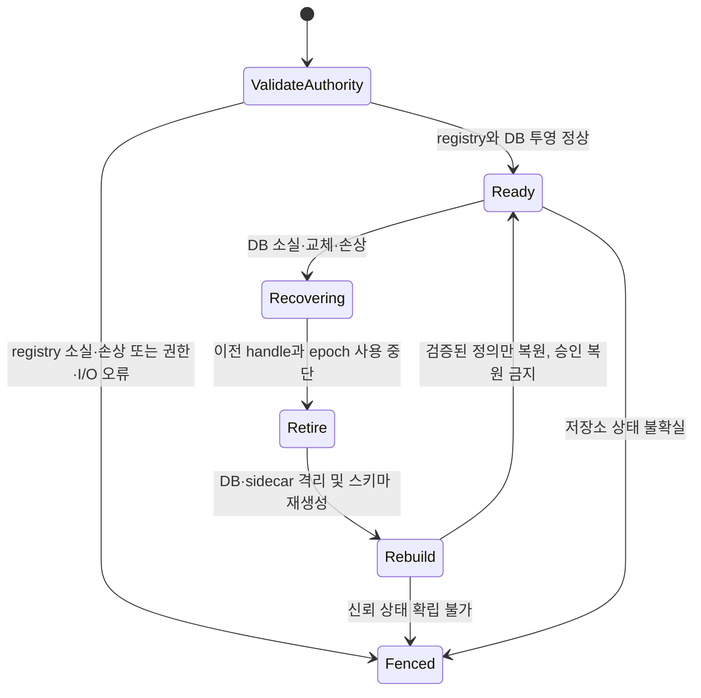

# 설계 04: 저장소·정책·복구 구현

이 문서는 `src/consentd/repository.{hh,cc}`와 실행 테스트의 현재 동작을
설명합니다. 원본 CEP는 설계 제안으로 유지합니다. PO 확정 사항은
`05-decisions.ko.md`에 별도로 기록합니다. 대화 본문은 저장하지 않습니다.

## 소유권과 영속 상태

`Repository`의 생성·호출·소멸은 하나의 DB executor 스레드가 담당합니다.
저장소는 사용자 응답을 기다리거나 클라이언트 callback을 호출하지 않습니다.
SQL은 바인딩 인자를 사용합니다. 변경은 `BEGIN IMMEDIATE` 트랜잭션으로
처리하고 `COMMIT` 및 경로 신원 재확인이 끝난 뒤 결과를 발행합니다.

SQLite 설정은 `journal_mode=DELETE`, `synchronous=EXTRA`(3),
`foreign_keys=ON`, `secure_delete=ON`, busy timeout 100ms입니다.
시작 시 journal·동기화·외래키 설정을 다시 읽어 지원 여부를 확인합니다.
스키마 버전 2는 `user_version`에 기록합니다. 기반 버전 1 DB는 하나의 스키마
트랜잭션에서 정리 ACK 증거 테이블을 추가합니다. 기존 정의와 지속 승인은
보존하고 임시 상태에는 정상 재시작 무효화 정책을 적용합니다. 알 수 없는
상위 버전은 DB를 지우거나 재생성하지 않고 실패합니다. 실제 flush 내구성은 기기와
파일시스템에도 의존합니다. 프로세스 강제 종료 테스트가 돌발 전원 차단의
내구성 증거를 대신하지 않습니다.

서로 다른 세 가지 신뢰 원천을 사용합니다.

| 상태 | 소유자와 목적 | 포함하지 않는 내용 |
|---|---|---|
| 보호된 설치 generation authority | Installer adapter; 설치된 패키지/app 및 현재 세대 검증 | 사용자 승인 |
| `definitions.registry` | Repository의 정의 원본; 정책·문구 전체, 패키지/app/설치 신원, 삭제 tombstone, 작업 fingerprint, 기대 DB device/inode/incarnation | grant·소비·세션·artifact |
| `consent.db` | 정의 투영과 영속 결정; 스키마/revision, 요청·grant·authorization·세션·artifact·출처·정리 상태 | 대화 본문 및 artifact 내용 |

`SetInstallationValidator`가 패키지/app 관계와 설치 신원을 검증합니다.
운영 경로는 별도의 보호된 generation authority와 pkgmgr-info 관계를
사용합니다. 검증기가 없으면 허용하지 않습니다.
`SetPackageGenerationValidator`는 Installer tombstone을 포함한 현재
패키지 generation으로 삭제를 검증합니다. 삭제된 앱이 pkgmgr-info에 남아
있어야만 정리할 수 있는 구조는 아닙니다. 직접 단위 테스트는 임시 경로와
전용 callback을 사용하며 운영 인증을 변경하지 않습니다.

등록은 패키지명과 appid를 각각 받고, 안정된 `operation_id`, 검증된 설치 신원,
정의·집행 소유자, 정책/문구 버전, 승인 방식과 기본 다국어 문구를 요구합니다.
정의 소유권을 다른 패키지/app으로 이전할 수 없습니다. 정책 버전 역행이나
같은 버전에서의 의미 변경은 거부합니다. 초기 Level 3 정책은 ONCE만
허용합니다. 이 제한은 보수적인 구현 선택이며 Context Engine 제품 등급표가
확정되었다는 의미는 아닙니다.

삭제는 패키지명과 기대 설치 generation으로 수행하며 appid는 요구하지
않습니다. 한 트랜잭션에서 패키지 내 모든 앱의 정의를 비활성화하고 관련
승인·authorization·대기 prompt·artifact를 무효화합니다. 다른 패키지에는
영향을 주지 않습니다. 재설치 후 도착한 이전 삭제는 거부합니다. 같은 작업을
재시도하면 payload fingerprint가 같아야 하며, 다르면 충돌로 반환합니다.

```mermaid
sequenceDiagram
  participant I as 인증된 Installer
  participant R as DB executor / Repository
  participant F as definitions.registry
  participant D as consent.db
  I->>R: 패키지, app, 작업, 기대 generation, 정의
  R->>R: 설치·소유권·버전·문구 검증
  R->>F: 임시 파일 작성 및 fsync
  R->>F: 원자적 rename 및 디렉터리 fsync
  Note over R: DB 투영 완료 전 권한 판단 차단
  R->>D: BEGIN IMMEDIATE; 관련 상태 무효화; 정의/revision 투영
  R->>D: COMMIT
  R->>R: 경로 신원·설치 generation 재확인
  R-->>I: 커밋 결과와 revision
```

## 복구와 실패 처리

registry는 정규화된 내용의 checksum을 포함하며 4MiB, 정의 2,048개,
설치 작업 기억 8,192개로 제한합니다. checksum은 신뢰하는 파일 소유자의
변조를 방어하는 서명이 아닙니다. 파일은 symlink가 아닌 단일 hard link의
일반 파일이어야 하며 daemon 유효 UID가 소유하고 타 사용자에게 노출하지
않아야 합니다. 상위 경로와 보호 디렉터리도 검사합니다. 운영 패키징은 서비스 계정
소유 보호 경로를 사용하고 직접 테스트는 sticky `/tmp` 아래 전용 경로를
사용합니다.

DB의 기대 device/inode와 무작위 incarnation을 registry에 따로 영속화합니다. 따라서 내부적으로
정상인 과거 DB 사본으로 교체하더라도 시작 시 이를 발견해 옛 승인을 되살리지
않습니다. 매 작업 전과 성공 응답 발행 전에 DB 경로를 stat합니다. SQLite의
POSIX 잠금에 영향을 주는 별도 live DB open/close는 하지 않습니다. 타이머는
무결성과 설치 상태를 확인합니다. 기존 handle을 폐기한 후 DB의 rollback
journal·WAL·SHM을 함께 격리합니다. main DB만 없어진 경우 남아 있는 hot
journal을 새 빈 DB에 재생하지 않습니다.
각 작업은 최초 복구 확인 직후 epoch를 저장하며 최종 응답 snapshot도 같은 epoch여야
합니다. 마지막 snapshot 자체가 뒤늦은 DB 삭제를 복구했다면 이전 ALLOWED 결정이나
receipt·permit·artifact를 새 epoch에 붙이지 않고 해당 필드가 없는 새 오류를 반환합니다.



파일 교체와 DB incarnation 불일치를 검출합니다. 권한 있는 주체가 같은 inode와
incarnation을 유지하며 과거 상태로 덮어쓰는 경우에는 별도의 커밋별 단조
watermark가 필요합니다. 정의 authority는 이러한 watermark가 아닙니다.
비인가 쓰기는 보호된 파일시스템 경계에서 차단합니다.

시작을 포함한 모든 투영/재생 경로는 먼저 registry 디렉터리 fsync에 성공해야
합니다. 이전 rename 결과를 읽을 수 있다는 이유만으로 내구성 불확실 상태를
해제하지 않습니다. SQLite 오류 코드는 rollback이 연결의 마지막 오류를 변경하기
전에 보존합니다.

명시적인 SQLite 손상, main DB 소실 또는 교체 감지만 재구성을 허용합니다.
일반 I/O·권한·용량 부족·알 수 없는 스키마 오류로 DB를 지우지 않습니다.
registry가 없어지면 시작을 거부하거나 실행 중 권한 판단을 차단합니다.
신뢰하는 Installer의 재등록·복구가 필요하며 없어진 DB에서 정의를 만들어낼
수 없습니다. registry rename은 DB 투영보다 먼저 완료합니다. 투영 실패 시
다음 시작/작업에서 해당 registry revision을 재생한 뒤 권한 판단을 재개합니다.

새 daemon/DB epoch는 클라이언트 캐시를 무효화합니다. 정상 재시작은 설치·정책이
같은 PERSISTENT 승인을 유지합니다. PENDING은 INVALIDATED가 되고 비지속
승인과 이전 authorization receipt는 무효화됩니다. 세션은 CLOSING으로 전환하고
잔존 artifact 정리를 요구합니다. 이전 세션을 자동 ACTIVE로 복원하지 않습니다.

DB 전체 소실 후에는 과거 holder 목록을 재구성할 수 없습니다.
`cleanup_reconciliation_required=1`을 후속 재시작에도 영속적으로 노출합니다.
이 값은 물리 삭제 성공이 아닙니다. 제품 holder는 이전 epoch 데이터를 차단하고
별도 정합 계약에 따라 정리해야 합니다. 증거 없이 이 불확실 상태를 자동으로
해제하는 API는 없습니다.

## 정책·prompt·세션·데이터

requirement는 정규화된 scope의 정확 일치로 비교합니다. 인증된 peer 정책으로
subject/profile 위임을 검증하고 AUTHORIZE는 등록된 집행 소유자도 확인합니다.
모든 필수 조건을 함께 평가하며 하나라도 부족하면 ONCE를 소비하지 않습니다.
집행 주체·operation·step으로 재시도를 식별합니다. payload가 달라지면 충돌하고,
철회·TIMED 만료·무효화 후에는 과거 receipt로 다시 허용하지 않습니다.
receipt는 출처 증거이며 양도 가능한 bearer 권한이 아닙니다.

argo만 prompt를 생성합니다. check는 UI를 열지 않습니다. prompt에는 서버가
선택한 정책/문구 버전, 정확 scope·목적·holder/recipient·승인 방식·보관 조건이
포함됩니다. 무작위 token은 요청 및 UI 신원/프로세스 인스턴스에 결합되며 다시
표시하면 교체합니다. 기한·취소·세션 generation·정책 변경은 이전 응답을
무효화합니다. locale은 정확 일치, 명시적인 `ko-KR → ko`, `en-US/en-GB → en`,
등록 기본 언어 순서입니다. 임의 script fallback은 추측하지 않습니다. 현재
문구는 literal UTF-8이며 typed schema와 scope 결합 formatter를 구현하기 전에는
`{...}` placeholder를 거부합니다.

UI ALLOWED 응답으로 명시적인 신규 승인을 추가한 뒤 같은 트랜잭션 안에서 모든
조건을 QUERY 방식으로 다시 확인하며 ONCE는 소비하지 않습니다. UI 대기 중 기존
조건이 만료·철회되거나 다른 작업에서 소비되었다면 전체 요청은 이유와 현재 조건별
결과를 포함한 INVALIDATED로 확정합니다. 새로 승인한 grant는 유지하지만 자동으로
새 prompt를 열지 않습니다. DENIED 응답도 이전에 충족된 조건의 현재 상태를 확인하고
이번 prompt에서 거부한 조건만 DENIED로 표시합니다. 재검증 오류는 트랜잭션을
rollback하고 요청을 PENDING으로 유지합니다. 확정된 요청 결과는 이력이며 실제
실행은 항상 새 원본 권한 확인을 요구합니다.

논리 세션과 IPC 연결을 분리합니다. 세션 제어는 인증된 subject/profile 및 소유
프로세스 인스턴스에 결합됩니다. ACTIVE 사용은 현재 generation과 idle·절대·lease
기한을 요구합니다. 명시적인 suspend와 lease 만료는 CONNECTION_BOUND 또는
RESUMABLE_CONVERSATION 정책을 적용합니다. resume은 동일 소유 인스턴스,
회전하는 서버 token 및 유예 기한을 검증합니다. heartbeat는 lease만 갱신하며
idle·절대 수명을 연장하지 않습니다. 초기 구현에는 사용자 활동 갱신 API가 없습니다.

원본 artifact 등록은 session·generation·scope·목적·recipient·수신 holder에
결합된 확정 receipt를 요구합니다. MEMORY_ONLY 제어 메타데이터만 저장하며
만료는 등록·재사용 시각이 아닌 취득 시각을 기준으로 합니다. 재등록은 기존
artifact와 기한을 반환합니다. 파생 artifact는 모든 부모의 grant 의존 관계,
가장 빠른 만료, 가장 높은 등급을 상속하며 다른 세션/holder/목적/scope로 확장하지
않습니다.

파생 artifact는 부모가 가진 원본 grant 의존 관계의 전이적 합집합을 저장합니다.
공통 검증기는 정확한 holder/프로세스/사용 문맥, subject/profile, 현재 세션
generation·기한, artifact 상태·TTL, 원본 철회 여부, 현재 정책과 설치 세대를
확인합니다. 파생 등록 전 모든 부모를 검사하고 원본/파생 등록, data_check 및
`check(operation=reuse-data)`도 커밋 후 성공 발행 직전에 다시 검증합니다.
따라서 외부 설치 세대 변경을 다음 timer tick까지 기다리지 않고 거부합니다.
커밋되었지만 성공을 발행하지 못한 artifact도 기록을 유지하고 정합 시 정리 대상으로
전환합니다.

ONCE 소비나 TIMED 접근 승인 만료만으로 별도 보관 권한이 있는 데이터를 지우지
않습니다. artifact가 상속한 보관 기한을 적용합니다. 물리적인 부모 사본 삭제만으로
보관 중인 자식을 철회하지도 않습니다. 자식의 전이적 원본 grant 의존 관계와 상속한
기한은 계속 적용하며 명시적 철회·설치/정책 무효화는 모든 의존 사본의 사용을 차단합니다.

종료·철회·TTL 만료는 먼저 사용을 차단합니다. 원래 holder 프로세스 인스턴스가
자신의 artifact 정리를 ACK할 수 있습니다. 같은 인증된 안정 holder 신원의
재시작 프로세스는 `cleanup_list` 및 `cleanup_ack`/`data_release`에 명시적으로
`reconcile=1`을 지정할 수 있습니다. 이 정리 전용 경로는 subject/profile 위임과
artifact의 세션 문맥 일치를 요구하며 이미 차단되었거나 삭제된 artifact만
대상으로 합니다. 원래 소유 인스턴스를 변경하거나 사용/등록 권한을 이전하지
않으며 세션·승인을 되살리지 않습니다. 재시작만으로 삭제 완료를 가정하지도
않습니다. ACK에는 실제 인증된 신원/인스턴스를 기록하고 물리 정리 책임은
신뢰 holder에게 있습니다. 실패·무응답은 CLEANUP_PENDING 또는
CLEANUP_FAILED 및 CLOSING으로 남습니다. 기록된 모든 artifact의 삭제 ACK가
확인되어야 CLOSED가 됩니다. 이는 신뢰 holder의 증거를 기록하는 기능이며
다른 프로세스의 데이터를 직접 지우는 기능은 아닙니다.

PERSISTENT와 SESSION 허용 request 결과는 짧은 캐시를 사용할 수 있습니다.
TTL은 최대 500ms이고 세션 기한으로 더 제한합니다. 설치 정합·정책/승인 변경·수명
전이는 revision을 변경합니다. 서버는 무효화 이벤트를 발행하고 연결 종료나
epoch 변경은 재동기화를 요구합니다. AUTHORIZE는 항상 현재 원본 상태를
확인합니다. 이벤트 지연 동안 잠시 오래된 request 힌트가 남을 수 있으나
보호 작업 실행을 허가하지는 않습니다.

## 타입을 지정한 다국어 문구

정의는 `template_version=1`과 최대 8개 이름 있는 인자(이름 최대 32바이트)를
선언할 수 있습니다. `parameter.<name>`은 기존 요구 조건의 `scope`, `operation`,
`purpose`, `recipient` 또는 정의의 `retention_ms`를 타입과 연결합니다. scope는
문자열 또는 정수, 다른 요청 값은 문자열, retention은 정수입니다. 정수는 정규화된
부호 있는 int64 십진 문자열과 포함 범위 `min`/`max`를 사용합니다. 문자열의
`max_bytes`는 1~512입니다. 각 언어의 title/body placeholder 합집합은 선언한
인자와 정확히 일치해야 합니다. 호출자가 제공하는 `display_args` 및 미리 구성한
인자 descriptor는 거부합니다. 화면의 범위 `30`은 실제 조회 범위 그대로이며,
취득 후 보관 기간인 별도의 `retention_ms`로 변환하지 않습니다.

타입 정의 요청은 일치하는 `rN.policy_version`을 명시합니다. 요청/실행 재시도
단축 경로보다 먼저 검증하고 영수증 payload와 artifact 원본 승인 key도 확인합니다.
같은 정확한 필드로 grant key를 구성하므로 `30`에 대한 승인을 `90`의 실행,
영수증 또는 artifact 범위 확장에 사용할 수 없습니다. 원본 승인 검증은 소비한 ONCE나
접근 시간 만료를 별도의 데이터 보관 권한 만료로 처리하지 않습니다. 인자 스키마
변경에는 policy version 증가가 필요합니다. 정의 ID별 text revision은 재설치를
포함하여 감소할 수 없습니다. 기본 언어, 번역 문구 또는 alias 변경에는 policy
증가와 별도로 text revision 증가가 필요합니다. 동일 문구의 재설치는 기존 text
revision을 유지할 수 있습니다. 정의·타입 스키마·alias는 독립 registry로 복구하지만
소실된 승인은 복구하지 않습니다.

UI는 `template_version=1`을 명시하여 타입 prompt를 요청합니다. 응답은 요청한
`locale`, 실제 선택한 `rN.locale`, 정렬된 `rN.argM.name/type/value` 및
`rN.arg_count`, `rN.template_version`을 전달합니다. 정확한 등록 언어, 명시적인
직접 `locale_fallback.<requested>` alias, 정해진 ko-KR/en-US/en-GB 기본 언어,
default 순서로 선택하며 그 밖의 지역·문자 체계 접미사는 추론하여 제거하지 않습니다.
요청 언어는 최신 prompt token 및 UI 인스턴스와 함께 내부 저장합니다. 타입 승인
응답에는 그 요청 언어와 token이 필요하며 개별 행의 선택 언어로 대체할 수 없습니다.
내부 언어 필드는 공개 대기/최종 결과에 포함하지 않습니다. 기존 고정 문구는 타입
기능 협상 없이 사용할 수 있습니다.

token 갱신 전에 전체 응답을 240개 필드와 64 KiB frame 예산으로 검사하며 envelope
메타데이터 여유도 확보합니다. 선택된 title/body를 임시 버퍼에 확장하여 각각
8192바이트 제한을 검사합니다. 잘못된 기능 버전·언어·출력 초과 요청은 이전 token을
바꾸지 않습니다. 중괄호·퍼센트·마크업을 포함한 값은 한 번만 문자 그대로 넣으며
UI도 결과를 일반 텍스트로 표시해야 합니다. 등록 template는 각각 최대 4096바이트입니다.
가능한 최장 값이 초과할 수 있다는 이유만으로 정상 스키마 자체를 거부하지 않습니다.

## 실행 증거와 남은 범위

`src/tests/repository_test.cc`는 실제 SQLite 파일과 전용 repository 인스턴스로
정의 소유권·중복 방지, 복수 앱 패키지 삭제/재설치, ONCE 및 재시도, AND 원자성,
철회, 오래된 prompt, 세션 generation/resume, artifact 보관, holder ACK
실패/성공, 지속 승인 재시작, 정상 과거 DB 교체, 실행/중지 중 강제 DB 삭제,
남은 journal 격리 및 손상 복구를 검사합니다. TIMED 재시도 만료, profile 단위
요청 조회, 권한/registry 소실 차단, 캐시 기한, 설치 세대 회전, 재개형 lease 만료,
heartbeat/idle 분리, 복수 부모 TTL 상속, receipt 재시도 기한 및 재시작 holder의
정리 전용 정합도 검사합니다. 버전 1 fixture로 스키마 이행, 지속 승인 보존,
임시 상태의 재시작 정책 및 알 수 없는 상위 스키마 거부도 확인합니다.
서로 다른 ONCE 작업과 취소/응답/기한 확정 순서는
직렬화된 repository 테스트이며 동시 IPC 검증을 의미하지 않습니다.
`repository_fault_test.cc`는 해당 테스트 실행 파일 안에서만 `fsync`,
`sqlite3_step`, `sqlite3_close`를 대체합니다. 재시도/재시작의 디렉터리 동기화
불확실 차단과 rollback 이후 손상 코드 보존을 결정적으로 검사합니다. 메타데이터
손상 주입은 원래 연결이 닫힐 때까지 유지되므로 반복 실패하는 incarnation 조회를
복구 성공으로 오인하는 테스트가 아닙니다. `SQLITE_FULL`과 `SQLITE_IOERR_WRITE`
반환 코드를 주입하여 반복 실패와 정상 재시도를 검사합니다. DB inode·epoch·격리
파일 목록은 변하지 않고 기존 지속 승인과 정의는 보존되어야 합니다. 이는 오류
분류 검증이며 실제 파일시스템 용량 소진이나 기기의 쓰기 실패를 재현하지 않습니다.
실패 시 비영 종료합니다.

`repository_provenance_test.cc`는 timer tick 없이 B 설치 세대만 회전시켜 A+B
부모와 여러 단계 파생 데이터의 거부, 다른 패키지 격리, ONCE/TIMED 접근과 보관의
분리 및 기한 상속을 검사합니다. 테스트 전용 SQLite interposer는 원본/파생 등록과
두 데이터 확인 경로에서 실제 COMMIT 반환 직후 설치 authority를 회전시킵니다.
성공 대신 오류가 나야 하고 이미 커밋된 미발행 artifact도 사용할 수 없으며 정리
목록에 나타나야 합니다. 추가 두 경우는 데이터 등록/확인의 커밋 후 검증 중 실제 DB를
unlink하여 최종 snapshot에서 복구를 유발하고 이전 성공 필드가 없는 오류를 요구합니다.
unlink 시 관찰 대상의 실제 COMMIT이 반환했고 SQLite가 autocommit 상태임을 확인합니다.
별도 PERSISTENT 승인을 사전에 ALLOWED로 입증하며 같은 repository의 후속 호출은
해당 정의가 복원되었더라도 새 동의를 요구해야 합니다.
`repository_ui_test.cc`는 UI 대기 중 기존 조건 변경과
전체 AND 확정, 재검증 오류 rollback을 검사합니다.
`repository_localization_test.cc`는 스키마/값 거부, 재시도 전 명시적 policy version,
언어/token 결합, 기존 token을 보존하는 확장·전체 prompt 크기 제한, 독립 revision
규칙, 고정 문구 호환, 타입 registry 복구 및 영수증/artifact 경계의 범위 확대 거부를
검사합니다. 기존에 허용하던 `count=01`은 고정/타입 요청 모두 prompt에서 정규화하며
요청 접수와 중복 판별 key는 바꾸지 않습니다.

`repository_crash_test.cc`는 자식 writer를 journal 동기화 직전, main DB 동기화
직전 및 커밋 성공 후 응답 전에 멈추고 SIGKILL을 보냅니다. 재개 후 지속 승인
철회의 rollback/유지와 DB 무결성을 확인합니다. main DB 동기화 경계에서는
[SQLite rollback journal 형식](https://www.sqlite.org/fileformat.html#the_rollback_journal)에
따라 journal 크기와 유효한 header를 검사합니다. 네 번째 경우는 같은 경계에서
main DB를 삭제한 뒤 writer를 강제 종료합니다. 쓰기 중 삭제 후 시작 복구이며
원래 writer가 계속 실행하는 동안의 복구는 아닙니다. 별도의 다섯 번째 경우는
삭제 후 같은 writer를 계속 실행합니다. 원래 작업은 성공을 반환하면 안 되고
같은 `Repository`의 후속 check는 새 epoch와 기존 승인이 없는 상태로 복구해야
합니다. 두 경우 모두 DB를 다시 열어 무결성도 확인합니다. 돌발 전원 차단 내구성이나
재시작에 걸친 ONCE 소비 내구성의 증거를 대신하지 않습니다. 실제 통과한 소스
snapshot은 검증 문서에서 구분합니다.
기본 fixture 경로는 `/tmp`이며 emulator에서는 tmpfs일 수 있습니다. 보호된
전용 테스트 디렉터리를 만든 뒤
`repository-crash-test --state-root /opt/var/lib/consent-test`로 영속 파일시스템을
검증할 수 있습니다. 각 경우는 자신이 만든 `mkdtemp` 하위 디렉터리만 정리합니다.
영속 경로 선택 자체가 전원 차단이나 기기의 물리 캐시 동작을 재현하지는 않습니다.

별도 `consentd-shutdown-test`는 실제 테스트 daemon에
`repository_shutdown_interposer.cc`만 추가합니다. 실제 행을 변경한 revoke를
트랜잭션이 활성인 COMMIT 직전에 멈춥니다. 전용 harness는 SIGTERM 뒤 접수 중단을
관찰하고 최대 5초 gate를 해제한 뒤 정상 drain/종료와 재시작 후 C API의 철회 결과를
확인합니다. ready/release 파일은 데몬 계정이 소유한 `/tmp/consent-shutdown-gate` 아래에만 두며 일반
daemon에는 gate가 없습니다. 응답 전 연결 종료는 클라이언트 입장에서 결과 불명이며
접수된 변경의 영속 결과는 재시작 확인으로 입증합니다.

GBS 빌드와 emulator 실행 증거는 프로젝트 검증 문서에 기록합니다. 이 문서만으로
모든 수용 기준을 통과했다고 주장하지 않습니다. 돌발 emulator 종료/전원 차단,
실제 파일시스템 용량 소진/기기 쓰기 실패(SQLite FULL/IOERR 반환 코드 분류 검증과
구분), 제품 Installer 트랜잭션 연동,
holder 프로세스 사망 후 정합, 외부 모델 정리와 장시간 부하
검증은 별도로 필요합니다. 활성 요청·세션·artifact에는 접수 상한이 있지만 과거 메타데이터의 확정된
보존 정책에 따른 자동 정리는 아직 없습니다. 상한 초과는 운영 조치가 필요하며 이미 소비한
승인을 다시 사용 가능하게 만드는 방식으로 처리하지 않습니다.

## 재시도 증거를 보존하는 metadata 정리

DB executor는 60초마다 최대 128개 대상 record를 원자적으로 정리합니다.
무효 authorization의 payload·연결, 종료 prompt의 비밀 값과 CLOSED session의
resume hash를 비울 수 있습니다. revoked grant는 authorization과 artifact
provenance 양쪽 모두 참조하지 않을 때만 제거합니다. 실행/request key와
fingerprint, artifact 행·재귀 provenance·cleanup ACK, registry receipt와 offline
seed는 남깁니다. 같은 무효 실행 재시도는 STALE, 내용 변경은 CONFLICT를 유지하며
소비한 ONCE를 다시 사용 가능하게 하지 않습니다. 실패하면 rollback하고 기존
storage 차단 경로를 적용합니다.

VACUUM이나 과거 재시도 행 삭제 없이 SQLite의 공간 재사용을 돕는 기능입니다.
일반 TTL pruning, 실행 시간 상한, registry 유실 reset은 구현하지 않습니다.
정확한 선정 조건·index·시험 범위와 별도의 미구현 registry 복구 설계는
[가이드 09](../guides/09-storage-maintenance.ko.md)를 참고하세요.
