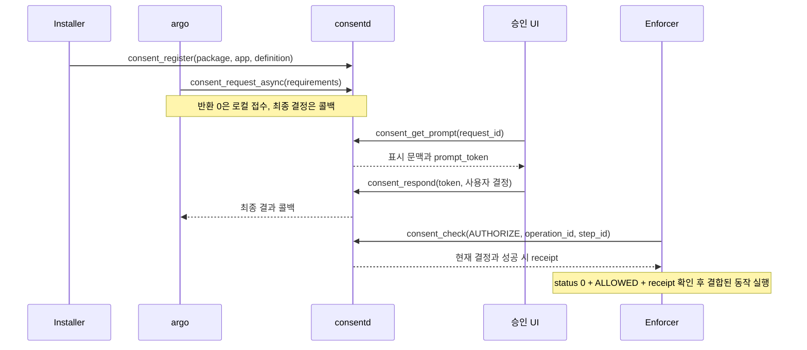

# 가이드 02: 공개 C API

`consent` 라이브러리는 42개 C 함수를 제공합니다. `<consent.h>` 또는 기능별
헤더를 포함하고 `pkg-config consent`로 링크합니다. 헤더는 Tizen Device와
Application Manager API 문서 형식에 맞춰 인자, 소유권, 콜백 규칙과 오류를
설명합니다. `@since 0.1.0`은 이 프레임워크 버전이며 Tizen 플랫폼 API 버전이나
배정된 privilege URI를 뜻하지 않습니다.

빌드·배포는 [가이드 01](01-development.ko.md), 신뢰할 수 있는 설치 generation은
[가이드 03](03-installation-authority.ko.md), 이미지 생성은
[가이드 04](04-offline-registration.ko.md)를 참고하세요. 검증 결과와 한계는
[가이드 07](07-verification.ko.md)에 기록합니다.

## 처음 읽는 순서와 핵심 용어

처음 연동한다면 아래 용어와 호출 흐름을 읽고, [함수별 찾아보기](#함수별-찾아보기)에서
담당 역할의 API를 선택하세요. [최소 C 조회 프로그램](#최소-c-조회-프로그램)으로
입력·결과 처리 방식을 익힌 뒤 동기 실행 허가, 비동기 승인, 등록, 세션·데이터
수명 절을 읽으면 됩니다. 이 가이드는 현재 [공개 헤더](../../src/consent/inc/consent.h)와
구현을 설명하며, [설계 01](../design/01-consent-framework.md)의 인터페이스 초안과
구별합니다.

| 용어 / 필드 | 의미와 사용 위치 |
|---|---|
| definition | Installer가 등록한 승인 정책의 이름입니다. 집행자, 민감도, 승인 방식, 표시 문구를 정의합니다. 등록 자체는 사용자 승인이 아닙니다. |
| requirement | 한 번의 request/check에서 요구하는 조건입니다. definition과 operation/scope/purpose/recipient를 묶으며 여러 조건은 모두 충족해야 합니다. |
| `subject`, `profile` | 승인을 적용할 주체와 프로필입니다. 인증된 호출자의 위임 범위 안에서 지정하며 호출자 신원을 대신하지 않습니다. |
| `operation`, `scope` | 수행할 동작과 정확한 접근 범위입니다. 예를 들어 `read`와 등록 정책에 맞는 범위 문자열을 사용합니다. |
| `purpose`, `recipient` | 사용 목적과 수신자입니다. 같은 자원이라도 이 값이 달라지면 기존 승인을 그대로 쓸 수 없습니다. |
| enforcer | 보호된 동작 직전에 권한을 검사하고 실제 접근을 통제하는 서비스입니다. |
| grant | 사용자 결정으로 생긴 접근 승인입니다. ONCE/SESSION/TIMED/PERSISTENT 수명을 가집니다. |
| receipt | 성공한 AUTHORIZE가 반환한 실행 허가 기록입니다. 실행 ID·요구 조건과 결합되며 임의 작업에 전용할 수 없습니다. |
| session / generation | 논리 세션과 현재 세대입니다. 소켓 연결과 별개이며 상태 전환 후 반환된 세대로 갱신합니다. 설치 generation과도 구별합니다. |
| artifact / holder | 보관 데이터의 제어 레코드와 실제 데이터를 보유·삭제하는 서비스입니다. 데이터 본문은 consentd에 보내지 않습니다. |

아래는 새 승인이 필요한 경우의 역할별 흐름입니다. 화살표는 각 역할의 C API
호출을 나타냅니다. 승인 UI로 요청을 전달하는 제품 연동은 별도로 필요합니다.
하나의 프로세스가 파라미터만 바꿔 모든 역할을 수행할 수 있다는 뜻은 아닙니다.



`request`는 사용자 승인을 구하고, `check(QUERY)`는 현재 충족 여부를 조회하며,
`check(AUTHORIZE)`는 실제 접근을 허가하고 ONCE를 소비합니다. 이 세 결과를
서로 대체하지 마세요. 기존 승인이 충분하면 새로운 UI 요청 없이 AUTHORIZE할 수
있습니다. 이미 취득한 데이터의 재사용은 아래 `operation=reuse-data` 계약을 따릅니다.

## 사전 조건과 호출 권한

제품 클라이언트는 systemd의 고정 endpoint `/run/.consentd.sock`에 연결합니다.
기본 역할 정책은 **default-deny**입니다. 소켓 그룹 접근이나 UID 0만으로 온라인
API 역할을 얻지 못합니다. 제품 통합자는 실제 실행파일, 커널 보안 label과
subject/profile/package/enforcer 위임을 설정해야 합니다. 예제는 role 필드 설정,
패키지 identity 우회, mock identity 선택이나 제품 endpoint 변경을 하지 않습니다.

| API 구분 | 인증된 호출자와 추가 검사 |
|---|---|
| `consent_register/update/unregister` | 패키지 위임을 받은 Installer; 신뢰할 수 있는 package/app 관계와 설치 generation |
| `consent_request`, `consent_request_async`, 요청 결과 조회·취소 | `argo`; subject/profile 위임과 저장된 요청 소유권 |
| `consent_check`, `consent_check_async` | `checker`, `cm`, `ce`, `holder`; 각 definition의 enforcer 소유권 또는 위임 |
| prompt 조회·응답 | `ui`; 요청 문맥, 표시 token, 같은 UI 프로세스 인스턴스 |
| `consent_revoke` | `admin`; subject/profile 위임 |
| session open/heartbeat/suspend/resume/close | `session`; 문맥 위임과 상태 전환 시 소유 프로세스 인스턴스 |
| session/cleanup 상태 조회 | 인증된 subject/profile 위임 |
| data·cleanup 목록·release 및 데이터 재사용 | `holder`; 프로세스 인스턴스와 receipt/provenance/문맥 결합 |
| offline 생성·등록 | real/effective UID 0, 명시적으로 선택한 보호된 이미지 root, 배타적 lifecycle lock |

온라인 성공 실행에는 이러한 실제 identity 또는 별도로 설정한 개발 환경이
필요합니다. 가이드 01의 isolated test daemon은 compile-time 시험 inventory를
사용합니다. [가이드 08의 .NET UI·참여자 PoC](08-consent-ui-poc.ko.md)는 별도
compile-time endpoint와 역할을 쓰지만 실제 pkgmgr의 package/app identity를
검증합니다. 가이드 07은 실행한 시나리오를 기록합니다.
제품 라이브러리에 링크한 독립 예제는 실제 identity를 등록하기 전에는 권한 거절이
정상입니다. 승인 UI와 Installer 제품 hook은 별도 통합 대상이며 예제가 구현하지 않습니다.

## 헤더와 소유권

| 헤더 | 함수 또는 선언 |
|---|---|
| `consent_common.h` | 핸들, enum, callback 타입, `consent_error_string` |
| `consent_client.h` | 온라인 생성, 오프라인 생성, destroy |
| `consent_params.h` | create/free/set/set_int64/set_check_mode/add_requirement |
| `consent_request.h` | request/check SYNC·ASYNC, detach, 결과 조회, cancel |
| `consent_registration.h` | register/update/unregister/revoke |
| `consent_prompt.h` | prompt 조회, 응답, 일반 텍스트 formatter |
| `consent_session.h` | open/heartbeat/suspend/resume/close/get_state |
| `consent_data.h` | data 등록·파생·해제, cleanup 상태·목록 |
| `consent_result.h` | free/clone/decision/get/size/get_at |
| `consent.h` | 모든 기능별 헤더를 포함하는 umbrella |

각 기능별 헤더는 C와 C++에서 단독으로 포함할 수 있습니다. private C++ 헤더는
설치하지 않습니다. 개발 패키지가 설치되어 있다면 다음과 같이 빌드합니다.

```sh
cc -std=c11 consumer.c -o consumer $(pkg-config --cflags --libs consent)
cc -std=c11 async-consumer.c -o async-consumer \
  $(pkg-config --cflags --libs consent glib-2.0)
```

| 객체 | 소유권과 수명 |
|---|---|
| `consent_client_h` | 소유자는 하나이며 생성 스레드에서 destroy합니다. raw handle을 쓰는 다른 호출과 destroy가 겹치면 안 됩니다. |
| `consent_params_t` | 호출자가 소유하는 단일 스레드 builder입니다. API 반환 전에 필드가 복사되므로 이후 해제·재사용할 수 있습니다. |
| 동기 결과 | 성공 시 호출자 소유, 오류 시 출력 NULL입니다. `consent_result_free`로 해제합니다. |
| 콜백 결과 | 콜백 반환까지 빌린 값입니다. callback status가 0이 아니면 NULL입니다. 보관하려면 clone하고 빌린 결과는 해제하지 않습니다. |
| 결과 필드 포인터 | 결과 수명까지 빌린 값입니다. 존재하는 빈 필드와 없는 필드는 다릅니다. |
| 포맷된 prompt | 호출자가 소유하는 UTF-8 할당이며 표준 `free()`로 해제합니다. |
| 오류 문자열 | 정적 문자열을 빌려 쓰며 해제하지 않습니다. |

출력은 NULL 또는 0으로 초기화하세요. `consent_result_get_at()`은 인자가 잘못되면
출력 포인터를 변경하지 않습니다. NULL 결과는 크기 0, decision UNKNOWN입니다.
결과를 해석하기 전에 API status를 검사하고, 해제한 객체를 다시 사용하지 마세요.

## 함수별 찾아보기

다음 42개 함수가 공개 C API입니다. 함수명은 실제 선언과 같으며 상세 인자와
오류는 각 표 위에 링크한 헤더에서 확인할 수 있습니다. `consent_feature_*`는
PoC의 별도 bridge에 속하므로 이 공개 API 목록에 포함하지 않습니다.

### 클라이언트와 입력 구성

선언: [consent_client.h](../../src/consent/inc/consent_client.h),
[consent_params.h](../../src/consent/inc/consent_params.h).

| 함수 | 용도와 사용법 |
|---|---|
| `consent_client_create` | 온라인 연결을 만들고 현재 스레드의 기본 GLib context를 포착합니다. 실패하면 출력 핸들은 NULL입니다. |
| `consent_client_create_with_context` | 콜백을 받을 `GMainContext`를 명시합니다. 라이브러리가 context 참조를 유지하며 호출자가 생성 스레드에서 loop를 구동합니다. |
| `consent_client_create_offline_registration` | 이미지 설치용 핸들을 만듭니다. 보호된 image root를 지정하고 register/destroy에만 사용합니다. |
| `consent_client_destroy` | 생성 스레드에서 핸들과 대기 콜백을 정리합니다. 원격 취소가 아니며 다른 호출과 동시에 실행하면 안 됩니다. |
| `consent_params_create` | 비어 있는 입력 builder를 만듭니다. |
| `consent_params_free` | builder를 해제합니다. NULL도 허용됩니다. |
| `consent_params_set` | 문자열 필드를 복사하며 같은 키가 있으면 값을 바꿉니다. |
| `consent_params_set_int64` | 정수를 10진 문자열 필드로 설정합니다. 각 연산의 허용 범위는 별도로 지켜야 합니다. |
| `consent_params_set_check_mode` | `CONSENT_CHECK_QUERY` 또는 `CONSENT_CHECK_AUTHORIZE`를 설정합니다. |
| `consent_params_add_requirement` | definition/operation/scope/purpose/recipient와 count를 함께 추가합니다. `policy_version`, `holder` 같은 추가 필드는 해당 `rN.*` 키로 설정합니다. |

### 승인 요청과 검사

선언: [consent_request.h](../../src/consent/inc/consent_request.h).

| 함수 | 용도와 사용법 |
|---|---|
| `consent_request` | argo가 승인을 요청하고 최종 결정까지 동기 대기합니다. `wait_timeout_ms`와 원격 `deadline_ms`는 별개입니다. |
| `consent_request_async` | 같은 승인을 비동기로 요청합니다. 반환 status, 콜백 status, 콜백 decision을 차례로 검사합니다. |
| `consent_check` | UI 없이 QUERY 또는 AUTHORIZE를 동기 수행합니다. AUTHORIZE에는 안정적인 실행 ID 두 개가 필요합니다. |
| `consent_check_async` | 같은 검사를 비동기로 수행합니다. AUTHORIZE 모드의 접수·detach를 실행 취소로 해석하면 안 됩니다. |
| `consent_async_detach` | 반환받은 로컬 async ID의 콜백을 억제합니다. 원격 request/check는 계속될 수 있습니다. |
| `consent_get_request_result` | 원래 요청 ID로 저장된 상태를 조회합니다. PENDING이면 아직 최종 결정이 아닙니다. |
| `consent_cancel_request` | 원격 대기 요청의 취소를 시도합니다. 이미 최종 결정된 요청이나 기존 grant를 철회하는 API가 아닙니다. |

### 등록·철회와 승인 화면

선언: [consent_registration.h](../../src/consent/inc/consent_registration.h),
[consent_prompt.h](../../src/consent/inc/consent_prompt.h).

| 함수 | 용도와 사용법 |
|---|---|
| `consent_register` | package name과 app ID를 별도 인자로 받아 완전한 definition을 등록합니다. offline 핸들이면 staging만 합니다. |
| `consent_update` | 온라인 definition을 완전한 새 내용으로 갱신합니다. 일부 필드만 보내는 patch가 아닙니다. |
| `consent_unregister` | package name으로 그 패키지의 모든 앱 등록을 제거합니다. app ID 인자는 없습니다. |
| `consent_revoke` | admin이 definition/subject/profile에 해당하는 승인을 철회합니다. |
| `consent_get_prompt` | UI가 저장된 요청의 표시 문맥과 최신 prompt_token을 가져옵니다. |
| `consent_respond` | UI가 표시한 token에 결합된 결정을 제출합니다. 응답 시점에 다시 평가된 최종 decision도 확인합니다. |
| `consent_prompt_format` | prompt의 title/body를 일반 UTF-8 텍스트로 만듭니다. 출력은 `free()`로 해제합니다. |

### 세션과 데이터 정리

선언: [consent_session.h](../../src/consent/inc/consent_session.h),
[consent_data.h](../../src/consent/inc/consent_data.h).

| 함수 | 용도와 사용법 |
|---|---|
| `consent_session_open` | 논리 세션을 만듭니다. 반환된 session/generation/resume_token을 필요한 수명 동안 보관합니다. |
| `consent_session_heartbeat` | 소유한 활성 세션의 lease를 갱신합니다. idle/최대 수명은 연장하지 않습니다. |
| `consent_session_suspend` | 재개 가능한 세션은 일시 정지하고 generation을 올립니다. CONNECTION_BOUND 세션은 종료합니다. |
| `consent_session_resume` | 같은 소유 프로세스가 최신 generation/token으로 재개합니다. 새 generation/token을 저장합니다. |
| `consent_session_close` | 접근을 차단하고 holder cleanup을 예약합니다. 성공만으로 실제 데이터 삭제가 완료되지는 않습니다. |
| `consent_session_get_state` | subject/profile/session으로 상태·현재 generation·cleanup 수를 조회합니다. lease 갱신이나 resume_token 조회가 아닙니다. |
| `consent_data_register` | holder가 AUTHORIZE receipt에 결합된 메모리 데이터의 보관 metadata를 등록합니다. |
| `consent_data_register_derived` | 부모 artifact들로부터 파생 데이터의 provenance와 수명을 등록합니다. 실제 데이터 변환은 holder 책임입니다. |
| `consent_data_release` | holder가 실제 삭제 결과를 ACK합니다. 이 함수가 애플리케이션 데이터를 삭제하지는 않습니다. |
| `consent_cleanup_get_state` | 세션의 기록된 정리 진행 상태를 조회합니다. |
| `consent_cleanup_get_pending` | holder가 처리해야 할 artifact 목록을 가져옵니다. 삭제·release 후 다시 조회합니다. |

### 결과와 오류 해석

선언: [consent_result.h](../../src/consent/inc/consent_result.h),
[consent_common.h](../../src/consent/inc/consent_common.h).

| 함수 | 용도와 사용법 |
|---|---|
| `consent_result_free` | 소유한 동기 결과나 clone을 해제합니다. NULL도 허용하며 빌린 콜백 결과에는 사용하지 않습니다. |
| `consent_result_clone` | 결과를 복사해 콜백 반환 뒤에도 보관할 수 있게 합니다. clone 실패도 처리해야 합니다. |
| `consent_result_get_decision` | decision enum을 얻습니다. 필드가 없거나 인식되지 않으면 UNKNOWN입니다. |
| `consent_result_get` | 키로 빌린 문자열을 얻습니다. 없는 키는 NULL, 존재하는 빈 값은 빈 문자열입니다. |
| `consent_result_size` | 결과 필드 수를 얻습니다. NULL이면 0입니다. |
| `consent_result_get_at` | 0부터 시작하는 인덱스로 키·값을 읽습니다. 순서에 의미를 부여하지 말고 필요한 필드는 키로 찾으세요. |
| `consent_error_string` | status의 정적 설명 문자열을 얻습니다. 해제하지 않습니다. |

등록·세션·cleanup 결과에는 decision이 없을 수 있습니다. 성공 여부는 각 함수의
status와 해당 연산의 결과 필드로 판단하세요. `get_decision()`의 UNKNOWN만으로
관리 연산 실패를 판단하거나, 반대로 status 0만으로 보호 접근을 허용하면 안 됩니다.

## 실행 가능한 예제 빌드

[`src/examples`](../../src/examples/)에는 다음 네 실행파일의 소스가 있습니다.

| 소스 / 실행파일 | 목적 |
|---|---|
| [`check.c`](../../src/examples/check.c) / `consent-example-check` | QUERY 후 안정적인 실행 ID로 AUTHORIZE |
| [`request.c`](../../src/examples/request.c) / `consent-example-request` | ASYNC 승인, 명시적 GLib dispatcher, 결과 clone, watchdog, detach/cancel과 종료 |
| [`register.c`](../../src/examples/register.c) / `consent-example-register` | package/app을 별도 인자로 받는 완전한 온라인 definition 등록 |
| [`offline-register.c`](../../src/examples/offline-register.c) / `consent-example-offline-register` | 같은 register API를 통한 명시적 root 이미지 staging |

컴포넌트 CMake는 `consent`에 링크하고 request 예제에만 GLib를 추가합니다.
설치 대상은 `${libexecdir}/consent/examples`이며 소스는 `${docdir}/src/examples`에
설치합니다. 가이드는 `${docdir}/docs/guides`에 설치하여 여기의 상대 소스 링크가
유지됩니다. 실제 prefix, docdir, libexecdir은 패키지 CMake 설정을 따릅니다.
설치된 소스 디렉터리에서 직접 빌드할 수도 있습니다.

```sh
cc -std=c11 -Wall -Wextra check.c example_common.c -o consent-example-check \
  $(pkg-config --cflags --libs consent)
cc -std=c11 -Wall -Wextra request.c example_common.c -o consent-example-request \
  $(pkg-config --cflags --libs consent glib-2.0)
```

등록 예제는 첫 명령의 소스 이름을 바꿔 빌드합니다. 인자 없이 실행하면 연결이나
쓰기 없이 사용법을 표시합니다. 종료 코드는 예제의 성공 결과 0, API·초기화 실패 1,
인자 개수 오류 2, request/check의 비 ALLOWED 결정 3입니다. request의 종료 코드
0도 참고용 승인 결과입니다. check 예제는 실제 AUTHORIZE를 수행하여 ONCE를
소비할 수 있지만 보호 자원 동작 자체는 수행하지 않습니다. 컴파일 성공은 권한을
갖춘 타깃 실행의 증거가 아닙니다.

## 인자 구성과 재시도 식별자

필드는 NUL로 끝나는 UTF-8 문자열을 복사합니다. 일반 값은 8,192바이트, 키는
ASCII 영문자·숫자·밑줄·점·하이픈으로 128바이트 이내입니다. `v`, `id`, `method`,
`status`, `role`, `pid`, `uid`, `gid`, 빈 키와 밑줄로 시작하는 키는 예약되어 있습니다.
builder는 서로 다른 필드 253개를 허용하지만 개별 연산과 64 KiB transport body
제한이 더 작을 수 있습니다. 임의 표시 인자나 호출자가 주장한 identity를 보내지 마세요.

| 연산 | 필수 필드와 주요 선택 필드 |
|---|---|
| request | `subject`, `profile`, `client_request_id`, `operation_id`, `count`, requirements. `session` 사용 시 현재 `generation`; `deadline_ms`는 100–300000, 기본 60000. |
| check QUERY | `subject`, `profile`, requirements; `mode=QUERY`가 기본. session/generation을 사용하면 현재 값이어야 합니다. |
| check AUTHORIZE | QUERY 필드에 `mode=AUTHORIZE`, 안정적인 `operation_id`, `step_id` 추가. |
| requirement N | `rN.definition`, `rN.operation`, `rN.scope`, `rN.purpose`, `rN.recipient`; typed definition은 `rN.policy_version` 필수. 데이터 보관 receipt에는 `rN.holder` 추가. |
| register/update | package/app 별도 인자; `definition`, `enforcer`, `operation_id`, `expected_generation`, `policy_version`, `text_revision`, `level`, `modes`, `default_locale`, `message.<locale>.title/body`. 선택적으로 `retention_ms`와 아래 typed schema. |
| unregister | package 인자와 `operation_id`, `expected_generation`. 패키지 내 모든 앱에 적용하며 app ID는 불필요합니다. |
| 요청 조회·취소 | `request_id` 또는 원래 `subject`, `profile`, `client_request_id`. 요청 소유권도 검사합니다. |
| revoke | `definition`, `subject`, `profile`. |

`consent_params_add_requirement()`로 기본 다섯 필드와 `count`를 원자적으로
추가합니다. 최대 16개의 서로 다른 조건을 AND로 평가합니다. `definition`,
`operation`, `purpose`는 유효한 비어 있지 않은 식별자여야 합니다. scope는 정확히
일치해야 하고 최대 4,096바이트이며 scope/recipient는 명시적인 빈 문자열일 수
있습니다. setter 성공은 해당 필드의 검증이며 전체 schema와 identity는 daemon이 검사합니다.

| 식별자 | 의미와 재시도 규칙 |
|---|---|
| `consent_async_id_t` | 핸들 내부 콜백 등록 ID로 detach에만 사용합니다. 원격 ID로 보내지 않습니다. |
| `client_request_id` | 인증된 소유자와 subject/profile 범위의 안정적인 요청 ID입니다. 접수 결과가 불확실하면 변경 없이 재사용합니다. |
| `request_id` | daemon이 발급한 저장 요청 ID입니다. cache 결과에는 없을 수 있습니다. |
| `operation_id` + `step_id` | 하나의 실제 AUTHORIZE 실행입니다. 같은 enforcer/ID/내용은 아직 유효한 기존 receipt를 반환하여 ONCE를 중복 소비하지 않습니다. |
| 등록 `operation_id` | 완전한 등록·삭제 연산 하나입니다. 온라인은 호출자 범위이며 오프라인 ID는 이미지 spool 전체에서 고유해야 합니다. 같은 내용으로만 재사용합니다. |
| `expected_generation` | Installer가 발급한 보호된 설치 generation입니다. 패키지 버전, 설치 시각이나 임의 UUID로 대체하지 않습니다. |

제출하기 전에 제품 연산과 함께 ID를 보관하세요. 응답을 잃었다고 새 ID를 만들지
마세요. 라이브러리는 동의 소비를 중복 제거하며 애플리케이션의 외부 부작용까지
중복 제거하지 않습니다. enforcer도 실제 실행을 중복 제거해야 합니다. session open과
derived-data 생성은 현재 operation-ID 중복 제거를 지원하지 않으므로 불확실한
결과 뒤에 무조건 재호출하면 안 됩니다.

## 동기 QUERY와 AUTHORIZE

### 최소 C 조회 프로그램

아래 코드를 `query.c`로 저장하면 helper 파일 없이 빌드할 수 있습니다. 일곱 인자는
실제 위임된 subject/profile과 등록된 definition의 정책·범위입니다. 동작은 `read`로
고정하며 세션 없는 QUERY만 수행합니다. SESSION 승인 검사에는 아래 실행 예제처럼
session/generation도 추가해야 합니다. 반환 코드 0도 **조회상 ALLOWED**일 뿐이며
이 프로그램은 receipt를 발급받거나 보호 자원을 사용하지 않습니다.

```c
#include <consent.h>
#include <stdio.h>

int main(int argc, char** argv) {
  consent_client_h client = NULL;
  consent_params_t* params = NULL;
  consent_result_t* result = NULL;
  int exit_status = 1;
  int status;

  if (argc != 8) {
    fprintf(stderr, "Usage: %s SUBJECT PROFILE DEFINITION POLICY_VERSION "
        "SCOPE PURPOSE RECIPIENT\n", argv[0]);
    return 2;
  }
  status = consent_params_create(&params);
  if (!status)
    status = consent_params_set(params, "subject", argv[1]);
  if (!status)
    status = consent_params_set(params, "profile", argv[2]);
  if (!status)
    status = consent_params_add_requirement(params, argv[3], "read",
        argv[5], argv[6], argv[7]);
  if (!status)
    status = consent_params_set(params, "r0.policy_version", argv[4]);
  if (!status)
    status = consent_params_set_check_mode(params, CONSENT_CHECK_QUERY);
  if (!status)
    status = consent_client_create(&client);
  if (!status)
    status = consent_check(client, params, 5000, &result);
  if (!status) {
    consent_decision_e decision = consent_result_get_decision(result);
    const char* name = consent_result_get(result, "decision");
    printf("QUERY: %s (advisory only)\n", name ? name : "UNKNOWN");
    exit_status = decision == CONSENT_DECISION_ALLOWED ? 0 : 3;
  } else {
    fprintf(stderr, "query: %s (%d)\n", consent_error_string(status), status);
  }
  consent_result_free(result);
  consent_params_free(params);
  if (client) {
    status = consent_client_destroy(client);
    if (status) {
      fprintf(stderr, "destroy: %s (%d)\n", consent_error_string(status), status);
      exit_status = 1;
    }
  }
  return exit_status;
}
```

```sh
cc -std=c11 -Wall -Wextra query.c -o consent-query \
  $(pkg-config --cflags --libs consent)
./consent-query SUBJECT PROFILE DEFINITION POLICY_VERSION SCOPE PURPOSE RECIPIENT
```

실제 값으로 바꾸고 빈 recipient는 `""`로 전달하세요. 종료 코드 1은 API 오류,
2는 인자 개수 오류, 3은 ALLOWED 이외의 결정입니다. QUERY가 CONSENT_REQUIRED이면
argo에 승인 요청을 맡기고, 실제 접근 직전에는 아래 AUTHORIZE 흐름을 사용합니다.

### 실행 직전 AUTHORIZE

check 예제에는 실제 설정된 identity와 문맥을 입력합니다.

```sh
consent-example-check SUBJECT PROFILE DEFINITION POLICY_VERSION \
  SCOPE PURPOSE RECIPIENT OPERATION_ID STEP_ID [SESSION GENERATION]
```

대문자는 인자 자리 표시자입니다. 명시적으로 빈 recipient는 `""`로 전달합니다.
예제의 보호 연산은 `read`이며 앞선 승인과 scope/purpose/recipient 및 선택적
session이 정확히 같아야 합니다. 핵심 호출 순서는 다음과 같습니다.

```c
status = consent_params_set_check_mode(params, CONSENT_CHECK_QUERY);
if (status == 0)
  status = consent_check(client, params, 5000, &result);
/* QUERY는 ALLOWED여도 참고용입니다. 소유한 결과를 해제합니다. */
consent_result_free(result);
result = NULL;
if (status == 0)
  status = consent_params_set_check_mode(params, CONSENT_CHECK_AUTHORIZE);
/* 다음 호출 전에 안정적인 operation_id와 step_id를 설정합니다. */
if (status == 0)
  status = consent_check(client, params, 5000, &result);
if (status == 0 &&
    consent_result_get_decision(result) == CONSENT_DECISION_ALLOWED &&
    consent_result_get(result, "receipt") != NULL) {
  /* 실제 enforcer가 이 문맥에 결합된 동작을 중복 없이 실행할 수 있습니다. */
}
consent_result_free(result);
```

전체 소스는 모든 setter의 오류를 검사하고 두 ID를 제공합니다. ONCE 소비 후
재시도하면 QUERY는 CONSENT_REQUIRED여도 AUTHORIZE는 같은 실행의 유효한 기존
receipt를 반환할 수 있습니다. 따라서 예제는 참고용 QUERY로 AUTHORIZE 재조정
여부를 결정하지 않습니다. check는 UI를 열지 않으며 필요할 때 argo가 별도 승인
요청을 해야 합니다.

## 비동기 승인과 dispatcher 수명

```sh
consent-example-request SUBJECT PROFILE DEFINITION POLICY_VERSION \
  SCOPE PURPOSE RECIPIENT CLIENT_REQUEST_ID OPERATION_ID [SESSION GENERATION]
```

예제는 명시적 `GMainContext`와 그 context를 사용하는 client를 생성하고,
`consent_request_async()` 제출 후 복사된 입력 builder를 해제한 다음 생성 스레드에서
`GMainLoop`를 실행합니다. 원격 승인 deadline은 60초, 애플리케이션 watchdog은
65초로 설정합니다. 라이브러리 ASYNC의 로컬 timeout은 300초입니다. 별도로 인증된
UI가 prompt를 처리해야 합니다.

제출의 `0`은 로컬 접수입니다. 콜백은 즉시 결정·cache 결과도 API 반환 이후 큐에
전달되며, 유효한 등록당 최대 한 번, 라이브러리 lock 없이 실행합니다. callback
status는 오류일 수 있고 정상 결과도 DENIED/EXPIRED/CANCELLED/INVALIDATED일 수
있습니다. request 처리는 원격 PENDING을 최종 결정 또는 로컬 timeout까지 polling합니다.
직접 결과를 조회하면 PENDING을 받을 수 있습니다.

콜백은 빌린 결과를 clone하고 loop를 종료합니다. main은 이후 소유한 clone을 읽고
해제하며, callback context를 소유한 동안 동기 호출을 하지 않습니다. watchdog이
만료되면 먼저 로컬 콜백을 detach하고 **context iteration 밖에서** 원래 요청 ID로
원격 취소를 시도합니다. 취소 시 이미 최종 결정된 요청을 볼 수 있고 기존 grant는
철회하지 않습니다. 취소 실패는 이후에도 상태 조정이 필요합니다. 마지막으로 콜백
data와 loop/context를 해제하기 전에 client를 destroy하므로 대기 중인 콜백이 수명이
끝난 스택을 참조하지 않습니다.

콜백 내부의 destroy도 지원하며 현재 빌린 결과는 그 콜백 반환까지 유효합니다.
같은 dispatcher를 다른 스레드에서 실행하거나 ASYNC 제출 중 nested iteration을
하면 안 됩니다. callback context를 소유한 스레드의 SYNC 호출은 WOULD_DEADLOCK을
반환합니다. fork/exec 또는 identity 변경 후 새 핸들이 필요합니다. 연결 단절 후에는
새 온라인 핸들을 만들되 기존 연산을 조정할 때 원래 원격 재시도 ID를 유지합니다.

## 온라인 등록과 이미지 생성 중 등록

```sh
consent-example-register PACKAGE APP DEFINITION ENFORCER GENERATION \
  OPERATION_ID POLICY_VERSION TEXT_REVISION
consent-example-offline-register IMAGE_ROOT PACKAGE APP DEFINITION ENFORCER \
  GENERATION OPERATION_ID POLICY_VERSION TEXT_REVISION
```

두 예제는 level 1, `ONCE,SESSION,TIMED,PERSISTENT`, retention 60000 ms, 기본 locale
`en`, 영문·국문 title/body의 완전한 typed definition을 구성합니다.
`template_version=1`은 문자열 변수 `scope`, `purpose`, `recipient`를 같은 이름의
requirement 필드에 결합하며 UTF-8 byte 상한은 각각 512, 256, 512입니다. 두 언어
본문 모두 세 placeholder를 포함하므로 포맷된 prompt에 실제 요청 값이 표시됩니다.
UI는 허용된 grant mode 선택과 해당 수명도 표시해야 합니다. 선택 전에 문구가
ONCE나 PERSISTENT를 단정하지 않습니다. 가이드 08의 PoC는 한 번 허용만 제공하며
다른 grant 선택은 제품 UI 통합이 필요합니다.
`consent_register()`에 package와 app을 별도로 전달합니다. 패키지나 enforcer를
추정하거나 설치 authority·사용자 승인을 만들지 않습니다. 실제 사용 전에 예제
문장과 허용 mode를 제품 정책으로 바꾸세요.

policy/text revision은 INT32_MAX 이하의 양의 정수입니다. 의미가 바뀌면 policy
version을, 문장·기본 locale·fallback alias가 바뀌면 text revision을 올립니다.
기본 번역에는 비어 있지 않은 title/body가 필요하고 메시지 필드는 최대 32개,
각각 UTF-8 4,096바이트입니다. Level 3은 ONCE만 허용합니다. update는 patch가 아닌
완전한 definition을 받고 unregister는 패키지 전체에 적용합니다. 오류와 소유권은
공개 헤더를 참고하세요.

온라인 성공은 daemon의 등록 commit을 의미합니다. 오프라인 생성에는 real/effective
root, 보호된 절대 이미지 경로, 배타적 lifecycle lock, Installer가 공급한 안정적인
generation이 필요합니다. 연결하지 않으며 온라인 실패의 암묵적 fallback이 아닙니다.
오프라인 성공은 **STAGED**입니다. 보호된 레코드는 영속화되지만 활성 등록, DB,
사용자 승인은 생성하지 않습니다. 시작 시 import가 실제 설치된 package/app 관계와
active generation을 검사합니다. register/destroy 외 핸들 연산은 INVALID_OPERATION을
반환합니다. 경로 제한, authority 공급, 레코드 상한과 쓰기 중단 후 재시도는 가이드 04를
참고하세요.

## 승인 UI와 지역화 template

UI는 request_id, 요청 locale, typed prompt 지원 시 `template_version=1`로
`consent_get_prompt()`를 호출합니다. 회전하는 prompt_token과 각 requirement의
실제 scope/purpose/recipient, definition revision, 민감도, 허용 mode, 선택 번역을
받습니다. 이 문맥을 함께 표시하세요. `consent_prompt_format(result, index,
"title"/"body", &text)`의 성공 출력을 `free()`로 해제합니다. 일반 텍스트로만
표시하고 markup, printf format이나 다시 확장할 template로 해석하지 마세요.

Typed 등록은 이름 있는 값을 권한 필드에 결합합니다.

| 필드 | 계약 |
|---|---|
| `template_version` | 정확히 `1` |
| `parameter.<name>.type` | `integer` 또는 `string` |
| `.source` | 정수: `scope` 또는 definition의 `retention_ms`; 문자열: `scope`, `purpose`, `recipient`, `operation` |
| `.min`, `.max` | 정수의 필수 inclusive signed-64-bit 범위 |
| `.max_bytes` | 문자열의 필수 UTF-8 1–512바이트 상한 |
| `locale_fallback.<requested>` | 완전한 등록 번역을 직접 지정; chain/cycle과 완전한 번역 shadow 불가 |

변수는 1–32자 ASCII 식별자 이름으로 최대 8개입니다. 모든 typed 번역은 title/body를
가지고 두 필드의 `{name}` 합집합이 선언된 변수와 정확히 같아야 합니다. 값은 검증된
`rN` 필드와 현재 정책에서 가져오며 독립적인 표시 문자열이 아닙니다. `rN.policy_version`이
없거나 오래되면 실패합니다. 정수 scope는 canonical decimal이어야 합니다(`30`은
허용, `030`·`+30`은 거절). 문자열 source 누락은 실패하지만 명시적인 빈 입력은 허용될
수 있습니다. `retention_ms` 기본값 0도 선언 범위를 만족해야 합니다. 포맷된 각 필드는
최대 8,192바이트입니다. ICU plural/date/지역별 숫자 포맷은 구현하지 않습니다.

locale은 완전한 exact 번역, 명시적인 direct alias, 기본 제공되는 `ko-KR` → `ko`
또는 `en-US`/`en-GB` → `en` fallback, 등록된 기본값 순으로 선택합니다. 그 외 locale
매핑은 명시적인 alias가 필요합니다. 최신 prompt_token, decision=ALLOWED/DENIED와 허용된 grant_mode로
응답하며 typed 응답에는 요청 locale도 그대로 보냅니다. 같은 UI 프로세스 인스턴스가
응답해야 합니다. daemon은 새 ONCE grant를 소비하지 않고 전체 AND를 재평가합니다.
UI 대기 중 기존 조건이 달라지면 ALLOWED 응답도 INVALIDATED로 끝날 수 있습니다.
다른 조건에 대해 명시적으로 승인한 유효 grant는 소비되지 않고 유지됩니다. 결과
decision을 확인하고 실행 전 AUTHORIZE하세요. 과거 요청 결과는 현재 권한이 아닙니다.

## Grant mode, session과 데이터 수명

| Mode | 접근 grant 수명 |
|---|---|
| ONCE | 첫 성공 AUTHORIZE 실행에서 원자적으로 소비하며 QUERY·UI 완료는 소비하지 않습니다. |
| SESSION | 논리 session에 결합하며 suspend/close/만료 또는 오래된 generation 사용을 거절합니다. |
| TIMED | UI duration_ms 100–3600000, 기본 300000; check가 절대 만료 시각을 늘리지 않습니다. |
| PERSISTENT | 무효화·철회까지 영속적이지만 무제한 데이터 보관을 뜻하지 않습니다. |

허용된 PERSISTENT/SESSION request 결과는 최대 500 ms의 핸들별 참고 cache lease를
가질 수 있으며 로컬 접수 시점과 session deadline을 보수적으로 반영합니다.
정책·철회·generation 변경과 동기화 손실이 cache를 무효화합니다. ONCE, TIMED,
level 3은 cache 대상이 아닙니다. 보호 접근은 항상 authoritative check를 사용하며
`source=CACHE`는 실행 허가가 아닙니다.

Session open에는 subject/profile이 필요합니다. 기본 lifecycle은 CONNECTION_BOUND이고
RESUMABLE_CONVERSATION은 제한 내 suspend/resume을 허용합니다. 기본값·범위는 다음과 같습니다.

| 필드 | 기본 ms | Inclusive 범위 ms |
|---|---:|---:|
| `idle_timeout_ms` | 600000 | 100–86400000 |
| `max_lifetime_ms` | 3600000 | 100–86400000 |
| `lease_ms` | 30000 | 100–60000 |
| `reconnect_grace_ms` | 30000 | 100–300000 |

반환된 session/generation/resume_token을 보관합니다. 전환은 subject/profile,
session과 현재 generation이 필요하고 resume에는 token과 같은 소유 프로세스
인스턴스가 필요합니다. CONNECTION_BOUND의 suspend는 close이며 resumable suspend는
generation을 올리고 사용을 차단합니다. Resume은 generation/token을 회전하고
30000 ms lease를 시작하지만 원래 idle/maximum deadline을 늘리지 않습니다.
session 소유자는 만료 전에 subject/profile/session/generation으로
`consent_session_heartbeat`를 호출해 lease를 30,000ms로 갱신할 수 있습니다.
idle/absolute 수명은 늘리지 않습니다. local wait는 5,000ms이고 입력은 caller 소유,
출력은 consent_result_free로 해제합니다. 다른 owner/옛 generation/비활성·종료
session/offline handle은 거절합니다. 상태 조회나 일반 check는 lease를
갱신하지 않습니다. daemon 재시작은 이전 session을 다시 활성화하지 않습니다.
반환 deadline/expiry는 daemon의 monotonic milliseconds이며 UTC 날짜가 아닙니다.

| 데이터 연산 | 필수 schema와 동작 |
|---|---|
| `consent_data_register` | `receipt`, subject/profile, active session/generation, 정확한 scope/purpose/recipient; 선택적 requirement index 기본 0. AUTHORIZE의 rN.holder가 현재 holder와 결합되어야 합니다. MEMORY_ONLY만 허용하고 definition retention_ms는 양수여야 합니다. |
| `consent_data_register_derived` | Subject/profile, active session/generation, scope/purpose/recipient, count 1–16, 서로 다른 parent0…parentN. 같은 holder 인스턴스·문맥이며 가장 빠른 부모 만료와 provenance 합집합을 상속합니다. |
| `consent_check` 데이터 재사용 | `operation=reuse-data`, artifact, subject/profile, active session/generation과 정확한 scope/purpose/recipient. 재취득 없이 현재 보관 데이터의 provenance를 검사합니다. |
| `consent_data_release` | `artifact`, 실제 삭제 후 명시적인 `success=1`, 실패 시 `success=0`. 이전 holder 인스턴스 cleanup에는 `reconcile=1`과 일치하는 subject/profile도 필요합니다. |
| `consent_cleanup_get_pending` | Subject/profile과 선택적 `reconcile=1`; aN.artifact/session/state/error를 최대 48개 반환합니다. 삭제 ACK 후 다시 조회합니다. |
| Session/cleanup 상태 | Subject/profile/session; state와 cleanup_pending은 관찰값이며 lease 갱신이나 독립적인 물리 삭제 증명이 아닙니다. |

원본 데이터는 취득 시각에 definition retention_ms를 더한 시점에 만료하며 재시도가
늘리지 않습니다. 접근 grant 수명과 이미 취득한 데이터 보관은 별개입니다. ONCE 소비나
TIMED 접근 grant 만료만으로 독립적으로 유효한 data-use permit이 사라지지 않습니다.
철회, session close, 정책·설치 무효화, 데이터 만료는 계속 사용을 차단하고 cleanup을
요구합니다. 기록된 holder 삭제 ACK가 완료되어야 CLOSING이 CLOSED가 됩니다.
Consent는 대화 본문이 아닌 제어 metadata만 저장합니다. 제품 holder가 실제 메모리·저장소
삭제와 원격 수신자의 의무를 이행해야 합니다.

## 오류와 안전한 상태 조정

`consent_error_e`와 `consent_error_string()`을 사용하세요. 표준 값은 `tizen.h`의
alias입니다. PROTOCOL, OUTCOME_UNKNOWN, SESSION_INACTIVE, SESSION_CLOSED,
CONFLICT, STORAGE는 `TIZEN_ERROR_MIN_MODULE_ERROR`부터 시작하는 모듈 내부 여섯
값이며 별도로 배정된 플랫폼 module range가 아닙니다. 소비자·daemon·라이브러리의
error ABI가 같아야 하며 이전 미공개 `-200x` 값은 폐기되었습니다.

| 결과 | 호출자의 처리 |
|---|---|
| Status 0, 비 ALLOWED decision | 실행하지 않고 요청·check 상태를 따릅니다. |
| INVALID_PARAMETER | schema·소유권을 수정하며 승인·거절로 임의 해석하지 않습니다. |
| PERMISSION_DENIED | 신뢰 identity·위임을 수정하고 offline fallback으로 바꾸지 않습니다. |
| TIMEOUT / OUTCOME_UNKNOWN | 실행하지 않습니다. 필요 시 다시 연결해 요청 상태를 조회하거나 지원되는 같은 중복 제거 키와 동일 payload로 재시도합니다. |
| DISCONNECTED | 온라인 핸들을 새로 만들고 상태 조정 시 원격 연산 ID를 유지합니다. |
| WOULD_DEADLOCK | callback context 소유를 벗어나거나 ASYNC API를 사용합니다. |
| STALE / SESSION_INACTIVE / SESSION_CLOSED | 현재 정책·session·설치 상태를 조정하며 이전 승인을 재사용하지 않습니다. |
| CONFLICT | ID가 다른 내용과 이미 결합되었으므로 덮어쓰지 말고 실제 연산을 정리합니다. |
| BUSY / TOO_LARGE / NO_SPACE / IO / STORAGE / PROTOCOL | 보호 실행을 중단하고 보고된 자원 상한·저장소·transport 실패를 처리합니다. |

헤더 문서 형식은 로컬 참조 `platform/core/api/device/include/battery.h`,
`device/doc/device_doc.h`, `app-manager/include/app_context.h`,
`app-manager/doc/appfw_app_manager_doc.h`를 따릅니다. 위 계약은 이 저장소의
client·wrapper·daemon에서 확인했으며 외부 플랫폼 version/privilege 주석은 복사하지 않았습니다.

## 기능 선택 요청

opt-in 필드와 canonical digest는 [프로토콜 가이드](../design/03-protocol.ko.md#기능-선택-승인-version-1)에 정의합니다.
설정 선택에서도 request는 argo만 호출합니다. PREAPPROVAL은 선택 기간 충족을,
TASK는 유효한 exact grant 재사용과 부족 조건만의 추가 승인을 처리합니다.
opt-in은 cache를 사용하지 않고 daemon hello capability가 필요합니다.
배치는 공통 기간과 최대 16개 논리 조건을 가지지만 240필드/64KiB 전체 prompt 및
render 예산에서 더 일찍 E2BIG가 날 수 있습니다. 묵시 분할이나 부분 승인은 금지입니다.
격리 설정 흐름은 [기능 가이드](10-feature-approval.ko.md)를 참고하세요.

## 문서 근거와 예제 검증 범위

함수별 찾아보기의 42개 이름은 [공개 헤더](../../src/consent/inc/)의 선언과
대조했습니다. 호출·출력 복사 규칙은 [wrapper.cc](../../src/consent/wrapper.cc),
입력 설정은 [params.cc](../../src/consent/params.cc), 결과 소유권은
[result.cc](../../src/consent/result.cc), 비동기 전체 사용 흐름은
[request.c](../../src/examples/request.c)에서 확인할 수 있습니다.

이 가이드의 최소 조회 프로그램은 실제 Tizen GBS SDK 헤더를 사용한 호스트
C11 `-Wall -Wextra -Werror -fsyntax-only` 검사를 통과했습니다. 기존
[public_headers_test.py](../../tests/public_headers_test.py)도 C11/C++17에서
10개 공개 헤더의 단독 포함과 42개 선언을 확인했습니다. 이는 문법·선언 검사이며
링크나 에뮬레이터 실행 검증은 아닙니다. 실행 근거와 제품 연동 한계는
[가이드 07](07-verification.ko.md)을 참고하세요.

### Cleanup 페이지와 재시도 sweep

기존 count/aN을 처리하고 개별 삭제·ACK 실패와 관계없이 more/next_cursor로
뒤 페이지를 읽습니다. result 해제 전에 다음 위치를 params로 복사합니다.
more="0" 뒤 새 sweep은 cursor를 비워 실패 항목과 추가 항목을 재시도합니다.
격리 executable consent-scenario cleanup-pages는 실제 등록97개/첫48 실패 ACK를
실행하며 feature holder도 같은 continuation 계약을 사용합니다. 다음 예제는
목록 순회이며 실제 삭제·ACK는 물리삭제 근거가 있는 holder가 수행해야 합니다.

```c
int more = 0;
int status = consent_params_set(params, "cursor", "");
do {
  consent_result_t *page = NULL;
  if (status)
    break;
  status = consent_cleanup_get_pending(client, params, &page);
  if (status)
    break;
  /* 각 aN을 처리하되 삭제 실패가 뒤 페이지 순회를 막지 않게 합니다. */
  more = strcmp(consent_result_get(page, "more"), "1") == 0;
  status = consent_params_set(params, "cursor",
      consent_result_get(page, "next_cursor"));
  consent_result_free(page);
} while (more);
/* 다음 재시도 sweep 전에 cursor를 명시적으로 비웁니다. */
consent_params_set(params, "cursor", "");
```

위치는 지속 DB incarnation과 인증된 holder/process/subject/profile/reconcile
scope에 묶습니다. 같은 holder 프로세스의 정상 daemon 재시작에서는 유지되며,
새 프로세스는 reconcile=1이어도 새 sweep을 시작합니다. cache epoch와 ACK policy
revision은 별개입니다. DB reset은 STALE, caller scope 변경은
PERMISSION_DENIED를 반환합니다. 잘못된 token은 INVALID_PARAMETER입니다.
이 오류 후에는 기존 순회를
폐기하고 새 sweep을 시작하며 내부 CleanupProgress owner도 continuation을
명시적으로 초기화합니다. 이 초기화는 물리삭제 완료 근거가 아닙니다.
페이지/API 오류를 삭제 성공으로 처리하지 않습니다.

## Client GIO 소유권과 프로세스 signal

각 online client의 `IoContext`는 전용 I/O thread, `GMainContext`,
`GMainLoop`를 소유합니다. `SocketTransport`는 nonblocking `GSocket`,
read/write source와 제한된 partial-frame buffer를 소유합니다.
`CallbackDelivery`는 호출자의 callback context와 delivery source를 보유합니다.
I/O context는 thread 시작 전에 재사용 wake source를 attach하며 stop은
단조 상태이므로 loop 진입 전 요청도 유지됩니다. 하나의 scheduler가 operation
deadline, result polling, partial-frame deadline을 합치며 idle 상태에서는
주기 timer를 실행하지 않습니다.

Close는 I/O producer를 중단하고 join한 뒤 state lock 밖에서 delivery source를
파괴합니다. 사용자 callback은 호출자 context에서 lock 없이 실행되며 callback
안에서 close해도 borrowed result는 callback 반환까지 유효합니다. Fork child의
각 owner는 상속된 GLib pointer를 abandon하고 상속 lock, source 파괴, thread
join을 피합니다. Transport는 상속 socket FD를 한 번 닫습니다. Fork 후 새 handle을
만들어야 하며 상속 handle은 사용할 수 없습니다.

GIO에는 프로세스 전체 signal 영향이 있습니다. 확인한 target GLib 2.80.5의 첫
`GSocket` 초기화는 기존 custom handler가 있어도 `SIGPIPE`를 `SIG_IGN`으로
설정합니다. 전용 target probe(PID 3558234)로 확인했으며 socket send에도 GIO의
signal 억제 동작이 적용됩니다. Client는 GIO 호출 전후 signal handler를 저장하거나
복구하지 않습니다. 다른 library를 함께 사용하는 프로그램은 이 GIO 정책을 고려해야
합니다. C ABI, wire protocol, 인증 검사는 유지하지만 기존 raw-socket client의
signal 동작까지 동일하다는 의미는 아닙니다.

Online create는 hello 전송을 시도하고 확인 응답 전에 disconnect/timeout이 발생하면
OUTCOME_UNKNOWN을 반환할 수 있습니다. 두 create 함수 모두 실패 시 output handle을
NULL로 유지하므로 새 handle로 다시 연결해야 합니다. 이 handshake 오류는 보호 업무나
승인 요청을 발행했다는 의미가 아닙니다. 인증 role 거부는 hello 중 DISCONNECTED 또는
OUTCOME_UNKNOWN으로 나타날 수 있으며 연결 실패만으로 PERMISSION_DENIED 정책
판단이라고 해석하지 않습니다.
