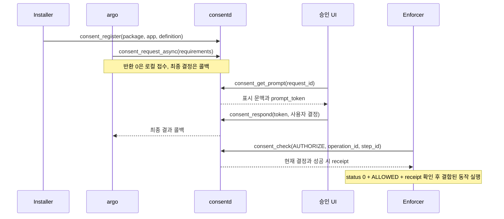

# 가이드 02: 공개 C API

[English](02-c-api.en.md)

할 일을 아래에서 선택하세요. 각 장은 입력과 사용 가능한 예제로 시작합니다.
함수별 찾아보기는 선언을 확인할 때 사용하는 참조 목록입니다.

- [C API 클라이언트 시작하기](api/01-start.ko.md)
- [승인 정의 등록하기](api/02-registration.ko.md)
- [승인을 요청하고 접근 허가 확인하기](api/03-request-and-check.ko.md)
- [결과와 비동기 콜백 처리하기](api/04-results-and-callbacks.ko.md)
- [세션과 취득 데이터 관리하기](api/05-sessions-and-data.ko.md)

## 처음 읽는 순서와 핵심 용어

처음 연동한다면 아래 용어와 호출 흐름을 읽고, [함수별 찾아보기](#함수별-찾아보기)에서
담당 역할의 API를 선택하세요. [최소 C 조회 프로그램](#최소-c-조회-프로그램)으로
입력·결과 처리 방식을 익힌 뒤 동기 실행 허가, 비동기 승인, 등록, 세션·데이터
수명 절을 읽으면 됩니다. 이 가이드는 현재 [공개 헤더](../../src/consent/inc/consent.h)와
구현을 설명하며, [설계 01](../design/01-consent-framework.md)의 인터페이스 초안과
구별합니다.

| 용어 / 필드 | 의미와 사용 위치 |
|---|---|
| definition | Installer가 등록한 승인 정책의 이름입니다. 집행자, 민감도, 승인 방식, 표시 문구를 정의합니다. 등록 자체는 사용자 승인이 아닙니다. |
| requirement | 한 번의 request/check에서 요구하는 조건입니다. definition과 operation/scope/purpose/recipient를 묶으며 여러 조건은 모두 충족해야 합니다. |
| `subject`, `profile` | 승인을 적용할 주체와 프로필입니다. 인증된 호출자의 위임 범위 안에서 지정하며 호출자 신원을 대신하지 않습니다. |
| `operation`, `scope` | 수행할 동작과 정확한 접근 범위입니다. 예를 들어 `read`와 등록 정책에 맞는 범위 문자열을 사용합니다. |
| `purpose`, `recipient` | 사용 목적과 수신자입니다. 같은 자원이라도 이 값이 달라지면 기존 승인을 그대로 쓸 수 없습니다. |
| enforcer | 보호된 동작 직전에 권한을 검사하고 실제 접근을 통제하는 서비스입니다. |
| grant | 사용자 결정으로 생긴 접근 승인입니다. ONCE/SESSION/TIMED/PERSISTENT 수명을 가집니다. |
| receipt | 성공한 AUTHORIZE가 반환한 실행 허가 기록입니다. 실행 ID·요구 조건과 결합되며 임의 작업에 전용할 수 없습니다. |
| session / generation | 논리 세션과 현재 세대입니다. 소켓 연결과 별개이며 상태 전환 후 반환된 세대로 갱신합니다. 설치 generation과도 구별합니다. |
| artifact / holder | 보관 데이터의 제어 레코드와 실제 데이터를 보유·삭제하는 서비스입니다. 데이터 본문은 consentd에 보내지 않습니다. |

아래는 새 승인이 필요한 경우의 역할별 흐름입니다. 화살표는 각 역할의 C API
호출을 나타냅니다. 승인 UI로 요청을 전달하는 제품 연동은 별도로 필요합니다.
하나의 프로세스가 파라미터만 바꿔 모든 역할을 수행할 수 있다는 뜻은 아닙니다.



`request`는 사용자 승인을 구하고, `check(QUERY)`는 현재 충족 여부를 조회하며,
`check(AUTHORIZE)`는 실제 접근을 허가하고 ONCE를 소비합니다. 이 세 결과를
서로 대체하지 마세요. 기존 승인이 충분하면 새로운 UI 요청 없이 AUTHORIZE할 수
있습니다. 이미 취득한 데이터의 재사용은 아래 `operation=reuse-data` 계약을 따릅니다.

## 사전 조건과 호출 권한

제품 클라이언트는 systemd의 고정 endpoint `/run/.consentd.sock`에 연결합니다.
기본 역할 정책은 **default-deny**입니다. 소켓 그룹 접근이나 UID 0만으로 온라인
API 역할을 얻지 못합니다. 제품 통합자는 실제 실행파일, 커널 보안 label과
subject/profile/package/enforcer 위임을 설정해야 합니다. 예제는 role 필드 설정,
패키지 identity 우회, mock identity 선택이나 제품 endpoint 변경을 하지 않습니다.

| API 구분 | 인증된 호출자와 추가 검사 |
|---|---|
| `consent_register/update/unregister` | 패키지 위임을 받은 Installer; 신뢰할 수 있는 package/app 관계와 설치 generation |
| `consent_request`, `consent_request_async`, 요청 결과 조회·취소 | `argo`; subject/profile 위임과 저장된 요청 소유권 |
| `consent_check`, `consent_check_async` | `checker`, `cm`, `ce`, `holder`; 각 definition의 enforcer 소유권 또는 위임 |
| prompt 조회·응답 | `ui`; 요청 문맥, 표시 token, 같은 UI 프로세스 인스턴스 |
| `consent_revoke` | `admin`; subject/profile 위임 |
| session open/heartbeat/suspend/resume/close | `session`; 문맥 위임과 상태 전환 시 소유 프로세스 인스턴스 |
| session/cleanup 상태 조회 | 인증된 subject/profile 위임 |
| data·cleanup 목록·release 및 데이터 재사용 | `holder`; 프로세스 인스턴스와 receipt/provenance/문맥 결합 |
| offline 생성·등록 | real/effective UID 0, 명시적으로 선택한 보호된 이미지 root, 배타적 lifecycle lock |

온라인 성공 실행에는 이러한 실제 identity 또는 별도로 설정한 개발 환경이
필요합니다. 가이드 01의 isolated test daemon은 compile-time 시험 inventory를
사용합니다. [가이드 08의 .NET UI·참여자 PoC](08-consent-ui-poc.ko.md)는 별도
compile-time endpoint와 역할을 쓰지만 실제 pkgmgr의 package/app identity를
검증합니다. 가이드 07은 실행한 시나리오를 기록합니다.
제품 라이브러리에 링크한 독립 예제는 실제 identity를 등록하기 전에는 권한 거절이
정상입니다. 승인 UI와 Installer 제품 hook은 별도 통합 대상이며 예제가 구현하지 않습니다.

## 함수별 찾아보기

다음 42개 함수가 공개 C API입니다. 함수명은 실제 선언과 같으며 상세 인자와
오류는 각 표 위에 링크한 헤더에서 확인할 수 있습니다. `consent_feature_*`는
PoC의 별도 bridge에 속하므로 이 공개 API 목록에 포함하지 않습니다.

### 클라이언트와 입력 구성

선언: [consent_client.h](../../src/consent/inc/consent_client.h),
[consent_params.h](../../src/consent/inc/consent_params.h).

| 함수 | 용도와 사용법 |
|---|---|
| `consent_client_create` | 온라인 연결을 만들고 현재 스레드의 기본 GLib context를 포착합니다. 실패하면 출력 핸들은 NULL입니다. |
| `consent_client_create_with_context` | 콜백을 받을 `GMainContext`를 명시합니다. 라이브러리가 context 참조를 유지하며 호출자가 생성 스레드에서 loop를 구동합니다. |
| `consent_client_create_offline_registration` | 이미지 설치용 핸들을 만듭니다. 보호된 image root를 지정하고 register/destroy에만 사용합니다. |
| `consent_client_destroy` | 생성 스레드에서 핸들과 대기 콜백을 정리합니다. 원격 취소가 아니며 다른 호출과 동시에 실행하면 안 됩니다. |
| `consent_params_create` | 비어 있는 입력 builder를 만듭니다. |
| `consent_params_free` | builder를 해제합니다. NULL도 허용됩니다. |
| `consent_params_set` | 문자열 필드를 복사하며 같은 키가 있으면 값을 바꿉니다. |
| `consent_params_set_int64` | 정수를 10진 문자열 필드로 설정합니다. 각 연산의 허용 범위는 별도로 지켜야 합니다. |
| `consent_params_set_check_mode` | `CONSENT_CHECK_QUERY` 또는 `CONSENT_CHECK_AUTHORIZE`를 설정합니다. |
| `consent_params_add_requirement` | definition/operation/scope/purpose/recipient와 count를 함께 추가합니다. `policy_version`, `holder` 같은 추가 필드는 해당 `rN.*` 키로 설정합니다. |

### 승인 요청과 검사

선언: [consent_request.h](../../src/consent/inc/consent_request.h).

| 함수 | 용도와 사용법 |
|---|---|
| `consent_request` | argo가 승인을 요청하고 최종 결정까지 동기 대기합니다. `wait_timeout_ms`와 원격 `deadline_ms`는 별개입니다. |
| `consent_request_async` | 같은 승인을 비동기로 요청합니다. 반환 status, 콜백 status, 콜백 decision을 차례로 검사합니다. |
| `consent_check` | UI 없이 QUERY 또는 AUTHORIZE를 동기 수행합니다. AUTHORIZE에는 안정적인 실행 ID 두 개가 필요합니다. |
| `consent_check_async` | 같은 검사를 비동기로 수행합니다. AUTHORIZE 모드의 접수·detach를 실행 취소로 해석하면 안 됩니다. |
| `consent_async_detach` | 반환받은 로컬 async ID의 콜백을 억제합니다. 원격 request/check는 계속될 수 있습니다. |
| `consent_get_request_result` | 원래 요청 ID로 저장된 상태를 조회합니다. PENDING이면 아직 최종 결정이 아닙니다. |
| `consent_cancel_request` | 원격 대기 요청의 취소를 시도합니다. 이미 최종 결정된 요청이나 기존 grant를 철회하는 API가 아닙니다. |

### 등록·철회와 승인 화면

선언: [consent_registration.h](../../src/consent/inc/consent_registration.h),
[consent_prompt.h](../../src/consent/inc/consent_prompt.h).

| 함수 | 용도와 사용법 |
|---|---|
| `consent_register` | package name과 app ID를 별도 인자로 받아 완전한 definition을 등록합니다. offline 핸들이면 staging만 합니다. |
| `consent_update` | 온라인 definition을 완전한 새 내용으로 갱신합니다. 일부 필드만 보내는 patch가 아닙니다. |
| `consent_unregister` | package name으로 그 패키지의 모든 앱 등록을 제거합니다. app ID 인자는 없습니다. |
| `consent_revoke` | admin이 definition/subject/profile에 해당하는 승인을 철회합니다. |
| `consent_get_prompt` | UI가 저장된 요청의 표시 문맥과 최신 prompt_token을 가져옵니다. |
| `consent_respond` | UI가 표시한 token에 결합된 결정을 제출합니다. 응답 시점에 다시 평가된 최종 decision도 확인합니다. |
| `consent_prompt_format` | prompt의 title/body를 일반 UTF-8 텍스트로 만듭니다. 출력은 `free()`로 해제합니다. |

### 세션과 데이터 정리

선언: [consent_session.h](../../src/consent/inc/consent_session.h),
[consent_data.h](../../src/consent/inc/consent_data.h).

| 함수 | 용도와 사용법 |
|---|---|
| `consent_session_open` | 논리 세션을 만듭니다. 반환된 session/generation/resume_token을 필요한 수명 동안 보관합니다. |
| `consent_session_heartbeat` | 소유한 활성 세션의 lease를 갱신합니다. idle/최대 수명은 연장하지 않습니다. |
| `consent_session_suspend` | 재개 가능한 세션은 일시 정지하고 generation을 올립니다. CONNECTION_BOUND 세션은 종료합니다. |
| `consent_session_resume` | 같은 소유 프로세스가 최신 generation/token으로 재개합니다. 새 generation/token을 저장합니다. |
| `consent_session_close` | 접근을 차단하고 holder cleanup을 예약합니다. 성공만으로 실제 데이터 삭제가 완료되지는 않습니다. |
| `consent_session_get_state` | subject/profile/session으로 상태·현재 generation·cleanup 수를 조회합니다. lease 갱신이나 resume_token 조회가 아닙니다. |
| `consent_data_register` | holder가 AUTHORIZE receipt에 결합된 메모리 데이터의 보관 metadata를 등록합니다. |
| `consent_data_register_derived` | 부모 artifact들로부터 파생 데이터의 provenance와 수명을 등록합니다. 실제 데이터 변환은 holder 책임입니다. |
| `consent_data_release` | holder가 실제 삭제 결과를 ACK합니다. 이 함수가 애플리케이션 데이터를 삭제하지는 않습니다. |
| `consent_cleanup_get_state` | 세션의 기록된 정리 진행 상태를 조회합니다. |
| `consent_cleanup_get_pending` | holder가 처리해야 할 artifact 목록을 가져옵니다. 삭제·release 후 다시 조회합니다. |

### 결과와 오류 해석

선언: [consent_result.h](../../src/consent/inc/consent_result.h),
[consent_common.h](../../src/consent/inc/consent_common.h).

| 함수 | 용도와 사용법 |
|---|---|
| `consent_result_free` | 소유한 동기 결과나 clone을 해제합니다. NULL도 허용하며 빌린 콜백 결과에는 사용하지 않습니다. |
| `consent_result_clone` | 결과를 복사해 콜백 반환 뒤에도 보관할 수 있게 합니다. clone 실패도 처리해야 합니다. |
| `consent_result_get_decision` | decision enum을 얻습니다. 필드가 없거나 인식되지 않으면 UNKNOWN입니다. |
| `consent_result_get` | 키로 빌린 문자열을 얻습니다. 없는 키는 NULL, 존재하는 빈 값은 빈 문자열입니다. |
| `consent_result_size` | 결과 필드 수를 얻습니다. NULL이면 0입니다. |
| `consent_result_get_at` | 0부터 시작하는 인덱스로 키·값을 읽습니다. 순서에 의미를 부여하지 말고 필요한 필드는 키로 찾으세요. |
| `consent_error_string` | status의 정적 설명 문자열을 얻습니다. 해제하지 않습니다. |

등록·세션·cleanup 결과에는 decision이 없을 수 있습니다. 성공 여부는 각 함수의
status와 해당 연산의 결과 필드로 판단하세요. `get_decision()`의 UNKNOWN만으로
관리 연산 실패를 판단하거나, 반대로 status 0만으로 보호 접근을 허용하면 안 됩니다.


## 헤더와 소유권

[작업별 설명 읽기: C API 클라이언트 시작하기](api/01-start.ko.md).

## 실행 가능한 예제 빌드

[작업별 설명 읽기: C API 클라이언트 시작하기](api/01-start.ko.md).

## 인자 구성과 재시도 식별자

[작업별 설명 읽기: 승인을 요청하고 접근 허가 확인하기](api/03-request-and-check.ko.md).

## 동기 QUERY와 AUTHORIZE

[작업별 설명 읽기: 승인을 요청하고 접근 허가 확인하기](api/03-request-and-check.ko.md).

### 최소 C 조회 프로그램

[승인을 요청하고 접근 허가 확인하기](api/03-request-and-check.ko.md).

### 실행 직전 AUTHORIZE

[승인을 요청하고 접근 허가 확인하기](api/03-request-and-check.ko.md).

## 비동기 승인과 dispatcher 수명

[작업별 설명 읽기: 결과와 비동기 콜백 처리하기](api/04-results-and-callbacks.ko.md).

## 온라인 등록과 이미지 생성 중 등록

[작업별 설명 읽기: 승인 정의 등록하기](api/02-registration.ko.md).

## 승인 UI와 지역화 template

[작업별 설명 읽기: 승인 정의 등록하기](api/02-registration.ko.md).

## Grant mode, session과 데이터 수명

[작업별 설명 읽기: 세션과 취득 데이터 관리하기](api/05-sessions-and-data.ko.md).

## 오류와 안전한 상태 조정

[작업별 설명 읽기: 결과와 비동기 콜백 처리하기](api/04-results-and-callbacks.ko.md).

## Client GIO 소유권과 프로세스 signal

[작업별 설명 읽기: 결과와 비동기 콜백 처리하기](api/04-results-and-callbacks.ko.md).

## 기능 선택 요청

opt-in 필드와 canonical digest는 [프로토콜
가이드](../design/03-protocol.ko.md#기능-선택-승인-version-1)에 정의합니다.
설정 선택에서도 request는 argo만 호출합니다. PREAPPROVAL은 선택 기간 충족을,
TASK는 유효한 exact grant 재사용과 부족 조건만의 추가 승인을 처리합니다.
opt-in은 cache를 사용하지 않고 daemon hello capability가 필요합니다.
배치는 공통 기간과 최대 16개 논리 조건을 가지지만 240필드/64KiB 전체 prompt 및
render 예산에서 더 일찍 E2BIG가 날 수 있습니다. 묵시 분할이나 부분 승인은 금지입니다.
격리 설정 흐름은 [기능 가이드](10-feature-approval.ko.md)를 참고하세요.

## 문서 근거와 예제 검증 범위

함수별 찾아보기의 42개 이름은 [공개 헤더](../../src/consent/inc/)의 선언과
대조했습니다. 호출·출력 복사 규칙은 [wrapper.cc](../../src/consent/wrapper.cc),
입력 설정은 [params.cc](../../src/consent/params.cc), 결과 소유권은
[result.cc](../../src/consent/result.cc), 비동기 전체 사용 흐름은
[request.c](../../src/examples/request.c)에서 확인할 수 있습니다.

이 가이드의 최소 조회 프로그램은 실제 Tizen GBS SDK 헤더를 사용한 호스트
C11 `-Wall -Wextra -Werror -fsyntax-only` 검사를 통과했습니다. 기존
[public_headers_test.py](../../tests/public_headers_test.py)도 C11/C++17에서
10개 공개 헤더의 단독 포함과 42개 선언을 확인했습니다. 이는 문법·선언 검사이며
링크나 에뮬레이터 실행 검증은 아닙니다. 실행 근거와 제품 연동 한계는
[가이드 07](07-verification.ko.md)을 참고하세요.


### Cleanup 페이지와 재시도 sweep

[세션과 취득 데이터 관리하기](api/05-sessions-and-data.ko.md).

## API 연동 계약

실행 가능한 예제, 기능별 헤더와 함수별 소유권·오류 계약은
[가이드 02](02-c-api.ko.md)에 정리했습니다. 재시도 증거를 보존하는 metadata
정리와 남은 용량·복구 한계는 [가이드 09](09-storage-maintenance.ko.md)를 참고하세요.

공개 C API 헤더는 `src/consent/inc/`에만 두며 비공개 C++ 헤더는 이 디렉터리
밖에 둡니다. 설치 헤더는 기존 `/usr/include/consent/consent.h`를 유지하고,
pkg-config를 쓰는 프로그램은 `<consent.h>`로 포함합니다. 공개 헤더가
`<tizen.h>`를 포함하므로 `consent.pc`는 `capi-base-common`을 공개 의존성으로
선언하여 필요한 컴파일·링크 설정을 전달합니다.

설치된 메타데이터로 C 프로그램을 빌드합니다.

```sh
cc consumer.c -o consumer $(pkg-config --cflags --libs consent)
```

`consent_register()`는 패키지명과 app ID를 각각 전달받고,
`consent_unregister()`는 패키지에 속한 모든 정의를 제거합니다.
호출자가 보낸 문자열만으로 소유권을 인정하지 않습니다. request는 인증된
argo만 사용할 수 있고 check는 UI를 호출하지 않습니다. 보호 작업 실행에는
AUTHORIZE 검사를 사용하며 일회성 소비와 재시도 식별자를 원자적으로 처리합니다.

비동기 함수 성공은 접수를 뜻합니다. 즉시 결정되는 결과를 포함하여 최종
성공·실패는 등록한 dispatcher callback으로 전달합니다. 입력은 반환 전에
복사합니다. callback 결과는 callback 실행 중 빌린 객체이므로 보관하려면
공개 clone/free 계약을 따릅니다. 비동기 함수는 dispatcher 소유 스레드에서
호출하며 중첩 loop iteration을 하지 않습니다. request cache를 보호 작업의
최종 실행 권한으로 사용하지 않습니다.

세션은 전송 연결과 독립된 대화를 뜻합니다. artifact와 data-use permit은
제어 메타데이터만 저장하며 대화 본문을 저장하지 않습니다. 실제 데이터 수명은
holder가 집행하고 정리를 ACK합니다. close 응답은 이후 사용 차단을 뜻하며
물리적 삭제 완료를 증명하지 않습니다.
holder가 재시작하면 명시적인 subject/profile과 `reconcile=1`로
`consent_cleanup_get_pending()`을 호출하여 이전 프로세스 인스턴스의 미완료
정리를 조회합니다. 실제 삭제 후 같은 문맥으로 `consent_data_release()`를
호출하여 완료를 알립니다. 이 대조는 정리 권한만 부여합니다. DB 전체 소실과
holder 대조의 한계는 [저장 가이드](../design/04-storage-design.ko.md)를 참조합니다.

---

[관련 작업](api/01-start.ko.md) · [이어 읽기](13-tool-examples.ko.md) · [역할별
문서](../README.md)
