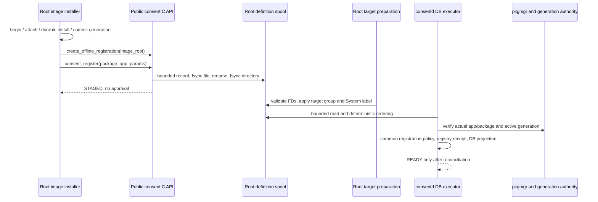

# Guide 04: Offline definition registration

An image-install system service can use the public `consent_register()` without
starting consentd. It must explicitly create a registration-only handle:

```c
consent_client_h client = NULL;
int status = consent_client_create_offline_registration(image_root, &client);
if (!status) {
    /* params contains operation_id, expected_generation and the complete
       definition, including policy/text versions and localized messages. */
    status = consent_register(client, package_name, app_id, params);
    consent_client_destroy(client);
}
```

`image_root` is an absolute, existing, root-owned protected directory. The caller
must be root at creation and on every write. The handle belongs to its original
process and thread; a fork child cannot use or destroy its inherited handle.
The initial root-only writer is an explicit provisioning authority, not a role
inferred from a shared UID. No nonroot product system-service identity is assumed.

Success0 means **STAGED: the protected definition installation record is durable**.
It does not mean the definition is active or a user approved it. The ordinary
`consent_client_create()` remains online; missing sockets, permission/peer failures,
timeouts and uncertain replies never switch it to offline mode. Offline handles
accept only `consent_register()` and destruction. Update, unregister, request,
check, async/detach, UI, session, revoke and data/cleanup APIs reject them with
`CONSENT_ERROR_INVALID_OPERATION`; outputs are null, async IDs zero and no callback
is accepted. Independent parameter/result/format helpers remain usable.

## Image installation generation

Provision the generation before opening the offline handle: the handle holds an
exclusive lifecycle lock until destruction. The CLI prepares installation identity
only; definitions are still registered through the C API.

```sh
# Root, explicitly inside a protected build environment. ROOT must already exist.
ROOT=/opt/consent-image
GEN=$(consent-installation-authority --image-root "$ROOT" \
  begin example.package image-install-1 absent)
consent-installation-authority --image-root "$ROOT" \
  attach example.package example.app image-app-1 "$GEN"
# Complete and durably confirm actual package installation in the image first.
consent-installation-authority --image-root "$ROOT" \
  commit example.package image-commit-1 "$GEN"
# The system service now calls consent_register(... expected_generation=GEN ...).
```

Begin issues and records a fresh generation. Attach records each app; commit is
called only when the trusted image installer has verified durable installation
completion. This responsibility is not inferred from socket absence. Existing
installations require their expected previous generation; stable operation IDs
preserve begin/attach/commit/remove retry results and conflicting payloads fail.
A reinstall rotates generation, and removal leaves a tombstone first. Neither
register nor startup invents a missing generation or restores an old one from a
spool. The production Installer transaction/hook remains a separate integration.

`image_root="/"` denotes the caller's current filesystem root, including an
explicit image chroot. On a real target it is usable only while the daemon and
other lifecycle users are stopped: the same EX/SH lock prevents concurrent image
writers and live daemon access. A busy lock returns BUSY without changing existing
lock metadata. This is not automatic discovery of an offline machine.

## Protected storage and first boot



The fixed path within the selected image is
`/opt/var/lib/consent-authority/registrations`. It contains native Parcel v1
records with `offline_format=1`, exact package/app, expected generation, operation
ID, complete validated definition and `payload_sha256`. The lowercase 64-hex digest
covers the canonical native Parcel Envelope body (`v=1`, `id=1`, `method=register`),
excluding the four-byte frame header and exactly the two metadata fields
`offline_format` and `payload_sha256`. Both are verified before stripping metadata
and importing. Missing/unsupported versions, duplicate fields and altered hashes
are rejected; metadata counts toward the stored frame and field limits. Final names are
SHA256(operation_id) plus `.parcel`; same operation/payload retries succeed and
changed payload returns CONFLICT. Publication uses an exclusive temporary file,
file fsync, atomic rename and directory fsync. A failure after publication returns
OUTCOME_UNKNOWN; retry the same ID and payload. Validated interrupted temporary
files are removed by a later writer under the same exclusive lock. Failed image
scaffolding is not always automatically repaired: an existing non-traversable
canonical ancestor is rejected without chmod; the trusted builder must explicitly
repair its intended permissions and retry.

Limits are64KiB per framed record,128 final records,256 directory entries and
4MiB total, including temporary files. Unknown entries, malformed records,
symlinks, hardlinks, FIFOs, untrusted owners and unsafe permissions are rejected.
Traversal is anchored to directory descriptors and never follows symlinks or
`..`; the writer cannot escape the selected image through those paths. Newly
created canonical `opt/var/lib` ancestors are root:root0755 regardless of umask;
authority/spool leaves are0700 and records0600. Existing canonical ancestors must permit other-read and other-execute, since
the nonroot daemon opens directory FDs without host-side NSS assumptions. Their
modes are not silently changed. The image-root host directory itself may remain
0700. Use a root-protected image path, not a user-writable build tree.

Image mode does not require host SMACK or target account lookup. Before target
startup, the root helper validates bounded managed files and applies root ownership,
security_fw group read access (directory0750, records0640) and the System SMACK
label. Label failure blocks startup. The daemon cannot rewrite the root spool;
only it writes its own definitions registry and SQLite DB. No offline path writes
consent.db, grants, usage, sessions, permits or artifact metadata.

All records are validated before import. With a nonempty spool, authority source
parsing/schema checks precede opening the repository. Each offline installation
check reads and classifies one protected authority FD: an absent authority leaf or
missing/pending/mismatched installation is deferred; malformed/schema/protection
and I/O errors block startup. A scoped strict reconciliation mode covers repository
Open, all imports and the final Snapshot, and restores normal online validation
on success or failure. Commit-boundary validation preserves that distinction. Deterministic order is package/app/
definition/generation, numeric policy/text revisions, then operation ID. The DB
executor uses the common registration policy without inventing an Installer Peer.
Actual pkgmgr app/package membership and protected active generation are checked
before retry lookup and again after commit, before publication. Missing, pending,
removed or stale installations remain deferred; unrelated packages still import.
Other malformed/protection/storage failures block startup with a diagnostic. Reconciliation runs at startup only; after correcting installation authority or provisioning deferred records, stop and restart the service. Periodic policy invalidation does not scan the spool.

The registry retains offline operation receipts outside SQLite. An applied receipt
keeps its original result without reapplying an old definition. An unseen seed whose same-owner/generation definition has revisions at least
as high on both axes and higher on at least one, or a seed
for a same-generation inactive definition, is recorded as obsolete and returns
STALE on every exact retry. An equal revision axis must retain the same associated
policy or text meaning; crossed revisions, same-revision conflicting content and
namespace changes remain errors. Obsolete receipts use an offline-only tagged
value and do not change the online receipt format. New real generations remain
eligible for normal registration. DB deletion restores valid definitions and these
retry protections, never approvals. Record/receipt limits return explicit errors;
automatic retention pruning is not implemented.

## Verification and limits

`scripts/emulator-offline-test.sh` demonstrates the public C API with the socket
absent, malformed/schema authority startup rejection before DB creation, first
valid startup, numeric revision ordering, two apps and another package,
retry/conflict, unsupported methods, live lifecycle exclusion, repeat startup,
DB loss, an unseen seed after unregister and same-name reinstall. It temporarily
uses the separate test inventory adapter and preserves/restores previous isolated
state. `offline-identity-test` distinguishes missing/pending from malformed,
protection, FIFO and injected I/O errors using the actual protected reader.
Root ownership/path/sync fault tests and repository generation/publication
regressions are separate executables. The production adapter retains actual
pkgmgr validation; isolated inventory results alone do not prove product hook
integration. Execution results and exact snapshots belong in the paired
[verification record](07-verification.en.md); implementation/test presence is not an
execution claim.

`scripts/emulator-offline-platform-test.sh` separately exercises the production
pkgmgr adapter using observed installed apps, mismatched membership and stale
generation. It preserves/restores the original production stores and leaves role
configuration unchanged. It checks the stopped DB projection and zero grants;
protected C API authorization remains denied without deployed product roles.
