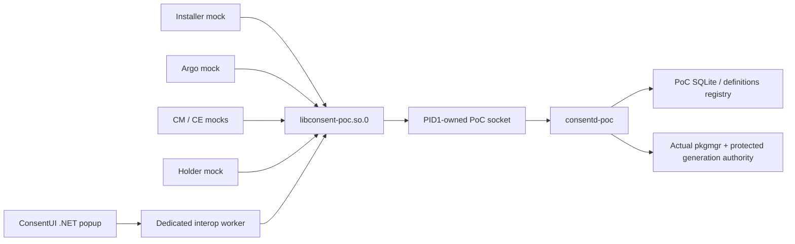

# 08. Consent UI and participant PoC

This development-only integration uses a .NET NUI application and five native
mock participants against the public C API and an isolated consent daemon.
It does not provision production roles, replace the platform approval UI, or
integrate a production Installer lifecycle hook.



## Build and installation

The RPM build enables `CONSENT_BUILD_POC`. The separate `consent-poc` package
contains the fixed-endpoint `libconsent-poc.so.0`, daemon, preparation and
installation-authority tools, native participant mocks, and two signed TPKs.
The PoC library retains production socket authentication; it does **not** use
`CONSENT_TESTING` or a runtime endpoint override.

Inside GBS, `dotnet-build-tools` 8.0.421 and the offline
`csapi-tizenfx-nuget` 14.0.0.19364 packages compile the application sources for
`net8.0-tizen10.1`. The SDK development signer creates the emulator TPK.
No host-precompiled application DLL is an input. The positive build also runs
the managed lifecycle/model regressions with that SDK. Signing is for this
emulator PoC, not distribution or production signing.

`consent-poc-register.service` registers only `org.tizen.consentui` globally.
An image/chroot RPM install skips live service actions; the installed boot
symlink runs registration when package-manager is available. This does not
create consent definitions, approval grants, roles or installation generations.
The negative package `org.tizen.consentui.negative` is installed explicitly for
identity testing. RPM removal leaves registered TPKs and their data in place;
after stopping the PoC, an operator may explicitly remove them with:

```sh
pkgcmd -u -n org.tizen.consentui --global
pkgcmd -u -n org.tizen.consentui.negative --global
```

## Explicit identity setup

The endpoint is `/opt/var/lib/consent-poc-runtime/consent.sock`, listened on by
PID1 through `consentd-poc.socket`. Its parent is protected root-owned 0755;
the socket is root:users 0660. Explicit stopped-service preparation validates
that leaf and sets only its SMACK label to `_`, then reads it back. The
ancestor labels and production policy are unchanged. The strict client verifies PID1/UID0, the exact
kernel bind address and the listener's `System::Privileged` security label.
This listener label is distinct from the daemon's `System` label and the UI
application's package label.

The package ships a deny-all role configuration. On the selected development
emulator, `scripts/emulator-poc-setup.sh probe-start` temporarily replaces only
the PoC service command with a bounded activated-socket peer diagnostic. Launch
the UI as `owner:users` in an explicit privileged test-launch context
(`SmackProcessLabel=System::Privileged`) using
`consent-poc-launch org.tizen.consentui REQUEST_ID en-US`; the
probe records kernel SO_PEERCRED/SO_PEERSEC and sends no consent response.
`probe-stop` restores the daemon unit and saves observations. A client failure
against this diagnostic is expected and is not an authorization test.

Only after observing the actual UI socket label does `configure` provision
its explicit PoC rule: the observed owner UID, protected exact
`/usr/bin/dotnet-hydra-loader`, and exact
`User::Pkg::org.tizen.consentui` label, with subject `owner` and profile `default`.
The installed single-app package relation and its DLL/ancestors must remain
unwritable by that app UID. The `tizenglobalapp` package-manager account is a
trusted installation owner; it is not the UI caller. A common loader/UID or
preload label alone never grants UI authority.

Configuration prepares independent state at `/opt/var/lib/consent-poc-state`
and root-owned authority at `/opt/var/lib/consent-poc-authority`, then performs
an explicit stable installation transaction. Definitions are subsequently
registered through `consent-mock-installer` using the actual installed package.
No production state or role file is changed. Reinstalling the application is a
new installation and requires an explicit new generation transaction using
`configure INSTALL_OPERATION EXPECTED_GENERATION`. Keep those two inputs stable
for retries; the default transaction is for initial setup only; repeating
the same setup transaction is not evidence of a new installation.

## Popup and participant contract

The popup accepts only the initial VIEW request ID and requested language.
Displayed title/body and all authorization bindings come from `get_prompt`.
An active popup ignores subsequent app-control payloads, including unrelated
launches. Only its language button changes language, fetching a fresh complete
snapshot/token before display. Technical IDs/revisions remain internal.

A dedicated worker owns the C client and its private GLib context. Every page
must be reviewed before approval is enabled. Legacy requests use Allow once
and require ONCE support. Approval-v1 requests display the bound common
SESSION/TIMED/ONCE period and issue only the displayed missing conditions. Prompt refresh is bounded to 500 ms, preserving page review only when the
bound content is unchanged. Token/policy/session changes cannot be replaced by
launch data. Deny, Back, close and the 60-second local timeout never approve.
Errors dismiss the popup; a failed cleanup response is not reported as success.
There is no automatic approval path in the UI.

The separate argo, CM, CE, holder and installer executables have distinct
executable identities. `serve` mode keeps async/session/holder ownership alive.
Bounded INI examples are installed under `/usr/share/consent/poc/fixtures`.
Argo emits the daemon request ID for UI launch, CM checks without consumption,
CE consumes ONCE with AUTHORIZE, and the holder registers derived metadata and
ACKs cleanup only after clearing its owned mock buffer. No real user data is
used. The negative .NET app records its status only; actual authorization
rejection also requires the matching PID in the daemon role-rejection log.

## Repeatable emulator procedure

Run these commands only against the selected development emulator, from the
repository version matching the frozen RPM artifacts. Both host and target
need Python 3: the host driver also runs small target-side Python checks.
`consent-tests` requires target `python3-base`; `consent-poc` alone does not.
The UI/registration service itself does not require Python. Resolve missing
runtime or test dependencies with matching Tizen repository RPMs in the normal
RPM transaction; dependency-check bypasses are not part of this procedure.

The following host example selects verified build26. Confirm the matching
snapshot and artifact hashes in [Guide 07](07-verification.en.md) before installation. Build24 exposed a text-fit failure and build25 exposed clipped popup placement;
neither is a successful complete visual baseline.

```sh
# Host: select the serial shown by sdb, then select the reviewed build.
sdb devices
CONSENT_SERIAL='<selected-emulator-serial>'
CONSENT_BUILD=26
CONSENT_RPMS="/var/tmp/consent-artifacts/gbs-build-$CONSENT_BUILD"
CONSENT_TARGET_RPMS="/tmp/consent-rpm$CONSENT_BUILD"
python3 --version
sdb -s "$CONSENT_SERIAL" root on
sdb -s "$CONSENT_SERIAL" shell "mkdir -p '$CONSENT_TARGET_RPMS'"
for package in consent consentd consent-tests consent-poc; do
  sdb -s "$CONSENT_SERIAL" push \
    "$CONSENT_RPMS/$package-0.1.0-1.x86_64.rpm" "$CONSENT_TARGET_RPMS/"
done
sdb -s "$CONSENT_SERIAL" push scripts/emulator-poc-setup.sh /tmp/emulator-poc-setup.sh
sdb -s "$CONSENT_SERIAL" shell
```

In that target root shell, first restrict and verify the pushed script.
SDB push may change its mode; the source mode is not proof of target mode.
Require a regular root-owned file with one link and no symlink before running
it in the privileged context. Then install the four matching packages together.
Add any missing matching dependency RPMs to the same staging directory first.
The target directory below must match `CONSENT_TARGET_RPMS` above.

```sh
# Target root shell; initial install or an ordinary version upgrade.
set -eu
[ -f /tmp/emulator-poc-setup.sh ] && [ ! -L /tmp/emulator-poc-setup.sh ]
[ "$(stat -c '%u:%g:%h' /tmp/emulator-poc-setup.sh)" = 0:0:1 ]
chmod 0600 /tmp/emulator-poc-setup.sh
[ "$(stat -c '%u:%g:%a:%h' /tmp/emulator-poc-setup.sh)" = 0:0:600:1 ]
systemd-run --quiet --wait --pipe \
  -p User=root -p Group=root -p SmackProcessLabel=System::Privileged \
  /bin/sh -c 'exec rpm -Uvh /tmp/consent-rpm26/*.rpm'

systemctl start consent-poc-register.service
systemctl show consent-poc-register.service \
  -p Result -p ExecMainCode -p ExecMainStatus
journalctl -u consent-poc-register.service -n 40 --no-pager
pkginfo --app org.tizen.consentui
pkginfo --pkg org.tizen.consentui
pkginfo --list org.tizen.consentui
python3 --version
```

Expect the registration command to succeed, `Result=success` and
`ExecMainStatus=0` with an exited process. An inactive successful oneshot is
normal. Check the exact package/app relation, version `0.1.0`, single app, and
`Exec: /opt/usr/globalapps/org.tizen.consentui/bin/ConsentUI.dll`.
For a deliberate development rebuild with the **same NEVRA**, use
`rpm -Uvh --replacepkgs --replacefiles /tmp/consent-rpm26/*.rpm` in the same
privileged `systemd-run` context instead of the initial-install RPM command.
These replacement flags are for that reviewed development rebuild only;
dependency verification remains enabled.

Use `/bin/sh` explicitly for the pushed script because target `/tmp` may be
mounted `noexec`. Define this function in the target root shell and run the
observation/configuration sequence:

```sh
poc_setup() {
  systemd-run --quiet --wait --pipe \
    -p User=root -p Group=root -p SmackProcessLabel=System::Privileged \
    /bin/sh /tmp/emulator-poc-setup.sh "$@"
}

poc_setup probe-start
systemd-run --quiet --wait --pipe \
  -p User=owner -p Group=users -p SmackProcessLabel=System::Privileged \
  /usr/libexec/consent/poc/consent-poc-launch \
  org.tizen.consentui dummy-probe en-US
poc_setup probe-stop
cat /opt/var/lib/consent-poc-control/peer-observation.log

# Fresh installation only: stable transaction with no previous generation.
poc_setup configure poc-ui-install-1 absent
cat /opt/var/lib/consent-poc-control/generation
```

The diagnostic deliberately cannot serve a prompt; the UI may fail/close.
Do not interpret that as a consent denial. After a real reinstall, use a new
installation operation ID and the expected current generation, preserving
both values for retries. For example, read the current generation before the
new transaction, record it with the chosen operation ID, then run:

```sh
CONSENT_EXPECTED_GENERATION=$(cat /opt/var/lib/consent-poc-control/generation)
poc_setup configure poc-ui-install-2 "$CONSENT_EXPECTED_GENERATION"
```

Return to a **host** terminal in the matching repository. Start the approval
case with a fresh artifact directory; do not change its serial or directory
between commands:

```sh
CONSENT_ALLOW_DIR=$(mktemp -d /var/tmp/consent-poc-allow.XXXXXX)
python3 scripts/emulator-poc-mocks.py \
  --serial "$CONSENT_SERIAL" --artifact-dir "$CONSENT_ALLOW_DIR" \
  start-request --expect ALLOWED --locale ko-KR
```

On the actual emulator UI, review every page and select **Allow once** within
the 60-second prompt bound. `start-request` only launches the UI; it never
sends an approval. After the UI response, continue on the host:

```sh
python3 scripts/emulator-poc-mocks.py \
  --serial "$CONSENT_SERIAL" --artifact-dir "$CONSENT_ALLOW_DIR" finish-allow
python3 scripts/emulator-poc-mocks.py \
  --serial "$CONSENT_SERIAL" --artifact-dir "$CONSENT_ALLOW_DIR" stop
```

`finish-allow` checks ALLOWED, non-consuming QUERY, ONCE acquisition/retry/
exhaustion, derived holder metadata and cleanup. A failed or timed-out UI must
not be substituted with an automatic response. Preserve failure evidence,
stop the actors, and use a fresh artifact directory for a new attempt.

For denial, use a different fresh directory and select **Deny** in the real
UI within the same bound:

```sh
CONSENT_DENY_DIR=$(mktemp -d /var/tmp/consent-poc-deny.XXXXXX)
python3 scripts/emulator-poc-mocks.py \
  --serial "$CONSENT_SERIAL" --artifact-dir "$CONSENT_DENY_DIR" \
  start-request --expect DENIED --locale en-US
# Select Deny in the emulator before running the next command.
python3 scripts/emulator-poc-mocks.py \
  --serial "$CONSENT_SERIAL" --artifact-dir "$CONSENT_DENY_DIR" stop
```

There is no `finish-allow` step for denial: `stop` verifies the DENIED callback
and the subsequent QUERY before shutting down the actors. Driver `stop`
preserves private logs and stops only its argo/holder processes. Finally stop
the PoC daemon/socket from the target root shell:

```sh
poc_setup stop
```

This retains PoC state, roles and installed UI packages for inspection. It does
not reset a production database or remove package data. Use the explicit TPK
removal commands above only when that separate cleanup is intended.

## Verification status

Frozen26 passed GBS compilation/managed tests, actual TPK installation and
paired socket identity checks. Actual EN/KO page review, language reset, Allow
and Deny, long unbroken text, cancellation, timeout and Back were exercised.
The Allow flow completed QUERY/ONCE authorization/retry and holder cleanup.
See [Guide 07](07-verification.en.md) for hashes, screenshots, exact evidence
and the separate24/25 failures. After verification the PoC daemon/socket and
actors are stopped; explicit PoC state/roles and installed TPKs remain for review.
This is a Common Emulator PoC, not product role/UI/Installer or physical TV acceptance.

## Feature Settings integration

The initial DEFAULT app-control opens Settings without changing a selection.
`consent-poc-launch org.tizen.consentui --settings en-US` uses this path; VIEW
continues to open a specific approval request. Launch parameters never select,
save or execute a function. See [Guide 10](10-feature-approval.en.md) for the
selection, missing-only approval and execution contract.

The private `libconsent-feature-poc.so.0` connects only to
`/opt/var/lib/consent-feature-runtime/argo.sock`, activated by
`consent-feature-poc.socket` and `consent-feature-poc.service`. The UI verifies
the root-protected path, PID1/UID0, original kernel bind address, inode and
`System::Privileged` listener label. The coordinator verifies the actual UI
UID, protected loader and exact package label. The app cannot read the root
coordinator's process identity on the selected target; no cross-UID executable
inspection or added UI capability is claimed. Only the dedicated runtime leaf
is prepared root:root 0755 with SMACK `_`; the socket is root:users 0660.

The argo actor owns the immutable catalog, selection CAS and coordinator epoch.
Saved SESSION or 30-minute selections survive closing Settings while the
conversation/selection period remains valid. An explicit task-only ONCE choice
is separate from those saved settings. Every mutation carries the viewed
catalog hash, epoch, expected revision and stable command ID. An ambiguous
reply retains the immutable submission for explicit same-command retry. A
coordinator restart rejects old commands and requires a newly reviewed choice.
All conditions must fit the combined prompt budget; no partial batch or silent
splitting is performed.

After ordinary PoC identity and generation setup, use a fresh host artifact
directory and the selected emulator serial:

```sh
python3 scripts/emulator-feature-flow.py --serial "$CONSENT_SERIAL" \
  --artifact-dir /var/tmp/consent-feature-run start --locale en-US
# Review Settings and approval pages and operate the actual application.
python3 scripts/emulator-feature-flow.py --serial "$CONSENT_SERIAL" \
  --artifact-dir /var/tmp/consent-feature-run collect
# Choose the explicit conversation-close task and observe holder cleanup first.
python3 scripts/emulator-feature-flow.py --serial "$CONSENT_SERIAL" \
  --artifact-dir /var/tmp/consent-feature-run stop
```

The driver uploads the matching protected preparation script and runs it in
root/System::Privileged context. It temporarily assigns distinct mock CM/CE
enforcers and restores the original PoC roles on stop. It collects evidence;
it does not approve requests or assert a visual result. Final ordinary PoC
shutdown still uses `emulator-poc-setup.sh stop`. A force-stop without a holder
ACK is not successful data cleanup.

The separate `consent-feature-gate-*` executables are installed only with tests.
`scripts/emulator-feature-gate.py` prepares an explicit protected
`/etc/systemd/system/consent-feature-poc.service.d/gate.conf` override, records
a real AUTHORIZE receipt/operation/job/PID, and holds action dispatch for at
most 30 seconds without blocking the actor. Its prepare/wait/release/audit/cleanup
phases require actual UI selection removal, verify cancellation and zero matching
action events, and restore the saved roles/unit configuration. The ordinary
coordinator has no gate or runtime switch. Native injected-completion evidence
and this target experiment are reported separately in Guide 07.

`scripts/emulator-feature-endpoint-test.py` uses the installed private bridge
and endpoint fixture to reject a directly bound fake server and a different
PID1 socket renamed to the expected path before any request bytes are sent.
It uses protected temporary `/etc/systemd/system` units and restores only the
recorded feature-unit states. The separate negative .NET package also probes
the bridge; correlate its PID with `feature-peer-rejected` /
`ui-peer-rejected` in the coordinator log, in addition to the consent daemon's
role-rejection evidence. A transport error alone does not establish this result.

For the separate reuse boundary, `prepare --kind reuse` selects instrumentation
only in the dedicated test coordinator; the default is `--kind acquisition`.
Acquisition evidence is `proof_kind=acquisition-receipt`. Reuse evidence is
`proof_kind=artifact-permit`, recorded after the real `reuse-data` permission
check, with artifact, session/generation, canonical exact-context SHA-256 and
operation/job/PID. It is not a new acquisition receipt. Both kinds pause before
the actor's final selection check and start dispatch. Preserve the old gate run
as evidence before preparing another run; the script refuses existing records.


Worker channels use a transient root-owned 0600 pathname under the protected
feature runtime directory. The coordinator connects and accepts before fork,
verifies its exact kernel PID/UID0/GID0 and System label at both ends, then
removes the listener pathname and transfers only the connected FD to the
verified executable. The worker still verifies the parent's executable inode,
start time and lifetime. The selected kernel returns an empty peer label for
socketpair; that case is rejected rather than accepted as a fallback. Channel
startup/exit diagnostics contain only stages and status; an unprovable leftover
node is reported by its generated path and is never blindly unlinked.

After installing the matching tests RPM and preparing the protected feature
runtime directory, the dedicated target test requires actual SMACK evidence:

```sh
# On the selected target, in the privileged test preparation context:
systemd-run --wait --pipe -p User=root -p Group=root \
  -p SmackProcessLabel=System -p CapabilityBoundingSet=CAP_SYS_PTRACE \
  -p AmbientCapabilities=CAP_SYS_PTRACE -p NoNewPrivileges=yes \
  /usr/libexec/consent/tests/consent-feature-test --worker-channel
```

This explicit mode must pass both-end kernel identity, Parcel transfer,
wrong-parent executable rejection, transient-stat retry and owned-node cleanup;
it does not skip when SMACK is unavailable. Ordinary host/GBS tests label that
positive platform portion SKIP while still testing wrong kernel PID rejection.
See Guide07 for the actual build and target outcome.

### Verified selected-feature flow (build29)

The exact build29 TPK/RPM set completed actual KO SESSION and EN 30-minute TIMED
selection/approval, app close/reopen with heartbeat, same-conversation artifact
reuse, a device-only missing-permission popup, and calendar-plus-device execution.
Denying a wider one-time calendar request kept both the saved selection and
execution counter unchanged; an explicitly chosen alternative reused the old
narrow artifact. Empty selection save and explicit conversation-close completed
holder wipe/ACK and CLOSED/pending0. [Guide 07](07-verification.en.md#build-29-selected-feature-preapproval-and-actual-task-execution)
records exact hashes, request/job/PID/revision context, screenshots, commands and
limits. This is Public Common Emulator acceptance of isolated mock providers,
not TV hardware or production Settings/argo integration.

The installable positive TPK is
`/var/tmp/consent-artifacts/gbs-build-29/org.tizen.consentui-0.1.0.tpk`.
Use that directory's matching runtime/daemon/PoC RPMs and the setup steps above;
the TPK alone does not provision trusted roles or generation authority.
Actual screenshots and phase logs are in
`/var/tmp/consent-artifacts/emulator-build-29/feature-main/`. In particular,
`prompt-ko-1.png` through `prompt-ko-3.png` show exact calendar scope and separate
retention, `missing-device-ko-1.png` through `-3.png` show the single missing
condition, and `timed-prompt-en-1.png` through `-5.png` show the 30-minute choice.
After wider denial, uncheck **This task only: once** before selecting the
already-authorized narrow alternative; that operation must not save the
one-time task into Settings.

For the actual dispatch-boundary test, copy the matching script to the selected
development emulator and run each phase through an explicit root privileged
unit. For example, on the target:

```sh
systemd-run --wait --pipe -p SmackProcessLabel=System::Privileged \
  /usr/bin/python3 /tmp/consent-feature-gate.py prepare --kind acquisition
# Operate the real Settings/approval UI; submit the reviewed calendar task.
systemd-run --wait --pipe -p SmackProcessLabel=System::Privileged \
  /usr/bin/python3 /tmp/consent-feature-gate.py wait --timeout 10
# Within the unchanged 30-second gate, uncheck calendar, review, and save.
systemd-run --wait --pipe -p SmackProcessLabel=System::Privileged \
  /usr/bin/python3 /tmp/consent-feature-gate.py release
systemd-run --wait --pipe -p SmackProcessLabel=System::Privileged \
  /usr/bin/python3 /tmp/consent-feature-gate.py audit
```

Preserve the completed evidence directory before the next `prepare`; never
replace records from an unfinished run. Use `--kind reuse` for the separate
reuse test, first acquire one artifact normally and then request it again.
After release and before audit/unit restoration, choose **conversation-close**
while the holder is still alive and confirm CLOSED/pending0. On interruption,
run the script's `cleanup` phase; a forced stop is not evidence of physical data
erasure. Both actual29 gates passed with matching action events0, while the
reuse baseline retained its single acquisition action. The first acquisition
attempt expired during inspection and is separately recorded as failure.
Native injected late-result/retry/epoch tests are distinct from these actual UI
gates; actions already started cannot be undone by later deselection.

Final actual29 cleanup restored ordinary PoC roles, stopped all feature/PoC/test
units, removed owned gate FIFOs/overrides/transient sockets, and left production
active with default-deny roles and unchanged DB/registry inodes. Installed
packages and protected regular evidence remain available for review. The scoped
Aurum bootstrap/forward were stopped. Final Guide07/08 evidence and PO Guide10
updates are post-archive documentation only; source and tested TPKs remain exact29.
