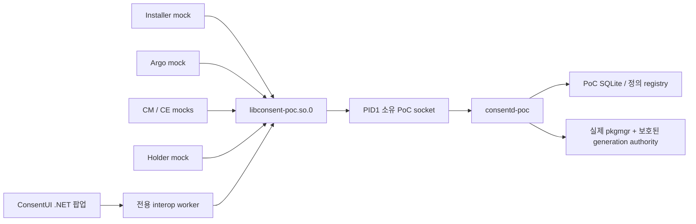

# 08. Consent UI와 참여자 PoC

.NET NUI 앱과 별도 native mock 5개가 공개 C API와 격리 consent daemon을
사용하는 개발용 통합입니다. 운영 역할, 실제 제품 승인 UI, Installer의
제품 설치 트랜잭션 연동을 완료한 것으로 해석하지 않습니다.



## 빌드와 설치

RPM 빌드는 `CONSENT_BUILD_POC`를 켭니다. 별도 `consent-poc` 패키지에 고정
endpoint의 `libconsent-poc.so.0`, daemon, 저장소 준비와 installation-authority
도구, native 참여자 mock, 서명된 TPK 두 개를 설치합니다. PoC 라이브러리는
운영 연결 검증을 유지하며 `CONSENT_TESTING`이나 환경변수 endpoint를 쓰지 않습니다.

GBS 안에서 `dotnet-build-tools` 8.0.421과 로컬
`csapi-tizenfx-nuget` 14.0.0.19364를 이용해 앱 소스를
`net8.0-tizen10.1`로 컴파일하고 SDK 개발 서명기로 emulator TPK를 만듭니다.
Host에서 미리 만든 앱 DLL은 입력으로 받지 않습니다. 정상 앱 빌드에는 같은
SDK로 실행하는 관리 코드 수명/모델 회귀도 포함됩니다. 이 서명은 emulator
PoC용이며 제품 배포 서명이 아닙니다.

`consent-poc-register.service`는 `org.tizen.consentui` TPK만 전역 등록합니다.
이미지/chroot RPM 설치에서는 실행 중인 서비스 조작을 생략하고, 부팅 후
package-manager가 준비되면 설치된 symlink에 따라 등록합니다. 동의 정의,
사용자 승인, 역할, installation generation은 자동 생성하지 않습니다.
부정 시험용 `org.tizen.consentui.negative`는 명시적으로 따로 설치합니다.
RPM 제거 시 등록된 앱과 데이터는 남습니다. PoC를 중지한 뒤 운영자가 다음
명령으로 명시 제거할 수 있습니다.

```sh
pkgcmd -u -n org.tizen.consentui --global
pkgcmd -u -n org.tizen.consentui.negative --global
```

## 명시적 신원 준비

PID1의 `consentd-poc.socket`이
`/opt/var/lib/consent-poc-runtime/consent.sock`을 listen합니다. 상위 경로는
보호된 root 소유 0755, 소켓은 root:users 0660입니다. 서비스가 중지된 명시 준비 단계에서 leaf를
검증하고 해당 디렉터리의 SMACK만 `_`로 설정·재조회합니다. 상위 경로 label과
운영 정책은 변경하지 않습니다. 클라이언트는
PID1/UID0, kernel의 정확한 bind 주소, listener의 `System::Privileged`
보안 label을 검증합니다. 이 label은 daemon의 `System` 및 앱별 label과
서로 다른 신원 정보입니다.

기본 역할 설정은 모두 거부합니다. 선택한 개발 emulator에서
`scripts/emulator-poc-setup.sh probe-start`는 PoC 서비스 실행 파일만
유계 activation 소켓 신원 관측기로 잠시 교체합니다.
명시적 시험 launcher 문맥(`owner:users`,
`SmackProcessLabel=System::Privileged`)에서
`consent-poc-launch org.tizen.consentui REQUEST_ID en-US`로 UI를 시작하면
관측기가 kernel SO_PEERCRED/SO_PEERSEC을 기록하고 동의 응답 없이 닫습니다.
`probe-stop`이 daemon unit을 복구하고 관측을 저장합니다. 이때 클라이언트
실패는 예상된 관측 동작이며 권한 거부 시험 자체가 아닙니다.

실제 UI 소켓 label을 확인한 뒤에만 `configure`가 PoC 역할을 준비합니다.
실제 owner UID, 보호된 정확한 `/usr/bin/dotnet-hydra-loader`, 정확한
`User::Pkg::org.tizen.consentui` label을 모두 요구하고 subject `owner`,
profile `default`로 제한합니다. 단일 앱 package 관계와 설치 DLL 및 상위
경로가 앱 UID에 의해 수정되지 않는지도 검증합니다. `tizenglobalapp`은
신뢰된 설치 관리 계정이며 UI 호출자와 다릅니다. 공통 loader/UID 또는
preload label만으로 UI 권한을 주지 않습니다.

독립 state `/opt/var/lib/consent-poc-state`와 root authority
`/opt/var/lib/consent-poc-authority`를 준비한 뒤 안정된 명시 설치 transaction을
수행합니다. 정의는 이후 `consent-mock-installer`가 실제 설치 package로
공개 API를 호출해 등록합니다. 운영 state와 roles는 변경하지 않습니다.
앱 재설치는 새로운 installation이므로 명시적인 새 generation transaction이
필요합니다. `configure INSTALL_OPERATION EXPECTED_GENERATION`으로 이를
명시하고 재시도 시 두 입력을 유지합니다. 기본 transaction은 최초 준비용입니다.
같은 준비 transaction의 재시도는 새 설치 증명이 아닙니다.

## 팝업과 참여자 계약

팝업은 최초 VIEW의 request ID와 언어만 받습니다. 표시 title/body와 권한
결합 정보는 모두 `get_prompt`에서 얻습니다. 팝업이 활성화된 동안 후속
app-control은 무시합니다. 언어는 UI 언어 버튼에서만 바꾸며 새 전체 표시와
token을 얻은 뒤 교체합니다. 기술 ID/revision은 내부에만 보관합니다.

전용 worker가 C client와 private GLib context를 소유합니다. 모든 페이지를
확인해야 허용 버튼을 활성화합니다. 기존 요청은 모든 조건이 ONCE를
지원할 때 이번 한 번 허용을 사용합니다. approval-v1 요청은 결합된 공통
SESSION/TIMED/ONCE 기간을 표시하고 화면에 나타난 부족 조건만 발급합니다. 500ms 간격의 prompt refresh에서 결합 내용이 같을 때만 페이지
확인 상태를 유지합니다. launch 입력으로 token/policy/session을 바꾸지
않습니다. 거부, Back, 닫기, 로컬 60초 timeout은 승인하지 않습니다.
오류 시 팝업을 닫고 정리 응답 실패를 성공으로 표시하지 않습니다.
UI에는 자동 승인 경로가 없습니다.

argo/CM/CE/holder/installer 실행 파일은 각각 별도 신원입니다. `serve`로
async/session/holder 소유 process를 유지합니다. 유계 INI 예제는
`/usr/share/consent/poc/fixtures`에 설치됩니다. Argo가 UI launch에 필요한
request ID를 출력하고 CM은 비소비 QUERY, CE는 ONCE 소비 AUTHORIZE를 수행합니다.
Holder는 파생 메타데이터를 등록하고 자신의 모의 buffer를 지운 뒤에만 cleanup
ACK을 보냅니다. 실제 사용자 데이터는 쓰지 않습니다. 부정 .NET 앱은 상태만
기록하며 권한 거부 판정에는 같은 PID의 daemon 역할 거부 로그도 필요합니다.

## Emulator 재현 절차

선택한 개발 emulator에서만 실행하며, 동결 RPM 산출물과 일치하는 저장소
버전의 스크립트를 사용합니다. Host와 target에 모두 Python 3이 필요합니다.
Host driver가 target에서도 작은 Python 검사를 실행하기 때문입니다.
`consent-tests`는 target `python3-base`를 의존하지만 `consent-poc`만 설치하면
Python이 보장되지 않습니다. UI와 등록 서비스 자체는 Python을 요구하지
않습니다. 누락된 runtime/시험 의존성은 일치하는 Tizen 저장소 RPM으로 일반
RPM transaction에서 해결하며 의존성 검사를 우회하지 않습니다.

아래 host 예시는 검증된 build26을 선택합니다.
[Guide 07](07-verification.ko.md)의 대응 snapshot과 산출물 hash를 검증한 뒤 설치합니다. Build24에서는 텍스트 크기 검사 실패, build25에서는 팝업 위치 잘림이
확인되어 전체 화면 검증의 성공 기준으로 사용할 수 없습니다.

```sh
# Host: sdb에 표시된 serial과 검토된 build를 선택합니다.
sdb devices
CONSENT_SERIAL='<selected-emulator-serial>'
CONSENT_BUILD=26
CONSENT_RPMS="/var/tmp/consent-artifacts/gbs-build-$CONSENT_BUILD"
CONSENT_TARGET_RPMS="/tmp/consent-rpm$CONSENT_BUILD"
python3 --version
sdb -s "$CONSENT_SERIAL" root on
sdb -s "$CONSENT_SERIAL" shell "mkdir -p '$CONSENT_TARGET_RPMS'"
for package in consent consentd consent-tests consent-poc; do
  sdb -s "$CONSENT_SERIAL" push \
    "$CONSENT_RPMS/$package-0.1.0-1.x86_64.rpm" "$CONSENT_TARGET_RPMS/"
done
sdb -s "$CONSENT_SERIAL" push scripts/emulator-poc-setup.sh /tmp/emulator-poc-setup.sh
sdb -s "$CONSENT_SERIAL" shell
```

이 target root shell에서 먼저 push한 스크립트의 권한을 제한·확인합니다.
SDB push가 mode를 바꿀 수 있으므로 소스의 mode만으로 target mode를
판단하지 않습니다. privileged 문맥으로 실행하기 전에 root 소유의 일반 파일,
단일 link, symlink 아님을 확인합니다. 이어서 같은 build의 네 패키지를 함께
설치합니다. 누락된 의존 RPM이 있으면 일치하는 버전을 같은 준비 디렉터리에
먼저 넣습니다. 아래 target 경로는 위 `CONSENT_TARGET_RPMS`와 같아야 합니다.

```sh
# Target root shell: 최초 설치 또는 일반적인 버전 업그레이드.
set -eu
[ -f /tmp/emulator-poc-setup.sh ] && [ ! -L /tmp/emulator-poc-setup.sh ]
[ "$(stat -c '%u:%g:%h' /tmp/emulator-poc-setup.sh)" = 0:0:1 ]
chmod 0600 /tmp/emulator-poc-setup.sh
[ "$(stat -c '%u:%g:%a:%h' /tmp/emulator-poc-setup.sh)" = 0:0:600:1 ]
systemd-run --quiet --wait --pipe \
  -p User=root -p Group=root -p SmackProcessLabel=System::Privileged \
  /bin/sh -c 'exec rpm -Uvh /tmp/consent-rpm26/*.rpm'

systemctl start consent-poc-register.service
systemctl show consent-poc-register.service \
  -p Result -p ExecMainCode -p ExecMainStatus
journalctl -u consent-poc-register.service -n 40 --no-pager
pkginfo --app org.tizen.consentui
pkginfo --pkg org.tizen.consentui
pkginfo --list org.tizen.consentui
python3 --version
```

등록 명령 성공, `Result=success`, 정상 종료한 process의
`ExecMainStatus=0`을 확인합니다. 성공한 oneshot이 inactive인 것은 정상입니다.
정확한 package/app 관계, version `0.1.0`, 단일 앱,
`Exec: /opt/usr/globalapps/org.tizen.consentui/bin/ConsentUI.dll`을 확인합니다.
개발 중 의도적으로 **같은 NEVRA**를 재빌드한 경우에는 최초 설치 RPM 명령을
`rpm -Uvh --replacepkgs --replacefiles /tmp/consent-rpm26/*.rpm`으로 바꾸어
같은 privileged `systemd-run` 문맥에서 실행합니다. 이 교체 옵션은 검토된
개발 재빌드에만 사용하며 의존성 검사는 유지합니다.

Target `/tmp`는 `noexec`일 수 있으므로 push한 스크립트는 `/bin/sh`를
명시해 실행합니다. Target root shell에서 다음 함수를 정의하고
신원 관찰과 설정을 순서대로 수행합니다.

```sh
poc_setup() {
  systemd-run --quiet --wait --pipe \
    -p User=root -p Group=root -p SmackProcessLabel=System::Privileged \
    /bin/sh /tmp/emulator-poc-setup.sh "$@"
}

poc_setup probe-start
systemd-run --quiet --wait --pipe \
  -p User=owner -p Group=users -p SmackProcessLabel=System::Privileged \
  /usr/libexec/consent/poc/consent-poc-launch \
  org.tizen.consentui dummy-probe en-US
poc_setup probe-stop
cat /opt/var/lib/consent-poc-control/peer-observation.log

# 최초 설치만 해당: 이전 generation이 없는 안정된 transaction.
poc_setup configure poc-ui-install-1 absent
cat /opt/var/lib/consent-poc-control/generation
```

관측기는 prompt를 응답하지 않으므로 UI가 실패하거나 닫힐 수 있습니다.
이를 동의 거절로 해석하지 않습니다. 실제 앱 재설치 후에는 새 설치 operation
ID와 예상하는 현재 generation을 사용하고, 재시도에는 두 값을 유지합니다.
예를 들어 새 transaction 전에 현재 generation을 읽고 선택한 operation ID와
함께 기록한 다음 실행합니다.

```sh
CONSENT_EXPECTED_GENERATION=$(cat /opt/var/lib/consent-poc-control/generation)
poc_setup configure poc-ui-install-2 "$CONSENT_EXPECTED_GENERATION"
```

일치하는 저장소의 **host** terminal로 돌아와 새 artifact 디렉터리로 승인
시험을 시작합니다. 후속 명령에서도 같은 serial과 디렉터리를 유지합니다.

```sh
CONSENT_ALLOW_DIR=$(mktemp -d /var/tmp/consent-poc-allow.XXXXXX)
python3 scripts/emulator-poc-mocks.py \
  --serial "$CONSENT_SERIAL" --artifact-dir "$CONSENT_ALLOW_DIR" \
  start-request --expect ALLOWED --locale ko-KR
```

실제 emulator UI에서 모든 페이지를 확인하고 prompt의 60초 제한 안에
**이번 한 번 허용**을 선택합니다. `start-request`는 UI만 시작하며 승인을
자동 전송하지 않습니다. UI 응답 후 host에서 이어서 실행합니다.

```sh
python3 scripts/emulator-poc-mocks.py \
  --serial "$CONSENT_SERIAL" --artifact-dir "$CONSENT_ALLOW_DIR" finish-allow
python3 scripts/emulator-poc-mocks.py \
  --serial "$CONSENT_SERIAL" --artifact-dir "$CONSENT_ALLOW_DIR" stop
```

`finish-allow`는 ALLOWED, 비소비 QUERY, ONCE 획득/재시도/소진, 파생 holder
메타데이터와 정리를 확인합니다. UI 실패나 timeout을 자동 응답으로 대체하지
않습니다. 실패 증거를 남기고 actor를 중지한 뒤 새 artifact 디렉터리로
재시도합니다.

거절은 다른 새 디렉터리로 시작하고 같은 제한 안에 실제 UI에서 **거부**를
선택합니다.

```sh
CONSENT_DENY_DIR=$(mktemp -d /var/tmp/consent-poc-deny.XXXXXX)
python3 scripts/emulator-poc-mocks.py \
  --serial "$CONSENT_SERIAL" --artifact-dir "$CONSENT_DENY_DIR" \
  start-request --expect DENIED --locale en-US
# Emulator에서 Deny를 선택한 뒤 다음 명령을 실행합니다.
python3 scripts/emulator-poc-mocks.py \
  --serial "$CONSENT_SERIAL" --artifact-dir "$CONSENT_DENY_DIR" stop
```

거절에는 `finish-allow` 단계가 없습니다. `stop`이 DENIED callback과 후속
QUERY를 확인한 뒤 actor를 중지합니다. Driver의 `stop`은 비공개 로그를
보존하며 자신의 argo/holder process만 중지합니다. 마지막으로 target root
shell에서 PoC daemon/socket을 따로 중지합니다.

```sh
poc_setup stop
```

PoC state, roles, 설치된 UI package는 검토할 수 있도록 남습니다.
운영 DB 초기화나 package 데이터 삭제는 수행하지 않습니다. 별도 앱 제거를
의도한 경우에만 앞 절의 명시 TPK 제거 명령을 사용합니다.

## 검증 상태

고정26에서 GBS 컴파일/managed 시험, 실제 TPK 설치와 소켓 신원 검사가 통과했습니다.
실제 한영 페이지 검토·언어 변경 초기화·허용/거절·긴 연속 문자열·취소·시간 초과·
Back을 검증했고 허용 뒤 QUERY/ONCE 승인·재시도 및 holder 정리가 완료됐습니다.
Hash, 화면, 정확한 근거와24/25 실패 구분은 [Guide 07](07-verification.ko.md)을
참고합니다. 검증 후 PoC daemon/socket과 actor는 중지하고 명시 PoC state/roles와
설치 TPK는 검토용으로 보존했습니다. Common Emulator PoC이며 제품 role/UI/Installer
연동이나 실제 TV 수용 완료 주장은 아닙니다.

## 기능 설정 연동

최초 DEFAULT app-control은 선택을 변경하지 않고 설정을 엽니다.
`consent-poc-launch org.tizen.consentui --settings ko-KR`가 이 경로이며 VIEW는
기존 특정 승인 요청을 엽니다. launch 인자로 기능 선택·저장·실행을 하지 않습니다.
선택, 부족분 승인, 실행 계약은 [Guide 10](10-feature-approval.ko.md)을 참고합니다.

별도 `libconsent-feature-poc.so.0`는 `consent-feature-poc.socket` 및
`consent-feature-poc.service`가 활성화하는
`/opt/var/lib/consent-feature-runtime/argo.sock`에만 연결합니다. UI는 root 보호
경로, PID1/UID0, kernel 원래 bind 주소, inode, `System::Privileged` listener
label을 검증합니다. coordinator는 실제 UI UID, 보호된 loader, 정확한 package
label을 검증합니다. 선택 target의 앱은 root coordinator process identity를
읽을 수 없으므로 cross-UID executable 조회나 UI capability 추가를 주장하지
않습니다. 전용 runtime leaf만 root:root 0755/SMACK `_`로 준비하며 socket은
root:users 0660입니다.

argo actor가 immutable catalog, 선택 CAS, coordinator epoch를 소유합니다.
저장한 SESSION 또는 30분 선택은 설정을 닫아도 대화/선택 기간 안에서 유지됩니다.
명시적인 이번 작업만 ONCE 선택은 저장 설정과 별개입니다. 모든 변경은 표시한
catalog hash, epoch, expected revision, stable command ID를 전달합니다. 응답이
불확실하면 immutable submission을 보존하여 같은 명령 재시도를 명시적으로
제공합니다. coordinator 재시작 뒤에는 과거 명령을 거부하고 새로 확인한 선택을
요구합니다. 모든 조건이 통합 prompt 예산에 들어가야 하며 일부 승인이나 자동
분할을 하지 않습니다.

기존 PoC 신원·generation 설정 뒤 새 host artifact 디렉터리와 확인된 emulator
serial을 사용합니다.

```sh
python3 scripts/emulator-feature-flow.py --serial "$CONSENT_SERIAL" \
  --artifact-dir /var/tmp/consent-feature-run start --locale ko-KR
# 실제 앱에서 설정과 승인 페이지를 확인하고 조작합니다.
python3 scripts/emulator-feature-flow.py --serial "$CONSENT_SERIAL" \
  --artifact-dir /var/tmp/consent-feature-run collect
# 명시적인 대화 종료 작업을 선택하고 holder 정리부터 확인합니다.
python3 scripts/emulator-feature-flow.py --serial "$CONSENT_SERIAL" \
  --artifact-dir /var/tmp/consent-feature-run stop
```

Driver는 대응 보호 준비 script를 복사하여 root/System::Privileged 문맥에서
실행합니다. mock CM/CE의 enforcer를 분리하고 stop에서 원 PoC 역할을 복원합니다.
증거를 수집할 뿐 요청 승인이나 화면 성공을 대신 판정하지 않습니다. 일반 PoC의
최종 종료는 여전히 `emulator-poc-setup.sh stop`을 사용합니다. holder ACK 없이
강제 종료한 것은 데이터 정리 성공이 아닙니다.

별도 `consent-feature-gate-*` 실행파일은 tests에만 설치됩니다.
`scripts/emulator-feature-gate.py`는 보호된
`/etc/systemd/system/consent-feature-poc.service.d/gate.conf` override를 명시적으로
준비하고 실제 AUTHORIZE receipt/operation/job/PID를 기록하며 actor를 막지 않고
동작 dispatch를 최대 30초 보류합니다. prepare/wait/release/audit/cleanup 단계는
실제 UI 선택 해제를 요구하고 해당 작업 취소와 action event 0개를 검증한 뒤
원 역할/unit 설정을 복원합니다. 일반 coordinator에는 gate나 runtime switch가
없습니다. native completion 주입 증거와 실제 target 시험은 Guide 07에서 구분합니다.

`scripts/emulator-feature-endpoint-test.py`는 설치된 private bridge와 endpoint
fixture로 직접 bind한 위조 서버 및 기대 경로로 rename한 다른 PID1 socket을
요청 byte 송신 전에 거부하는지 검사합니다. 보호된 `/etc/systemd/system` 임시
unit을 사용하고 기록한 feature unit 상태만 복원합니다. 별도 negative .NET
package도 bridge를 조회합니다. 해당 PID의 coordinator
`feature-peer-rejected` / `ui-peer-rejected` 로그와 consent daemon의 역할 거부
증거를 함께 확인하며 transport 오류만으로 인증 거부를 주장하지 않습니다.

별도 재사용 경계는 `prepare --kind reuse`로 전용 test coordinator의 계측만
선택합니다. 기본값은 `--kind acquisition`입니다. 취득 증거는
`proof_kind=acquisition-receipt`, 재사용 증거는 실제 `reuse-data` 권한 조회 뒤
기록한 `proof_kind=artifact-permit`이며 artifact, session/generation, 정확한
문맥의 canonical SHA-256, operation/job/PID에 결합합니다. 새 취득 receipt가
아닙니다. 두 종류 모두 actor 최종 선택 검증 및 start dispatch 전에 보류합니다.
다음 run을 준비하기 전에 이전 gate 자료를 증거로 보존해야 하며 script는 기존
기록 덮어쓰기를 거부합니다.


worker 채널은 보호된 feature runtime 아래에 일시적인 root 소유0600 pathname을
만든다. coordinator가 fork 전에 connect/accept하고 양쪽 kernel PID가 자신인지,
UID0/GID0 및 System label이 일치하는지 검사한다. 이후 listener 경로를 제거하고
검증한 실행파일에 연결 FD만 전달한다. worker의 부모 실행파일 inode/starttime/
수명 검사는 유지한다. 선택한 커널의 socketpair는 peer label이 비어 있으며,
이를 허용하는 fallback은 없다. 시작/종료 진단은 단계와 status만 포함한다.
inode를 증명하지 못한 잔여 node는 생성된 경로를 기록하고 무조건 unlink하지 않는다.

matching tests RPM 설치와 보호 feature runtime 준비 후 실제 SMACK 근거를
필수로 검사하는 target 명령은 다음과 같다.

```sh
# 선택한 target의 privileged 시험 준비 문맥에서 실행:
systemd-run --wait --pipe -p User=root -p Group=root \
  -p SmackProcessLabel=System -p CapabilityBoundingSet=CAP_SYS_PTRACE \
  -p AmbientCapabilities=CAP_SYS_PTRACE -p NoNewPrivileges=yes \
  /usr/libexec/consent/tests/consent-feature-test --worker-channel
```

이 명시 모드는 양쪽 kernel 신원, Parcel 전달, 다른 부모 실행파일 거부,
일시 stat 오류 재시도 및 자기 node 정리를 반드시 통과해야 하며 SMACK 부재를
SKIP하지 않는다. 일반 host/GBS 시험은 해당 플랫폼 양성 부분만 SKIP으로 구분하고
다른 kernel PID 거부는 실행한다. 실제 빌드와 target 결과는 Guide07에 기록한다.

### 검증된 선택 기능 흐름(build29)

정확한 build29 TPK/RPM으로 실제 KO SESSION 및 EN 30분 TIMED 선택·승인,
앱 닫기·재실행 중 heartbeat 유지, 같은 대화 artifact 재사용, 부족한 기기 권한만
표시한 popup 및 일정+기기 실행을 완료했습니다. 넓은 일회 일정 요청을 거부하면
저장 선택과 실행 count가 유지되며, 별도로 명시한 대안은 기존 좁은 artifact를
재사용합니다. 빈 선택 저장 및 명시적 대화 종료에서 holder wipe/ACK와
CLOSED/pending0을 확인했습니다. [Guide 07](07-verification.ko.md#build-29-선택-기능-사전승인과-실제-작업-실행)에
정확한 해시, request/job/PID/revision 문맥, 화면·명령·제한을 기록했습니다.
격리 mock provider의 Public Common Emulator 수용 결과이며 TV 하드웨어 또는
제품 Settings/argo 연동 완료가 아닙니다.

설치 가능한 positive TPK는
`/var/tmp/consent-artifacts/gbs-build-29/org.tizen.consentui-0.1.0.tpk`입니다.
같은 폴더의 runtime/daemon/PoC RPM 및 위 setup 절차와 함께 사용하세요.
TPK만으로 신뢰 역할이나 generation authority가 준비되지는 않습니다.
실제 화면과 단계 로그는
`/var/tmp/consent-artifacts/emulator-build-29/feature-main/`에 있습니다.
`prompt-ko-1.png`~`prompt-ko-3.png`는 정확한 일정 범위와 별도 보관기간,
`missing-device-ko-1.png`~`-3.png`는 부족한 한 조건,
`timed-prompt-en-1.png`~`-5.png`는 30분 선택을 보여줍니다.
넓은 요청 거부 후에는 **이번 작업만 한 번** 체크를 해제하고 이미 승인된 좁은
대안을 선택하세요. 일회 작업을 설정에 저장하는 동작이 아닙니다.

실제 dispatch 경계 시험은 일치하는 script를 선택 개발 emulator에 복사한 뒤
각 단계를 명시적 root privileged unit으로 실행합니다. 다음은 target 명령입니다.

```sh
systemd-run --wait --pipe -p SmackProcessLabel=System::Privileged \
  /usr/bin/python3 /tmp/consent-feature-gate.py prepare --kind acquisition
# 실제 설정/승인 UI를 조작하고 검토한 일정 작업을 요청합니다.
systemd-run --wait --pipe -p SmackProcessLabel=System::Privileged \
  /usr/bin/python3 /tmp/consent-feature-gate.py wait --timeout 10
# 기존 30초 gate 안에서 일정 체크 해제→검토→저장을 수행합니다.
systemd-run --wait --pipe -p SmackProcessLabel=System::Privileged \
  /usr/bin/python3 /tmp/consent-feature-gate.py release
systemd-run --wait --pipe -p SmackProcessLabel=System::Privileged \
  /usr/bin/python3 /tmp/consent-feature-gate.py audit
```

다음 `prepare` 전에 완료된 근거 폴더를 보존하고, 끝나지 않은 run의 기록을
덮어쓰지 마세요. 별도 재사용 시험은 `--kind reuse`로 시작하여 먼저 정상적으로
artifact 한 개를 취득한 뒤 다시 요청합니다. release 후 audit/unit 복원 전,
살아 있는 holder에서 **대화 종료**를 선택하여 CLOSED/pending0을 확인하세요.
중단 시 script의 `cleanup` 단계를 실행하되 강제 중지를 실제 삭제 근거로 보지
않습니다. actual29 두 gate는 해당 action event0으로 통과했고 재사용 기준 상태의
최초 취득 1건은 그대로 남았습니다. 첫 취득 시도는 확인 중 기한 만료로 실패하여
별도 보존했습니다. Native 지연 결과/retry/epoch 주입 회귀는 실제 UI gate와 다른
근거이며, 이미 시작된 효과를 나중 선택 해제로 되돌린다고 주장하지 않습니다.

최종 actual29 정리에서는 일반 PoC 역할 복원, feature/PoC/test unit 중지,
소유 gate FIFO/override/임시 소켓 제거를 확인했습니다. production은 default-deny와
기존 DB/registry inode를 유지하며 active입니다. 설치 패키지와 보호된 일반 근거 파일은
검토용으로 남겼으며 소유 Aurum bootstrap/forward는 종료했습니다. 최종 Guide07/08
근거와 PO Guide10 정리만 archive 이후 문서이며, 소스와 시험 TPK는 exact29를 유지합니다.
