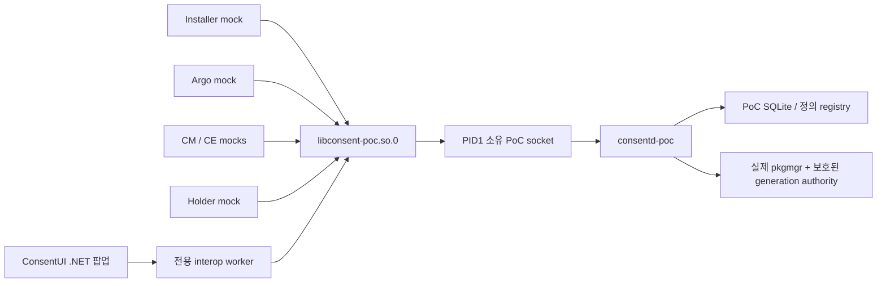

# 가이드 08: Consent UI 예제

.NET NUI 앱은 작은 승인 팝업을 표시하고 허용 전에 모든 페이지를 검토하게 합니다.
명시적인 approval-v2 요청은 기본 해제된 항상 허용 선택을 제공할 수 있으며
등록된 전체 정책이 이를 허용해야 합니다.
[네이티브 배치와 기간 계약](#ui09-작은-native-배치와-명시적-승인-기간-선택)을 참고하세요.

현재 한 명령 기기 검증 도구는 [가이드 17](17-native-ui-smoke.ko.md)에 있습니다.
아래 수동 절차는 각각 이전 빌드 스냅샷을 표시합니다. 예제는 공개 C API와 격리된
mock 참여자를 사용하고 네이티브 라이브러리는 `libconsent-poc.so.0`로 고정합니다.
제품 UI 역할, endpoint/패키지 설정과 argo 실행 연결은 연동이 필요합니다.
각 plugin이 인증된 등록과 패키지/앱 세대 계약에 따라 Installer hook을 담당합니다.


```mermaid
flowchart LR
  I[Installer mock] --> L[libconsent-poc.so.0]
  A[Argo mock] --> L
  C[CM / CE mocks] --> L
  H[Holder mock] --> L
  U[ConsentUI .NET 팝업] --> W[전용 interop worker]
  W --> L
  L --> S[PID1 소유 PoC socket]
  S --> D[consentd-poc]
  D --> R[PoC SQLite / 정의 registry]
  D --> P[실제 pkgmgr + 보호된 generation authority]
```

## 빌드와 설치

RPM 빌드는 `CONSENT_BUILD_POC`를 켭니다. 별도 `consent-poc` 패키지에 고정
endpoint의 `libconsent-poc.so.0`, daemon, 저장소 준비와 installation-authority
도구, native 참여자 mock, 서명된 TPK 두 개를 설치합니다. PoC 라이브러리는
운영 연결 검증을 유지하며 `CONSENT_TESTING`이나 환경변수 endpoint를 쓰지 않습니다.

GBS 안에서 `dotnet-build-tools` 8.0.421과 로컬
`csapi-tizenfx-nuget` 14.0.0.19364를 이용해 앱 소스를
`net8.0-tizen10.1`로 컴파일하고 SDK 개발 서명기로 emulator TPK를 만듭니다.
Host에서 미리 만든 앱 DLL은 입력으로 받지 않습니다. 정상 앱 빌드에는 같은
SDK로 실행하는 관리 코드 수명/모델 회귀도 포함됩니다. 이 서명은 emulator
PoC용이며 제품 배포 서명이 아닙니다.

`consent-poc-register.service`는 `org.tizen.consentui` TPK만 전역 등록합니다.
이미지/chroot RPM 설치에서는 실행 중인 서비스 조작을 생략하고, 부팅 후
package-manager가 준비되면 설치된 symlink에 따라 등록합니다. 동의 정의,
사용자 승인, 역할, installation generation은 자동 생성하지 않습니다.
부정 시험용 `org.tizen.consentui.negative`는 명시적으로 따로 설치합니다.
RPM 제거 시 등록된 앱과 데이터는 남습니다. PoC를 중지한 뒤 운영자가 다음
명령으로 명시 제거할 수 있습니다.

```sh
pkgcmd -u -n org.tizen.consentui --global
pkgcmd -u -n org.tizen.consentui.negative --global
```

## 명시적 신원 준비

PID1의 `consentd-poc.socket`이
`/opt/var/lib/consent-poc-runtime/consent.sock`을 listen합니다. 상위 경로는
보호된 root 소유 0755, 소켓은 root:users 0660입니다. 서비스가 중지된 명시 준비 단계에서 leaf를
검증하고 해당 디렉터리의 SMACK만 `_`로 설정·재조회합니다. 상위 경로 label과
운영 정책은 변경하지 않습니다. 클라이언트는
PID1/UID0, kernel의 정확한 bind 주소, listener의 `System::Privileged`
보안 label을 검증합니다. 이 label은 daemon의 `System` 및 앱별 label과
서로 다른 신원 정보입니다.

기본 역할 설정은 모두 거부합니다. 선택한 개발 emulator에서
`scripts/emulator-poc-setup.sh probe-start`는 PoC 서비스 실행 파일만
유계 activation 소켓 신원 관측기로 잠시 교체합니다.
명시적 시험 launcher 문맥(`owner:users`,
`SmackProcessLabel=System::Privileged`)에서
`consent-poc-launch org.tizen.consentui REQUEST_ID en-US`로 UI를 시작하면
관측기가 kernel SO_PEERCRED/SO_PEERSEC을 기록하고 동의 응답 없이 닫습니다.
`probe-stop`이 daemon unit을 복구하고 관측을 저장합니다. 이때 클라이언트
실패는 예상된 관측 동작이며 권한 거부 시험 자체가 아닙니다.

실제 UI 소켓 label을 확인한 뒤에만 `configure`가 PoC 역할을 준비합니다.
실제 owner UID, 보호된 정확한 `/usr/bin/dotnet-hydra-loader`, 정확한
`User::Pkg::org.tizen.consentui` label을 모두 요구하고 subject `owner`,
profile `default`로 제한합니다. 단일 앱 package 관계와 설치 DLL 및 상위
경로가 앱 UID에 의해 수정되지 않는지도 검증합니다. `tizenglobalapp`은
신뢰된 설치 관리 계정이며 UI 호출자와 다릅니다. 공통 loader/UID 또는
preload label만으로 UI 권한을 주지 않습니다.

독립 state `/opt/var/lib/consent-poc-state`와 root authority
`/opt/var/lib/consent-poc-authority`를 준비한 뒤 안정된 명시 설치 transaction을
수행합니다. 정의는 이후 `consent-mock-installer`가 실제 설치 package로
공개 API를 호출해 등록합니다. 운영 state와 roles는 변경하지 않습니다.
앱 재설치는 새로운 installation이므로 명시적인 새 generation transaction이
필요합니다. `configure INSTALL_OPERATION EXPECTED_GENERATION`으로 이를
명시하고 재시도 시 두 입력을 유지합니다. 기본 transaction은 최초 준비용입니다.
같은 준비 transaction의 재시도는 새 설치 증명이 아닙니다.

## 팝업과 참여자 계약

팝업은 최초 VIEW의 request ID와 언어만 받습니다. 표시 title/body와 권한
결합 정보는 모두 `get_prompt`에서 얻습니다. 팝업이 활성화된 동안 후속
app-control은 무시합니다. 언어는 UI 언어 버튼에서만 바꾸며 새 전체 표시와
token을 얻은 뒤 교체합니다. 기술 ID/revision은 내부에만 보관합니다.

전용 worker가 C client와 private GLib context를 소유합니다. 모든 페이지를
확인해야 허용 버튼을 활성화합니다. 기존 요청은 모든 조건이 ONCE를
지원할 때 이번 한 번 허용을 사용합니다. approval-v1 요청은 결합된 공통
SESSION/TIMED/ONCE 기간을 표시하고 화면에 나타난 부족 조건만 발급합니다.
500ms 간격으로 안내를 갱신할 때 결합 내용이 같을 때만 페이지
확인 상태를 유지합니다. launch 입력으로 token/policy/session을 바꾸지
않습니다. 거부, Back, 닫기, 로컬 60초 timeout은 승인하지 않습니다.
오류 시 팝업을 닫고 정리 응답 실패를 성공으로 표시하지 않습니다.
UI에는 자동 승인 경로가 없습니다.

argo/CM/CE/holder/installer 실행 파일은 각각 별도 신원입니다. `serve`로
async/session/holder 소유 process를 유지합니다. 유계 INI 예제는
`/usr/share/consent/poc/fixtures`에 설치됩니다. Argo가 UI launch에 필요한
request ID를 출력하고 CM은 비소비 QUERY, CE는 ONCE 소비 AUTHORIZE를 수행합니다.
Holder는 파생 메타데이터를 등록하고 자신의 모의 buffer를 지운 뒤에만 cleanup
ACK을 보냅니다. 실제 사용자 데이터는 쓰지 않습니다. 부정 .NET 앱은 상태만
기록하며 권한 거부 판정에는 같은 PID의 daemon 역할 거부 로그도 필요합니다.

## 과거 수동 실행 절차 (build26)

선택한 개발 emulator에서만 실행하며, 동결 RPM 산출물과 일치하는 저장소
버전의 스크립트를 사용합니다. Host와 target에 모두 Python 3이 필요합니다.
Host driver가 target에서도 작은 Python 검사를 실행하기 때문입니다.
`consent-tests`는 target `python3-base`를 의존하지만 `consent-poc`만 설치하면
Python이 보장되지 않습니다. UI와 등록 서비스 자체는 Python을 요구하지
않습니다. 누락된 runtime/시험 의존성은 일치하는 Tizen 저장소 RPM으로 일반
RPM transaction에서 해결하며 의존성 검사를 우회하지 않습니다.

아래 host 예시는 검증된 build26을 선택합니다.
[Guide 07](07-verification.ko.md)의 대응 snapshot과 산출물 hash를 검증한 뒤 설치합니다. Build24에서는 텍스트 크기 검사 실패, build25에서는 팝업 위치 잘림이
확인되어 전체 화면 검증의 성공 기준으로 사용할 수 없습니다.

```sh
# Host: sdb에 표시된 serial과 검토된 build를 선택합니다.
sdb devices
CONSENT_SERIAL='<selected-emulator-serial>'
CONSENT_BUILD=26
CONSENT_RPMS="/var/tmp/consent-artifacts/gbs-build-$CONSENT_BUILD"
CONSENT_TARGET_RPMS="/tmp/consent-rpm$CONSENT_BUILD"
python3 --version
sdb -s "$CONSENT_SERIAL" root on
sdb -s "$CONSENT_SERIAL" shell "mkdir -p '$CONSENT_TARGET_RPMS'"
for package in consent consentd consent-tests consent-poc; do
  sdb -s "$CONSENT_SERIAL" push \
    "$CONSENT_RPMS/$package-0.1.0-1.x86_64.rpm" "$CONSENT_TARGET_RPMS/"
done
sdb -s "$CONSENT_SERIAL" push scripts/emulator-poc-setup.sh /tmp/emulator-poc-setup.sh
sdb -s "$CONSENT_SERIAL" shell
```

이 target root shell에서 먼저 push한 스크립트의 권한을 제한·확인합니다.
SDB push가 mode를 바꿀 수 있으므로 소스의 mode만으로 target mode를
판단하지 않습니다. privileged 문맥으로 실행하기 전에 root 소유의 일반 파일,
단일 link, symlink 아님을 확인합니다. 이어서 같은 build의 네 패키지를 함께
설치합니다. 누락된 의존 RPM이 있으면 일치하는 버전을 같은 준비 디렉터리에
먼저 넣습니다. 아래 target 경로는 위 `CONSENT_TARGET_RPMS`와 같아야 합니다.

```sh
# Target root shell: 최초 설치 또는 일반적인 버전 업그레이드.
set -eu
[ -f /tmp/emulator-poc-setup.sh ] && [ ! -L /tmp/emulator-poc-setup.sh ]
[ "$(stat -c '%u:%g:%h' /tmp/emulator-poc-setup.sh)" = 0:0:1 ]
chmod 0600 /tmp/emulator-poc-setup.sh
[ "$(stat -c '%u:%g:%a:%h' /tmp/emulator-poc-setup.sh)" = 0:0:600:1 ]
systemd-run --quiet --wait --pipe \
  -p User=root -p Group=root -p SmackProcessLabel=System::Privileged \
  /bin/sh -c 'exec rpm -Uvh /tmp/consent-rpm26/*.rpm'

systemctl start consent-poc-register.service
systemctl show consent-poc-register.service \
  -p Result -p ExecMainCode -p ExecMainStatus
journalctl -u consent-poc-register.service -n 40 --no-pager
pkginfo --app org.tizen.consentui
pkginfo --pkg org.tizen.consentui
pkginfo --list org.tizen.consentui
python3 --version
```

등록 명령 성공, `Result=success`, 정상 종료한 process의
`ExecMainStatus=0`을 확인합니다. 성공한 oneshot이 inactive인 것은 정상입니다.
정확한 package/app 관계, version `0.1.0`, 단일 앱,
`Exec: /opt/usr/globalapps/org.tizen.consentui/bin/ConsentUI.dll`을 확인합니다.
개발 중 의도적으로 **같은 NEVRA**를 재빌드한 경우에는 최초 설치 RPM 명령을
`rpm -Uvh --replacepkgs --replacefiles /tmp/consent-rpm26/*.rpm`으로 바꾸어
같은 privileged `systemd-run` 문맥에서 실행합니다. 이 교체 옵션은 검토된
개발 재빌드에만 사용하며 의존성 검사는 유지합니다.

Target `/tmp`는 `noexec`일 수 있으므로 push한 스크립트는 `/bin/sh`를
명시해 실행합니다. Target root shell에서 다음 함수를 정의하고
신원 관찰과 설정을 순서대로 수행합니다.

```sh
poc_setup() {
  systemd-run --quiet --wait --pipe \
    -p User=root -p Group=root -p SmackProcessLabel=System::Privileged \
    /bin/sh /tmp/emulator-poc-setup.sh "$@"
}

poc_setup probe-start
systemd-run --quiet --wait --pipe \
  -p User=owner -p Group=users -p SmackProcessLabel=System::Privileged \
  /usr/libexec/consent/poc/consent-poc-launch \
  org.tizen.consentui dummy-probe en-US
poc_setup probe-stop
cat /opt/var/lib/consent-poc-control/peer-observation.log

# 최초 설치만 해당: 이전 generation이 없는 안정된 transaction.
poc_setup configure poc-ui-install-1 absent
cat /opt/var/lib/consent-poc-control/generation
```

관측기는 prompt를 응답하지 않으므로 UI가 실패하거나 닫힐 수 있습니다.
이를 동의 거절로 해석하지 않습니다. 실제 앱 재설치 후에는 새 설치 operation
ID와 예상하는 현재 generation을 사용하고, 재시도에는 두 값을 유지합니다.
예를 들어 새 transaction 전에 현재 generation을 읽고 선택한 operation ID와
함께 기록한 다음 실행합니다.

```sh
CONSENT_EXPECTED_GENERATION=$(cat /opt/var/lib/consent-poc-control/generation)
poc_setup configure poc-ui-install-2 "$CONSENT_EXPECTED_GENERATION"
```

일치하는 저장소의 **host** terminal로 돌아와 새 artifact 디렉터리로 승인
시험을 시작합니다. 후속 명령에서도 같은 serial과 디렉터리를 유지합니다.

```sh
CONSENT_ALLOW_DIR=$(mktemp -d /var/tmp/consent-poc-allow.XXXXXX)
python3 scripts/emulator-poc-mocks.py \
  --serial "$CONSENT_SERIAL" --artifact-dir "$CONSENT_ALLOW_DIR" \
  start-request --expect ALLOWED --locale ko-KR
```

실제 emulator UI에서 모든 페이지를 확인하고 prompt의 60초 제한 안에
**이번 한 번 허용**을 선택합니다. `start-request`는 UI만 시작하며 승인을
자동 전송하지 않습니다. UI 응답 후 host에서 이어서 실행합니다.

```sh
python3 scripts/emulator-poc-mocks.py \
  --serial "$CONSENT_SERIAL" --artifact-dir "$CONSENT_ALLOW_DIR" finish-allow
python3 scripts/emulator-poc-mocks.py \
  --serial "$CONSENT_SERIAL" --artifact-dir "$CONSENT_ALLOW_DIR" stop
```

`finish-allow`는 ALLOWED, 비소비 QUERY, ONCE 획득/재시도/소진, 파생 holder
메타데이터와 정리를 확인합니다. UI 실패나 timeout을 자동 응답으로 대체하지
않습니다. 실패 증거를 남기고 actor를 중지한 뒤 새 artifact 디렉터리로
재시도합니다.

거절은 다른 새 디렉터리로 시작하고 같은 제한 안에 실제 UI에서 **거부**를
선택합니다.

```sh
CONSENT_DENY_DIR=$(mktemp -d /var/tmp/consent-poc-deny.XXXXXX)
python3 scripts/emulator-poc-mocks.py \
  --serial "$CONSENT_SERIAL" --artifact-dir "$CONSENT_DENY_DIR" \
  start-request --expect DENIED --locale en-US
# Emulator에서 Deny를 선택한 뒤 다음 명령을 실행합니다.
python3 scripts/emulator-poc-mocks.py \
  --serial "$CONSENT_SERIAL" --artifact-dir "$CONSENT_DENY_DIR" stop
```

거절에는 `finish-allow` 단계가 없습니다. `stop`이 DENIED callback과 후속
QUERY를 확인한 뒤 actor를 중지합니다. Driver의 `stop`은 비공개 로그를
보존하며 자신의 argo/holder process만 중지합니다. 마지막으로 target root
shell에서 PoC daemon/socket을 따로 중지합니다.

```sh
poc_setup stop
```

PoC state, roles, 설치된 UI package는 검토할 수 있도록 남습니다.
운영 DB 초기화나 package 데이터 삭제는 수행하지 않습니다. 별도 앱 제거를
의도한 경우에만 앞 절의 명시 TPK 제거 명령을 사용합니다.

## Feature Settings

설정 화면은 기능과 기본 기간을 고릅니다. 기간은 이번 대화 또는 30분이며
작업 전용 선택은 저장한 설정을 바꾸지 않고 ONCE를 사용합니다. Catalog와 승인
요청은 argo가 소유하며 설정 화면에는 argo 역할이 없습니다. 기존 승인 때문에
팝업이 필요 없어도 사용자가 작업 내용을 검토합니다. 작업자는 보호 동작 전에
여전히 AUTHORIZE를 호출합니다.

기능 연결과 대화 재사용은 [가이드 10](10-feature-approval.ko.md)에 있습니다.
[build26–29 실행 기록](../history/07-verification-history.ko.md#guide-8-settings-history)에
이전 설정 명령과 화면 실패를 보존했습니다. 새 자동 실행은 가이드 17을 사용하세요.

## UI09: 작은 native 배치와 명시적 승인 기간 선택

새 native 카드는 논리 크기 580×600, 제목 26px·본문 16px, 둥근 흰색·회색
표면과 파란 주 동작을 사용합니다. 배율은 1을 넘지 않으며 짧은 창과 가로 창도
24px 여백으로 제한합니다. 기능 설정 화면은 기존의 별도 배치를 유지합니다.
바인딩된 전체 metadata는 생략 없이 페이지로 표시하고 모두 검토해야 허용됩니다.

native 체크박스는 기본 해제되어 requester의 ONCE·SESSION·TIMED 기간을
유지합니다. 전체 등록 조건이 허용하는 명시적 approval-v2 요청만 PERSISTENT를
선택할 수 있습니다. 별도 opt-in fixture 명령은 `feature-register-choice`와
`feature-serve-choice`이며 기본 명령과 approval-v1은 유지됩니다. 체크박스는
신원·프로필·기능·범위·동작·목적·수신자·보관 기간을 바꿀 수 없습니다. 선택·언어·
내용 변경은 전체 검토를 초기화하고 같은 바인딩의 token 갱신만 검토를 유지합니다.
거절이 기본 focus이며 시간 만료·닫기는 허용하지 않습니다. 제출 전에 원래 worker
snapshot의 참조 일치를 확인합니다.

고정 `libconsent-poc.so.0`와 feature library는 동일 native build target에서
main TPK로 포함해 개발 서명하며 SONAME·payload hash를 기록합니다. App launch가
라이브러리나 socket을 입력하지 않습니다. 개발 검증은 소유한 격리 daemon과 보호된
fixture 신원을 사용합니다. 제품 UI 역할·endpoint/패키지 배포·argo launch 구성은
남은 외부 계약입니다. 아래 실제 target 증거는 host managed 검사와 구분합니다.
기본 NUI 체크박스는 주황색으로 표시됐으며 Samsung runtime theme 설치를 주장하지
않습니다.

### 네이티브 UI 검증 단계

Release27 r7 GBS는 0으로 종료했고 29개가 통과했으며 root 전용 4개를
건너뛰었습니다. 관리 코드 UI 검사도 통과했습니다. 실제 기기에서 기본 ONCE,
선택한 PERSISTENT, 새 operation의 승인 재사용, 철회와 CM의 ONCE 전용 정책을
확인했습니다. 후속 실행은 재시작 시 승인 유지, DB 손실 뒤 새 승인, helper의
설치 세대 변경 뒤 실제 UI 승인과 새 CE 동작을 확인했습니다. Helper의 세대
변경을 TPK 재설치 검증으로 해석하지 않습니다.

전역 RPM을 설치하지 않고 추출한 테스트 도구와 서명된 TPK의 바이트를 UI 및
전용 namespace의 작업 라이브러리에 사용했습니다. 원래 TPK, 서비스와 보호된
운영/PoC 상태는 복원하거나 유지했습니다.
증거: `/var/tmp/consent-artifacts/consent-ui-native-09/`. 현재 저장소 실행 도구는
가이드 17을 사용하며 과거 수동 controller는 보관 기록으로만 참고하세요.

[네이티브 UI 상세 증거](../history/07-verification-history.ko.md#guide-8-checkpoint)

## 브라우저 미리보기

[이전 배치 HTML 보관본](../previews/consent-popup.html)는 API·실제 승인 없이
이전 NUI 배치와 전체 페이지 검토 흐름을 재현합니다. 기존 NUI 시각·상호작용 코드는
제품 UI에 재사용할 수 있지만 현재 NativeApi는 `libconsent-poc.so.0`로 고정돼
있습니다. 제품 build·endpoint/패키지 설정·신뢰 UI 역할·argo launch mapping이
필요하며 임의 라이브러리의 runtime 대체가 아닙니다. Installer hook은 각 plugin이
인증된 Installer publication과 보호된 package/app generation 계약을 따라
담당합니다.

별도의 [작은 One UI 스타일 제안](../previews/consent-popup-oneui.html)은 기본 해제된
‘항상 허용’ 체크박스를 제공합니다. 현재 프로필의 동일한 기능·범위·목적·수신자에
적용할 PERSISTENT 정책 제안이며, 각 취득 데이터 보관은 여전히 최대 30분입니다.
정책 변경·재설치·프로필 authority 동기화 손실 시 재승인이 필요할 수 있습니다.
Repository는 허용된 legacy definition의 PERSISTENT를 지원하지만 기본/approval-v1 feature
정의에는 해당 모드가 없고 approval-v1 선택 모드는 ONCE·SESSION·TIMED뿐입니다.
제안은 native 정책·API를 변경하거나 실제 승인을 생성하지 않습니다. 위의 기존
재현본은 그대로 유지됩니다. 실제 native 흐름은 아래
[UI09 opt-in fixture](#ui09-작은-native-배치와-명시적-승인-기간-선택)를 참고하세요.

Samsung의 [dialog](https://developer.samsung.com/one-ui/comp/dialog.html)와
[grid](https://developer.samsung.com/one-ui/layout/grid.html) 안내를 참고해 local
font, desktop 최대 폭 580px, mobile 좌우 24px 여백을 사용합니다. Browser 글꼴은
NUI와 다를 수 있습니다. 거절이 기본 focus이며 닫기·Escape·미리보기의 60초 만료는
허용하지 않습니다. 스크롤이 생기면 전체 안내를 검토해야 허용할 수 있으며,
체크박스 변경 시 안내를 다시 표시합니다.
