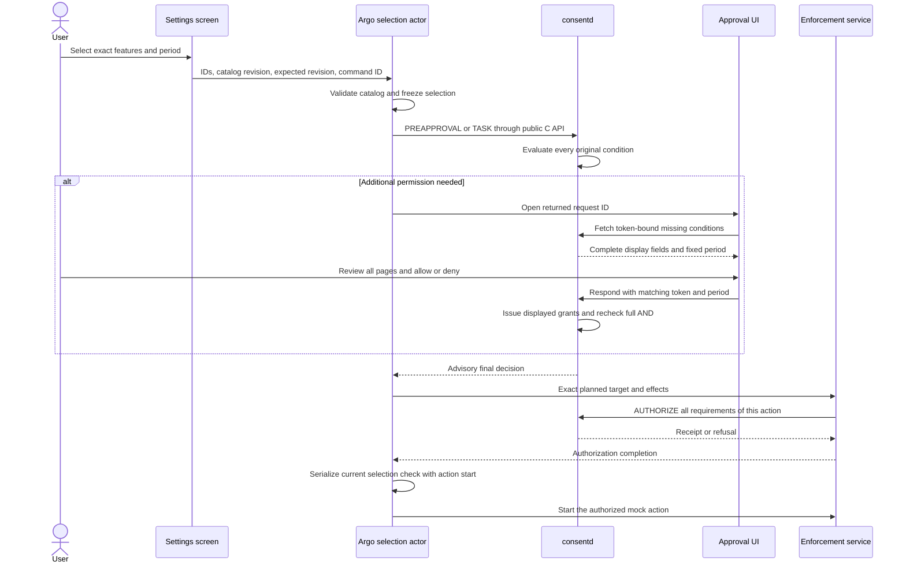

# 10. Feature selection and task approval

The opt-in approval contract and isolated PoC implement the
[D-16 integration contract](../design/05-decisions.en.md#d-16-feature-selection-missing-approvals-and-conversation-reuse).
[Guide 07](07-verification.en.md) records exact build snapshots, emulator results
and remaining limits; a design example below is not test evidence.
Use [Guide 08](08-consent-ui-poc.en.md) for the isolated .NET application and mock
participant environment. Production role enrollment remains separate.

## What the user chooses

Present a small set of understandable features in Settings. Each choice identifies
the providing application, the exact read or change scope, purpose, recipient and
approval period. Keep result retention separate from permission to acquire data.
The initial batch uses one clearly displayed approval period for all its items.
Settings offers this conversation (SESSION) or 30 minutes (TIMED). ONCE is reserved
for an explicit task-only selection and does not enable a persistent preference.

| Feature example | Exact access and effect | Reuse boundary |
| --- | --- | --- |
| Read my selected calendar and use the results in this conversation | A particular calendar provider, a fixed date range, a read operation, a stated planning purpose, and a named recipient/holder | Read only after AUTHORIZE. Reuse the acquired result only through its artifact permit, within the same valid conversation and retention period. |
| Control my selected device | A particular provider, device identity and permitted operation, such as turning off the study lamp | Every actual control operation must pass AUTHORIZE for that target and effect. Selecting this feature does not allow arbitrary device operations. |

A feature is not a broad permission named “calendar” or “device control.” The
protected argo catalog expands it into an immutable list of exact requirements.
Provider choices use fixed catalog variants, not whichever application becomes
the default later. Feature labels help users understand the decision; definition,
installation and policy checks still determine authority.

The TV flow is:

1. Select features and review their common period. Unselected features stay
   inactive. Selecting is distinct from completing consent approval.
2. Argo submits the selected requirements. The approval popup shows only the
   additional permissions needed, with their targets, purposes, recipients and
   periods. The user reviews all pages before allowing.
3. For a task, argo resolves the actual execution plan against the current
   selection. Existing exact approvals are reused; missing permissions are
   collected into one request. An otherwise inactive feature may be selected
   explicitly for this task without saving it as a Settings preference.
   Review the task's target, effect and period before submitting, even when an
   existing grant makes an additional approval popup unnecessary.
4. The enforcement service authorizes every requirement for each protected
   action immediately before execution. A popup result or cached QUERY is not an
   execution receipt.
5. Reuse authorized access or an existing permitted result during the same
   conversation. Ask again only when required authority is missing or no longer
   valid. Additional permissions never silently join an earlier selection.

Settings must distinguish selected, approval needed, ready and task-only states.
An app launch, restored screen, callback, timeout or back action must not be
interpreted as a user's new selection or an approval.
An advisory ALLOWED result does not mean the provider action has completed.
Keep execution pending until its actual result arrives. During that interval,
prevent another task submission but permit saving a deselection; a read-only
status refresh must not overwrite the user's unsaved choices.

## Ownership and boundaries



The PoC Settings bridge is private to the isolated app and argo mock. Its fixed
endpoint is `/opt/var/lib/consent-feature-runtime/argo.sock`, owned by
`consent-feature-poc.socket`; `consent-feature-poc.service` handles accepted work. Its input
is bounded selection data: allowed feature/variant IDs, catalog revision and a
period preset, plus retry and revision metadata. It cannot forward an arbitrary
request, scope, provider, role or shell command. The client authenticates the
PID1-created listener using kernel credentials/SMACK, the original bound address
and protected pathname/inode checks. The server validates its inherited listener
and authenticates the actual UI process/package. The app UID could not read a
root peer's proc identity in the target probe; the UI receives no extra process
inspection capability. Settings and popup share an app identity, so the bridge
cannot distinguish which screen generated a call.

Argo owns the protected catalog and current selection state. It alone initiates
consent requests. A stable command ID deduplicates Settings retries, and an
expected selection revision prevents an old window from overwriting a newer
selection. Bind changes to the coordinator's current incarnation as well as its
revision. A coordinator restart clears its in-memory selection and command ledger;
an old retry must return stale instead of starting another task. Preserve an
uncertain submission and its IDs until the same command is reconciled. A task-only
selection has a bounded task identity and does not change saved Settings.

Closing Settings does not discard an already accepted selection or end the
conversation. Authenticate each new UI connection, then associate accepted state
with the stable app/subject rather than the old popup PID. The PoC keeps this state
in its coordinator process; it does not promise persistent preferences across
coordinator restart. The existing approval UI role can fetch and respond to prompts;
it does not become argo or a session controller.

Serialize selection updates, expiry, catalog replacement and action admission.
After asynchronous AUTHORIZE returns, recheck the current selection in the same
argo actor turn that starts the action. Checking and then queueing an action
without a final execution-boundary check leaves a race with deselection. Selection
changes prevent future starts; they do not roll back an action already started.
Retain late results from actions already dispatched when a selection changes.
A cancelled task must not erase a provider's execution history or turn an
uncertain outcome into “nothing executed.” Apply the same check-before-start
boundary to use of an existing artifact, after its authoritative reuse check.
Production integration must provide this boundary in the real planner and
execution service as well; a mock's selection check is not a daemon-wide feature
policy. The example calendar and device tasks have separate enforcement owners;
each action checks its complete exact requirement set. Combining their approvals
does not make effects across different services atomic or roll back an earlier
successful action when a later action fails.

## Exact requests and immutable selections

The additive request contract uses the existing public parameter-map API. No
feature grant or catalog table replaces the daemon's exact grants.

| Field | Meaning |
| --- | --- |
| `approval_version=1` | Require the new approval contract and matching daemon/UI capability. |
| `request_kind=PREAPPROVAL` or `TASK` | Select period-coverage evaluation or evaluation for current use. |
| `selection_id`, `selection_revision`, `selection_digest` | Identify the immutable catalog expansion and selection snapshot. |
| `grant_mode` | Common ONCE, SESSION or TIMED period for newly issued grants. |
| `duration_ms` | TIMED duration only, within 100–3,600,000 ms. |
| Requirement feature metadata and `policy_version` | Group exact conditions for display and bind each registered policy, including literal definitions. |
| Existing subject/profile, session/generation and requirement fields | Preserve the original delegation, conversation and exact scope/operation/purpose/recipient/holder checks. |

These fields participate in validation, request fingerprints, stored payloads,
display tokens and retry checks. The daemon derives package/app and installation
identity from trusted registered definitions. Caller feature names and hashes do
not prove ownership or make unselected permissions valid.

The grant key remains unchanged. Suppose a selected feature originally requires
A and B and a later catalog version adds C. The old selection still contains only
A and B. A new explicit selection includes C; still-valid exact grants for A and
B can be reused, while C requires its own authority. Reusing a request ID with a
changed selection or period is a conflict, not a convenient update.

A provider/app, policy, operation, purpose, recipient, holder or scope change
cannot inherit approval through a feature name. Scope comparison remains exact:
a narrower string is not automatically recognized as a subset. If a plan can use
an already-approved narrower alternative, select that exact alternative and
verify the resulting target/effect. Do not execute the refused original action.

The 16-condition limit is a logical upper bound, not a promise that every prompt
fits. The combined prompt is still limited to 240 fields and a 64 KiB frame, with
a separate 8,192-byte formatted-field limit. Provider/feature metadata and typed
arguments consume that budget. The argo catalog must keep its selectable bundles
within the supported display budget. Oversized requests fail explicitly; do not
silently omit a condition or split one approved snapshot into extra approvals.

### Selection digest encoding

`selection_digest` is a consistency binding, not a signature or role credential.
The approval-v1 implementation hashes UTF-8 bytes with SHA-256 and emits 64
lowercase hexadecimal characters. Start with `consent-selection-v1` followed by
a newline. Sort field names lexicographically and append each as
`byte_length(name):namebyte_length(value):value`, without extra separators.

Include the approval context except `selection_digest`; always include subject,
profile, session, generation and count, using an empty string for absent optional
values. For each row from zero through count minus one, always include definition,
policy_version, scope, operation, purpose, recipient, holder, feature_id and
feature_revision, again using empty strings for missing optional values. Row
order is significant. Request IDs, operation IDs, deadlines, UI tokens and the
server's private TIMED target are not part of this digest. They retain their own
retry and lifecycle checks. Integer context fields use canonical decimal strings,
without leading zeroes. Use the same canonical encoding in argo and the daemon;
Parcel serialization or JSON formatting is not this digest's input.

## Periods and conversation reuse

| Period | Approval meaning | Required distinction |
| --- | --- | --- |
| ONCE | One authoritative consumption of the exact permission | It does not preapprove an entire conversation. A stable execution retry reuses a receipt rather than refilling the grant. |
| SESSION | Access while the selected logical conversation is active | Require its exact session/generation; transport reconnection alone does not create or restore it. |
| TIMED | Access until the chosen duration after approval expires | It may remain valid outside the current conversation. Show that meaning instead of “this conversation only.” |

For PREAPPROVAL, an existing grant must cover the selected period. One ONCE grant
cannot satisfy a SESSION choice. A TIMED coverage target is fixed at the first
admission plus the requested duration and stored privately; refreshes and retries
do not advance it. Newly issued TIMED grants start from one response timestamp,
matching the UI's “after approval” period. Coverage checks use the same rules at
admission, prompt refresh, response and final AND evaluation.

For TASK, any currently valid exact grant may satisfy a requirement. For example,
a still-valid 30-minute preapproval can satisfy a current task whose missing
permissions would be granted for the conversation. Do not force another popup
merely because the grant modes differ. The current selection's expiry is also
checked at execution; an older persistent grant must not keep an expired feature
selection active.

A session controller, rather than the popup, owns conversation heartbeat. The
heartbeat renews the existing lease, subject to idle and maximum lifetimes. It
cannot revive a closed session or an old generation. A paused, ended or invalid
conversation stops SESSION access and invalidates the relevant reuse path.

Acquiring a calendar result and reusing that result are different operations.
Use the authorization receipt to register the artifact and check its provenance,
purpose, recipient, holder and session before each reuse. Registered retention,
revocation and session state still apply. A result may expire before the
conversation ends; SESSION access does not imply indefinite retention or a fresh
read without authorization. Physical cleanup completes only with holder evidence.

## Missing-only prompts and final checks

Keep the entire original requirement vector for evaluation. A prompt projects
only missing rows, retaining their original indices privately and remapping typed
arguments consistently. The display token binds the exact projected set, locale,
policies, selection and period. An older UI must not handle this request as a
legacy prompt.

If all conditions become satisfied, complete without asking for approval. If
another request satisfies a displayed condition while the popup is open, do not
issue another ONCE grant. If a hidden condition expires, is revoked or is consumed,
do not silently add it to the response's approval set. Reevaluate the full AND;
the task can become INVALIDATED even though an explicitly approved new condition
remains approved. Only a new request can present the newly missing permission.

Opt-in requests bypass client cache lookup and insertion and return
`cacheable=0`. They require daemon admission for period anchoring, immutable
selection and retry checks. The client verifies server support before sending,
and the daemon rejects malformed or unsupported opt-in fields. The legacy cache
contract is separate. AUTHORIZE remains necessary for actual protected effects.

## Run the isolated Settings PoC

First complete the package installation, observed UI identity and installation
generation setup in [Guide 08](08-consent-ui-poc.en.md). Select the development
emulator explicitly. Run the following from the matching source checkout on the
host; each new run needs a fresh artifact directory:

```sh
sdb devices
CONSENT_SERIAL='selected-development-emulator-serial'
CONSENT_FEATURE_DIR=$(mktemp -d /var/tmp/consent-feature.XXXXXX)
python3 scripts/emulator-feature-flow.py --serial "$CONSENT_SERIAL" \
  --artifact-dir "$CONSENT_FEATURE_DIR" start --locale en-US
```

The command prepares only the isolated PoC participants and opens Settings. It
does not select a feature or approve a request. On the actual screen:

1. Confirm that all features start unselected. Select calendar reading, choose
   this conversation, review every Settings page, then approve the consent popup.
2. Review and run the calendar summary twice. Check the actual mock result and
   existing artifact reuse, not just an approval callback.
3. Select device control as well and save. The additional popup should show only
   the missing device permission, including the lamp target and switch-off effect.
4. Request the expanded calendar range as an explicit task-only ONCE choice and
   deny it. Uncheck “This task only: once,” then choose the existing-calendar-data
   alternative. That task may use the previously acquired narrow result;
   it must not perform the refused wider read or alter saved Settings.
5. Clear the selection and save. Ordinary tasks must remain unavailable. Choose
   conversation close and confirm holder cleanup followed by CLOSED and no
   pending cleanup before stopping the participants.

Use `--locale ko-KR` for a fresh Korean run. To reopen the existing Settings
session, collect logs, or stop that same run, keep its serial and artifact path:

```sh
python3 scripts/emulator-feature-flow.py --serial "$CONSENT_SERIAL" \
  --artifact-dir "$CONSENT_FEATURE_DIR" reopen
python3 scripts/emulator-feature-flow.py --serial "$CONSENT_SERIAL" \
  --artifact-dir "$CONSENT_FEATURE_DIR" collect
python3 scripts/emulator-feature-flow.py --serial "$CONSENT_SERIAL" \
  --artifact-dir "$CONSENT_FEATURE_DIR" stop
```

Service stop is transport teardown, not evidence of a holder cleanup ACK. Follow
Guide 08 for the final ordinary PoC shutdown. Calendar data and device actions
here are separate mock implementations, not access to a user's calendar or a
physical lamp. Guide 08 also documents the dedicated endpoint-negative and
post-AUTHORIZE deselection fixtures; those use explicit test-only participants.

## Verification checklist

Record source snapshots, GBS outputs, exact TPK/RPM hashes and actual device
results in Guide 07. Keep native model tests separate from real clicks and
platform credential evidence. The feature increment must demonstrate:

- Selecting one feature does not activate another, even with an existing grant.
- A task displays only missing permissions and preserves all original AND checks.
- Catalog additions and changed providers, purposes, recipients or scopes do not
  inherit approval; unchanged exact conditions remain reusable.
- Settings CAS/retries, deselection after AUTHORIZE, expiry and task-only selection
  cannot start obsolete work or rewrite saved preferences.
- Period tampering, stale tokens, unsupported daemon/UI capabilities and warm
  client caches cannot bypass admission or increase approval duration.
- Same-conversation access/result reuse works; heartbeat, session end and holder
  cleanup preserve the existing lifecycle boundaries.
- An allowed alternative executes its own exact action and leaves the rejected
  action unexecuted.
- Actual English/Korean screens show complete targets, effects and periods;
  another package sharing the launcher cannot use the Settings bridge.
