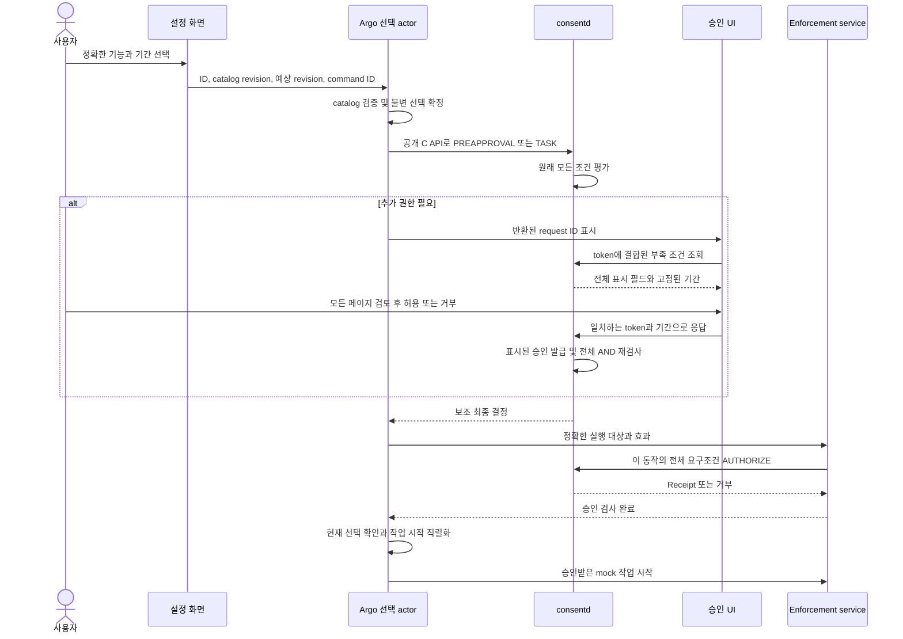

# 10. 기능 선택과 작업 승인

opt-in 승인 계약과 격리 PoC는
[D-16 연동 계약](../design/05-decisions.ko.md#d-16-기능-선택-부족한-승인과-대화-내-재사용)을 구현한다.
[가이드 07](07-verification.ko.md)에 정확한 빌드 snapshot, emulator 결과와 남은 한계를
기록하며 아래 설계 예시는 시험 근거가 아니다. 격리 .NET 앱과 mock 참여자 환경은
[가이드 08](08-consent-ui-poc.ko.md)을 참조한다. 운영 role 등록은 별도 연동 작업이다.

## 사용자가 선택하는 내용

설정에는 이해하기 쉬운 소수의 기능을 제공한다. 각 선택에 제공 앱, 정확한 읽기·변경
범위, 목적, 수신자와 승인 기간을 연결한다. 데이터 취득 권한과 결과 보유 기간은
구분한다. 초기 배치는 모든 항목에 하나의 명확히 표시된 승인 기간을 적용한다.
설정에는 이번 대화(SESSION)와 30분(TIMED)을 제공한다. ONCE는 명시적인 작업 한정
선택이며 지속적인 설정 선호를 활성화하지 않는다.

| 기능 예시 | 정확한 접근과 효과 | 재사용 경계 |
| --- | --- | --- |
| 선택한 일정 앱의 일정을 읽고 이 대화에서 결과 사용 | 특정 일정 제공 앱, 고정된 날짜 범위, 읽기 작업, 명시한 계획 목적, 지정 수신자·holder | AUTHORIZE 뒤 읽는다. 취득 결과는 같은 유효 대화와 보유 기간 안에서 artifact permit을 확인하여 재사용한다. |
| 선택한 기기의 제어 | 특정 제공 앱, 기기 신원과 허용된 작업. 예를 들어 서재 조명 끄기 | 실제 제어마다 대상·효과를 AUTHORIZE한다. 기능 선택만으로 임의 기기 작업이 허용되지 않는다. |

기능은 단순히 “일정” 또는 “기기 제어”라는 이름의 포괄 권한이 아니다. argo의 보호
catalog가 정확한 요구조건의 불변 목록으로 확장한다. 제공 앱 선택은 고정된 catalog
variant를 사용하며 나중에 기본 앱이 바뀌었다고 다시 해석하지 않는다. 기능 이름은
결정을 이해하는 데 쓰고, 권한은 계속 정의·설치 신원·정책 검사로 판정한다.

TV 흐름은 다음과 같다.

1. 기능과 공통 기간을 선택하여 검토한다. 미선택 기능은 비활성이다. 선택한 상태와
   consent 승인이 완료된 상태는 구분한다.
2. argo가 선택한 요구조건을 제출한다. 팝업은 추가로 필요한 권한만 대상·목적·수신자·
   기간과 함께 표시한다. 사용자는 모든 페이지를 검토한 뒤 허용한다.
3. 작업에는 현재 선택에 결합한 실제 실행 계획을 만든다. 기존의 정확한 승인은
   재사용하고 부족한 권한은 하나의 요청에 모은다. 비활성 기능도 설정에 저장하지 않고
   이번 작업에 한해 명시적으로 선택할 수 있다.
   기존 grant로 추가 팝업을 생략할 수 있어도 제출 전에 작업의 대상·효과·기간을 검토한다.
4. enforcement service는 각 보호 동작 직전에 그 동작의 전체 요구조건을 승인받는다.
   팝업 결과나 cache QUERY는 실행 receipt가 아니다.
5. 같은 대화에서 승인된 접근이나 사용 가능한 기존 결과를 재사용한다. 필요한
   권한이 없거나 더 이상 유효하지 않을 때만 다시 요청한다. 이후 추가된 권한이
   이전 선택에 조용히 합쳐지지 않는다.

설정에는 선택됨·승인 필요·실행 가능·이번 작업 한정을 구별하여 표시한다. 앱 실행,
화면 복원, callback, timeout, 뒤로 가기를 새로운 사용자 선택이나 승인으로 간주하지
않는다.
보조 ALLOWED 결과는 제공 앱의 작업 완료를 뜻하지 않는다. 실제 실행 결과가 도착할
때까지 실행 대기를 유지한다. 그동안 새 작업 제출은 막지만 선택 해제 저장은 허용하며,
읽기 전용 상태 갱신이 사용자의 미저장 선택을 덮어쓰면 안 된다.

## 소유권과 경계



PoC 설정 bridge는 격리 앱과 argo mock 사이의 비공개 통신이다. 고정 endpoint는
`consent-feature-poc.socket`이 소유하는 `/opt/var/lib/consent-feature-runtime/argo.sock`이며
`consent-feature-poc.service`가 접수된 작업을 처리한다. 입력은 허용된
기능·variant ID, catalog revision, 기간 preset과 재시도·revision metadata로
제한한다. 임의 request·scope·provider·role·shell 명령은 전달할 수 없다. client는
kernel credential·SMACK, 원래 bind address, 보호 pathname/inode로 PID1 생성
listener를 인증한다. server는 상속 listener와 실제 UI process/package를 확인한다.
대상 probe에서 앱 UID로 root peer의 proc 신원을 읽을 수 없었으며 UI에 추가 process
조회 capability를 주지 않는다. 설정과 팝업은 같은 앱 신원이므로 bridge가 어떤
화면에서 호출했는지 신원으로 구별한다고 주장하지 않는다.

argo가 보호 catalog와 현재 선택 상태를 소유하고 consent 요청을 시작한다. 안정된
command ID로 설정 재시도를 중복 처리하지 않으며, 예상 selection revision으로
오래된 창이 최신 선택을 덮어쓰지 못하게 한다. revision뿐 아니라 coordinator의 현재
incarnation에도 변경을 결합한다. coordinator 재시작으로 메모리 선택·명령 기록이
초기화되면 과거 retry는 새 작업을 시작하지 않고 stale로 거부해야 한다. 결과가
불확실한 submission과 ID는 같은 명령의 결과를 재조정할 때까지 보존한다. 작업 한정
선택은 제한된 task 신원에 결합하며 저장된 설정을 바꾸지 않는다.

설정 창을 닫았다고 확정한 선택을 버리거나 대화를 끝내지 않는다. 새 UI 연결마다
인증한 뒤 확정 상태는 이전 팝업 PID가 아닌 안정된 앱·subject에 소유시킨다. PoC는
coordinator process에 상태를 보관하며 coordinator 재시작을 넘는 영속 설정 보존을
보장하지 않는다. 기존 승인 UI role은 prompt를 조회·응답할
수 있지만 argo나 session controller가 되지는 않는다.

선택 변경·만료·catalog 교체·작업 시작을 직렬화한다. 비동기 AUTHORIZE가 돌아오면
작업을 시작하는 같은 argo actor 실행 구간에서 현재 선택을 다시 검사한다. 검사
후 최종 경계 확인 없이 작업을 queue에 넘기면 선택 해제와 경합할 수 있다. 선택
변경은 이후 작업 시작을 막으며 이미 시작한 작업을 되돌리지는 않는다. 선택 변경 전에
이미 전달한 동작의 늦은 결과도 보존한다. 작업 취소로 제공자의 실행 이력을 지우거나
불확실한 결과를 “실행 없음”으로 바꾸면 안 된다. 기존 artifact의 재사용도 authoritative
재사용 검사 뒤 같은 실행 전 선택 확인을 적용한다. 운영 제품도
실제 planner·execution service에 이 경계를 제공해야 한다. mock의 선택 검사가
전체 daemon의 기능 정책을 대신하는 것은 아니다. 예제 일정과 기기 작업은 서로 다른
enforcement owner를 가지며 각 동작의 전체 exact 요구조건을 검사한다. 승인을 함께
받는다고 여러 service의 효과가 원자적으로 실행되거나, 뒤의 동작이 실패했을 때
앞서 성공한 동작이 되돌려지는 것은 아니다.

## 정확한 요청과 불변 선택

추가 요청 계약은 기존 공개 parameter-map API를 사용한다. 새 feature grant나
catalog table이 daemon의 정확한 grant를 대체하지 않는다.

| 필드 | 의미 |
| --- | --- |
| `approval_version=1` | 새 승인 계약과 이에 맞는 daemon/UI capability를 요구한다. |
| `request_kind=PREAPPROVAL` 또는 `TASK` | 선택 기간 충족 검사 또는 현재 사용 가능 검사를 선택한다. |
| `selection_id`, `selection_revision`, `selection_digest` | 불변 catalog 확장과 선택 snapshot을 식별한다. |
| `grant_mode` | 새로 발급할 승인에 공통으로 적용하는 ONCE·SESSION·TIMED 기간이다. |
| `duration_ms` | TIMED에만 사용하며 100~3,600,000ms 범위이다. |
| 요구조건의 기능 metadata와 `policy_version` | 표시를 위해 정확한 조건을 묶고 literal을 포함한 각 등록 정책에 결합한다. |
| 기존 subject/profile, session/generation 및 요구조건 필드 | 원래의 위임·대화·정확한 scope/operation/purpose/recipient/holder 검사를 유지한다. |

이 필드는 검증·request fingerprint·저장 payload·display token·retry 검사에
참여한다. daemon은 신뢰하는 등록 정의에서 package/app과 설치 신원을 얻는다.
caller의 기능 이름과 hash는 소유권 증거가 아니며 미선택 권한을 유효하게 만들지
않는다.

GrantKey는 바꾸지 않는다. 원래 A·B를 요구하는 기능에 이후 catalog가 C를 추가해도
과거 선택에는 A·B만 남는다. 새 명시 선택에 C를 넣으면 A·B의 유효한 exact grant는
재사용하고 C에는 별도 권한을 요구한다. 같은 request ID로 선택이나 기간을 바꾸는
것은 편리한 갱신이 아니라 충돌이다.

제공 앱·정책·작업·목적·수신자·holder·scope가 바뀌었을 때 기능 이름을 통해 승인을
상속하지 않는다. scope는 정확히 비교하므로 더 좁아 보이는 문자열을 자동으로
부분집합으로 인정하지 않는다. 이미 허용된 더 좁은 대안이 가능하면 그 정확한 대안을
선택하고 결과 대상·효과를 확인한다. 거부된 원래 작업은 실행하지 않는다.

16조건은 논리적인 최대치이며 모든 조합이 표시된다는 보장은 아니다. 결합 prompt의
240필드·64KiB frame 제한과 별도 formatted field 8,192byte 제한을 유지한다. 제공 앱·
기능 metadata와 typed argument도 예산을 사용한다. argo catalog는 선택 가능한 묶음이
표시 한도 안에 들도록 구성해야 한다. 크기를 넘기면 명시적으로 실패하며 조건을
조용히 생략하거나 한 승인 snapshot을 추가 승인들로 묵시 분할하지 않는다.

### Selection digest 인코딩

`selection_digest`는 일관성 결합이며 서명이나 role credential이 아니다.
approval-v1 구현은 UTF-8 byte를 SHA-256으로 hash하여 소문자 16진수 64자로 표현한다.
`consent-selection-v1` 뒤 newline으로 시작한다. 필드 이름을 사전순 정렬하고 각각
`이름의byte길이:이름값의byte길이:값`을 추가 구분자 없이 연결한다.

approval context 중 `selection_digest`만 제외하여 넣는다. subject·profile·session·
generation·count는 항상 넣고 없는 선택 값은 빈 문자열로 한다. 0부터 count-1까지
각 행에 definition·policy_version·scope·operation·purpose·recipient·holder·
feature_id·feature_revision을 항상 넣으며 없는 선택 값은 빈 문자열로 한다. 행의
순서도 의미가 있다. request ID·operation ID·deadline·UI token·서버 내부 TIMED 목표는
이 digest에 넣지 않으며 각각의 retry·lifecycle 검사를 유지한다. context 정수는
앞의 0이 없는 정규 10진수 문자열을 사용한다. argo와 daemon은 같은 canonical
인코딩을 사용해야 한다. Parcel 직렬화나 JSON 표현 자체를 hash하는 것이 아니다.

## 기간과 대화 내 재사용

| 기간 | 승인 의미 | 구분할 경계 |
| --- | --- | --- |
| ONCE | 정확한 권한을 authoritative 검사에서 한 번 소비 | 대화 전체를 사전 승인하지 않는다. 안정된 실행 재시도는 receipt를 재사용하며 grant를 채우지 않는다. |
| SESSION | 선택한 논리적 대화가 활성인 동안 접근 | 정확한 session/generation이 필요하며 통신 재연결만으로 생성·복구하지 않는다. |
| TIMED | 승인 후 선택한 기간이 만료될 때까지 접근 | 현재 대화 밖에서도 유효할 수 있으므로 “이 대화에서만”이라고 표시하지 않는다. |

PREAPPROVAL에서는 기존 승인이 선택 기간을 충족해야 한다. ONCE 하나로 SESSION
선택을 충족하지 않는다. TIMED coverage 목표는 최초 admission 시각에 요청 기간을
더하여 내부 저장하며 refresh·retry로 뒤로 밀지 않는다. 새 TIMED grant는 한 응답
시각부터 시작하여 UI의 “승인 후” 기간과 맞춘다. admission·prompt refresh·응답·
최종 AND에서 같은 coverage 규칙을 사용한다.

TASK에서는 현재 유효한 exact grant가 요구조건을 충족할 수 있다. 예를 들어 아직
유효한 30분 사전 승인은 부족한 권한을 SESSION으로 요청하는 현재 작업에도 쓸 수
있다. mode가 다르다는 이유만으로 다시 묻지 않는다. 실행 때는 현재 선택의 만료도
확인하여 과거 persistent grant가 만료된 기능 선택을 계속 활성화하지 못하게 한다.

팝업이 아닌 session controller가 대화 heartbeat를 소유한다. heartbeat는 idle·
최대 수명 안에서 기존 lease를 갱신하며 닫힌 session이나 과거 generation을 되살리지
않는다. 대화가 중지·종료되거나 무효하면 SESSION 접근과 관련 재사용 경로를 막는다.

일정 결과를 취득하는 작업과 이미 얻은 결과를 쓰는 작업은 다르다. 실행 receipt로
artifact를 등록하고 재사용마다 provenance·목적·수신자·holder·session을 검사한다.
등록된 보유 기간·철회·session 상태도 적용한다. 결과는 대화가 끝나기 전에 만료될
수 있으며 SESSION 접근은 무제한 보유나 승인 없는 새 읽기를 뜻하지 않는다. 물리적
정리는 holder 근거가 있어야 완료로 처리한다.

## 부족한 항목 표시와 최종 검사

평가에는 원래 전체 요구조건을 유지한다. prompt는 부족한 행만 표시하되 원본 index를
내부에 보존하고 typed argument를 같은 행으로 재배치한다. display token은 정확한
표시 집합·locale·정책·선택·기간에 결합한다. 이전 UI가 이를 legacy prompt로 처리하지
못하게 한다.

모든 조건이 충족되면 승인 요청 화면 없이 끝낸다. 팝업이 열린 동안 다른 요청이
표시된 조건을 충족하면 ONCE를 중복 발급하지 않는다. 숨겨진 조건이 만료·철회·소비돼도
응답의 승인 대상에 조용히 추가하지 않는다. 전체 AND를 다시 검사하므로 명시 승인한
새 조건이 남아 있더라도 작업 요청은 INVALIDATED가 될 수 있다. 새로 부족해진 권한은
새 요청으로 보여줘야 한다.

새 계약 요청은 client cache 조회·저장을 거치지 않고 `cacheable=0`을 반환한다.
기간 기준·불변 선택·retry 검사를 위해 daemon admission이 필요하다. client는 송신
전에 server 지원을 확인하고 daemon은 잘못되거나 지원하지 않는 opt-in 필드를
거부한다. legacy cache 계약과 구분하며 실제 보호 효과에는 계속 AUTHORIZE가 필요하다.

## 격리 Settings PoC 실행

먼저 [가이드 08](08-consent-ui-poc.ko.md)의 패키지 설치, 실제 UI 신원 관측과
설치 generation 구성을 완료한다. 개발 emulator를 명시적으로 선택하고, 일치하는
소스 checkout의 호스트 터미널에서 실행한다. 새 실행마다 새 artifact 디렉터리를 쓴다.

```sh
sdb devices
CONSENT_SERIAL='selected-development-emulator-serial'
CONSENT_FEATURE_DIR=$(mktemp -d /var/tmp/consent-feature.XXXXXX)
python3 scripts/emulator-feature-flow.py --serial "$CONSENT_SERIAL" \
  --artifact-dir "$CONSENT_FEATURE_DIR" start --locale en-US
```

이 명령은 격리 PoC 참여자를 준비하고 Settings를 열 뿐, 기능을 선택하거나 요청을
승인하지 않는다. 실제 화면에서 다음을 수행한다.

1. 모든 기능이 미선택인지 확인한다. 일정 읽기와 이번 대화 기간을 선택하고 Settings의
   모든 페이지를 검토한 뒤 consent 팝업을 승인한다.
2. 일정 요약 작업을 검토하고 두 번 실행한다. 승인 callback뿐 아니라 실제 mock 결과와
   기존 artifact 재사용을 확인한다.
3. 기기 제어도 선택하여 저장한다. 추가 팝업은 부족한 기기 권한만 표시하고 지정한 조명과
   끄기 작업의 효과를 설명해야 한다.
4. 확장된 일정 범위를 명시적인 작업 한정 ONCE로 요청하고 거부한다. ‘이번 작업만 한 번’
   선택을 해제한 뒤 기존 일정 데이터 대안 작업을 선택한다. 이 작업은 이미 얻은 좁은
   범위의 결과만 사용할 수 있으며, 거부한 넓은 읽기를 수행하거나 저장된 Settings를
   바꾸면 안 된다.
5. 선택을 모두 해제하여 저장한다. 일반 작업은 사용할 수 없어야 한다. 대화 종료를
   선택하고 holder 정리 후 CLOSED와 미처리 정리 없음까지 확인한 뒤 참여자를 중지한다.

새 한국어 실행에는 `--locale ko-KR`을 사용한다. 기존 Settings 세션을 다시 열거나
로그를 수집하거나 같은 실행을 중지할 때는 serial과 artifact 경로를 유지한다.

```sh
python3 scripts/emulator-feature-flow.py --serial "$CONSENT_SERIAL" \
  --artifact-dir "$CONSENT_FEATURE_DIR" reopen
python3 scripts/emulator-feature-flow.py --serial "$CONSENT_SERIAL" \
  --artifact-dir "$CONSENT_FEATURE_DIR" collect
python3 scripts/emulator-feature-flow.py --serial "$CONSENT_SERIAL" \
  --artifact-dir "$CONSENT_FEATURE_DIR" stop
```

서비스 중지는 통신 종료이며 holder cleanup ACK의 근거가 아니다. 최종 일반 PoC
중지는 가이드 08을 따른다. 여기의 일정 데이터와 기기 동작은 별도 mock 구현이며
사용자 일정이나 실제 조명을 조작하지 않는다. 전용 endpoint 음성 시험과 AUTHORIZE
이후 선택 해제 fixture도 가이드 08에 설명하며, 명시적인 시험 전용 참여자를 쓴다.

## 검증 항목

소스 snapshot·GBS 결과·정확한 TPK/RPM hash·실제 기기 결과는 가이드 07에 기록한다.
native model 시험과 실제 버튼 클릭·platform credential 근거를 구분한다. 이번 증분은
다음을 확인해야 한다.

- 한 기능을 선택해도 다른 기능은 기존 grant가 있다는 이유로 활성화되지 않는다.
- 작업에는 부족한 권한만 표시하고 원래 전체 AND 검사를 유지한다.
- catalog 추가와 제공 앱·목적·수신자·범위 변경은 승인을 상속하지 않으며 변경 없는
  정확한 조건은 재사용한다.
- Settings CAS·retry, AUTHORIZE 뒤 선택 해제, 만료, 작업 한정 선택으로 과거 작업을
  시작하거나 저장된 설정을 바꿀 수 없다.
- 기간 변조·stale token·미지원 daemon/UI·따뜻한 client cache가 admission을 우회하거나
  승인 기간을 늘릴 수 없다.
- 같은 대화의 접근·결과 재사용이 동작하고 heartbeat·session 종료·holder 정리는 기존
  수명 경계를 유지한다.
- 허용된 대안은 자신의 정확한 작업만 실행하고 거부된 원래 작업을 실행하지 않는다.
- 실제 한영 화면에 전체 대상·효과·기간이 표시되며 같은 launcher를 쓰는 다른 package는
  Settings bridge를 사용할 수 없다.
