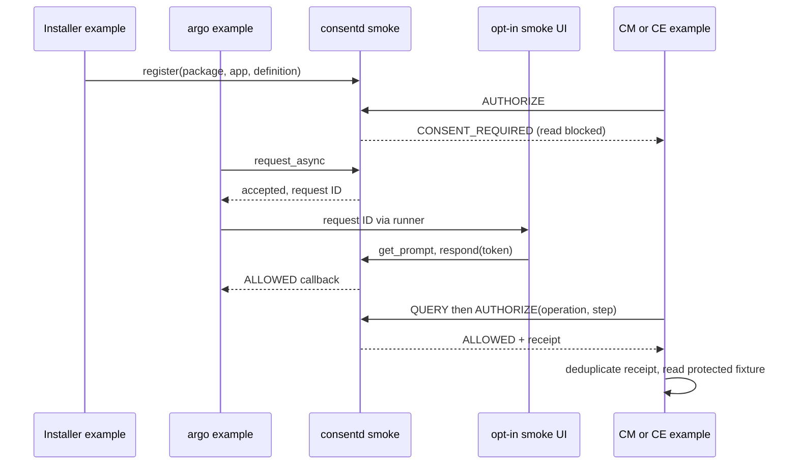

# Guide 12: Check approval before reading a resource

This guide runs CM and CE examples against an isolated consent daemon. Each
checker calls the public C API before reading a test resource. The test passes
only when an unapproved read is blocked and an approved read actually occurs.
A receipt is the daemon's record of an AUTHORIZE decision; it is not a reusable
bearer credential. The examples also keep an execution ledger to prevent the
same receipt from causing another read.

Use `tests/smoke/` and the installed `emulator-smoke.py` runner. Build with
`CONSENT_BUILD_SMOKE=ON`; the examples belong to the test package. The isolated
daemon uses test package identities and a protected installation-generation
registry. It still checks the activated listener's PID1/root/SMACK identity.
See the product status below before treating this as a platform integration.

## Build and run

Discover the connected development emulator and query its architecture first:

```sh
sdb devices
sdb -s DEVICE shell uname -m
gbs build -A x86_64 --profile tizen_10_1_emulator --include-all \
  --define '_without_poc 1'
```

Install matching runtime and test RPMs using `rpm -Uvh` on the selected
emulator. The runner requires the installed CM parser at
`/usr/libexec/capmgr/capmgr-package-tool`, `libcapmgr.so.0`, Python3, SQLite,
and systemd. Missing CM or a missing API symbol fails the smoke.
The runner fixes LD_LIBRARY_PATH to the private installed smoke directory;
this also supports RPM builds that strip RPATH.
The test RPM adds no CM dependency to production packages.

Run the installed runner in an explicitly selected development emulator:

```sh
sdb -s DEVICE root on
sdb -s DEVICE shell 'systemd-run --quiet --wait --pipe \
  -p SmackProcessLabel=System /usr/bin/python3 \
  /usr/libexec/consent/smoke/emulator-smoke.py --seed 20260930'
```

Preserve stdout/stderr, `SMOKE_EXIT`, and the outer command exit separately.
The runner records subprocess commands, exit statuses, actor PIDs, seed,
recovery order, and daemon journal. An interrupted or failed run stops only
its validated managed units and reaps its children. It retains owned fixture
artifacts for inspection. Python optimized mode is forbidden because safety
assertions must remain active.

After inspecting the evidence, explicitly remove this fixture before repeating:

```sh
sdb -s DEVICE shell 'systemd-run --quiet --wait --pipe \
  -p SmackProcessLabel=System /usr/bin/python3 \
  /usr/libexec/consent/smoke/emulator-smoke.py --cleanup'
```

Cleanup verifies the marker, directory owners, and exact recorded managed-unit
hashes before stopping or removing anything. Existing foreign paths or units
are rejected before setup mutates state. No implicit reset is available.

## What the actors do

| Actor | Authentication and work |
| --- | --- |
| Installer | Separate executable; register explicit package/app and generation |
| CM example | `cm` role and `cm` enforcer only; QUERY, AUTHORIZE, protected skill read |
| CE example | `ce` role and `ce` enforcer only; QUERY, AUTHORIZE, protected fixture data read |
| argo example | `argo` role; async acceptance, request-ID lookup, callback after return |
| Smoke UI | `ui` role; explicit `--auto-approve-smoke`, prompt token, response |
| Admin | `admin` role; revoke delegated subject/profile decisions |

Each executable is independently authenticated by executable identity and kernel
credentials. CM/CE registration, request initiation, and cross-enforcer
AUTHORIZE are rejected. UI receives the request ID from argo; it does not call
argo's request-result lookup API. Automatic approval belongs only to this fixture.

The real parser processes this manifest against an isolated absolute catalog:

```json
{"version":1,"operation":"smoke-install","owner":"smoke.package",
 "mode":"replace","root":"/tmp/consent-smoke/catalog-package",
 "metadata":[{"key":"http://tizen.org/metadata/capability/skill",
 "value":"skill.json"}]}
```

The descriptor identifies `consent-smoke` and `res/skills/smoke`. Stage returns
pending/revision0; successful finalize publishes revision1, and replay leaves
revision1. The runner checks the published `skill:consent-smoke` and its package
owner using its own read-only catalog connection. This is actual parser/catalog
execution. A separate developer mapping binds that identity to `smoke.cm.read`,
level1 and enforcer `cm`. The CM parser does not import consent metadata.

The CE demonstration binds levels0–3 to four distinct definitions. Level0 still
requires a grant. Unknown levels fail; level3 permits ONCE only. The Installer
also exercises the daemon rejection of level4 and level3 PERSISTENT metadata.
These numbers are demonstration policy, not verified CE taxonomy.

Before any approval, AUTHORIZE returns CONSENT_REQUIRED and the resource read
counter stays zero. After ALLOWED and a receipt, the actor opens and reads the
isolated resource. QUERY is advisory. ONCE AUTHORIZE consumes atomically; a retry
with the same operation/step reuses the receipt and deduplicates the fixture read.
A new operation requires fresh approval. The example deduplication is process
local; real enforcers need durable side-effect deduplication where applicable.



## Concrete C example commands

The runner owns fresh setup and generation provisioning. Inside an enrolled
root/System actor context, these inputs show the public API usage sequence.
Use the generation returned by the runner; do not invent it. These are
adaptations for the corresponding stages of an active freshly provisioned fixture.
The completed runner leaves stopped registry-loss state; do not paste these
commands after a completed smoke. Run the pre-approval commands before the
concurrent argo/UI pair, then the post-approval commands after its callback.

```sh
export LD_LIBRARY_PATH=/usr/libexec/consent/smoke
smoke=/usr/libexec/consent/smoke
"$smoke/consent-smoke-installer" "$GENERATION" smoke.cm.read cm 1 register-demo
printf 'query advisory CONSENT_REQUIRED\nauthorize demo-before CONSENT_REQUIRED\n' |
  "$smoke/consent-smoke-cm" smoke.cm.read \
  /tmp/consent-smoke/catalog-package/res/skills/smoke/SKILL.md
printf 'query advisory CONSENT_REQUIRED\n' |
  "$smoke/consent-smoke-ce" smoke.ce.level0 /tmp/consent-smoke/context-data.txt
```

Argo waits for its callback. Start it in terminal/context A; while it is
waiting, copy the printed REQUEST_ID into the independent UI context B.
Both contexts must already be enrolled root/System actors.

Terminal/context A:

```sh
export LD_LIBRARY_PATH=/usr/libexec/consent/smoke
/usr/libexec/consent/smoke/consent-smoke-argo smoke.cm.read approve-demo
```

Concurrent terminal/context B:

```sh
export LD_LIBRARY_PATH=/usr/libexec/consent/smoke
/usr/libexec/consent/smoke/consent-smoke-ui \
  --auto-approve-smoke "$REQUEST_ID" PERSISTENT
```

After the argo callback, the post-approval CM check/read:

```sh
export LD_LIBRARY_PATH=/usr/libexec/consent/smoke
smoke=/usr/libexec/consent/smoke
printf 'query advisory ALLOWED\nauthorize demo-authorized ALLOWED\n' |
  "$smoke/consent-smoke-cm" smoke.cm.read \
  /tmp/consent-smoke/catalog-package/res/skills/smoke/SKILL.md
```

These are independent example invocations, not a second setup runner. Each
CM/CE invocation owns one handle; the runner keeps their stdin open to exercise
explicit reconnects and preserve the actor's receipt ledger. Request IDs and
prompt tokens belong to their originating argo/UI operations.

## Recovery and evidence boundaries

Mutable fixture paths are `/tmp/consent-smoke`,
`/opt/var/lib/consent-smoke-runtime`, `/opt/var/lib/consent-smoke-state`, and
`/opt/var/lib/consent-smoke-authority`; units are `consentd-smoke.socket/service`.
The runtime socket parent is protected even though control files use sticky /tmp.
Only consentd opens the live consent DB. Runner SQLite inspection occurs with
both managed service and socket stopped.

A normal restart preserves both persistent CM/CE grants. The seeded loss order
covers deletion while running, deletion while stopped, and deliberate corruption
while stopped. Both check actor PIDs and their receipt ledgers span recovery. After daemon
stop/restart, old handles return exactly DISCONNECTED. An explicit reconnect
command destroys the old handle and creates/authenticates a new one, logging
handle_generation. Running DB deletion uses the original handle when connected. Existing grants are rejected,
epoch changes, and readback before fresh approval confirms integrity `ok`,
schema2, five active definitions, zero grants, and cleanup reconciliation required.
Fresh approvals then permit CM and CE AUTHORIZE and actual fixture reads.
A retry receipt absent from the live ledger blocks the read because prior
execution is unknown. Check APIs are authoritative and do not use the argo request cache; these live
handle cases prove stale authorization rejection, not a request-cache-hit test.

Total definition-registry plus DB loss intentionally blocks daemon startup and
protected execution. The runner never reconstructs approvals or silently resets
the registry. It preserves the failed fixture until explicit cleanup.
Production and existing PoC state metadata are compared before/after the run.
This is no abrupt reboot or interrupted-commit proof; the existing verification
guide records those separate tests.

`catalog_actual/PASS` and `developer_smoke/PASS` differ from
`product_public_api/BLOCKED` and `product_internal_integration/BLOCKED`.
The preflight calls the actual public `capmgr_client_create` symbol and records
status/null-handle; expected denial exits3, missing library/symbol exits2.
`--require-product` always fails until both product adapters exist, including CE.

## Product integration status

The installed CM offline parser and catalog are exercised, but consent
requirements come from a separate developer mapping. Public CM authorization
still fails closed and no internal consent adapter is installed. CE levels are
fixture policy; the current product source/API and taxonomy remain unverified.
`--require-product` therefore fails even when developer scenarios pass.

## Verified checkpoint

Release19 r6 completed GBS with 22 PASS and four root-only SKIP. The installed
smoke returned 0, strict product mode returned the expected 1 after the
scenarios, and cleanup returned 0. Both CM and CE checks required fresh
approval after each tested DB loss. Normal restart retained persistent grants.
Production daemon18 and PoC18 were unchanged. Evidence:
`/var/tmp/consent-artifacts/consent-smoke-01/`.

[Detailed snapshot and failure history](../history/07-verification-history.en.md#guide-12-checkpoint)
