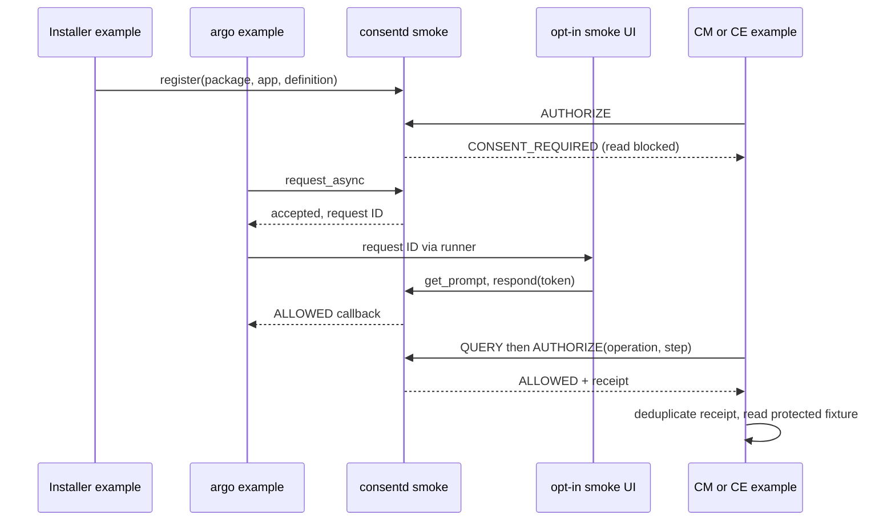

# 가이드 12: 자원을 읽기 전 승인 검사

[English](12-developer-smoke.en.md)

CM과 CE 예제가 격리된 consentd에서 승인을 확인한 뒤 테스트 자원을 읽는 방법을
설명합니다. 승인 전 읽기를 차단하고 승인 후 실제 읽기가 일어나야 테스트가
통과합니다. Receipt는 consentd가 발급한 AUTHORIZE 판단 기록이며 전달만으로
권한을 얻는 인증 정보가 아닙니다. 예제는 같은 receipt로 두 번 읽지 않도록
실행 기록도 보관합니다.

소스는 `tests/smoke/`, 실행 도구는 설치된 `emulator-smoke.py`입니다.
`CONSENT_BUILD_SMOKE=ON`으로 빌드하며 예제는 테스트 패키지에 들어갑니다.
격리 데몬은 테스트 패키지 신원과 보호된 설치 세대 저장소를 사용합니다.
활성화된 소켓의 PID1/root/SMACK 신원 검사는 유지합니다. 제품에 적용하기 전
아래 연동 현황을 확인하세요.

## 1. 빌드·실행·정리하기

개발 에뮬레이터를 선택하고 아키텍처를 먼저 확인하세요.

```sh
sdb devices
sdb -s DEVICE shell uname -m
gbs build -A x86_64 --profile tizen_10_1_emulator --include-all \
  --define '_without_poc 1'
```

선택한 에뮬레이터에 같은 빌드의 runtime/test RPM을 `rpm -Uvh`로 설치하세요.
`/usr/libexec/capmgr/capmgr-package-tool`, `libcapmgr.so.0`, Python3, SQLite와
systemd가 필요합니다. CM 도구나 공개 API 심볼이 없으면 실패합니다.
실행 도구는 LD_LIBRARY_PATH를 전용 디렉터리로 고정하므로 RPM이 RPATH를
제거해도 같은 라이브러리를 사용합니다. 제품 패키지에는 CM 의존성을 추가하지
않습니다.

선택한 개발 에뮬레이터에서 설치된 실행 도구를 호출하세요.

```sh
sdb -s DEVICE root on
sdb -s DEVICE shell 'systemd-run --quiet --wait --pipe \
  -p SmackProcessLabel=System /usr/bin/python3 \
  /usr/libexec/consent/smoke/emulator-smoke.py --seed 20260930'
```

stdout/stderr, 내부 `SMOKE_EXIT`와 외부 종료 코드를 각각 보존하세요.
실행 도구는 자식 명령과 종료 코드, 프로세스 PID, seed, 복구 순서와 데몬 로그를
기록합니다. 실패하거나 중단돼도 검증한 자체 unit만 중지하고 자식을 회수합니다.
테스트 파일은 검사할 수 있도록 남깁니다. 안전 assertion이 사라지는 Python
최적화 모드는 거부합니다.

결과를 확인한 뒤 재실행 전에 명시적으로 정리하세요.

```sh
sdb -s DEVICE shell 'systemd-run --quiet --wait --pipe \
  -p SmackProcessLabel=System /usr/bin/python3 \
  /usr/libexec/consent/smoke/emulator-smoke.py --cleanup'
```

정리는 식별 표식, 디렉터리 소유권과 기록한 unit의 hash를 먼저 검증합니다.
다른 기존 경로나 unit이 있으면 설정을 바꾸기 전에 거부합니다.
자동 초기화는 하지 않습니다.

소스의 성공 분기는 본 실행에서 `SMOKE_EXIT 0`, --cleanup에서
`PASS explicit owned fixture cleanup`을 출력합니다. 원격 systemd-run 종료도
보관하세요. 호스트 SDB 반환만으로 Python 결과를 알 수 없습니다.
--require-product는 개발 시나리오가 통과해도 제품 어댑터 부재로 실패합니다.
정리 성공은 별도로 확인해야 합니다.

## C 예제의 구체적 입력

초기 설정과 설치 세대 발급은 실행 도구가 담당합니다. 등록된 root/System 역할로
아래 순서를 확인할 수 있습니다. 세대는 실행 도구가 받은 값을 쓰고 임의로 만들지
마세요. 초기 설정을 마친 환경이 실행 중인 해당 단계에서만 사용하는 예입니다.
전체 실행이 끝나면 registry 손실 상태로 중지하므로 완료 뒤 붙여 넣지 마세요.
승인 전 호출, 동시에 실행할 argo/UI, 완료 콜백 뒤 호출 순서로 진행합니다.

```sh
export LD_LIBRARY_PATH=/usr/libexec/consent/smoke
smoke=/usr/libexec/consent/smoke
"$smoke/consent-smoke-installer" "$GENERATION" smoke.cm.read cm 1 register-demo
printf 'query advisory CONSENT_REQUIRED\nauthorize demo-before CONSENT_REQUIRED\n' |
  "$smoke/consent-smoke-cm" smoke.cm.read \
  /tmp/consent-smoke/catalog-package/res/skills/smoke/SKILL.md
printf 'query advisory CONSENT_REQUIRED\n' |
  "$smoke/consent-smoke-ce" smoke.ce.level0 /tmp/consent-smoke/context-data.txt
```

Argo는 callback을 기다린다. 터미널/문맥 A에서 argo를 시작하고 기다리는 동안
출력된 REQUEST_ID를 독립 UI 문맥 B에 전달한다. 두 문맥 모두 사전에 등록된
root/System actor여야 한다.

터미널/문맥 A:

```sh
export LD_LIBRARY_PATH=/usr/libexec/consent/smoke
/usr/libexec/consent/smoke/consent-smoke-argo smoke.cm.read approve-demo
```

동시에 사용하는 터미널/문맥 B:

```sh
export LD_LIBRARY_PATH=/usr/libexec/consent/smoke
/usr/libexec/consent/smoke/consent-smoke-ui \
  --auto-approve-smoke "$REQUEST_ID" PERSISTENT
```

Argo callback 뒤 승인 후 CM 확인/읽기:

```sh
export LD_LIBRARY_PATH=/usr/libexec/consent/smoke
smoke=/usr/libexec/consent/smoke
printf 'query advisory ALLOWED\nauthorize demo-authorized ALLOWED\n' |
  "$smoke/consent-smoke-cm" smoke.cm.read \
  /tmp/consent-smoke/catalog-package/res/skills/smoke/SKILL.md
```

각 CM/CE 호출은 handle 하나를 소유합니다. 실행 도구는 stdin을 열어 둔 채
명시적 재연결과 프로세스의 실행 기록을 검사합니다. Request ID와 안내 token은
이를 생성한 argo/UI operation에 속합니다.

## 역할별 예제

| Actor | 인증과 작업 |
| --- | --- |
| Installer | 독립 실행 파일; package/app와 generation을 명시하여 등록 |
| CM | cm 역할, cm enforcer만; QUERY/AUTHORIZE 후 skill 읽기 |
| CE | ce 역할, ce enforcer만; QUERY/AUTHORIZE 후 fixture data 읽기 |
| argo | argo 역할; async acceptance, request-ID lookup, 반환 후 callback |
| Smoke UI | ui 역할; 명시적 `--auto-approve-smoke`, prompt token과 응답 |
| Admin | admin 역할; 위임된 subject/profile 승인 철회 |

각 실행 파일은 실행 신원과 커널 자격 정보로 독립 인증합니다. CM/CE의 등록,
승인 요청과 서로의 권한 검사는 거부합니다. UI는 argo가 실행 도구를 통해 전달한
request ID로 get_prompt/respond만 호출하며 argo의 결과 조회를 사용하지 않습니다.
자동 응답은 이 테스트에만 사용합니다.

실제 CM parser가 절대 경로의 격리 catalog에서 다음 manifest를 처리합니다.

```json
{"version":1,"operation":"smoke-install","owner":"smoke.package",
 "mode":"replace","root":"/tmp/consent-smoke/catalog-package",
 "metadata":[{"key":"http://tizen.org/metadata/capability/skill",
 "value":"skill.json"}]}
```

Descriptor는 `consent-smoke`와 `res/skills/smoke`를 지정합니다. Stage 결과는
pending/revision0이고 finalize 성공과 재시도는 revision1입니다. 실행 도구는
catalog를 읽기 전용으로 열어 `skill:consent-smoke`와 소유 패키지를 확인합니다.
별도 예제 연결이 이 신원을 `smoke.cm.read`, level1과 검사자 `cm`에 연결합니다.
CM parser 자체가 consent metadata를 전달하지는 않습니다.

CE 예제는 level0–3을 각 정의에 연결합니다. level0도 승인이 필요합니다.
알려지지 않은 등급은 거부하고 level3은 ONCE만 허용합니다. Installer 예제는
데몬이 level4와 level3 PERSISTENT 등록을 거부하는지도 검사합니다.
이 숫자는 개발용 정책입니다.

승인 전 AUTHORIZE는 CONSENT_REQUIRED를 반환하고 읽기 횟수는 0입니다.
ALLOWED와 receipt를 받은 뒤에만 자원을 열어 읽습니다. QUERY는 참고값입니다.
ONCE 승인은 AUTHORIZE에서 원자적으로 소비합니다. 같은 operation/step으로
재시도하면 같은 receipt를 사용하고 다시 읽지 않습니다. 새 operation에는 새
승인이 필요합니다. 예제의 중복 방지는 프로세스 내부에만 유지되므로 제품
검사자는 필요에 따라 영속적인 중복 방지를 구현해야 합니다.



## 안전 검사와 복구

변경하는 경로는 `/tmp/consent-smoke`, `/opt/var/lib/consent-smoke-runtime`,
`/opt/var/lib/consent-smoke-state`와 `/opt/var/lib/consent-smoke-authority`입니다.
Unit은 `consentd-smoke.socket/service`입니다. 제어 파일은 sticky /tmp를 쓰지만
소켓 상위 디렉터리는 보호합니다. 실행 중 consent DB는 데몬만 엽니다.
실행 도구의 SQLite 검사는 자체 service와 socket을 모두 중지한 뒤 수행합니다.

정상 재시작은 CM/CE의 지속 승인 둘 다 보존합니다. Seed로 순서를 정해 실행 중
DB 삭제, 정지 중 삭제와 정지 중 손상을 시험합니다. 두 검사 프로세스의 PID와
실행 기록은 유지합니다. 데몬 정지/재시작 뒤 기존 handle이 DISCONNECTED를
반환하는지 확인하고 명시적으로 해제한 뒤 새 handle을 인증합니다.
`handle_generation`을 기록하며 실행 중 삭제에서 연결이 유지되면 기존 handle을
사용합니다.

DB 손실은 기존 승인을 거부하고 epoch를 바꿉니다. 새 승인 전에 integrity `ok`,
schema2, 활성 정의5개, grant0과 정리 재조정 필요 상태를 확인합니다. 새 승인 뒤
CM/CE AUTHORIZE와 실제 읽기를 검사합니다. 실행 기록에 없는 이전 receipt는
실행 여부를 알 수 없어 읽기를 차단합니다. 이 검사는 오래된 권한 차단을
증명하지만 argo 요청 캐시의 적중을 시험하지는 않습니다.

정의 registry와 DB를 모두 잃으면 시작과 보호 동작을 차단합니다. 승인을 복원하거나
registry를 자동 초기화하지 않고 명시적 정리까지 실패 상태를 보존합니다.
운영/PoC 상태는 전후 비교합니다. 갑작스러운 재부팅이나 commit 중단 검사는
포함하지 않습니다.

`catalog_actual/PASS`와 `developer_smoke/PASS`는 개발자 검증 결과입니다.
제품 상태는 `product_public_api/BLOCKED`, `product_internal_integration/BLOCKED`로
구분합니다. 사전 검사는 실제 `capmgr_client_create`를 호출해 상태와 null handle을
기록합니다. 예상 권한 거부는 exit3, 라이브러리/심볼 부재는 exit2입니다.

## 제품 연동 현황

설치된 실제 CM parser와 catalog를 검사하지만 consent 조건은 별도 예제 연결에서
얻습니다. 공개 CM 권한 검사는 거부 상태이고 내부 consent 어댑터가 없습니다.
CE 등급은 테스트 정책이며 현재 제품 소스, API와 등급 체계는 미확인입니다.
따라서 개발자 시나리오가 통과해도 `--require-product`는 실패합니다.

## 검증한 단계

Release19 r6 GBS에서 22개가 통과하고 root 전용 4개를 건너뛰었습니다. 설치된
smoke는 0, 제품 strict는 시나리오 완료 뒤 예상 코드 1, 정리는 0으로
종료했습니다. CM과 CE는 각 DB 손실 뒤 새 승인을 요구했고 정상 재시작에서는
지속 승인을 유지했습니다. 운영 daemon18과 PoC18은 변경하지 않았습니다.
증거: `/var/tmp/consent-artifacts/consent-smoke-01/`.

[스냅샷 상세와 실패 이력](../history/07-verification-history.ko.md#guide-12-checkpoint)


<a id="빌드와-실행"></a>
---

[관련 작업](01-development.ko.md) · [이어 읽기](13-tool-examples.ko.md) · [역할별
문서](../README.md)
