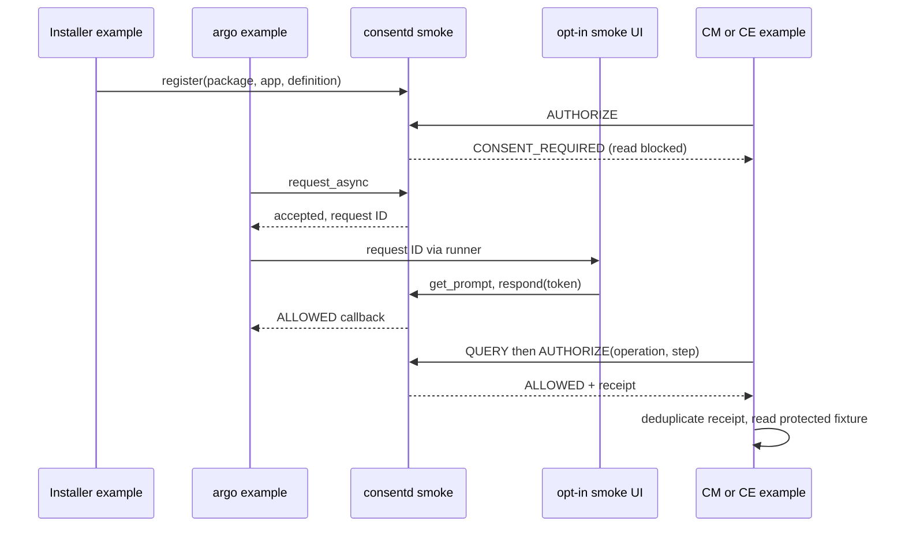

# 가이드 12: 개발자 CM/CE consent smoke

이 smoke는 설치된 실제 CM offline package parser와 공개 consent C API,
실제 IPC·socket activation을 사용한다. CM catalog와 consent binding은
별개다. 현재 CM 제품 authorization은 fail-closed이며 내부 consent adapter가
없다. CE 예제는 최신 소스/API 확인 전까지 이식 가능한 개발용 등급 정책이다.
제품 통합이나 실제 사용자 승인을 대체했다고 주장하지 않는다.

코드는 `tests/smoke/`, 단일 기기 runner는 `scripts/emulator-smoke.py`다.
`CONSENT_BUILD_SMOKE=ON`이면 test RPM에만 별도 바이너리를 설치한다.
생산 역할 정책·endpoint·공개 심볼·daemon 동작은 변경하지 않는다.
smoke client는 일반 endpoint 및 연결 peer 검사를 그대로 컴파일하여
활성화 listener의 PID1/root/SMACK 신원을 검사한다. 격리 daemon은 기존
compile-time test package identity fixture와 보호된 Installer generation
registry를 사용한다. 이 fixture는 실제 설치 앱 metadata 검증과 구별한다.

## 빌드와 실행

개발 emulator를 발견하고 architecture를 먼저 확인한다.

```sh
sdb devices
sdb -s DEVICE shell uname -m
gbs build -A x86_64 --profile tizen_10_1_emulator --include-all \
  --define '_without_poc 1'
```

선택한 emulator에 일치하는 runtime/test RPM을 `rpm -Uvh`로 설치한다.
필요 항목은 `/usr/libexec/capmgr/capmgr-package-tool`, `libcapmgr.so.0`,
Python3, SQLite, systemd다. CM 또는 공개 API 심볼 부재는 실패다.
runner는 LD_LIBRARY_PATH를 전용 설치 smoke 디렉터리로 고정한다.
RPM이 RPATH를 제거하는 빌드에서도 같은 library를 사용한다.
test RPM 때문에 생산 패키지에 CM 의존성이 추가되지는 않는다.

설치된 runner를 명시적으로 선택한 개발 emulator에서 실행한다.

```sh
sdb -s DEVICE root on
sdb -s DEVICE shell 'systemd-run --quiet --wait --pipe \
  -p SmackProcessLabel=System /usr/bin/python3 \
  /usr/libexec/consent/smoke/emulator-smoke.py --seed 20260930'
```

stdout/stderr, 내부 `SMOKE_EXIT`, 외부 명령 exit를 각각 보존한다.
runner는 subprocess 명령·exit, actor PID, seed, 복구 순서, daemon journal을
기록한다. 중단·실패 시에도 검증된 자체 unit만 중지하고 자식들을 회수한다.
검사용 fixture artifact는 보존한다. 보호 assertion을 유지하기 위해 Python
optimized mode는 거부한다.

증거 확인 후 재실행 전에 명시적으로 정리한다.

```sh
sdb -s DEVICE shell 'systemd-run --quiet --wait --pipe \
  -p SmackProcessLabel=System /usr/bin/python3 \
  /usr/libexec/consent/smoke/emulator-smoke.py --cleanup'
```

정리는 marker·디렉터리 소유권·기록한 managed unit의 정확한 hash를 먼저
검증한다. 다른 기존 경로나 unit이 있으면 setup의 변경 전에 거부한다.
암묵적 초기화는 제공하지 않는다.

## 역할별 예제

| Actor | 인증과 작업 |
| --- | --- |
| Installer | 독립 실행 파일; package/app와 generation을 명시하여 등록 |
| CM | cm 역할, cm enforcer만; QUERY/AUTHORIZE 후 skill 읽기 |
| CE | ce 역할, ce enforcer만; QUERY/AUTHORIZE 후 fixture data 읽기 |
| argo | argo 역할; async acceptance, request-ID lookup, 반환 후 callback |
| Smoke UI | ui 역할; 명시적 `--auto-approve-smoke`, prompt token과 응답 |
| Admin | admin 역할; 위임된 subject/profile 승인 철회 |

각 실행 파일은 executable identity와 kernel credential로 독립 인증한다.
CM/CE 등록·승인 요청·서로의 enforcer AUTHORIZE는 거부된다. UI는 argo에서
runner를 통해 전달받은 request ID로 get_prompt/respond만 호출하며 argo의
request-result lookup을 사용하지 않는다. 자동 승인은 smoke에만 속한다.

실제 CM parser가 격리 absolute catalog에 다음 manifest를 처리한다.

```json
{"version":1,"operation":"smoke-install","owner":"smoke.package",
 "mode":"replace","root":"/tmp/consent-smoke/catalog-package",
 "metadata":[{"key":"http://tizen.org/metadata/capability/skill",
 "value":"skill.json"}]}
```

Descriptor는 `consent-smoke`, `res/skills/smoke`를 지정한다. stage 결과는
pending/revision0, finalize success는 revision1, 재시도도 revision1이다.
runner는 자체 read-only catalog connection으로 공개된
`skill:consent-smoke`와 package owner를 검사한다. 이는 실제 parser/catalog
실행이다. 별도 개발용 mapping이 이 identity를 `smoke.cm.read`, level1,
enforcer `cm`에 연결한다. CM parser 자체가 consent metadata를 전달하지는 않는다.

CE 데모는 level0–3을 각각 정의에 연결한다. level0도 grant가 필요하다.
미지 등급은 거부하며 level3은 ONCE만 허용한다. Installer는 daemon의 level4,
level3 PERSISTENT metadata 거부도 검사한다. 이 숫자는 검증된 CE taxonomy가
아닌 개발용 정책이다.

승인 전 AUTHORIZE는 CONSENT_REQUIRED이고 자원 read counter는 0이다.
ALLOWED와 receipt 이후에만 격리 자원을 열어 실제 읽는다. QUERY는 참고값이다.
ONCE AUTHORIZE는 원자적으로 소비되며 같은 operation/step 재시도는 같은 receipt를
재사용하고 fixture read를 중복 수행하지 않는다. 새 operation에는 새 승인이 필요하다.
예제 중복 방지는 process 내부에만 유지된다. 제품 enforcer는 필요에 따라 실제
부작용의 durable 중복 방지를 구현해야 한다.



## C 예제의 구체적 입력

Fresh setup과 generation provisioning은 runner가 소유한다. 등록된 root/System
actor 문맥 안에서 다음 입력으로 공개 API 순서를 확인할 수 있다. generation은
runner가 받은 값을 사용하며 임의로 만들지 않는다. 이 입력은 실행 중인 fresh
fixture의 해당 단계에 맞춰 적용하는 예다. 완료한 runner는 정지된 registry-loss
상태를 남기므로 완료 뒤 그대로 붙여넣어 실행하지 않는다. 승인 전 호출, 동시
argo/UI 호출, callback 뒤 승인 후 호출 순서로 적용한다.

```sh
export LD_LIBRARY_PATH=/usr/libexec/consent/smoke
smoke=/usr/libexec/consent/smoke
"$smoke/consent-smoke-installer" "$GENERATION" smoke.cm.read cm 1 register-demo
printf 'query advisory CONSENT_REQUIRED\nauthorize demo-before CONSENT_REQUIRED\n' |
  "$smoke/consent-smoke-cm" smoke.cm.read \
  /tmp/consent-smoke/catalog-package/res/skills/smoke/SKILL.md
printf 'query advisory CONSENT_REQUIRED\n' |
  "$smoke/consent-smoke-ce" smoke.ce.level0 /tmp/consent-smoke/context-data.txt
```

Argo는 callback을 기다린다. 터미널/문맥 A에서 argo를 시작하고 기다리는 동안
출력된 REQUEST_ID를 독립 UI 문맥 B에 전달한다. 두 문맥 모두 사전에 등록된
root/System actor여야 한다.

터미널/문맥 A:

```sh
export LD_LIBRARY_PATH=/usr/libexec/consent/smoke
/usr/libexec/consent/smoke/consent-smoke-argo smoke.cm.read approve-demo
```

동시에 사용하는 터미널/문맥 B:

```sh
export LD_LIBRARY_PATH=/usr/libexec/consent/smoke
/usr/libexec/consent/smoke/consent-smoke-ui \
  --auto-approve-smoke "$REQUEST_ID" PERSISTENT
```

Argo callback 뒤 승인 후 CM 확인/읽기:

```sh
export LD_LIBRARY_PATH=/usr/libexec/consent/smoke
smoke=/usr/libexec/consent/smoke
printf 'query advisory ALLOWED\nauthorize demo-authorized ALLOWED\n' |
  "$smoke/consent-smoke-cm" smoke.cm.read \
  /tmp/consent-smoke/catalog-package/res/skills/smoke/SKILL.md
```

이는 독립 예제 호출이며 별도 setup runner가 아니다. 각 CM/CE 호출은 한 handle을
소유한다. runner는 stdin을 유지하여 explicit reconnect와 actor receipt ledger를
검사한다. request ID와 prompt token은 생성한 argo/UI operation에 속한다.

## 복구와 증거 범위

변경 경로는 `/tmp/consent-smoke`, `/opt/var/lib/consent-smoke-runtime`,
`/opt/var/lib/consent-smoke-state`, `/opt/var/lib/consent-smoke-authority`다.
Unit은 `consentd-smoke.socket/service`다. Control은 sticky /tmp를 사용하지만
socket의 runtime parent는 보호되어 있다. live consent DB는 daemon만 연다.
runner의 SQLite 검사는 자체 service와 socket을 모두 중지한 상태에서 수행한다.

정상 restart는 CM/CE persistent grant 둘 다 보존한다. seed로 순서를 결정하여
실행 중 DB 삭제, 정지 중 삭제, 정지 중 손상을 시험한다. 두 check actor PID와 receipt ledger는 복구 전후 유지된다. daemon 정지/재시작
후 old handle의 정확한 DISCONNECTED를 확인한다. explicit reconnect 명령에서
old handle을 destroy하고 새 handle을 create/인증하며 handle_generation을 기록한다.
실행 중 DB 삭제는 연결이 유지되는 경우 원래 handle을 사용한다. 기존 grant는 거부되고 epoch가 바뀐다. fresh approval 전
readback에서 integrity `ok`, schema2, active definition5, grant0,
cleanup reconciliation required를 확인한다. 새 승인 뒤 CM/CE AUTHORIZE와 실제
fixture 읽기가 성공한다. live ledger에 없는 재시도 receipt는 이전 실행 여부가 불명확하여 읽기를 차단한다.
check API는 authoritative이며 argo request cache를
사용하지 않는다. 이 live handle 검사는 오래된 authorization 차단의 증거이고
request cache hit 자체의 시험은 아니다.

Definition registry와 DB를 모두 잃으면 daemon startup과 보호 동작을 안전하게
차단한다. 승인 복원이나 registry 자동 reset은 하지 않는다. 명시적 cleanup까지
실패 상태를 보존한다. 생산·기존 PoC 상태 metadata를 실행 전후 비교한다.
이 smoke는 abrupt reboot나 commit 중단 증거가 아니며 기존 검증 가이드의
별도 시험과 구별한다.

`catalog_actual/PASS`, `developer_smoke/PASS`는
`product_public_api/BLOCKED`, `product_internal_integration/BLOCKED`와 별개다.
Preflight는 실제 `capmgr_client_create` 심볼을 호출하여 status와 null handle을
기록한다. expected denial exit3, library/symbol 부재 exit2다.
`--require-product`는 CE를 포함한 두 제품 adapter가 존재하기 전까지 항상 실패한다.

## 실제 실행 증거 (2026-09-30)

수용된 구현은 기준 `a569363` Release18 위의 미커밋 Release19다. 최종
source/build snapshot **r6**, 설치 runner 재현, strict-product negative,
cleanup이 완료 증거다. 설치 CM은 `capability-manager-0.1.0-15.x86_64`,
기기는 `emulator-26101`, x86_64다. 개발자 smoke 범위에서 구현·패키징·가용
emulator 검증은 독립 리뷰 ACCEPTED를 받았다. CM 제품 내부 adapter와 최신 CE
제품 통합은 외부 미해결 gate다.

이전 snapshot은 별개로 보존한다. 최초 GBS는 PoC SDK provisioning에서 실패,
r2는 nested IDL fixture의 cmake 복사 누락에서 실패했다. r5 기기 실행은 새 unit
load와 부분 bootstrap cleanup에서 파괴 시나리오 전에 실패했다. 수정 runner와
native-r5의 탐색 실행은 이후 통과했다. 이 증거는 수정 이력이며 아래 최종 설치
r6 결과를 대신하지 않는다.

명령·실패 시도·subprocess exit·journal·출력은 빌드 호스트의
`/var/tmp/consent-artifacts/consent-smoke-01/`에 보존한다. Source hash manifest는
`source-r6.json`, build 출력은 `consent-smoke-gbs-r6.log`다. 실제 CE API,
CM 제품 내부 AUTHORIZE, abrupt reboot, commit 중단, request-cache-hit coverage를
입증하지 않는다. Native snapshot 고정 후 최종 가이드만 수정했다.

최종 r6 일치 패키지 재실행: GBS exit0 (CTest26: PASS22, root-only SKIP4),
native/runner 파일은 `source-r6.json`과 일치했다. 동일 NVR r6 재설치는 변경
파일 충돌로 최초 exit3이었다. 같은 runtime/devel/test 패키지에 명시적
`--replacepkgs --replacefiles`를 적용한 재설치는 exit0이다. 설치 runner SHA256:
`912502e58186dd4b82e093c1fe2ab4c51b59bb76520dd415941e8acc73e67bf0`.

| 설치 r6 실행 | Seed | 내부 / 외부 exit | 증거 파일 |
| --- | --- | --- | --- |
| 전체 개발자 smoke | 20260930 | 0 / 0 | `device-r6-seed20260930.log` |
| 전체 smoke 뒤 strict product negative | 20260931 | 1 / 1 (기대값) | `device-r6-strict-seed20260931.log` |
| 최종 명시적 cleanup | — | 0 / 0 | `final-cleanup-services-r6.log` |

기본 순서는 running-delete/corrupt/stopped-delete, strict 순서는
stopped-delete/corrupt/running-delete다. 두 실행 모두 생산·PoC 상태 metadata
불변을 확인했다. 생산 consentd는 Release18, active/success, 설치·시험 전후
MainPID31569였다. PoC는 inactive/success, MainPID0을 유지했다. 최종 cleanup 뒤
smoke unit 둘 다 not-found/MainPID0이고 네 fixture 디렉터리는 모두 없었다.
Runtime/devel/tests는 Release19이며 생산 daemon RPM/service와 기존 PoC 설치는
변경하지 않았다. r6 native build를 고정한 후 예제 호출·증거만 문서에서 수정했다.

최종 설치 (`install-r6-replace.log`, INSTALL_EXIT0):

```sh
systemd-run --quiet --wait --pipe --unit=consent-smoke-install-r6-replace \
  -p SmackProcessLabel=System::Privileged rpm -Uvh \
  --replacepkgs --replacefiles /tmp/consent-smoke-runtime.rpm \
  /tmp/consent-smoke-devel.rpm /tmp/consent-smoke-tests.rpm
```

최종 명령은 각각 `sdb -s emulator-26101 shell`을 통해 실행했다.

```sh
systemd-run --quiet --wait --pipe --unit=consent-smoke-run-r6 \
  -p SmackProcessLabel=System /usr/bin/python3 \
  /usr/libexec/consent/smoke/emulator-smoke.py --seed 20260930
systemd-run --quiet --wait --pipe --unit=consent-smoke-strict-r6 \
  -p SmackProcessLabel=System /usr/bin/python3 \
  /usr/libexec/consent/smoke/emulator-smoke.py \
  --seed 20260931 --require-product
systemd-run --quiet --wait --pipe --unit=consent-smoke-clean-final-r6 \
  -p SmackProcessLabel=System /usr/bin/python3 \
  /usr/libexec/consent/smoke/emulator-smoke.py --cleanup
```

두 전체 실행 사이에도 명시적 cleanup을 했다. SDB transport는 기대된 strict
실패에서도 exit0이므로 내부/외부 marker의 exit1을 기준으로 판정한다.
r6 RPM 경로는 `/home/hjhun/GBS-ROOT/local/repos/tizen_10_1_emulator/x86_64/RPMS/`다.
`consent`, `consent-devel`, `consent-tests`, 빌드만 한 `consentd` 모두
`0.1.0-19.x86_64.rpm`이다. 증거 디렉터리는 설치한 세 RPM과 SHA256을 r5/r6로
구분하여 보존한다.
