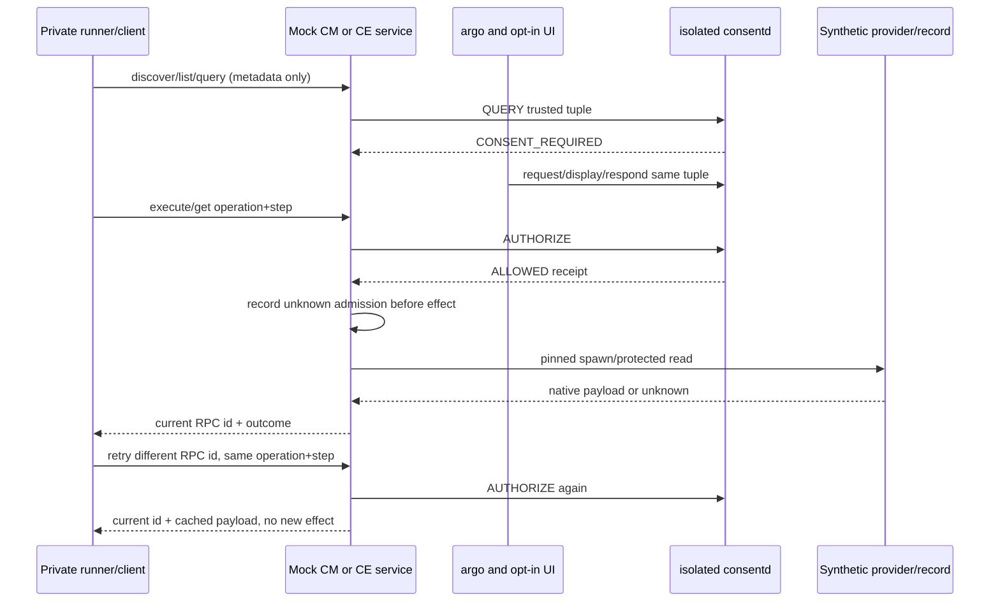

# Guide 14: Persistent CM and CE mock services

This extends [Guide 13](13-tool-examples.en.md) with `--mock-services` in the
same isolated runner. Two persistent C executables expose private newline
JSON-RPC requests over runner-owned stdin/stdout pipes. CM discovery/execute
and CE metadata/get are synthetic APIs, not product capmgr_client_execute or
current CE taxonomy. They authenticate to the actual isolated consent library
and daemon as distinct cm-only/ce-only identities. Production roles/services
and the existing PoC are unchanged. No personal context RPC is called.

## Build and runner

Build with CONSENT_BUILD_SMOKE and CONSENT_BUILD_SMOKE_TOOLS enabled; JSON-GLib
remains test-only. Release23 tests install consent-smoke-mock-cm/ce and the
source examples. The production runtime has no new JSON dependency.

```sh
# Development emulator only, root/System, fresh guarded owned fixture:
export LD_LIBRARY_PATH=/usr/libexec/consent/smoke
/usr/libexec/consent/smoke/emulator-smoke.py --mock-services --seed 20261005
# Explicitly remove only the validated fixture and owned smoke units:
/usr/libexec/consent/smoke/emulator-smoke.py --cleanup
```

Default catalog is a root-owned synthetic finite catalog with a pinned installed
provider. `--mock-catalog actual` optionally exercises the installed CM parser.
Missing tool is OPTIONAL_MISSING with explicit fixture selection; any invoked
parser failure fails the run. Actual parser metadata contains no consent policy;
the separately registered fixture mapping is explicit. `--tools` remains a
separate regression mode; mock mode never requires public CM create to succeed.
`--require-product` still fails because product integration is absent.

## Request and response contract

The following inputs adapt active freshly provisioned fixture stages. Completed
runner fixtures are stopped with registry loss, so these are not post-run commands.
Start one service per private developer terminal/controller with fixed
LD_LIBRARY_PATH; setup, trusted metadata, package/app generation registration
and isolated daemon provisioning belong to the runner.

```sh
export LD_LIBRARY_PATH=/usr/libexec/consent/smoke
/usr/libexec/consent/smoke/consent-smoke-mock-cm fixture
# Separate process/controller:
/usr/libexec/consent/smoke/consent-smoke-mock-ce fixture
```

Each request is one JSON object followed by newline. stdout contains exactly one
JSON-RPC reply per request; startup/errors go to stderr. Request id is a nonempty
bounded ASCII identifier and only correlates transport. Protected operation_id
and step_id identify the immutable consent retry; changing transport id replays
the same approved action without a second effect, returning the current id.
Private pipe clients are fixture controllers, not authenticated arbitrary product
requesters. Only the service executable identity authenticates to consent.
Callers never submit subject/profile/package/app/generation/level/path/receipt
or requirement tuples. Those come from trusted server fixture metadata.

```json
{"jsonrpc":"2.0","id":"c1","method":"catalog.discover","params":{}}
{"jsonrpc":"2.0","id":"e1","method":"context.list","params":{}}
{"jsonrpc":"2.0","id":"e2","method":"context.metadata","params":{"record":"level3"}}
{"jsonrpc":"2.0","id":"c2","method":"capability.query","params":{"capability":"cli:smoke-tool","record":"summary","operation_id":"cm-query","step_id":"execute"}}
{"jsonrpc":"2.0","id":"c3","method":"capability.execute","params":{"capability":"cli:smoke-tool","record":"summary","operation_id":"cm-summary-1","step_id":"execute"}}
{"jsonrpc":"2.0","id":"c4","method":"capability.execute","params":{"capability":"cli:smoke-tool","record":"summary","operation_id":"cm-summary-1","step_id":"execute"}}
{"jsonrpc":"2.0","id":"e3","method":"context.get","params":{"record":"level0","operation_id":"ce-level0-1","step_id":"get"}}
```

Before approval the action result contains api_status0, CONSENT_REQUIRED and
admissions0, without execution/data. Approved CM result contains ALLOWED and
execution.state=succeeded, data.summary=synthetic capability summary; CE returns
synthetic record text. Native errors retain execution.native_error; timeout or
invalid execution remains unknown. Consent API errors have API_ERROR and the
exact api_status, without execution. ALLOWED with an unknown prior receipt is
blocked_unknown_receipt, admits nothing and returns no data.

Only argo requests approval and only opt-in UI displays/responds. A DENIED UI
response completes argo with DENIED; it creates no durable deny grant, so a later
independent check remains CONSENT_REQUIRED and admits no effect. Run concurrently
in terminal A/B while the mock process remains alive:

```sh
# A: copy REQUEST_ID while argo waits:
/usr/libexec/consent/smoke/consent-smoke-argo smoke.cm.tool.summary approval-1
```

In terminal B concurrently, choose approval for the copied request id:

```sh
export LD_LIBRARY_PATH=/usr/libexec/consent/smoke
/usr/libexec/consent/smoke/consent-smoke-ui --auto-approve-smoke REQUEST_ID ONCE
```

For a separate denial scenario, respond to its still-pending request instead:

```sh
export LD_LIBRARY_PATH=/usr/libexec/consent/smoke
/usr/libexec/consent/smoke/consent-smoke-ui --auto-deny-smoke REQUEST_ID ONCE
```

CE records level0..3 map to their registered definitions. Level0 requires a
grant; level3 allows ONCE only. QUERY/list/metadata never spawn a provider or
open protected record data. A capability/record change with the same operation
and step is an immutable-tuple conflict. Every retry calls authoritative
AUTHORIZE before reading the receipt ledger or serving cached data, so revocation
and recovery block old results. The ledger stores payload, never a serialized
old RPC envelope. It is process-local, capped at128; reaching the cap terminates
explicitly before the next authorization/ONCE consumption. No durable product
side-effect deduplication is claimed.

Frames are complete, bounded16KiB and reject embedded NUL, oversize/truncation;
a partial frame expires in12s and closes with exit2. Invalid-envelope errors return
-32600, invalid parameters -32602, unknown method -32601, parse/frame -32700.
The JSON-GLib fixture parser is not a comprehensive production protocol validator.
Provider stdout/stderr are independently bounded/drained and every provider is
waited, including timeout kill. Existing tool_execute stays a compatible wrapper;
structured capture owns a validated reply allocated for the caller to free.

`mock.probe-role` accepts only fixed register/request/cross diagnostic kinds.
It checks exact real permission rejection against known fixture tuples; it cannot
install caller definitions. `mock.reconnect` accepts empty params and explicitly
destroys/recreates authentication. The runner first confirms the old handle is
DISCONNECTED on stopped-daemon recovery. Same service PID/ledger survives handle
recreation; running-delete checks the original handle. No automatic reconnect.



## Verified Release23 snapshot (2026-09-30)

CONSENT-MOCK-INTEGRATION-04 final implementation r5 uses baseline8f0c441 plus
these reviewed changes. Evidence root:
`/var/tmp/consent-artifacts/consent-mock-integration-04/`.
source-r5.json records15 executed/packaged source paths. All11 implementation
hashes matched before publication (implementation-r5-postcheck.json). Publication
wraps one CMake line only: native/runner10 hashes remain equal, and the CMake
command-argument tokens are identical while its byte hash changes. External
publication-format.json records old/new hashes; no RPM rebuild or target replay
is claimed for that formatting delta. This paired guide receives
final evidence and concurrent-input prose after the build; the archived RPMs
contain the earlier guide draft, not this later verification prose.

Exact build from the consent repository:

```sh
gbs build -A x86_64 --profile tizen_10_1_emulator --include-all \
  --define '_without_poc 1'
```

gbs-r5.log/.exit0; CTest27 =23 PASS +4 root-only SKIP, no failures,73.41s.
rpms-r5/ and rpms-r5.json preserve Release23 RPMs/hashes, including the produced
production daemon RPM which was not installed. On discovered emulator-26101
x86_64, normal RPM upgrade installed only consent/consent-devel/consent-tests23
under the verified System::Privileged transaction context (install-r5.log
INSTALL_EXIT0). ldconfig permission diagnostics are retained, not suppressed.
installed-hash-r5.log confirms all19 installed smoke payload hashes match the
archived tests RPM, including current runner and both service executables.

The exact target command shape (commands.jsonl records the individual commands):

```sh
systemd-run --quiet --wait --pipe -p User=root -p SmackProcessLabel=System \
  /usr/bin/python3 /usr/libexec/consent/smoke/emulator-smoke.py \
  --mock-services --seed 20261005
```

| Installed scenario/log | Actual remote result |
| --- | --- |
| installed-mock-seed20261005-r5.log | SMOKE_EXIT0, MOCK_OUTER_EXIT0 |
| installed-tools-seed20261006-r5.log | SMOKE_EXIT0, OUTER_EXIT0 |
| installed-default-seed20261007-r5.log | SMOKE_EXIT0, OUTER_EXIT0 |
| cleanup-after-mock-r5.log | SMOKE_EXIT0, CLEANUP_EXIT0 |
| cleanup-after-tools-r5.log | SMOKE_EXIT0, CLEANUP_EXIT0 |
| cleanup-final-r5.log | SMOKE_EXIT0, CLEANUP_EXIT0 |

SDB hostexit0 alone is not remote success; both runner and outer markers are
checked. Mock mode used fixture catalog (no product create/parser dependency).
The required legacy tools regression exercised actual installed parser/catalog
and expected blocked public preflight. No optional actual mock-catalog run or
strict-product target run is claimed for this checkpoint.

Mock evidence includes role-specific CM8/CE4 discovery, actual permission errors,
invalid inputs/byte frames, no-effect QUERY, approved CM payload and CE0..3,
different RPC-id dedup, immutable tuple conflict, unknown prior receipt block,
revoked prior receipt STALE(-116), new operation CONSENT_REQUIRED, real argo/UI
DENIED callback followed by CONSENT_REQUIRED with unchanged admissions1,
and native_error/timeout cached outcomes with no repeated admission.
Recovery order running-delete/corrupt/stopped-delete retains mock PIDs113749 and
113753; each readback reports integrity=ok/schema2/definitions12/grants0/
cleanup_unknown1 before fresh approval and new actual fixture effects. Old
handles are explicitly rejected/recreated after daemon stop; running-delete uses
the original handles. Registry loss startup fails and both services reject actions.

Initial gbs-r1/r2 success history is retained. gbs-r3.exit1 was an owner sequencing
error: a new build started during prior GBS teardown and safely rejected the
in-use mounted root. No unmount workaround was applied; final builds were
sequential. gbs-r4.exit0 and installed-mock-seed20261005-r4 remote1 are retained:
the actual denied callback was correct; the runner incorrectly expected a durable
DENIED check. cleanup-failed-r4.log is0. The final narrow assertion fix and normal
Release23 upgrade preserve the daemon contract.

device-before-r5.log/device-after.log confirm full service/package and protected
state inode/size/mtime/uid/mode equality. Production consentd18 PID31569 remains
active; PoC18 PID0 remains inactive; installed product CM15 unchanged. Final
smoke units are both not-found and all four fixture directories absent. Prior
smoke01 r6, Integration02 r4 and CM prerequisite archives remain unchanged.
results-r5.json summarizes the outcomes. Product CM principal/provisioning/
transport/consent enforcement and latest CE server/taxonomy remain external gates.
