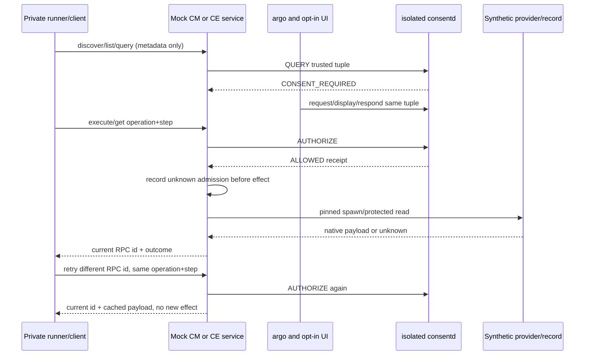

# Guide 14: Run mock CM and CE services

Two persistent C processes offer a small CM tool API and CE data API over
private JSON-RPC pipes. They authenticate separately and use the real isolated
consent library and daemon. Unlike one-shot commands, the services retain an
execution ledger across requests, so retries can return a saved result without
repeating the effect. Run `emulator-smoke.py --mock-services` after building
[Guide 13](13-tool-examples.en.md). These are synthetic developer services;
product integration status is listed below.

## Build and runner

Build with CONSENT_BUILD_SMOKE and CONSENT_BUILD_SMOKE_TOOLS enabled; JSON-GLib
remains test-only. Release23 tests install consent-smoke-mock-cm/ce and the
source examples. The production runtime has no new JSON dependency.

```sh
# Development emulator only, root/System, fresh guarded owned fixture:
export LD_LIBRARY_PATH=/usr/libexec/consent/smoke
/usr/libexec/consent/smoke/emulator-smoke.py --mock-services --seed 20261005
# Explicitly remove only the validated fixture and owned smoke units:
/usr/libexec/consent/smoke/emulator-smoke.py --cleanup
```

Default catalog is a root-owned synthetic finite catalog with a pinned installed
provider. `--mock-catalog actual` optionally exercises the installed CM parser.
Missing tool is OPTIONAL_MISSING with explicit fixture selection; any invoked
parser failure fails the run. Actual parser metadata contains no consent policy;
the separately registered fixture mapping is explicit. `--tools` remains a
separate regression mode; mock mode never requires public CM create to succeed.
`--require-product` still fails because product integration is absent.

## Request and response contract

The following inputs adapt active freshly provisioned fixture stages. Completed
runner fixtures are stopped with registry loss, so these are not post-run commands.
Start one service per private developer terminal/controller with fixed
LD_LIBRARY_PATH; setup, trusted metadata, package/app generation registration
and isolated daemon provisioning belong to the runner.

```sh
export LD_LIBRARY_PATH=/usr/libexec/consent/smoke
/usr/libexec/consent/smoke/consent-smoke-mock-cm fixture
# Separate process/controller:
/usr/libexec/consent/smoke/consent-smoke-mock-ce fixture
```

Each request is one JSON object followed by newline. stdout contains exactly one
JSON-RPC reply per request; startup/errors go to stderr. Request id is a nonempty
bounded ASCII identifier and only correlates transport. Protected operation_id
and step_id identify the immutable consent retry; changing transport id replays
the same approved action without a second effect, returning the current id.
Private pipe clients are fixture controllers, not authenticated arbitrary product
requesters. Only the service executable identity authenticates to consent.
Callers never submit subject/profile/package/app/generation/level/path/receipt
or requirement tuples. Those come from trusted server fixture metadata.

```jsonl
{"jsonrpc":"2.0","id":"c1","method":"catalog.discover","params":{}}
{"jsonrpc":"2.0","id":"e1","method":"context.list","params":{}}
{"jsonrpc":"2.0","id":"e2","method":"context.metadata","params":{"record":"level3"}}
{"jsonrpc":"2.0","id":"c2","method":"capability.query","params":{"capability":"cli:smoke-tool","record":"summary","operation_id":"cm-query","step_id":"execute"}}
{"jsonrpc":"2.0","id":"c3","method":"capability.execute","params":{"capability":"cli:smoke-tool","record":"summary","operation_id":"cm-summary-1","step_id":"execute"}}
{"jsonrpc":"2.0","id":"c4","method":"capability.execute","params":{"capability":"cli:smoke-tool","record":"summary","operation_id":"cm-summary-1","step_id":"execute"}}
{"jsonrpc":"2.0","id":"e3","method":"context.get","params":{"record":"level0","operation_id":"ce-level0-1","step_id":"get"}}
```

Before approval the action result contains api_status0, CONSENT_REQUIRED and
admissions0, without execution/data. Approved CM result contains ALLOWED and
execution.state=succeeded, data.summary=synthetic capability summary; CE returns
synthetic record text. Native errors retain execution.native_error; timeout or
invalid execution remains unknown. Consent API errors have API_ERROR and the
exact api_status, without execution. ALLOWED with an unknown prior receipt is
blocked_unknown_receipt, admits nothing and returns no data.

Only argo requests approval and only opt-in UI displays/responds. A DENIED UI
response completes argo with DENIED; it creates no durable deny grant, so a later
independent check remains CONSENT_REQUIRED and admits no effect. Run concurrently
in terminal A/B while the mock process remains alive:

```sh
# A: copy REQUEST_ID while argo waits:
/usr/libexec/consent/smoke/consent-smoke-argo smoke.cm.tool.summary approval-1
```

In terminal B concurrently, choose approval for the copied request id:

```sh
export LD_LIBRARY_PATH=/usr/libexec/consent/smoke
/usr/libexec/consent/smoke/consent-smoke-ui --auto-approve-smoke REQUEST_ID ONCE
```

For a separate denial scenario, respond to its still-pending request instead:

```sh
export LD_LIBRARY_PATH=/usr/libexec/consent/smoke
/usr/libexec/consent/smoke/consent-smoke-ui --auto-deny-smoke REQUEST_ID ONCE
```

## Safety and retries

CE records level0..3 map to their registered definitions. Level0 requires a
grant; level3 allows ONCE only. QUERY/list/metadata never spawn a provider or
open protected record data. A capability/record change with the same operation
and step is an immutable-tuple conflict. Every retry calls authoritative
AUTHORIZE before reading the receipt ledger or serving cached data, so revocation
and recovery block old results. The ledger stores payload, never a serialized
old RPC envelope. It is process-local and capped at 128; reaching the cap
terminates
explicitly before the next authorization/ONCE consumption. No durable product
side-effect deduplication is claimed.

Frames are read completely with a 16KiB bound. Embedded NUL, oversized and
truncated input is rejected. A partial frame expires after 12 seconds with
exit2. Invalid-envelope errors return
-32600, invalid parameters -32602, unknown method -32601, parse/frame -32700.
The JSON-GLib fixture parser is not a comprehensive production protocol validator.
Provider stdout/stderr are independently bounded/drained and every provider is
waited, including timeout kill. Existing tool_execute stays a compatible wrapper;
structured capture owns a validated reply allocated for the caller to free.

`mock.probe-role` accepts only fixed register/request/cross diagnostic kinds.
It checks exact real permission rejection against known fixture tuples; it cannot
install caller definitions. `mock.reconnect` accepts empty params and explicitly
destroys/recreates authentication. The runner first confirms the old handle is
DISCONNECTED on stopped-daemon recovery. Same service PID/ledger survives handle
recreation; running-delete checks the original handle. No automatic reconnect.



## Product integration status

These private APIs use synthetic tools and records. They are not product CM
execution or a verified CE taxonomy. The default mock catalog works without a
successful product CM create. Optional actual parser publication remains
separate from consent mapping; a parser invocation failure is not hidden by
fallback. `--require-product` reports the absent product integration.

## Verified checkpoint

Release23 r5 completed GBS with 23 PASS and four root-only SKIP. Installed
mock, legacy tools and default modes returned 0; all cleanups returned 0.
Discovery advertised CM8/CE4 callable records. CM/CE processes retained their
ledgers across recovery and recreated disconnected handles explicitly. Each
loss readback had schema2, definitions12, grants0 and cleanup_unknown1 before
fresh approval and effects. Production daemon18 and PoC18 were unchanged.
Evidence: `/var/tmp/consent-artifacts/consent-mock-integration-04/`.

[Detailed snapshot and failure history](../history/07-verification-history.en.md#guide-14-checkpoint)
