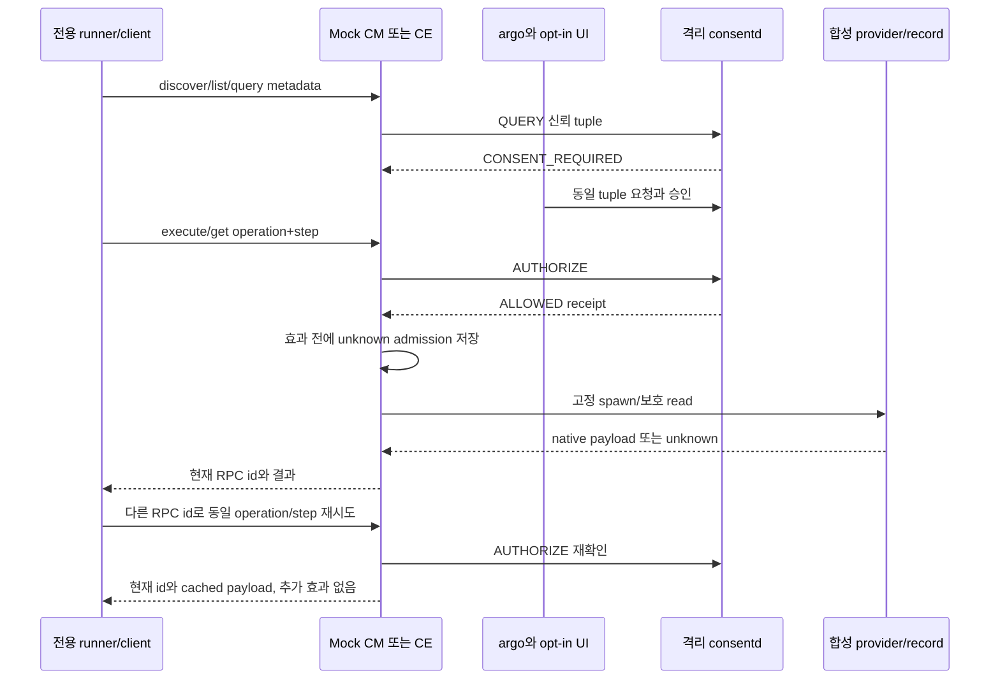

# 가이드 14: 지속형 CM 및 CE mock 서비스

[가이드 13](13-tool-examples.ko.md)의 같은 격리 runner에 `--mock-services`를
추가합니다. 독립 C 프로세스 두 개가 runner 전용 stdin/stdout pipe로 줄 단위
JSON-RPC를 받습니다. CM 조회/실행과 CE metadata/get은 합성 API이며 제품
capmgr_client_execute 또는 실제 CE 등급 체계가 아닙니다. 서로 다른 cm-only와
ce-only identity로 실제 격리 consent 라이브러리·daemon에 인증합니다. 운영
권한·서비스·PoC를 바꾸지 않으며 개인 context RPC도 호출하지 않습니다.

## 빌드와 runner

CONSENT_BUILD_SMOKE와 CONSENT_BUILD_SMOKE_TOOLS를 켭니다. JSON-GLib 의존성은
테스트에만 적용합니다. Release23 tests에 consent-smoke-mock-cm/ce와 소스 예제를
설치하며 운영 runtime에는 JSON 의존성을 추가하지 않습니다.

```sh
# 개발 emulator root/System, 보호된 새 fixture에서만 실행:
export LD_LIBRARY_PATH=/usr/libexec/consent/smoke
/usr/libexec/consent/smoke/emulator-smoke.py --mock-services --seed 20261005
/usr/libexec/consent/smoke/emulator-smoke.py --cleanup
```

기본 catalog는 root 소유 합성 catalog와 고정 설치 provider inode입니다.
`--mock-catalog actual`은 설치된 실제 CM parser를 선택적으로 실행합니다.
도구가 없으면 OPTIONAL_MISSING과 fixture 선택을 명시하지만 실행한 parser의
실패를 fallback으로 숨기지 않습니다. 실제 parser는 consent 정책을 전달하지
않고 별도의 fixture 등록 mapping을 사용합니다. 기존 `--tools`는 별도 회귀
모드입니다. mock 실행에 제품 CM create 성공은 필요하지 않습니다.
`--require-product`는 실제 제품 통합 부재 때문에 계속 실패합니다.

## 요청 및 응답 계약

아래 입력은 새 fixture가 실제 활성화된 단계에 맞춰 응용하는 예입니다.
완료된 runner는 registry-loss/stopped 상태이므로 종료 후 그대로 실행하는
명령이 아닙니다. trusted metadata, package/app generation 등록과 daemon
provisioning은 runner가 담당합니다. 각 controller에서 별도 프로세스를 엽니다.

```sh
export LD_LIBRARY_PATH=/usr/libexec/consent/smoke
/usr/libexec/consent/smoke/consent-smoke-mock-cm fixture
# 독립 프로세스/controller:
/usr/libexec/consent/smoke/consent-smoke-mock-ce fixture
```

JSON 객체 하나와 newline이 요청 한 개입니다. stdout은 요청마다 JSON-RPC 응답
한 개만 출력하고 시작·오류 진단은 stderr로 보냅니다. id는 제한된 ASCII
문자열이며 transport 상관관계만 담당합니다. operation_id와 step_id는 불변
consent 재시도를 식별합니다. RPC id만 바꾼 재시도는 새 효과 없이 현재 id를
응답합니다. private pipe client는 fixture controller이며 임의 제품 requester의 인증이
아닙니다. consent에는 서비스 executable identity만 인증합니다.
caller는 subject/profile/package/app/generation/level/path/receipt나
requirement tuple을 보낼 수 없고 서비스의 신뢰 fixture metadata가 결정합니다.

```json
{"jsonrpc":"2.0","id":"c1","method":"catalog.discover","params":{}}
{"jsonrpc":"2.0","id":"e1","method":"context.list","params":{}}
{"jsonrpc":"2.0","id":"e2","method":"context.metadata","params":{"record":"level3"}}
{"jsonrpc":"2.0","id":"c2","method":"capability.query","params":{"capability":"cli:smoke-tool","record":"summary","operation_id":"cm-query","step_id":"execute"}}
{"jsonrpc":"2.0","id":"c3","method":"capability.execute","params":{"capability":"cli:smoke-tool","record":"summary","operation_id":"cm-summary-1","step_id":"execute"}}
{"jsonrpc":"2.0","id":"c4","method":"capability.execute","params":{"capability":"cli:smoke-tool","record":"summary","operation_id":"cm-summary-1","step_id":"execute"}}
{"jsonrpc":"2.0","id":"e3","method":"context.get","params":{"record":"level0","operation_id":"ce-level0-1","step_id":"get"}}
```

승인 전 결과는 api_status0, CONSENT_REQUIRED, admissions0이며 execution/data가
없습니다. 승인 후 CM은 ALLOWED, execution.state=succeeded 및 합성 summary를,
CE는 합성 record 내용을 반환합니다. native 오류는 execution.native_error에,
timeout/불명확한 실행은 unknown에 기록합니다. consent API 오류는 API_ERROR와
정확한 api_status이며 execution은 없습니다. ALLOWED여도 이전 receipt가 로컬
ledger에 없으면 blocked_unknown_receipt로 차단하고 데이터·추가 admission이
없습니다.

argo만 승인 요청을 시작하고 opt-in UI만 prompt 조회와 응답을 합니다. UI의
DENIED 응답은 argo callback을 DENIED로 완료하지만 durable deny grant를 만들지
않으므로 이후 독립 check는 CONSENT_REQUIRED이며 보호 효과가 없습니다. mock
프로세스는 유지한 채 A/B 터미널에서 동시에 실행합니다.

```sh
# A: 대기 중 출력한 REQUEST_ID 복사:
/usr/libexec/consent/smoke/consent-smoke-argo smoke.cm.tool.summary approval-1
```

B 터미널에서 동시에 복사한 request id에 승인 응답을 보냅니다.

```sh
export LD_LIBRARY_PATH=/usr/libexec/consent/smoke
/usr/libexec/consent/smoke/consent-smoke-ui --auto-approve-smoke REQUEST_ID ONCE
```

별도 거부 시나리오에서는 그 시나리오의 아직 대기 중인 요청에 대신 응답합니다.

```sh
export LD_LIBRARY_PATH=/usr/libexec/consent/smoke
/usr/libexec/consent/smoke/consent-smoke-ui --auto-deny-smoke REQUEST_ID ONCE
```

CE level0..3은 서버가 등록 definition에 매핑합니다. level0도 grant가 필요하고
level3은 ONCE만 허용합니다. QUERY/list/metadata는 provider를 실행하거나 보호
record를 열지 않습니다. 같은 operation/step으로 capability/record를 변경하면
불변 tuple 충돌입니다. 캐시 결과를 반환하는 재시도도 ledger 조회 전에 실제
AUTHORIZE를 수행하므로 철회·복구 후 옛 결과를 전달하지 않습니다. ledger에는
payload만 저장하며 과거 RPC envelope/id는 저장하지 않습니다. 프로세스 로컬
ledger는128개로 제한하며 도달 시 다음 AUTHORIZE/ONCE 소비 전에 명시적으로
종료합니다. 제품의 durable side-effect dedup 보장은 주장하지 않습니다.

frame은 완전 읽기·16KiB 제한·NUL/초과/잘림 거부를 적용합니다. 부분 frame은
12초 후 parse 오류와 exit2로 종료합니다. envelope 오류 -32600, params -32602,
알 수 없는 method -32601, parse/frame -32700입니다. JSON-GLib fixture parser는
포괄적인 제품 protocol validator가 아닙니다. provider stdout/stderr를 독립적으로
제한·drain하고 timeout kill 후에도 wait합니다. 기존 tool_execute wrapper는
호환되며 structured capture는 검증한 reply를 할당하고 caller가 해제합니다.

mock.probe-role은 고정 register/request/cross 종류만 허용하며 알려진 fixture
실제 권한 거부를 검증합니다. caller definition 설치는 불가능합니다.
mock.reconnect는 빈 params로 handle을 명시적으로 destroy/create합니다. runner는
stopped 복구 전에 옛 handle DISCONNECTED를 확인합니다. 서비스 PID와 ledger는
유지하고 running-delete는 원래 handle로 확인합니다. 자동 reconnect는 없습니다.



## 검증한 Release23 snapshot (2026-09-30)

CONSENT-MOCK-INTEGRATION-04 최종 구현 r5는 baseline8f0c441과 검토한 변경을
사용합니다. 증거 경로:
`/var/tmp/consent-artifacts/consent-mock-integration-04/`.
source-r5.json은 실행·패키징한15개 소스 경로를 기록합니다. 게시 전11개 구현
hash는 일치했습니다(implementation-r5-postcheck.json). 게시 시 CMake 한 줄만
줄바꿈하여 native/runner10개 hash는 동일하고 CMake command 인자 token도
동일하지만 해당 파일 byte hash는 바뀝니다. 외부 publication-format.json에
old/new hash를 기록하며 이 formatting 차이에 RPM 재빌드·target 재실행은
없었습니다. 이 가이드 쌍의 최종 증거와
동시 입력 설명은 빌드 후 추가했습니다. 보존 RPM에는 이전 가이드 초안이 있으며
이후의 검증 문구가 포함됐다고 주장하지 않습니다.

consent 저장소의 정확한 빌드 명령:

```sh
gbs build -A x86_64 --profile tizen_10_1_emulator --include-all \
  --define '_without_poc 1'
```

gbs-r5.log/.exit0, CTest27 =23 PASS +root-only4 SKIP, 실패0,73.41초입니다.
rpms-r5/와 rpms-r5.json에 Release23 RPM/hash를 보존합니다. 운영 daemon RPM도
생성됐지만 설치하지 않았습니다. 발견한 emulator-26101 x86_64에서 검증된
System::Privileged transaction으로 consent/consent-devel/consent-tests23만 정상
업그레이드했습니다(install-r5.log INSTALL_EXIT0). ldconfig 권한 진단은 그대로
보존했습니다. installed-hash-r5.log의19개 설치 smoke payload hash가 tests RPM과
일치하며 현재 runner와 두 서비스 executable을 포함합니다.

개별 명령은 commands.jsonl에 기록하며 target 실행 형태는 다음과 같습니다.

```sh
systemd-run --quiet --wait --pipe -p User=root -p SmackProcessLabel=System \
  /usr/bin/python3 /usr/libexec/consent/smoke/emulator-smoke.py \
  --mock-services --seed 20261005
```

| 설치본 시나리오/log | 실제 remote 결과 |
| --- | --- |
| installed-mock-seed20261005-r5.log | SMOKE_EXIT0, MOCK_OUTER_EXIT0 |
| installed-tools-seed20261006-r5.log | SMOKE_EXIT0, OUTER_EXIT0 |
| installed-default-seed20261007-r5.log | SMOKE_EXIT0, OUTER_EXIT0 |
| cleanup-after-mock-r5.log | SMOKE_EXIT0, CLEANUP_EXIT0 |
| cleanup-after-tools-r5.log | SMOKE_EXIT0, CLEANUP_EXIT0 |
| cleanup-final-r5.log | SMOKE_EXIT0, CLEANUP_EXIT0 |

SDB hostexit0만으로 remote 성공을 판단하지 않고 runner/outer marker를 모두
검사했습니다. mock은 fixture catalog를 사용해 제품 create/parser에 의존하지
않았습니다. 필수 기존 tools 회귀에서는 실제 설치 parser/catalog와 예상된
public preflight 차단을 검증했습니다. 이 checkpoint에서 선택적 actual mock
catalog나 strict-product target 실행을 했다고 주장하지 않습니다.

mock 증거는 CM8/CE4 role별 discover, 실제 권한 오류, 잘못된 params/byte frame,
효과 없는 QUERY, 승인된 CM payload와 CE0..3, 다른 RPC id의 dedup, 불변 tuple
충돌, 알 수 없는 이전 receipt 차단, 철회된 receipt STALE(-116), 새 operation의
CONSENT_REQUIRED, 실제 argo/UI DENIED callback 뒤 admissions1 불변 상태의
CONSENT_REQUIRED, native_error/timeout 결과 재사용과 추가 admission 억제입니다.
복구 순서는 running-delete/corrupt/stopped-delete이며 mock PID113749/113753을
유지했습니다. 매번 새 승인 전 integrity=ok/schema2/definitions12/grants0/
cleanup_unknown1을 확인하고 새 승인 후 실제 fixture 효과를 실행했습니다.
daemon stop 후 옛 handle 거부와 명시 재생성을 확인하며 running-delete는 원래
handle을 사용합니다. registry loss는 시작에 실패하고 두 서비스 실행을 차단합니다.

초기 gbs-r1/r2 성공 기록을 보존했습니다. gbs-r3.exit1은 owner가 이전 GBS 정리
도중 새 빌드를 시작한 순서 오류이며 사용 중인 mounted root를 안전하게 거부한
결과입니다. 수동 unmount 우회는 없고 이후 빌드는 순차 실행했습니다.
gbs-r4.exit0 및 installed-mock-seed20261005-r4 remote1도 보존했습니다. 실제
DENIED callback은 정확했고 runner의 durable DENIED 기대가 잘못됐습니다.
cleanup-failed-r4.log는0입니다. 최종 assertion 수정과 정상 Release23 업그레이드로
daemon 계약을 유지했습니다.

device-before-r5.log/device-after.log의 서비스/package 및 보호 상태 inode/size/
mtime/uid/mode fingerprint가 완전히 같습니다. 운영 consentd18 PID31569 active,
PoC18 PID0 inactive, 제품 CM15 설치 상태가 유지됐습니다. 최종 smoke unit 두 개는
not-found이며 fixture 네 경로가 없습니다. 기존 smoke01 r6, Integration02 r4와
CM prerequisite 증거는 변경하지 않았습니다. results-r5.json에 결과를 요약합니다.
제품 CM principal/provisioning/transport/consent enforcement와 최신 CE server/
taxonomy는 외부 gate로 남습니다.
