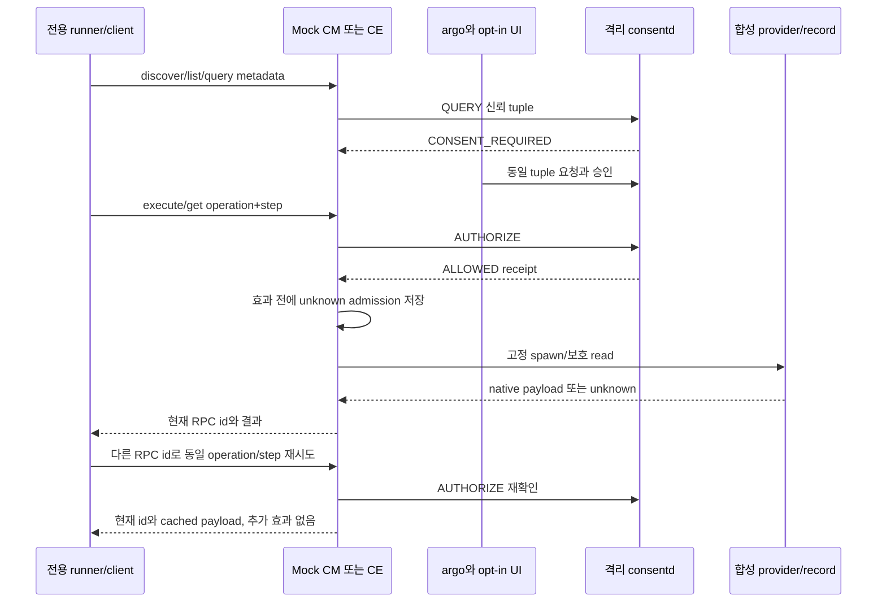

# 가이드 14: CM과 CE mock 서비스 실행

별도 C 프로세스 두 개가 전용 JSON-RPC 파이프로 CM 도구 API와 CE 데이터 API를
제공합니다. 각각 다른 신원으로 실제 격리 consent 라이브러리와 데몬에 인증합니다.
한 번 실행하고 끝나는 명령과 달리 서비스는 요청 사이에 실행 기록을 유지합니다.
따라서 재시도 때 같은 동작을 반복하지 않고 저장한 결과를 반환할 수 있습니다.
[가이드 13](13-tool-examples.ko.md)을 빌드한 뒤 `--mock-services`로 실행하세요.
개발용 합성 서비스이며 제품 연동 상태는 아래에서 설명합니다.

## 빌드와 runner

`CONSENT_BUILD_SMOKE`와 `CONSENT_BUILD_SMOKE_TOOLS`를 켭니다. JSON-GLib는
테스트에만 필요합니다. 테스트 패키지에 `consent-smoke-mock-cm/ce`와 소스 예제를
설치하고 운영 라이브러리에는 JSON 의존성을 추가하지 않습니다.

```sh
# 개발 emulator root/System, 보호된 새 fixture에서만 실행:
export LD_LIBRARY_PATH=/usr/libexec/consent/smoke
/usr/libexec/consent/smoke/emulator-smoke.py --mock-services --seed 20261005
/usr/libexec/consent/smoke/emulator-smoke.py --cleanup
```

기본 catalog는 root 소유의 합성 목록이며 제공자 실행 파일은 고정 inode로
검증합니다. `--mock-catalog actual`은 설치된 실제 CM parser를 선택합니다.
도구가 없으면 OPTIONAL_MISSING과 테스트 목록 선택을 명시합니다. 실행한
parser의 실패를 대체 목록으로 숨기지 않습니다. Consent 등록 연결은 별도로
구성합니다. 기존 `--tools`는 별도 회귀 검사 모드입니다.

## 요청 및 응답 계약

아래 입력은 초기 설정을 마친 환경이 실행 중일 때 사용합니다. 전체 실행이 끝나면
registry 손실 상태로 중지하므로 완료 뒤 그대로 실행하지 마세요. 실행 도구가
신뢰된 metadata, 패키지/앱 세대 등록과 데몬 설정을 담당합니다. 각 제어 터미널에서
별도 프로세스를 엽니다.

```sh
export LD_LIBRARY_PATH=/usr/libexec/consent/smoke
/usr/libexec/consent/smoke/consent-smoke-mock-cm fixture
# 독립 프로세스/controller:
/usr/libexec/consent/smoke/consent-smoke-mock-ce fixture
```

JSON 객체 하나와 줄바꿈이 요청 한 개입니다. stdout에는 요청마다 JSON-RPC
응답 하나만 출력하고 시작/오류 진단은 stderr로 보냅니다. id는 길이가 제한된
ASCII 문자열이며 요청과 응답을 연결할 뿐입니다. Consent 재시도는 불변
operation_id와 step_id로 식별합니다. RPC id만 바꿔 재시도하면 동작을 반복하지
않고 새 id로 응답합니다.

전용 파이프의 호출자는 테스트 제어 프로그램입니다. 임의 제품 요청자를 인증하는
API가 아니며 consent는 서비스 실행 파일의 신원만 인증합니다. 호출자는
subject/profile/package/app/generation/level/path/receipt 또는 요구 조건 묶음을
보낼 수 없습니다. 서비스가 신뢰된 테스트 metadata에서 그 값을 결정합니다.

```jsonl
{"jsonrpc":"2.0","id":"c1","method":"catalog.discover","params":{}}
{"jsonrpc":"2.0","id":"e1","method":"context.list","params":{}}
{"jsonrpc":"2.0","id":"e2","method":"context.metadata","params":{"record":"level3"}}
{"jsonrpc":"2.0","id":"c2","method":"capability.query","params":{"capability":"cli:smoke-tool","record":"summary","operation_id":"cm-query","step_id":"execute"}}
{"jsonrpc":"2.0","id":"c3","method":"capability.execute","params":{"capability":"cli:smoke-tool","record":"summary","operation_id":"cm-summary-1","step_id":"execute"}}
{"jsonrpc":"2.0","id":"c4","method":"capability.execute","params":{"capability":"cli:smoke-tool","record":"summary","operation_id":"cm-summary-1","step_id":"execute"}}
{"jsonrpc":"2.0","id":"e3","method":"context.get","params":{"record":"level0","operation_id":"ce-level0-1","step_id":"get"}}
```

승인 전 응답은 api_status0, CONSENT_REQUIRED와 admissions0이며 실행 결과나
데이터가 없습니다. 승인 후 CM은 ALLOWED, execution.state=succeeded와 테스트
요약을 반환하고 CE는 테스트 record 내용을 반환합니다. 제공자 오류는
execution.native_error, 만료나 불명확한 실행은 unknown으로 기록합니다.
Consent API 오류는 API_ERROR와 정확한 api_status를 반환하며 실행하지 않습니다.
ALLOWED라도 이전 receipt가 실행 기록에 없으면 blocked_unknown_receipt로
차단하고 데이터 반환이나 추가 실행을 하지 않습니다.

승인 요청은 argo만 시작하고 명시적으로 켠 테스트 UI가 안내 조회와 응답을 합니다.
UI가 거절하면 argo 콜백은 DENIED로 완료합니다. 지속 거부 grant를 만들지는
않으므로 이후 독립 check는 CONSENT_REQUIRED이고 보호 동작도 없습니다.
Mock 프로세스를 유지한 채 A/B 터미널에서 동시에 실행하세요.

```sh
# A: 대기 중 출력한 REQUEST_ID 복사:
/usr/libexec/consent/smoke/consent-smoke-argo smoke.cm.tool.summary approval-1
```

B 터미널에서 동시에 복사한 request id에 승인 응답을 보냅니다.

```sh
export LD_LIBRARY_PATH=/usr/libexec/consent/smoke
/usr/libexec/consent/smoke/consent-smoke-ui --auto-approve-smoke REQUEST_ID ONCE
```

별도 거부 시나리오에서는 그 시나리오의 아직 대기 중인 요청에 대신 응답합니다.

```sh
export LD_LIBRARY_PATH=/usr/libexec/consent/smoke
/usr/libexec/consent/smoke/consent-smoke-ui --auto-deny-smoke REQUEST_ID ONCE
```

## 안전 검사와 재시도

서버가 CE level0..3을 등록된 정의에 연결합니다. level0도 승인이 필요하고
level3은 ONCE만 허용합니다. QUERY/list/metadata는 제공자를 실행하거나 보호된
파일을 열지 않습니다. 같은 operation/step에서 capability나 record를 바꾸면
조건 충돌입니다.

저장한 결과를 반환하는 재시도도 실행 기록 조회 전에 AUTHORIZE를 호출하므로
철회나 복구 뒤 옛 결과를 전달하지 않습니다. 실행 기록에는 결과만 저장하며
과거 RPC 응답 전체나 id를 저장하지 않습니다. 프로세스 내 기록은 128개로
제한합니다. 한도에 도달하면 다음 AUTHORIZE와 ONCE 소비 전에 종료합니다.
프로세스 종료를 넘는 제품 중복 방지를 보장하지 않습니다.

요청 frame은 끝까지 읽으며 16KiB를 넘거나 NUL을 포함하거나 잘린 입력은
거부합니다. 부분 frame은 12초 뒤 해석 오류와 exit2로 종료합니다. 오류 코드는
응답 구조 -32600, 인자 -32602, 알 수 없는 method -32601, 해석/frame -32700입니다.
JSON-GLib 예제는 제품 프로토콜 전체를 검증하는 도구가 아닙니다. 제공자의
stdout/stderr는 독립적으로 제한해 수집하고 만료로 종료시켜도 반드시 회수합니다.
기존 tool_execute 함수는 호환됩니다. 구조화된 수집 결과는 검증한 응답을
할당하며 호출자가 해제합니다.

mock.probe-role은 고정 register/request/cross 검사만 허용하여 실제 권한 거부를
확인합니다. 호출자가 정의를 설치할 수 없습니다. mock.reconnect는 빈 params로
handle을 해제한 뒤 다시 만듭니다. 정지 후 복구에서는 먼저 옛 handle의
DISCONNECTED를 확인합니다. 서비스 PID와 실행 기록은 유지하고 실행 중 삭제는
원래 handle로 확인합니다. 자동 재연결은 하지 않습니다.



## 제품 연동 현황

전용 API는 합성 도구와 데이터를 사용하며 제품 CM 실행이나 검증된 CE 등급 체계가
아닙니다. 기본 mock catalog에는 제품 CM create 성공이 필요하지 않습니다.
선택한 실제 parser 등록도 consent 연결과 별개이며 parser 실행 실패를 대체
catalog로 숨기지 않습니다. `--require-product`는 제품 연동 부재를 보고합니다.

## 검증한 단계

Release23 r5 GBS에서 23개가 통과하고 root 전용 4개를 건너뛰었습니다. 설치된
mock/tools/default와 모든 정리는 0으로 종료했습니다. 검색 결과는 실행 가능한
CM 8개, CE 4개 record였습니다. 복구 중 CM/CE 프로세스는 실행 기록을 유지하고
끊긴 handle은 명시적으로 다시 만들었습니다. 각 손실 뒤 schema2, definitions12,
grants0, cleanup_unknown1을 확인한 다음 새 승인과 동작을 검증했습니다.
운영 daemon18과 PoC18은 변경하지 않았습니다.
증거: `/var/tmp/consent-artifacts/consent-mock-integration-04/`.

[스냅샷 상세와 실패 이력](../history/07-verification-history.ko.md#guide-14-checkpoint)
