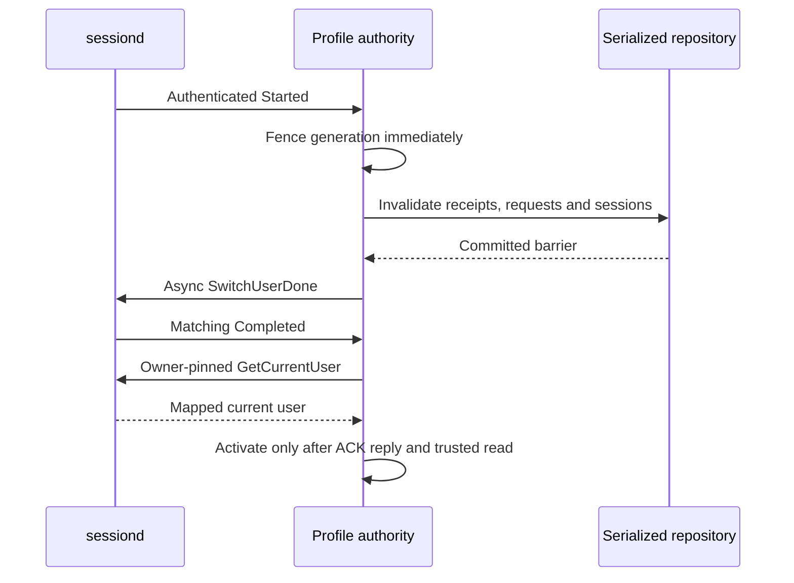

# Guide 15. Explicit requester profiles and sessiond authority

This checkpoint adds an opt-in daemon-owned active-profile authority. It does
not add a public C ABI field: request/check parameters already require explicit
`subject` and `profile` in synchronous and asynchronous calls. The daemon never
replaces the caller's requested profile with the active profile.

```c
consent_params_t *params = NULL;
consent_params_create(&params);
consent_params_set(params, "subject", "configured.subject");
consent_params_set(params, "profile", "configured.profile.A");
/* Add the registered requirement, then request as argo or check as CM/CE. */
```

## Protected configuration and trust

Absent `profiles.conf` under the protected authority directory retains legacy
static delegation. Present malformed configuration fails closed. Provisioning
must explicitly map a positive platform session account UID and exact
subject/subsession/profile pairs. This UID is not the caller's peer UID. Empty
subsession is accepted only when explicitly provisioned; profile remains
nonempty. Required/unknown/duplicate keys and groups are checked, with protected
no-follow ownership and bounded complete file reads.

```ini
[authority]
mode=sessiond
session_uid=PROVISIONED_ACCOUNT_UID
[binding A]
subject=configured.subject
subsession=A
profile=configured.profile.A
[binding default]
subject=configured.subject
subsession=
profile=configured.profile.default
```

Replace the symbolic UID before provisioning; the sample is intentionally not
an installable account mapping. Mapping and native D-Bus privileges remain
platform-owner decisions. The adapter does not alter service identity or policy.

The daemon opens a private system-bus connection and verifies that
`org.tizen.sessiond` and `org.tizen.sessiond.fully_ready` have the same unique
owner. It installs owner-pinned signal subscriptions before bounded asynchronous
WAIT registration and `GetCurrentUser`. Signal sender, path, interface, full
payload and configured account UID are checked. Initial and completion reads
use the authenticated server's in-memory result; library filesystem getters
cannot establish readiness. A fresh connection avoids stale waiter registration
on reconnect. The ready name means manager initialization, not readiness of all
platform providers.

Local libsessiond callbacks use an unrestricted sender subscription, and its
current-user getter reads user-owned files and can succeed without the daemon.
Therefore the production adapter uses authenticated native transport, while
`consent-smoke-sessiond-preflight` links libsessiond only in the test RPM for
explicit-UID read-only comparison/discovery. Production always uses the system
bus; private-bus injection is internal test infrastructure only.

## Fencing, decisions and cleanup



Actual sessiond switches physical filesystem state after emitting Started and
before waiting for clients. Its completion can occur after ACKs or timeout.
The consent barrier precedes ACK submission, not the physical switch. Returned
authorizations cannot be retracted; atomic provider action coordination remains
external. An ACK reply is transport success, not evidence of physical deletion
or completion of every participant.

Protected request/check, session open/resume/heartbeat, data use and UI approval
require the active mapped profile. Missing parameters remain invalid; unknown,
undelegated or inactive profiles are rejected, and uncertain authority is busy.
Inactive session inspection and authenticated cleanup/result/cancel metadata
remain available. Stored ALLOWED results additionally validate their stored
context and generation before publication. Ordinary switches invalidate pending
and terminal ALLOWED request records, old UI tokens, sessions and receipts,
including sessionless receipts. Persistent grants survive continuously observed
ordinary switches, partitioned by profile: A→B→A allows a fresh A operation but
never resurrects its old receipt or closed session.

Startup or any unverified owner/transport gap conservatively retires all mapped
approvals. A profile name cannot prove that removal/recreation was not missed.
An observed removal selectively retires the removed profile. Failed barriers
never permit ACK/activation. Late approval commit races compensate only newly
inserted grants and invalidate their request/token; compensation failure hard
fences the repository. Uncertain ONCE consumption can remain consumed and does
not authorize a repeated effect.

Trusted snapshots advertise internal `profile_authority=1`. Enabled clients
bypass local request caches for both sync and async calls; legacy-mode cache
behavior is unchanged. QUERY caches remain advisory. Protected actions always
require authoritative AUTHORIZE, and final I/O rejects a changed generation. Each queued sensitive frame retains
its captured generation, checked before every send/resume. A stale unsent or
partially sent frame closes the connection without completing the old success;
non-sensitive cleanup/event metadata is unaffected. Final send admission is the
linearization boundary; fully written frames cannot be retracted.

## Isolated developer verification

The same guarded installed runner accepts `--profiles`. Its private fake
sessiond exercises the production adapter's authenticated native D-Bus methods
and signals, mapped A/B/default profiles, owner loss and resynchronization.
Persistent CM/CE mock services receive explicit requested profiles over private
stdio, own their fixture mappings and check real isolated consent IPC before
synthetic provider/context effects. Callers cannot supply a subject, level,
path or receipt. This is not current product CM/CE integration or real account
switching.

```json
{"jsonrpc":"2.0","id":"transport-1","method":"capability.execute","params":{"capability":"cli:smoke-tool","record":"summary","profile":"smoke.profile.A","operation_id":"example-A","step_id":"invoke"}}
```

Adapt the method/record names from runner-owned discovery, rather than sending
this illustrative request to a production endpoint. Profiles are an explicit
finite fixture allowlist; caller privilege is never inferred from a profile
string. Receipt deduplication remains process-local, with AUTHORIZE before
cached payload delivery.

## Commands and verified snapshot

Run the installed isolated fixture under its required role label, then explicitly
clean up. The runner owns fresh fixture provisioning and refuses foreign paths.

```sh
systemd-run --quiet --wait --pipe -p User=root -p SmackProcessLabel=System \
  /usr/bin/python3 /usr/libexec/consent/smoke/emulator-smoke.py \
  --profiles --seed 20261010
systemd-run --quiet --wait --pipe -p User=root -p SmackProcessLabel=System \
  /usr/bin/python3 /usr/libexec/consent/smoke/emulator-smoke.py --cleanup
```

Native C actor inputs illustrate an active, freshly provisioned A fixture stage;
they are adaptations, not commands to run after completed smoke, which leaves
stopped registry-loss state. Each executable has its separately authenticated
role. A check is metadata only and cannot initiate approval.

```sh
printf 'check smoke.profile.A example-query 0\n' | \
  LD_LIBRARY_PATH=/usr/libexec/consent/smoke \
  /usr/libexec/consent/smoke/consent-smoke-profile-cm
printf 'request_async smoke.profile.B inactive-request -13\n' | \
  LD_LIBRARY_PATH=/usr/libexec/consent/smoke \
  /usr/libexec/consent/smoke/consent-smoke-profile-argo
```

The exact build command was:

```sh
gbs build -A x86_64 --profile tizen_10_1_emulator --include-all \
  --define '_without_poc 1'
```

Evidence is retained under `/var/tmp/consent-artifacts/consent-profile-05/`.
`source-r8.json` records the executed Release25 snapshot, all 29 files matching
before target verification (`source-r8-postcheck.json`). Final evidence prose in
this paired guide was added afterward; the other 27 implementation/build/test/
runner/navigation files retain their executed hashes. Archived RPMs and logs
remain unchanged; installed package documentation describes the earlier draft.
No documentation-only rebuild is claimed.

| Evidence file | Actual result |
| --- | --- |
| `gbs-r8.log`, `gbs-r8.exit` | exit0; CTest 25 PASS + 4 root-only SKIP |
| `rpms-r8/`, `rpms-r8.json` | matching Release25 runtime/devel/tests plus preserved full build artifacts |
| `install-r8.log` | remote INSTALL_EXIT:0; only runtime/devel/tests upgraded |
| `installed-r8-hash.log` | 25 installed payload hashes match RPM, HASH_EXIT:0 |
| `installed-profiles-seed20261010-r8.log` | SMOKE_EXIT0 / OUTER_EXIT:0 |
| `installed-strict-seed20261011-r8.log` | all scenarios PASS; SMOKE_EXIT1 / OUTER_EXIT:1 solely unverified product profile provisioning/privilege |
| `installed-mock-seed20261012-r8.log` | SMOKE_EXIT0 / OUTER_EXIT:0 |
| `installed-tools-seed20261013-r8.log` | SMOKE_EXIT0 / OUTER_EXIT:0, actual installed CM parser/catalog exercised |
| `installed-default-seed20261014-r8.log` | SMOKE_EXIT0 / OUTER_EXIT:0 |
| `cleanup-final-r8.log` | SMOKE_EXIT0 / CLEANUP_EXIT:0 |
| `device-before-r7.log`, `device-before-r8.log`, `device-after-r8.log` | complete production/PoC fingerprint equality; production daemon18 active PID31569; PoC18 inactive PID0; smoke units2 not-found, fixture directories4 absent |
| `native-readonly-preflight-r8.log` | security_fw/System, explicit synthetic configured UID1: library file observation0, native NameHasNoOwner/BLOCKED3 |
| `verification-r8.json`, `commands.jsonl` | consolidated outcomes and exact device command argv |

Profile scenarios verify warm A sync/async request source=DAEMON, missing/
unknown/undelegated/inactive rejection, terminal INVALIDATED callback exactly
once, late UI rejection, unrevoked CE receipt invalidation across A→B→A, fresh
persistent A reuse without old session revival, owner-gap approval retirement,
all three DB losses with integrity/schema2/definitions12/grants0/cleanup_unknown1
readback, fresh approvals and payload effects, same CM/CE service PIDs and explicit
new handles, and safe total registry-loss blocking. Authorization/API errors
have no effects; process-local mock receipts never replace current AUTHORIZE.
Native private-bus tests exercise the actual adapter's sender/owner/init/stale
successful reply/removal/ACK timeout/shutdown paths. Socketpair tests verify real
blocked and partially written sensitive responses cannot complete after fence.

Retained history is explicit: r1 compiler signedness failure; r2/r3 successful
builds; r4 compiler dangling-else fixture failure; r5/r6 invalid test envelope
failures; r7 successful build/profile0/strict1 followed by the legacy mock
helper-variable NameError1 and owned cleanup0. R8 restores the original dynamic
definition-count assertion and upgrades normally to Release25. No protocol
bounds, role policy or production fatal behavior was weakened.

Native product activation remains unverified: this emulator has no owner for
`org.tizen.sessiond`. The library filesystem getter nevertheless returned0,
which demonstrates why it is not readiness evidence. UID1 belongs only to the
synthetic configured fixture, not a discovered/provisioned product account
mapping. Product mapping, privilege, live native switch/provider coordination,
actual CM authorization adapter and current CE server integration remain external
gates. No real account switch, production daemon installation or policy change
was performed. See [Guide 14](14-mock-services.en.md) for existing mock boundaries.

The focused repository cleanup test registers an A artifact under an owned
session and receipt, switches to B, rejects A data use, and permits authenticated
A cleanup listing/ACK while inactive. Matching ACK advances CLOSING to CLOSED;
returning to A cannot revive the session. This is control-metadata evidence, not
proof that physical data was deleted.
