# Guide 15: Request approval for an explicit profile

[한국어](15-profile-authority.ko.md)

Request and check calls already require `subject` and `profile`, in both sync
and async APIs. This guide explains how the daemon can additionally verify
that the requested profile is currently active. It never substitutes the
active profile for a caller's input.

The optional profile authority is the daemon's trusted active-profile state.
It reads authenticated sessiond replies and fences sensitive operations when
that state is uncertain or changes. Without a configured authority, existing
static delegation rules remain in use.

```c
/* Fragment on an existing builder; propagate status before request/check. */
int status = consent_params_set(params, "subject", "configured.subject");
if (status == 0)
  status = consent_params_set(params, "profile", "configured.profile.A");
/* Add the exact requirement only when status == 0. Caller frees params. */
```

## Commands and verified snapshot

Run the installed isolated fixture under its required role label, then
explicitly
clean up. The runner owns fresh fixture provisioning and refuses foreign paths.

```sh
systemd-run --quiet --wait --pipe -p User=root -p SmackProcessLabel=System \
  /usr/bin/python3 /usr/libexec/consent/smoke/emulator-smoke.py \
  --profiles --seed 20261010
systemd-run --quiet --wait --pipe -p User=root -p SmackProcessLabel=System \
  /usr/bin/python3 /usr/libexec/consent/smoke/emulator-smoke.py --cleanup
```

Native C actor inputs illustrate an active, freshly provisioned A fixture stage;
they are adaptations, not commands to run after completed smoke, which leaves
stopped registry-loss state. Each executable has its separately authenticated
role. A check is metadata only and cannot initiate approval.

```sh
printf 'check smoke.profile.A example-query 0\n' | \
  LD_LIBRARY_PATH=/usr/libexec/consent/smoke \
  /usr/libexec/consent/smoke/consent-smoke-profile-cm
printf 'request_async smoke.profile.B inactive-request -13\n' | \
  LD_LIBRARY_PATH=/usr/libexec/consent/smoke \
  /usr/libexec/consent/smoke/consent-smoke-profile-argo
```

## 2. Read the A → B → A outcomes

The installed --profiles runner drives these transitions on a private fake bus,
not real user accounts. This table describes its tested assertions, not extra
commands for switching sessiond:

| Step | Expected protected behavior |
| --- | --- |
| Active A with fresh approval | CM/CE execute once under A |
| Switch to B | A requests/checks blocked; pending UI invalidated; counts unchanged |
| Return to A | Saved old CE operation is STALE; no old data or admission |
| Fresh A operation | Continuously observed persistent A grant may allow a new effect |
| Owner loss/resync | Mapped grants retired; fresh approval required |
| Missing/unknown/spoofed profile | Exact API rejection, no admission |

After the runner completes, read SMOKE_EXIT and the remote process exit, then
run the cleanup command above. The native actor examples apply only to a freshly
provisioned active A stage, not the stopped final fixture. Native provisioning
and its trust checks are a separate reference below.

## Isolated developer verification

The same guarded installed runner accepts `--profiles`. Its private fake
sessiond exercises the production adapter's authenticated native D-Bus methods
and signals, mapped A/B/default profiles, owner loss and resynchronization.
Persistent CM/CE mock services receive explicit requested profiles over private
stdio, own their fixture mappings and check real isolated consent IPC before
synthetic provider/context effects. Callers cannot supply a subject, level,
path or receipt. This is not current product CM/CE integration or real account
switching.

```json
{
  "jsonrpc": "2.0",
  "id": "transport-1",
  "method": "capability.execute",
  "params": {
    "capability": "cli:smoke-tool",
    "record": "summary",
    "profile": "smoke.profile.A",
    "operation_id": "example-A",
    "step_id": "invoke"
  }
}
```

Adapt the method/record names from runner-owned discovery, rather than sending
this illustrative request to a production endpoint. Profiles are an explicit
finite fixture allowlist; caller privilege is never inferred from a profile
string. Receipt deduplication remains process-local, with AUTHORIZE before
cached payload delivery.

## Protected configuration and trust

Absent `profiles.conf` under the protected authority directory retains legacy
static delegation. Present malformed configuration fails closed. Provisioning
must explicitly map a positive platform session account UID and exact
subject/subsession/profile pairs. This UID is not the caller's peer UID. Empty
subsession is accepted only when explicitly provisioned; profile remains
nonempty. Required/unknown/duplicate keys and groups are checked, with protected
no-follow ownership and bounded complete file reads.

```ini
[authority]
mode=sessiond
session_uid=PROVISIONED_ACCOUNT_UID
[binding A]
subject=configured.subject
subsession=A
profile=configured.profile.A
[binding default]
subject=configured.subject
subsession=
profile=configured.profile.default
```

Replace the symbolic UID before provisioning; the sample is intentionally not
an installable account mapping. Mapping and native D-Bus privileges remain
platform-owner decisions. The adapter does not alter service identity or policy.

The daemon opens a private system-bus connection and verifies that
`org.tizen.sessiond` and `org.tizen.sessiond.fully_ready` have the same unique
owner. Before bounded async WAIT registration and `GetCurrentUser`, it
subscribes
to that owner's signals and checks:

- The sender is the verified unique owner.
- The path and interface match the contract.
- The full payload has the expected types and configured account UID.

Initial and completion reads use the authenticated server's in-memory state.
A filesystem getter cannot establish readiness. Reconnect uses a fresh
connection to avoid stale waiter registrations. The ready name means manager
initialization, not that every platform provider is ready.

Local libsessiond callbacks use an unrestricted sender subscription, and its
current-user getter reads user-owned files and can succeed without the daemon.
Therefore the production adapter uses authenticated native transport, while
`consent-smoke-sessiond-preflight` links libsessiond only in the test RPM for
explicit-UID read-only comparison/discovery. Production always uses the system
bus; private-bus injection is internal test infrastructure only.

## Profile switches and protected operations

```mermaid
sequenceDiagram
  participant S as sessiond
  participant A as Profile authority
  participant R as Serialized repository
  S->>A: Authenticated Started
  A->>A: Fence generation immediately
  A->>R: Invalidate receipts, requests and sessions
  R-->>A: Committed barrier
  A->>S: Async SwitchUserDone
  S->>A: Matching Completed
  A->>S: Owner-pinned GetCurrentUser
  S-->>A: Mapped current user
  A->>A: Activate only after ACK reply and trusted read
```



Actual sessiond switches physical filesystem state after emitting Started and
before waiting for clients. Its completion can occur after ACKs or timeout.
The consent barrier precedes ACK submission, not the physical switch. Returned
authorizations cannot be retracted; atomic provider action coordination remains
external. An ACK reply is transport success, not evidence of physical deletion
or completion of every participant.

Sensitive operations require the active mapped profile: request/check,
session open/resume/heartbeat, data use and UI approval. Missing fields are
invalid. Unknown, undelegated or inactive profiles are rejected; uncertain
authority returns busy. Inactive session inspection and authenticated
cleanup/result/cancel metadata remain available. Stored ALLOWED results check
their stored context and generation before publication.

Generation is the authority version used to reject work from an earlier state.
Ordinary switches invalidate pending and terminal ALLOWED requests, UI tokens,
sessions and all receipts, including sessionless ones. Persistent grants remain
partitioned by profile during continuously observed ordinary switches. A→B→A
allows a fresh A operation, but never revives its old receipt or closed session.

Startup or any unverified owner/transport gap conservatively retires all mapped
approvals. A profile name cannot prove that removal/recreation was not missed.
An observed removal selectively retires the removed profile. Failed barriers
never permit ACK/activation. Late approval commit races compensate only newly
inserted grants and invalidate their request/token; compensation failure hard
fences the repository. Uncertain ONCE consumption can remain consumed and does
not authorize a repeated effect.

Trusted snapshots advertise internal `profile_authority=1`. Enabled clients
bypass local request caches for both sync and async calls; legacy-mode cache
behavior is unchanged. QUERY caches remain advisory. Protected actions always
require AUTHORIZE at the daemon. Final I/O rejects a changed generation.
Each queued sensitive frame retains
its captured generation, checked before every send/resume. A stale unsent or
partially sent frame closes the connection without completing the old success;
non-sensitive cleanup/event metadata is unaffected. Final send admission is the
linearization boundary; fully written frames cannot be retracted.

## Verified checkpoint and limits

Release25 r8 completed GBS with 25 PASS and four root-only SKIP. Profiles,
mock, tools and default modes returned 0; strict profile mode returned the
expected 1 after scenarios, and cleanup returned 0. Private-bus tests covered
sender/owner trust, stale replies, removal and ACK timeouts. Socketpair tests
covered queued and partial sensitive replies. Inactive-profile cleanup ACKs
closed sessions without reviving them; this proves metadata transitions, not
physical deletion.

Native preflight returned BLOCKED3 because the sessiond bus name had no owner.
The library file getter returned 0 and was not used as readiness evidence.
Configured UID1 was synthetic, not a discovered product mapping. Product
account mapping, bus privileges and real switch/provider coordination remain
unverified. Evidence: `/var/tmp/consent-artifacts/consent-profile-05/`.

[Detailed snapshot and failure
history](../history/07-verification-history.en.md#guide-15-checkpoint)

---

[Related task](api/03-request-and-check.en.md) ·
[Continue](16-maintenance-and-integration.en.md) · [Reading
paths](../README.md)
