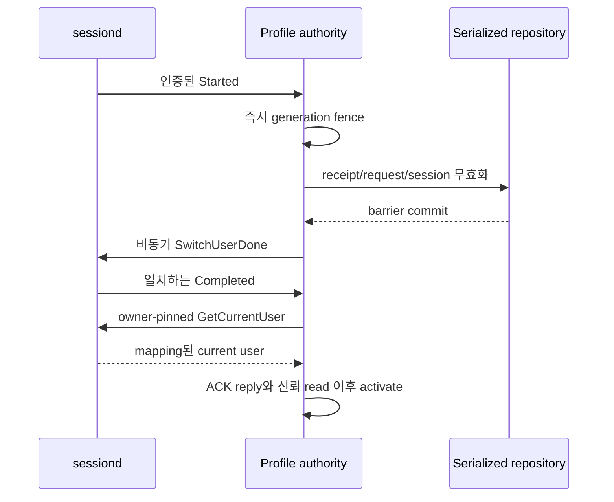

# 가이드 15. 명시적 requester 프로필과 sessiond authority

이 checkpoint는 daemon 소유 active-profile authority를 opt-in으로 추가합니다.
공개 C ABI 필드를 추가하지 않습니다. 동기·비동기 request/check params에는 이미
명시적 `subject`, `profile`이 필요하며, 요청 프로필을 active profile로 바꾸지
않습니다.

```c
consent_params_t *params = NULL;
consent_params_create(&params);
consent_params_set(params, "subject", "configured.subject");
consent_params_set(params, "profile", "configured.profile.A");
/* 등록된 requirement를 추가하고 argo는 request, CM/CE는 check를 호출합니다. */
```

## 보호 설정과 신뢰

보호 authority 디렉터리의 `profiles.conf`가 없으면 기존 static delegation을
유지합니다. 파일이 있으나 잘못된 설정이면 fail-closed입니다. 플랫폼 session
account의 양수 UID와 subject/subsession/profile을 명시적으로 provision해야
합니다. UID는 caller peer UID가 아닙니다. 빈 subsession도 명시적으로 설정해야
하며 profile은 비어 있으면 안 됩니다. 필수·알 수 없는·중복 key/group과 보호
소유권, no-follow, 제한된 전체 파일 읽기를 검사합니다.

```ini
[authority]
mode=sessiond
session_uid=PROVISIONED_ACCOUNT_UID
[binding A]
subject=configured.subject
subsession=A
profile=configured.profile.A
[binding default]
subject=configured.subject
subsession=
profile=configured.profile.default
```

symbolic UID를 실제 provision 값으로 바꿔야 합니다. 위 예제는 그대로 설치할
account mapping이 아닙니다. mapping과 native D-Bus privilege는 플랫폼 owner의
결정 사항입니다. adapter는 service identity나 policy를 변경하지 않습니다.

daemon은 전용 system-bus connection에서 `org.tizen.sessiond`와
`org.tizen.sessiond.fully_ready`의 unique owner가 동일함을 검증합니다. 제한된
비동기 WAIT 등록과 `GetCurrentUser` 전에 owner-pinned signal 구독을 설치하고
sender/path/interface/전체 payload/설정 account UID를 확인합니다. 최초·completion
read는 인증된 server의 in-memory 결과를 사용합니다. library 파일 getter만으로
ready가 되지 않습니다. 재연결 시 새 connection으로 stale waiter를 피합니다.
ready name은 manager 초기화이며 모든 platform provider의 ready를 뜻하지 않습니다.

실제 libsessiond callback 구독은 sender를 제한하지 않고, current-user getter는
user 소유 파일을 읽으며 daemon 없이도 성공할 수 있습니다. production adapter는
인증된 native transport를 사용합니다. `consent-smoke-sessiond-preflight`만 test
RPM에서 libsessiond에 링크하여 명시 UID의 read-only 비교·discovery를 제공합니다.
production은 항상 system bus이며 private-bus 주입은 내부 테스트 용도입니다.

## Fence, 결정과 cleanup



실제 sessiond는 Started를 emit한 뒤 client ACK를 기다리기 전에 filesystem을
전환합니다. completion은 ACK 또는 timeout 뒤 발생할 수 있습니다. consent
barrier는 ACK 제출보다 먼저지만 물리 전환보다 먼저라는 보장은 아닙니다. 이미
반환한 authorization은 회수할 수 없으며 provider 동작의 원자적 조율은 외부
과제입니다. ACK reply는 transport 성공이며 물리 삭제나 모든 참여자의 완료
증거가 아닙니다.

보호 request/check, session open/resume/heartbeat, data use와 UI 승인은 active
mapped profile이 필요합니다. 누락은 invalid, unknown/undelegated/inactive는
거부하며 authority가 불확실하면 busy입니다. inactive session 검사와 인증된
cleanup/result/cancel metadata는 허용합니다. 저장된 ALLOWED 결과는 저장 context와
generation을 추가 검증합니다. 일반 switch는 pending 및 terminal ALLOWED request,
UI token, session, sessionless receipt까지 무효화합니다. 계속 관측한 일반 switch의
PERSISTENT grant는 profile별로 유지합니다. A→B→A의 새 operation은 A 승인을
재사용할 수 있으나 old receipt나 닫힌 session은 되살아나지 않습니다.

startup 또는 확인되지 않은 owner/transport gap은 모든 mapped 승인을 보수적으로
철회합니다. 같은 이름만으로 놓친 삭제·재생성이 없었다고 증명할 수 없습니다.
관측한 removal은 해당 profile만 철회합니다. 실패한 barrier는 ACK/activate를
허용하지 않습니다. 늦은 승인 commit race는 새 grant만 보상 철회하고 request/token을
무효화합니다. 보상 실패는 repository hard fence입니다. 불확실한 ONCE 소비는
소비 상태로 남을 수 있으며 반복 effect를 허용하지 않습니다.

신뢰 snapshot의 내부 `profile_authority=1`이 활성화되면 동기·비동기 request는
local cache를 우회합니다. legacy cache 동작은 유지됩니다. QUERY cache는 참고용이며
보호 동작은 항상 authoritative AUTHORIZE가 필요합니다. final I/O에서도 변경된
generation을 거부합니다. 민감한 queued frame은 captured generation을 보존하고
매 send/resume 전에 검사합니다. stale unsent/partial frame은 연결을 닫아 old success를
완료하지 않습니다. cleanup/event metadata에는 이 제한을 적용하지 않습니다.
final-send admission이 선형화 경계이며 이미 전송 완료된 frame은 회수하지 못합니다.

## 격리 개발자 검증

같은 보호 runner의 `--profiles` 모드는 전용 fake sessiond를 통해 production
adapter의 인증된 native D-Bus method/signal, A/B/default mapping, owner loss와
resync를 검증합니다. persistent CM/CE mock service는 private stdio의 명시 요청
profile을 받고 fixture mapping을 소유합니다. synthetic provider/context effect 전에
실제 격리 consent IPC를 검사합니다. caller는 subject/level/path/receipt를 넘길 수
없습니다. 실제 제품 CM/CE 통합이나 실제 account 전환을 의미하지 않습니다.

```json
{"jsonrpc":"2.0","id":"transport-1","method":"capability.execute","params":{"capability":"cli:smoke-tool","record":"summary","profile":"smoke.profile.A","operation_id":"example-A","step_id":"invoke"}}
```

runner 소유 discovery의 실제 method/record 이름에 맞춰 적용하는 예시이며 product
endpoint에 보낼 명령이 아닙니다. fixture profile은 유한 allowlist이고 문자열만으로
caller privilege를 인정하지 않습니다. receipt dedup은 process-local이며 cached
payload 전달 전에도 AUTHORIZE를 호출합니다.

## 명령과 검증 snapshot

필수 role label로 설치된 격리 fixture를 실행한 뒤 명시적으로 cleanup합니다.
runner가 fresh fixture를 provision하며 외부 소유 경로는 거부합니다.

```sh
systemd-run --quiet --wait --pipe -p User=root -p SmackProcessLabel=System \
  /usr/bin/python3 /usr/libexec/consent/smoke/emulator-smoke.py \
  --profiles --seed 20261010
systemd-run --quiet --wait --pipe -p User=root -p SmackProcessLabel=System \
  /usr/bin/python3 /usr/libexec/consent/smoke/emulator-smoke.py --cleanup
```

다음 C actor 입력은 freshly provisioned active A fixture 단계에 적용하는 예시입니다.
완료된 smoke는 stopped registry-loss 상태를 남기므로 완료 후 실행할 명령이 아닙니다.
각 executable은 별도 인증 role이며 check는 metadata만 검사하고 승인을 요청하지 않습니다.

```sh
printf 'check smoke.profile.A example-query 0\n' | \
  LD_LIBRARY_PATH=/usr/libexec/consent/smoke \
  /usr/libexec/consent/smoke/consent-smoke-profile-cm
printf 'request_async smoke.profile.B inactive-request -13\n' | \
  LD_LIBRARY_PATH=/usr/libexec/consent/smoke \
  /usr/libexec/consent/smoke/consent-smoke-profile-argo
```

실제 build 명령은 다음과 같습니다.

```sh
gbs build -A x86_64 --profile tizen_10_1_emulator --include-all \
  --define '_without_poc 1'
```

증거는 `/var/tmp/consent-artifacts/consent-profile-05/`에 보존합니다.
`source-r8.json`은 실행된 Release25 snapshot이며 target 검증 전 29개 파일이 모두
일치했습니다(`source-r8-postcheck.json`). 이 문서 쌍의 최종 증거 문장은 이후 추가한
것이며 나머지 implementation/build/test/runner/navigation 27개는 실행 hash를
유지합니다. RPM·로그는 그대로 보존하고 설치 패키지 문서는 이전 draft입니다.
문서만을 위한 rebuild를 주장하지 않습니다.

| 증거 파일 | 실제 결과 |
| --- | --- |
| `gbs-r8.log`, `gbs-r8.exit` | exit0; CTest 25 PASS + root-only 4 SKIP |
| `rpms-r8/`, `rpms-r8.json` | matching Release25 runtime/devel/tests와 전체 build 산출물 보존 |
| `install-r8.log` | remote INSTALL_EXIT:0; runtime/devel/tests만 upgrade |
| `installed-r8-hash.log` | 설치 payload 25 hash가 RPM과 일치, HASH_EXIT:0 |
| `installed-profiles-seed20261010-r8.log` | SMOKE_EXIT0 / OUTER_EXIT:0 |
| `installed-strict-seed20261011-r8.log` | 모든 시나리오 PASS 뒤 product profile provisioning/privilege 미검증만으로 SMOKE_EXIT1 / OUTER_EXIT:1 |
| `installed-mock-seed20261012-r8.log` | SMOKE_EXIT0 / OUTER_EXIT:0 |
| `installed-tools-seed20261013-r8.log` | SMOKE_EXIT0 / OUTER_EXIT:0, 실제 설치 CM parser/catalog 수행 |
| `installed-default-seed20261014-r8.log` | SMOKE_EXIT0 / OUTER_EXIT:0 |
| `cleanup-final-r8.log` | SMOKE_EXIT0 / CLEANUP_EXIT:0 |
| `device-before-r7.log`, `device-before-r8.log`, `device-after-r8.log` | 전체 production/PoC fingerprint 일치; production daemon18 active PID31569, PoC18 inactive PID0; smoke unit2 not-found, fixture directory4 absent |
| `native-readonly-preflight-r8.log` | security_fw/System, 명시적 synthetic 설정 UID1: library file observation0, native NameHasNoOwner/BLOCKED3 |
| `verification-r8.json`, `commands.jsonl` | 종합 결과와 실제 device command argv |

profile 시나리오는 warm A 동기·비동기 request source=DAEMON, 누락/unknown/
undelegated/inactive 거부, terminal INVALIDATED callback 정확히 1회, late UI 거부,
A→B→A에서 철회하지 않은 CE receipt 무효화와 새 A persistent 승인 재사용, old session
미복원, owner gap 승인 철회, 세 DB loss의 integrity/schema2/definitions12/grants0/
cleanup_unknown1 검사와 fresh approval/payload effect, 같은 CM/CE service PID 및
명시적 새 handle, total registry loss 안전 차단을 검증합니다. 권한 검사/API 오류는
effect가 없으며 process-local mock receipt가 현재 AUTHORIZE를 대체하지 않습니다.
private-bus native 테스트는 실제 adapter의 sender/owner/init/stale 성공 reply/removal/
ACK timeout/shutdown을 검증합니다. socketpair는 실제 blocked/partial sensitive
응답이 fence 후 완료되지 않음을 검증합니다.

실패 이력도 보존합니다. r1 compiler signedness 실패, r2/r3 build 성공, r4 compiler
dangling-else fixture 실패, r5/r6 잘못된 test envelope 실패, r7 build/profile0/strict1
성공 뒤 legacy mock helper 변수 NameError1 및 owned cleanup0입니다. r8은 기존 동적
definition-count assertion을 복원하고 Release25로 정상 upgrade합니다. protocol bound,
role policy, production fatal 동작을 완화하지 않았습니다.

native product activation은 미검증입니다. 이 emulator에는 `org.tizen.sessiond` owner가
없지만 library 파일 getter는0을 반환했습니다. 파일 getter가 ready 근거가 아님을
보여줍니다. UID1은 synthetic fixture 설정이며 발견·provision된 product account
mapping이 아닙니다. 제품 mapping/privilege, 실제 native switch/provider 조율, 실제 CM
authorization adapter와 최신 CE server 통합은 외부 gate입니다. 실제 account switch,
production daemon 설치나 policy 변경은 수행하지 않았습니다.
기존 mock 경계는 [가이드 14](14-mock-services.ko.md)를 참고하십시오.

repository cleanup 테스트는 소유 session/receipt로 A artifact를 등록한 뒤 B로
전환하여 A data use를 거부하고, inactive A의 인증된 cleanup list/ACK를 허용하는지
확인합니다. 일치하는 ACK로 CLOSING에서 CLOSED로 진행하며 A 복귀로 session을
되살리지 않습니다. 이는 제어 metadata 증거이며 물리 데이터 삭제 증거가 아닙니다.
