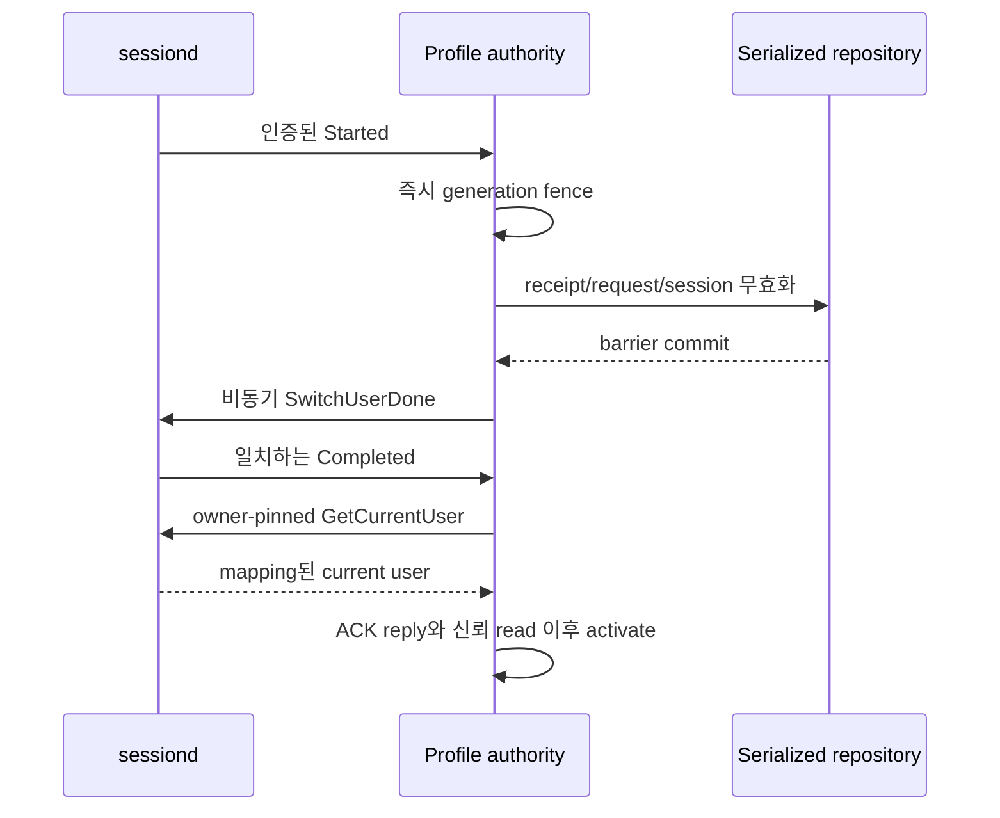

# 가이드 15: 요청 프로필을 명시하고 활성 상태 확인

[English](15-profile-authority.en.md)

동기·비동기 request/check API에는 이미 `subject`와 `profile`이 필요합니다.
이 가이드는 데몬이 요청받은 프로필의 현재 활성 상태까지 확인하도록 설정하는
방법을 설명합니다. 호출자가 지정한 프로필을 활성 프로필로 바꾸지 않습니다.

프로필 authority는 데몬이 신뢰하는 활성 프로필 상태입니다. 선택적으로 설정하며
인증된 sessiond 응답을 읽습니다. 상태가 불확실하거나 바뀌면 민감한 동작을
차단합니다. 설정하지 않으면 기존의 고정 위임 규칙을 사용합니다.

```c
/* Fragment on an existing builder; propagate status before request/check. */
int status = consent_params_set(params, "subject", "configured.subject");
if (status == 0)
  status = consent_params_set(params, "profile", "configured.profile.A");
/* Add the exact requirement only when status == 0. Caller frees params. */
```

## 실행 명령

필수 역할 라벨로 격리 테스트를 실행한 뒤 명시적으로 정리하세요. 실행 도구가
새 환경을 설정하며 외부 소유 경로는 거부합니다.

```sh
systemd-run --quiet --wait --pipe -p User=root -p SmackProcessLabel=System \
  /usr/bin/python3 /usr/libexec/consent/smoke/emulator-smoke.py \
  --profiles --seed 20261010
systemd-run --quiet --wait --pipe -p User=root -p SmackProcessLabel=System \
  /usr/bin/python3 /usr/libexec/consent/smoke/emulator-smoke.py --cleanup
```

다음 C 예제 입력은 초기 설정을 마친 활성 A 단계에서 사용합니다. 전체 실행은
registry 손실 상태로 중지하므로 완료 후 실행하지 마세요. 각 실행 파일은 별도
역할로 인증하며 check는 metadata만 검사하고 승인을 요청하지 않습니다.

```sh
printf 'check smoke.profile.A example-query 0\n' | \
  LD_LIBRARY_PATH=/usr/libexec/consent/smoke \
  /usr/libexec/consent/smoke/consent-smoke-profile-cm
printf 'request_async smoke.profile.B inactive-request -13\n' | \
  LD_LIBRARY_PATH=/usr/libexec/consent/smoke \
  /usr/libexec/consent/smoke/consent-smoke-profile-argo
```

## 2. A → B → A 결과 확인하기

설치한 --profiles 실행 도구가 전용 fake bus에서 전환하며 실제 계정을 바꾸지는
않습니다. 표는 검증한 assertion을 설명하며 sessiond 전환용 명령이 아닙니다.

| 단계 | 예상 보호 동작 |
| --- | --- |
| 활성 A에서 새 승인 | CM/CE가 A에서 한 번 실행 |
| B로 전환 | A 요청·검사 차단, 대기 UI 무효화, 실행 횟수 유지 |
| A로 복귀 | 저장한 옛 CE operation은 STALE, 옛 데이터·추가 진입 없음 |
| 새 A operation | 정상 전환을 계속 관측했다면 A의 지속 승인으로 새 실행 가능 |
| 소유자 손실·재동기화 | 연결된 승인을 철회하고 새 승인 필요 |
| 누락·미지·위조 프로필 | 정확한 API 오류, 진입 없음 |

종료 후 SMOKE_EXIT와 원격 프로세스 종료 코드를 확인하고 위 정리 명령을
실행하세요. 네이티브 actor 예제는 초기 설정을 끝낸 활성 A 단계에만 적용되며
최종 중지 환경에서 실행하는 명령이 아닙니다. 실제 프로비저닝과 신뢰 검사는
아래 별도 참조에서 설명합니다.

## 격리 개발자 검증

`--profiles`는 전용 fake sessiond로 운영 어댑터의 인증된 D-Bus method/signal,
A/B/default 연결, 소유자 손실과 재동기화를 검사합니다. 지속형 CM/CE mock
서비스는 전용 stdio로 요청 프로필을 받고 자체 테스트 연결 정보를 사용합니다.
합성 도구 실행이나 데이터 조회 전에 실제 격리 consent IPC를 확인합니다.
호출자는 subject/level/path/receipt를 넘길 수 없습니다. 실제 제품 CM/CE 연동이나
실제 계정 전환을 검증하는 모드는 아닙니다.

```json
{
  "jsonrpc": "2.0",
  "id": "transport-1",
  "method": "capability.execute",
  "params": {
    "capability": "cli:smoke-tool",
    "record": "summary",
    "profile": "smoke.profile.A",
    "operation_id": "example-A",
    "step_id": "invoke"
  }
}
```

테스트 검색 결과의 method와 record에 맞춰 사용하는 예이며 제품 endpoint로
보내지 마세요. 테스트 프로필은 정해진 목록만 허용하고 문자열만으로 호출자의
권한을 인정하지 않습니다. Receipt 중복 방지는 프로세스 내부에만 유지되며
저장한 결과를 반환하기 전에도 AUTHORIZE를 호출합니다.

## 보호 설정과 신뢰

보호된 authority 디렉터리에 `profiles.conf`가 없으면 기존 고정 위임을 유지합니다.
파일이 있으나 잘못됐으면 시작을 거부합니다. 플랫폼 세션 계정의 양수 UID와
subject/subsession/profile 연결을 명시적으로 설정해야 합니다. UID는 호출자의
peer UID가 아닙니다. 빈 subsession도 명시해야 하며 profile은 비울 수 없습니다.
필수 key, 알 수 없는/중복 key와 group, 소유권과 심볼릭 링크 여부를 확인하고
전체 파일을 제한된 크기로 읽습니다.

```ini
[authority]
mode=sessiond
session_uid=PROVISIONED_ACCOUNT_UID
[binding A]
subject=configured.subject
subsession=A
profile=configured.profile.A
[binding default]
subject=configured.subject
subsession=
profile=configured.profile.default
```

UID 자리표시자는 실제 발급된 계정 값으로 바꿔야 합니다. 위 예제를 제품 계정
설정으로 그대로 설치하지 마세요. 계정 연결과 네이티브 D-Bus 권한은 플랫폼이
결정해야 하며 어댑터가 서비스 신원이나 정책을 바꾸지 않습니다.

데몬은 전용 system bus 연결에서 `org.tizen.sessiond`와
`org.tizen.sessiond.fully_ready`의 고유 소유자가 같은지 확인합니다. 제한된 비동기
WAIT 등록과 `GetCurrentUser` 전에 그 소유자의 signal을 구독합니다.

- 발신자가 확인한 고유 소유자인지 검사합니다.
- 경로와 interface가 계약과 같은지 검사합니다.
- 전체 인자 형식과 설정한 계정 UID를 검사합니다.

최초 조회와 전환 완료 뒤 조회에는 인증된 서버의 메모리 상태를 사용합니다.

파일 getter의 성공만으로 준비됐다고 판단하지 않습니다. 재연결 때 새 연결을
만들어 오래된 대기 등록을 피합니다. Ready 이름은 관리자 초기화만 뜻하며 모든
플랫폼 제공자가 준비됐다는 뜻은 아닙니다.

Libsessiond의 콜백 구독은 발신자를 제한하지 않습니다. Current-user getter는
사용자 소유 파일을 읽으므로 데몬이 없어도 성공할 수 있습니다. 운영 어댑터는
인증된 네이티브 통신을 사용합니다. 테스트 패키지의
`consent-smoke-sessiond-preflight`만 libsessiond에 연결해 명시한 UID를 읽기 전용으로
비교합니다. 운영에서는 항상 system bus를 쓰고 전용 bus 주입은 내부 테스트에만
사용합니다.

## 프로필 전환과 차단



Sessiond는 Started를 보낸 뒤 client ACK를 기다리기 전에 파일 시스템을
전환합니다. 완료 signal은 ACK 또는 만료 뒤 올 수 있습니다. Consent는 ACK
제출 전에 DB 차단을 완료하지만 실제 전환보다 먼저라는 보장은 없습니다.
이미 반환한 실행 허가는 회수할 수 없으며 제공자의 동작과 원자적으로 조율하는
일은 별도 연동 과제입니다. ACK 응답은 통신 성공이며 물리적 삭제나 모든
참여자의 완료를 증명하지 않습니다.

보호 request/check, session open/resume/heartbeat, 데이터 사용과 UI 승인에는
현재 활성 상태로 연결된 프로필이 필요합니다. 누락은 invalid, 알려지지 않거나
위임되지 않았거나 비활성인 프로필은 거부하고 권한 상태가 불확실하면 busy입니다.
비활성 세션 검사와 인증된 cleanup/result/cancel metadata는 허용합니다.
저장된 ALLOWED 결과는 저장한 문맥과 세대를 다시 검사합니다.

세대(generation)는 이전 상태의 작업을 거부하는 권한 상태 버전입니다.
일반 전환은 대기 요청과 완료된 ALLOWED 요청, UI token, 세션과 세션 없는
receipt까지 무효화합니다. 끊김 없이 관측한 정상 전환에서는 PERSISTENT 승인을
프로필별로 유지합니다. A→B→A에서 새 operation은 A의 승인을 재사용할 수 있으나
옛 receipt나 닫힌 세션은 되살아나지 않습니다.

시작 시점이나 확인하지 못한 소유자/통신 공백 뒤에는 연결된 모든 승인을
보수적으로 철회합니다. 같은 이름만으로 삭제 후 재생성이 없었다고 증명할 수
없기 때문입니다. 관측한 프로필 삭제는 해당 프로필만 철회합니다. DB 차단이
실패하면 ACK와 활성화를 허용하지 않습니다.

늦은 승인 commit 경합에서는 새 grant만 보상 철회하고 요청/token을 무효화합니다.
보상까지 실패하면 저장소가 권한 처리를 닫습니다. 불확실한 ONCE 소비는 소비된
상태로 남을 수 있으며 같은 동작을 반복하도록 허용하지 않습니다.

신뢰한 상태 응답에 내부 `profile_authority=1`이 있으면 동기·비동기 request가
로컬 캐시를 우회합니다. 설정하지 않은 기존 모드의 캐시는 유지합니다. QUERY
캐시는 참고용이며 보호 동작에는 항상 AUTHORIZE가 필요합니다.

최종 I/O에서도 세대 변경을 거부합니다. 민감한 대기 frame은 접수한 세대를
보존하고 매 전송/재개 전에 검사합니다. 오래된 미전송/부분 frame은 연결을 닫아
옛 성공 응답을 완료하지 않습니다. 정리/이벤트 metadata에는 이 제한을 적용하지
않습니다. 최종 전송 접수가 순서의 기준이며 완전히 전송한 frame은 회수하지
못합니다.

## 검증한 단계와 한계

Release25 r8 GBS에서 25개가 통과하고 root 전용 4개를 건너뛰었습니다.
profiles/mock/tools/default는 0, 제품 프로필 strict는 시나리오 뒤 예상 코드 1,
정리는 0으로 종료했습니다. 전용 bus 테스트는 발신자/소유자 신뢰, 오래된 응답,
프로필 삭제와 ACK 만료를 확인했고 socketpair 테스트는 대기/부분 전송 응답을
확인했습니다. 비활성 프로필의 정리 ACK로 세션을 닫고 되살리지 않았습니다.
이는 metadata 전환 증거이며 물리적 삭제 증거가 아닙니다.

네이티브 사전 검사는 sessiond bus name의 소유자가 없어 BLOCKED3을 반환했습니다.
라이브러리 파일 getter의 0은 준비 상태의 근거로 쓰지 않았습니다. 설정한 UID1은
합성 값이며 실제 제품 계정 연결을 발견한 결과가 아닙니다. 제품 계정 연결,
bus 권한과 실제 전환/제공자 조율은 아직 검증하지 않았습니다.
증거: `/var/tmp/consent-artifacts/consent-profile-05/`.

[스냅샷 상세와 실패 이력](../history/07-verification-history.ko.md#guide-15-checkpoint)

---

[관련 작업](api/03-request-and-check.ko.md) · [이어
읽기](16-maintenance-and-integration.ko.md) · [역할별 문서](../README.md)
