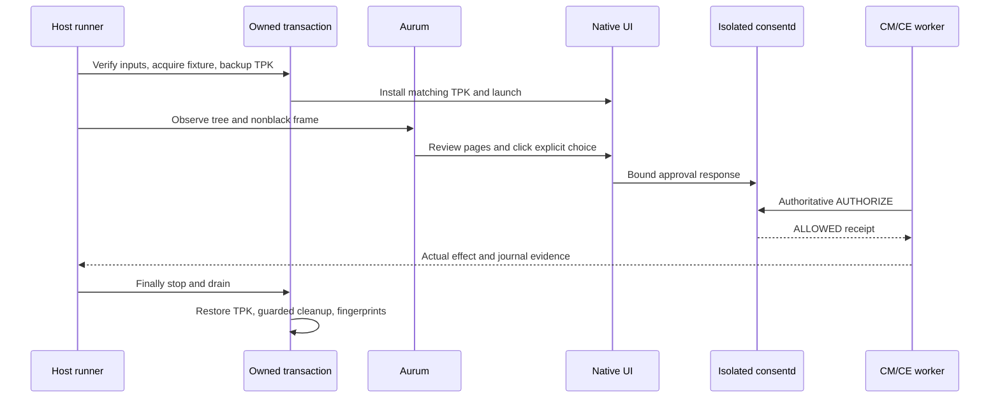

# Guide 17: Run the native approval UI smoke

[한국어](17-native-ui-smoke.ko.md)

Run one host command to test the actual .NET NUI popup through Aurum. The
runner reviews pages, submits screen choices and checks real worker effects
against an isolated consent daemon. It uses synthetic CM/CE providers; it
never submits approvals through a replacement API. Popup behavior and
approval-v2 are described in [Guide 08](08-consent-ui-poc.en.md).

## Prepare and run

Use matching x86_64 `consent-tests` and `consent-poc` RPMs from one Release28
GBS build. The PoC RPM contains the signed main TPK and `.build.json` sidecar.
CMake declares both as outputs, so a missing sidecar causes regeneration.
Keep the actual build log and exit status: packages alone do not prove tests
passed.

The host needs Python 3, Pillow, SDB, RPM, rpm2cpio, cpio, readelf and an
existing Aurum CLI. The emulator needs its original PoC package, trusted role
configuration and installed Aurum bootstrap app; bootstrap must not already be
running. Nothing is downloaded or auto-installed.
The existing cache must have this exact layout; hashes are recorded:

```text
AURUM_CACHE/
  venv/bin/python
  generated/aurum_pb2.py
  generated/aurum_pb2_grpc.py
```

Before any transaction, verify the selected target is in SDB root mode. Original
PoC and feature socket/service units must be inactive with MainPID 0. The four
owned UI09 units must be not-found and no previous fixture may remain. The
runner checks those conditions; it never adopts a retained fixture or stops
production to satisfy them. An existing bootstrap/forward is a conflict.

```sh
python3 scripts/consent-ui-smoke.py \
  --build-dir /path/to/matching/rpms \
  --serial SELECTED_EMULATOR \
  --aurum-cli /path/to/aurum-ui \
  --aurum-cache /path/to/existing/aurum-cache \
  --seed 20261001 \
  --output /path/to/new/evidence
```

Choose a new output directory. `--aurum-cache` defaults to `TIZEN_AURUM_CACHE`
or the normal user cache location. `--port` chooses an unused unprivileged
host port, or the runner selects one. An existing forward or bootstrap is a
conflict. Omit `--serial` only when exactly one connected target matches a live
local SDK emulator process and its same-PID SDB serial log. Display name or
x86_64 architecture alone does not identify an emulator.

## 2. Read results and restoration status

The following are illustrative excerpts of the files written by the source;
seeded lifecycle order and other metadata depend on the invocation.
`OUTPUT/result.json` contains the overall exit, selected order and subruns:

```json
{
  "exit": 0,
  "scenario": "all",
  "subruns": [
    {
      "scenario": "functional",
      "exit": 0
    },
    {
      "scenario": "restart",
      "exit": 0
    },
    {
      "scenario": "delete",
      "exit": 0
    },
    {
      "scenario": "generation",
      "exit": 0
    }
  ]
}
```
Each phase directory has `finally.json`:

```json
{
  "errors": [],
  "created_root": true,
  "install_attempted": true,
  "setup_succeeded": true
}
```
Require overall exit 0 and errors=[] for every phase. Acquisition flags show
what was attempted; they do not alone prove restoration. Read the retained
restoration fingerprints and command evidence. On failure, inspect the same
files before a new run. There is no cleanup CLI that blindly erases retained
state, and no need to stop or change production services to retry.

| Exit | Meaning |
| --- | --- |
| 0 | Every selected scenario and restoration succeeded |
| 1 | Scenario, collector or restoration failed |
| 2 | CLI argument error; output may not have been created |
| 3 | Missing/unavailable prerequisite; never a pass |

The printed CONSENT_UI_SMOKE_EXIT value must agree with process exit. Host SDB
status alone is not remote success. Historical `proof.json` is a separately
retained audit, not a file this command promises to generate.

<a id="results-and-troubleshooting"></a>

## Troubleshooting and host tests

Use each failure's bounded command log, tree/frame and restoration records.
Missing tools or unusable native controls mean unavailable, not a skipped pass.
A restoration failure retains uncertain payload for inspection; do not erase it
or retry installation over an undrained process.

Host safety tests are part of CTest. To run them directly from the host repository:

```sh
PYTHONDONTWRITEBYTECODE=1 python3 tests/ui_smoke_test.py
```


## What the scenarios prove

`--scenario all` runs the functional phase, followed by separate restart,
delete and generation phases in seeded order. A single phase can be selected
for diagnosis. Each phase starts fresh with a 600-second action window; each
native prompt still expires after 60 seconds.

The functional phase checks:

- Default unchecked ONCE approval causes one actual CE effect.
- Denial of a fresh request causes no extra effect.
- Separate ON and OFF probes review a fresh prompt completely, change the
  choice, verify review resets, then deny without another effect.
- Checked PERSISTENT approval causes an effect; a new operation with the same
  tuple obtains a fresh CE receipt without another approval popup.
- Revocation requires approval again; denial leaves the count unchanged.
- ONCE-only CM policy disables the checkbox and allows one approved CM effect.

Restart must retain the persistent grant. Stopped DB deletion must recover
with zero grants and require fresh UI approval before another effect. The
owned installation helper's generation change must reject the saved operation
as STALE and require fresh approval. That helper change is not a TPK reinstall.
SQLite inspection happens only after stopping and draining the daemon.

Success requires current coordinator PID and stable epoch, matching journal
results, a new operation/receipt, expected worker identity and exact effect
counts. A screenshot or successful click is insufficient. The immutable base
period in feature-state remains ONCE even when the chosen response is
PERSISTENT.



## Safety checks

### Native control observations

Every input uses a fresh accessibility tree and a nonblack screenshot. The
selected control must be unique, visible and enabled. Unknown trees, overlays
or captures block the run; there is no coordinate-only or QMP fallback.
Full review must include scope, purpose, recipient, access period and separate
data retention.

A Next input is sent once. For up to 15 seconds within the remaining action
window, observations may show only the old page or exact next page with the
same page count. Inputs are not repeated and pages are not skipped. Each Deny
is followed by a fresh tree/frame and matching denial callback. On failure,
bounded logs from verified own GUI PIDs are retained without replacing the
original error. Journal queries use `env SYSTEMD_COLORS=0 journalctl`; JSON
parsing stays strict and does not strip ANSI.

### Tree identity and overlays

The adapter registers fresh IDs using fixed-package `findElements` and dumps
those IDs. Empty-ID tree calls do not discover roots on the inspected server.
Each observation has an eight-second total deadline and at most three seconds
per RPC. Showing package candidates are limited to eight at depth one. IDs,
package, geometry, bytes, node count and depth are validated. A root is removed
only when proven to be a descendant of another returned tree.

Fast dumps can omit package. For each root, a package-scoped full refresh
`findElements(elementId, packageName, maxDepth=24)` must supply one exact-ID
record for every hierarchy node. Current records provide package, state,
geometry, text and control type; the dump provides structure. Raw dump fields
and pairing IDs stay separate. Conflicting packages, missing/duplicate/stale
IDs or a changed root block input. Failure diagnostics omit foreign body text.

Global showing metadata is limited to 32 depth-one records: ID, package,
showing, visible, active and geometry only. This includes direct children,
not an exact depth-zero inventory. Unknown foreign active visible records
block input. The only supported system chrome is verified preloaded,
read-only system `org.tizen.taskbar` 2.0.1. Checks include its main app,
historical manifest hash, named `tizenglobalapp` owner, protected no-follow
files and the `owner` process mapping the installed `TaskBar.dll` device/inode.
Files and process identity must stay unchanged. This proves installed identity,
not that the DLL was compiled from the inspected source. The observed root-owned
0775/root-group `/usr/apps` writer directory is accepted without changing it.

Aurum ACTIVE is AT-SPI state, not exclusive window-manager focus. A verified
taskbar may coexist with the UI. Before each input, the same tree/frame/metadata
must put the original control center inside an own active visible clipped
window and outside every foreign active rectangle, including the whole
taskbar. No alternate point or transparent input region is assumed. Invalid
geometry or identity returns unavailable with evidence.

### Artifact and process ownership

Before installation, the runner checks ELF architecture/dependencies, fixed
signed TPK package/app/executable, author certificate, DLL and native hashes.
It extracts finite test payloads rather than installing RPMs or replacing
global libraries. UI09 helpers retain real identity/bootstrap/storage checks.
Matching signed TPK bytes are used by the temporary main app and private unit
library binds. The original TPK is backed up and verified for each run.

An invocation nonce, immutable acquired-root identity, protected configuration
and unit digests prove ownership. Runtime directory identity is recorded at
mkdir, not adopted from a later observation. Existing foreign fixtures are
rejected before mutation. Cleanup uses directory FDs and a fixed inventory;
unknown or replaced files are retained and cause failure.

Every transient has an exact recorded command and unit contract. Finally,
the runner stops and drains owned processes and descendant cgroups, confirms
GUI shutdown, restores the TPK, then removes owned state/payload. Global
package/state/config/service fingerprints are checked. Allowed app inode/time
and runtime-parent timestamp changes are reported separately; protected
metadata must match. Restoration failure retains uncertain state for diagnosis.

Long fixed Python inspections use bounded lossless zlib/base64 transport only
when quoting exceeds the SDB service limit. Original argv, code hash/size and
wire service are retained; decoded size/hash must match. Oversized or non-Python
commands fail without upload fallback. Target Python needs those standard
library modules.

### Verified Release28 checkpoint

GBS r14 returned 0: 30 CTest cases passed and four root-only cases were skipped.
Managed checks and 58 host tests passed. The generation-only run, full run
and functional repeat returned 0. All six transactions restored original
packages/services, passed cleanup, and preserved protected global state.

| Output | Scenario / seed | Result |
| --- | --- | --- |
| `attempt-r14-01` | generation / 20261014 | 0 |
| `attempt-r14-02` | all / 20261015 | 0; all four phases passed |
| `attempt-r14-03` | functional / 20261016 | 0; focused repeat passed |

The full run used `gbs build -A x86_64 --profile tizen_10_1_emulator
--include-all`, matching `rpms-r14/` and the frozen `source-r14.json`.
Command logs, screenshots, worker receipts and restoration proofs are under
`/var/tmp/consent-artifacts/consent-ui-smoke-10/`. Each phase has
`scenario.json` and `finally.json`. The retained historical audit also has an
attempt-level `proof.json`; the runner itself writes `OUTPUT/result.json`.

The r12 OFF-probe denial failure remains unexplained. R13 failed on an
unobserved Next transition. Diagnostics and bounded transition waits improved
observation; they do not establish that a native input race was fixed. The
successful full run and repeat do not erase those failures. Unknown UI or
collector results still fail; the runner never substitutes PENDING, repeated
clicks or skipped review for success.

[Detailed snapshot and failure
history](../history/07-verification-history.en.md#guide-17-checkpoint)

---

[Related task](08-consent-ui-poc.en.md) · [Continue](07-verification.en.md) ·
[Reading paths](../README.md)
