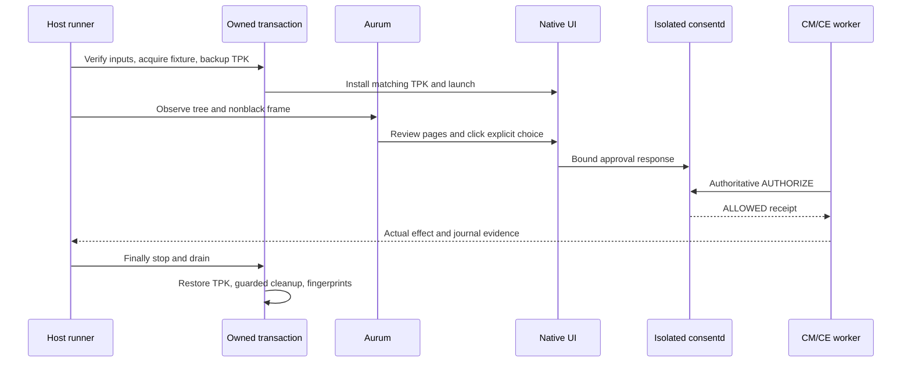

# 17. Repeatable native UI smoke

The repository-owned host runner drives the actual .NET NUI demonstration
through an existing Aurum CLI. It checks protected worker execution over the
isolated consent daemon. It does not replace product CM/CE adapters, install
automation tools, or approve through an API instead of the displayed UI.

The compact popup and approval-v2 policy are described in
[Guide 08](08-consent-ui-poc.en.md). Installer hooks remain each plugin's
responsibility under the authenticated publisher and package-generation
contracts.

## Inputs and command

Use matching `consent-tests` and `consent-poc` x86_64 RPMs from one Release 28
GBS build. The PoC RPM contains the signed main TPK and its `.build.json`
sidecar. CMake declares both outputs, so deleting the sidecar triggers the
builder again. Package presence alone does not prove that GBS tests passed;
retain the actual build command, log and exit status separately.

```sh
python3 scripts/consent-ui-smoke.py \
  --build-dir /path/to/matching/rpms \
  --serial SELECTED_EMULATOR \
  --aurum-cli /path/to/aurum-ui \
  --aurum-cache /path/to/existing/aurum-cache \
  --seed 20261001 \
  --output /path/to/new/evidence
```

`--serial` may be omitted only when one connected target correlates with a
live local SDK emulator process and its same-PID SDB serial log. SDB's display
name is arbitrary; x86_64 architecture alone does not classify an emulator.
`--port` selects an unused unprivileged host port; otherwise the runner chooses
one. An existing forward or bootstrap process is a conflict.

Host prerequisites are Python 3, Pillow, SDB, RPM, rpm2cpio, cpio, readelf and
an already available Aurum CLI. No dependency is installed automatically. The
selected emulator must already provide the original PoC package, trusted role
configuration and Aurum bootstrap. The runner validates required ELF
architecture/dependencies and fixed signed TPK package/application/executable,
author-certificate identity, DLL and native-library hashes before installation.

The existing Aurum cache must provide `venv/bin/python` and generated
`aurum_pb2.py`/`aurum_pb2_grpc.py`; their hashes are recorded. `--aurum-cache`
defaults to `TIZEN_AURUM_CACHE` or the user cache convention. Nothing is fetched.
The repository adapter first registers fresh native IDs with `findElements`
for the fixed UI package, then dumps each registered ID. A tree request with
an empty ID does not discover roots on the inspected Aurum server.

Each observation uses an eight-second aggregate RPC deadline and at most three
seconds per RPC. Own-package showing candidates at depth at most one are
limited to eight; package, IDs, geometry, bytes, node count and depth are
validated. Only roots proven to occur as descendants in another returned tree
are eliminated; IDs are never reused across observations/relaunches.
The inspected fast dump can omit package even for the same registered root:
actual diagnostics found an own-package candidate and an empty-package dump
with identical ID, while raw showing/visible/enabled were true. Empty package
is not accepted as ownership. For each root, a separate package-scoped
full-refresh `findElements(elementId, packageName, maxDepth=24)` must provide a
unique exact-ID record for every hierarchy node. Effective package, state,
geometry, text and control metadata come from those current native records;
structure comes from the dump. Raw dump fields and pairing IDs are retained
separately. Conflicting nonempty packages, missing/duplicate/stale IDs or a
changed root fail closed. Failure diagnostics contain only bounded IDs,
package/state/geometry and call metadata, without foreign body text.

Global showing metadata at depth at most one is limited to 32 records. Only
ID/package/showing/visible/active/geometry are retained, without foreign text
or descendant trees. This includes window roots and direct children, not an
exact depth-zero inventory. Unknown foreign active visible records block input. The sole supported system
chrome contract is preloaded, readonly, system `org.tizen.taskbar` 2.0.1 with its
verified main app, historical manifest hash, named `tizenglobalapp` file owner,
no-follow protected files and the `owner` process mapping the exact installed
`TaskBar.dll` device/inode. File and process identities must remain unchanged
within the run. This verifies installed platform identity; it does not claim
compiled DLL equality with source. `/usr/apps` may be the observed root-owned
0775/root-group platform writer directory; no permissions are modified.

Aurum ACTIVE comes from AT-SPI state, not exclusive window-manager focus.
Verified taskbar metadata may therefore coexist with the UI. Before every input,
the same fresh tree/frame/metadata selects the unique control's original center.
That point must be inside an own active visible screen-clipped window and
outside every foreign active rectangle, including the full taskbar rectangle.
No point search, hardcoded coordinates or transparent input-region assumption
is used. Malformed, unbounded or unsupported geometry/proof returns unavailable
with evidence; unknown overlays remain blocked.

Long fixed Python inspection bodies use bounded lossless zlib/base64 transport
when shell quoting would exceed the observed SDB service-name limit. Original
argv, code SHA/byte count and actual wire service are retained. Decoded code is
size/hash checked; oversized or non-Python services are rejected without a path
or upload fallback. Target Python must provide these standard-library modules.

## Actual observations and scenarios

The default `--scenario all` runs a functional phase followed by seeded,
independent `restart`, `delete` and `generation` phases. A single phase may be
selected for diagnosis. Each phase uses a fresh isolated fixture and a bounded
600-second action window; the native prompt retains its 60-second deadline.

The functional phase verifies:

- Default unchecked ONCE approval produces one actual CE action.
- A new denial creates no additional protected effect.
- ON and OFF reset probes use distinct fresh prompts. Each completes one review,
  toggles the choice, verifies first-page reset and disabled approval, then
  actually denies with the unchanged effect counter. A separate fresh checked
  prompt completes all disclosure pages before positive approval.
- Checked PERSISTENT approval produces an action; a new operation with the same
  tuple produces a fresh CE receipt without another consent popup.
- Actual revocation requires approval again; denial leaves the counter intact.
- The ONCE-only CM policy disables the checkbox and permits one approved action.

Lifecycle phases verify normal-restart persistent coverage, stopped DB deletion
with zero recovered grants and fresh UI approval, and owned installation-helper
generation retirement with old-operation STALE and fresh UI approval. The helper
generation change is **not a TPK reinstall**. Read-only SQLite inspection occurs
only after the daemon is stopped and drained.

Input uses unique visible native controls with verified geometry and enabled
state. An actual nonblack screenshot accompanies each tree observation. Unknown
or unsupported accessibility trees, overlays and capture failures block the run;
there is no coordinate-only or QMP fallback. Review text must disclose the exact
scope, purpose, recipient, access period and separate data-retention period.

After one Next input, fresh observations wait at most 15 seconds within the
remaining outer window. Only the previous or exact next page with unchanged
page count is accepted; there is no input redelivery or page skipping. Every
Deny input is followed by a fresh tree/frame and the strict matching denial
callback. On failure, bounded logs from verified own GUI PIDs are retained;
diagnostic errors never replace the original failure.

Machine-parsed cursor and event queries explicitly run
`env SYSTEMD_COLORS=0 journalctl`. Raw output is retained and JSON remains strict;
ANSI is not stripped or accepted.

Success also requires journal events from the current owned coordinator PID and
stable epoch, a new operation and receipt, the expected worker identity and exact
counter progression. Screenshots or successful clicks alone cannot pass. The
feature-state base period remains ONCE when the selected response is PERSISTENT.



## Ownership and restoration

The runner extracts finite verified payload files rather than installing RPMs
or replacing global libraries. Fixed UI09 test helpers retain real production
identity/bootstrap/storage checks. New signed TPK native bytes are staged for
private unit namespaces and bundled in the temporarily installed main TPK.
The original installed TPK is backed up and verified afresh.

An invocation nonce, immutable acquired-root identity, protected configuration
and unit digests identify owned setup. Runtime-directory identities come from
mkdir-time records rather than later observations. Foreign/pre-existing fixtures
are rejected before mutation. Cleanup checks fixed inventories through directory
FDs and retains unknown or replaced entries instead of deleting them.

Every dispatched transient has a recorded exact command and unit contract.
Finally, the runner stops and drains owned processes and descendant cgroups,
confirms the GUI stopped, restores the original TPK, removes owned fixture state
and payload, and verifies original global package/state/config/service
fingerprints. Expected app inode/timestamp changes and runtime-parent timestamps
are recorded separately; protected metadata must match. Restoration failure is
an error and retains uncertain state for diagnosis.

## Evidence and current verification status

The output directory must not already exist. It contains bounded command output
and failure categories, provenance and backup records, actual trees/screenshots,
worker journal evidence, per-phase results and finally/restoration records.
Exit 0 requires every selected phase and cleanup to pass. Exit 3 means an
explicit unavailable prerequisite; failures, including restoration failures,
return 1. Argument errors return 2. No unavailable result is reported as PASS.

Host safety tests run through CTest and can also be executed directly:

```sh
PYTHONDONTWRITEBYTECODE=1 python3 tests/ui_smoke_test.py
```

### Executed r14 checkpoint (2026-10-01)

Evidence is retained under
`/var/tmp/consent-artifacts/consent-ui-smoke-10`. The exact development build was:

```sh
gbs build -A x86_64 --profile tizen_10_1_emulator --include-all
```

`gbs-r14.log` and `gbs-r14.exit` record exit 0 / Done, CTest 34 cases:
30 PASS and four root-only SKIP. Managed binding, review, period-choice and
worker lifetime checks also passed. `host-tests-r14.log` records 58 host tests.
`rpms-r14/` retains 11 RPMs including source/debug packages;
`build-audit-r14.json` records their SHA256 values and exact equality of all 21
frozen files in current source and `source-export-r14.tar.gz`.

The selected target was `emulator-26101`, x86_64, correlated with the running SDK
emulator and its SDB serial log. These are the actual host inputs; they are not
hardcoded runner defaults:

```sh
BASE=/var/tmp/consent-artifacts/consent-ui-smoke-10
AURUM=/home/hjhun/.agents/disabled-skills/tizen-aurum-ui-automation/scripts/aurum-ui
CACHE=/home/hjhun/.cache/tizen-aurum-ui-automation
python3 scripts/consent-ui-smoke.py \
  --build-dir "$BASE/rpms-r14" --serial emulator-26101 \
  --aurum-cli "$AURUM" --aurum-cache "$CACHE" --port 55059 \
  --scenario all --seed 20261015 --output "$BASE/attempt-r14-02"
```

| Output | Scenario / seed | Actual result |
| --- | --- | --- |
| `attempt-r14-01` | generation / 20261014 | exit 0 |
| `attempt-r14-02` | all / 20261015 | exit 0; all four subruns PASS |
| `attempt-r14-03` | functional / 20261016 | exit 0; focused repeat PASS |

The generation-only and repeat commands use the same inputs as above, with
only `--scenario`, `--seed` and `--output` changed as listed. Each command's
adjacent `.log` and `.exit`, attempt-level `result.json`/`proof.json`, and
per-phase `scenario.json`/`finally.json` retain the actual outcomes.

Both functional runs proved actual CE count 1 (default ONCE), no-effect denials
including separate ON/OFF reset probes, checked approval count 2, fresh-operation
persistent reuse count 3 without another consent popup, revoked denial staying
at 3, and ONCE-only CM count 4 with a disabled checkbox. Actual UI and both worker
mapped device/inode/SHA evidence is retained in each functional phase. The
checkbox is the installed NUI theme's orange control, not a Samsung theme claim.

The all-run restart readback retained one PERSISTENT grant and a new actual CE
operation succeeded without another approval. DB deletion readback showed
integrity `ok`, schema 2, two definitions, zero grants and `cleanup_unknown=1`;
the saved operation required consent before a fresh actual UI approval/effect.
Owned-helper generation change similarly required fresh consent, rejected the
saved old operation with exact STALE -116, and then produced a fresh UI-approved
CE operation/receipt. Gate-only receipts and worker execution receipts are
recorded separately. Old processes were stopped/drained and new authenticated
handles created; this is not same-handle recovery or a TPK reinstall.

All six successful transactions (generation-only, four all-run phases and the
functional repeat) recorded empty finally errors, owned cleanup exit 0, and exact
before/after equality for original `package_files`, `protected_trees` and `units`.
Production `consentd.service` remained active with PID 31569; both original PoC
services remained inactive with PID 0. No global RPM/library/policy installation
occurred. Original TPK restoration and allowed app inode/time changes were
verified separately; runtime-parent protected identities/modes/labels matched
while expected timestamps were recorded. Protected inventory/FD deletion removed
the owned payload after state, authority, endpoints and units were cleaned.

The executed package matches frozen `source-r14.json`, not later evidence prose.
The published source retains 16 byte-identical files. Three Python files have
only reviewed publication formatting: one trailing space removed in `ui.py`,
one comprehension wrapped in `aurum_tree.py`, and three lines wrapped in
`emulator-ui-native.py`. `publication-format-r14.json` records executed/current
SHA256, identical ASTs and exact reversal to executed bytes for all three.
This paired Guide 17 contains the two later evidence-prose updates; no rebuild
or device replay was performed for these publication edits. Earlier UI09 manual
evidence remains separate from these repository-runner results.

### Retained failures and limits

All earlier command output and restoration proofs remain alongside the final
checkpoint. They are not retroactively marked PASS:

| Attempt | Retained result / correction |
| --- | --- |
| r1-01 | missing generated-audit mode and read-mutated atime guard; exact owned FD recovery cleanup 0 retained |
| r3-01 | known Aurum bootstrap diagnostic prefix rejected before JSON |
| r4-01 / r5-01 | empty startup trees; actual settings pixels retained, then source-backed registered-root route established |
| r7-01 | ordinary active taskbar blocked; verified platform identity and control-center conflict checks added |
| r8-01 / r8-02 | omitted dump package rejected; bounded no-input diagnostic proved exact-ID own-package omission |
| r9-01 | oracle omitted the actual retention word “maximum”; no Allow sent |
| r10-01 | colored journal JSON rejected after the first actual CE effect |
| r11-01 | owned host interruption for timing review; neither runtime failure nor PASS |
| r12-01 | OFF-probe terminal DENIED not observed; cause remains unknown |
| r13-01 | final generation Next did not advance in the first observation; full all-run failed |

Post-deny diagnostics and bounded one-input page waits improve evidence and
semantic observation; they do not prove a native refresh/input race was fixed.
The matching full run and focused functional repeat passed, but the unexplained
r12 failure remains an honest reproducibility limit. Unknown UI/collector errors
still fail rather than accepting PENDING, repeating clicks or skipping review.

This is an isolated developer mock CM/CE execution demonstration over actual
consent IPC and native UI. Product CM/CE adapters, profile provisioning/privilege,
trusted deployment UI/argo roles and physical holder cleanup remain external
integration work. Installer hooks belong to each plugin under existing
publisher/generation contracts.
