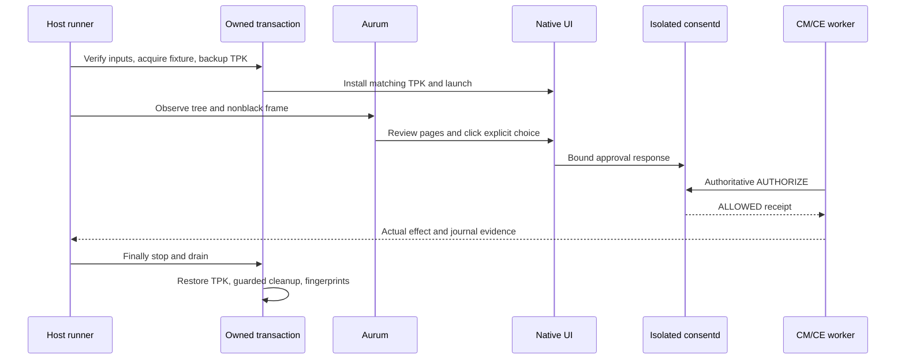

# 17. 반복 가능한 네이티브 UI smoke

저장소의 호스트 runner가 기존 Aurum CLI로 실제 .NET NUI 예제를 조작하고,
격리된 consent daemon을 통한 보호 작업 실행을 검사합니다. 제품 CM/CE adapter를
대체하거나 자동화 도구를 설치하지 않으며, 화면 대신 API로 승인하지 않습니다.

작은 popup과 approval-v2 정책은 [가이드 08](08-consent-ui-poc.ko.md)에 설명되어
있습니다. Installer hook은 각 plugin이 인증된 publisher와 package generation
계약에 따라 연동합니다.

## 입력과 명령

동일한 Release 28 GBS 빌드의 x86_64 `consent-tests`, `consent-poc` RPM을 사용합니다.
PoC RPM에는 서명된 main TPK와 `.build.json`이 포함됩니다. CMake는 둘을 실제
출력으로 선언하므로 sidecar를 삭제하면 builder를 다시 실행합니다. RPM 존재만으로
GBS 테스트 통과를 판단하지 않으며 실제 빌드 명령·로그·종료 상태를 별도로 보존합니다.

```sh
python3 scripts/consent-ui-smoke.py \
  --build-dir /path/to/matching/rpms \
  --serial SELECTED_EMULATOR \
  --aurum-cli /path/to/aurum-ui \
  --aurum-cache /path/to/existing/aurum-cache \
  --seed 20261001 \
  --output /path/to/new/evidence
```

`--serial`은 연결 장치 하나가 실행 중인 로컬 SDK emulator 프로세스 및 동일 PID의
SDB serial 로그와 일치할 때만 생략할 수 있습니다. SDB 표시 이름은 임의 문자열이며
x86_64만으로 emulator라고 판단하지 않습니다. `--port`는 사용하지 않는 비특권 호스트
port를 지정하며 생략 시 runner가 선택합니다. 기존 forward나 bootstrap은 충돌입니다.

호스트에는 Python 3, Pillow, SDB, RPM, rpm2cpio, cpio, readelf, 기존 Aurum CLI가
필요합니다. 의존성을 자동 설치하지 않습니다. emulator에는 원래 PoC package,
신뢰된 role 설정, Aurum bootstrap이 있어야 합니다. 설치 전에 필수 ELF architecture와
의존성, 서명된 TPK의 고정 package/app/executable, author certificate identity,
DLL 및 native library hash를 확인합니다.

기존 Aurum cache에 `venv/bin/python`, 생성된 `aurum_pb2.py`와
`aurum_pb2_grpc.py`가 있어야 하며 hash를 기록합니다. `--aurum-cache` 기본값은
`TIZEN_AURUM_CACHE` 또는 사용자 cache 경로 규약입니다. 다운로드하지 않습니다.
repository adapter는 고정 UI package의 `findElements`로 실제 ID를 새로 등록한
뒤 등록된 ID의 tree를 수집합니다. 조사한 Aurum 서버에서는 빈 ID로 tree를
요청하면 root를 검색하지 않습니다.

관측마다 전체 RPC 기한 8초와 개별 RPC 최대 3초를 적용합니다. depth 최대 1의
own-package showing 후보는 8개로 제한하고 package/ID/geometry/bytes/node 수와
depth를 검증합니다. 다른 반환 tree의 실제 descendant로 입증된 root만 제거하며
관측·재실행 사이에 ID를 재사용하지 않습니다.
조사한 fast dump는 같은 등록 root에서도 package를 누락할 수 있습니다. 실제
진단에서 candidate의 own-package와 dump의 빈 package가 동일 ID로 확인됐으며
raw showing/visible/enabled는 true였습니다. 빈 package를 소유권으로 인정하지
않습니다. root마다 별도의 package-scoped full-refresh
`findElements(elementId, packageName, maxDepth=24)`가 모든 hierarchy node에 대해
유일한 exact-ID record를 제공해야 합니다. 실제 package/state/geometry/text/control
값은 현재 native record에서, 구조는 dump에서 가져오고 raw dump 필드와 pairing ID를
별도로 보존합니다. nonempty package 충돌, 누락·중복·stale ID 또는 root 변경은
차단합니다. 실패 진단은 제한된 ID/package/state/geometry/call metadata만 보존하며
외부 body text를 기록하지 않습니다.

전역 showing metadata는 depth 최대 1, 32개로 제한하며 ID/package/showing/
visible/active/geometry만 보존합니다. 외부 text나 descendant tree는 수집하지
않습니다. window root와 직접 child를 포함하므로 정확한 depth 0 목록이라고
주장하지 않습니다. 알 수 없는 외부 active+visible record는 입력을 차단합니다. 지원하는 system chrome은
preload/readonly/system인 `org.tizen.taskbar` 2.0.1 하나뿐입니다. 실제 main app,
과거 manifest hash, named `tizenglobalapp` 파일 owner, 보호된 no-follow 파일과
정확한 설치 `TaskBar.dll` dev/inode를 mapping한 `owner` process를 확인합니다.
실행 중 파일·process 신원이 바뀌면 차단합니다. 설치된 플랫폼 신원을 검증하며
DLL이 해당 source의 compiled bytes와 같다고 주장하지 않습니다. `/usr/apps`는
관측된 root 소유 0775/root-group 플랫폼 writer directory일 수 있으며 권한을
변경하지 않습니다.

Aurum ACTIVE는 독점 WM focus가 아닌 AT-SPI state이므로 검증된 taskbar와 UI가
동시에 active일 수 있습니다. 매 입력 전에 동일한 최신 tree/frame/metadata로
선택한 유일한 control의 원래 중심점을 사용합니다. 해당 점은 own active+visible
window의 screen-clipped 영역 안이며 전체 taskbar rectangle을 포함한 모든 외부
active rectangle 밖이어야 합니다. 다른 점 검색·고정 좌표·투명 input-region
가정을 사용하지 않습니다. malformed/unbounded/unsupported geometry나 신원은
증거를 남기고 unavailable로 종료하며 알 수 없는 overlay는 계속 차단합니다.

긴 고정 Python 검사 코드는 shell 인용 후 SDB service-name 제한을 넘을 때
제한된 무손실 zlib/base64 전송을 사용합니다. 원래 argv, code SHA/bytes, 실제
wire service를 보존하고 decode 크기/hash를 검사합니다. 너무 큰 명령이나 다른
interpreter는 path/upload fallback 없이 거부합니다. target Python에 해당
표준 library module이 있어야 합니다.

## 실제 관측과 시나리오

기본 `--scenario all`은 기능 시나리오 다음에 seed로 순서를 정한 독립 `restart`,
`delete`, `generation` 시나리오를 실행합니다. 진단 시 하나만 선택할 수 있습니다.
각 시나리오는 새 격리 fixture와 600초 작업 제한을 사용하며 native prompt의 60초
기한은 유지합니다.

기능 시나리오는 다음을 검사합니다.

- 기본 unchecked ONCE 승인 후 실제 CE 작업 한 번.
- 새 요청 거절 후 추가 보호 효과 없음.
- ON/OFF reset 검사는 각각 새 prompt에서 한 번의 전체 검토 후 choice를 바꿉니다.
  첫 페이지 복귀와 승인 비활성화를 확인한 뒤 실제 거절과 효과 counter 유지를
  검증합니다. 별도 fresh checked prompt의 모든 disclosure를 검토한 후 승인합니다.
- checked PERSISTENT 승인 후 작업, 동일 tuple의 새 operation은 새 CE receipt로
  실행되고 추가 consent popup 없음.
- 실제 철회 후 다시 승인 필요, 거절 시 counter 유지.
- ONCE-only CM 정책의 checkbox 비활성화와 승인된 CM 작업 한 번.

수명주기 시나리오는 정상 restart의 persistent 유지, daemon 정지 중 DB 삭제 후
복구 grant 0과 새 UI 승인, 실제 owned installation helper의 generation 변경 후
기존 operation STALE 및 새 UI 승인을 검증합니다. helper generation 변경은
**TPK 재설치가 아닙니다**. 읽기 전용 SQLite 검사는 daemon 정지·drain 후에만 합니다.

입력은 실제 visible native control의 유일한 identity, geometry, enabled 상태를
사용합니다. 각 tree 관측에는 실제 nonblack screenshot이 동반됩니다. 알 수 없거나
지원되지 않는 accessibility tree, overlay, capture 실패는 진행을 차단합니다.
좌표만 사용하는 방식이나 QMP fallback은 없습니다. 검토 내용에는 정확한 범위·목적·
수신자·접근 기간과 별도의 데이터 보관 기간이 모두 있어야 합니다.

Next 입력은 한 번만 전송합니다. 남은 outer window 안에서 최대 15초 동안 fresh
관측으로 이전 페이지 또는 정확한 다음 페이지와 동일한 page count만 허용합니다.
입력 재전송이나 page skip은 없습니다. 각 Deny 직후 fresh tree/frame와 matching
거절 callback을 검사합니다. 실패 시 검증된 own GUI PID의 제한된 로그만 보존하며
진단 오류가 원래 실패를 덮지 않습니다.

기계 판독 cursor/event는 `env SYSTEMD_COLORS=0 journalctl`로 조회합니다. raw output을
보존하고 strict JSON을 유지하며 ANSI를 제거하거나 허용하지 않습니다.

성공에는 현재 owned coordinator PID와 안정된 epoch의 journal event, 새 operation과
receipt, 예상 worker identity 및 정확한 counter 증가도 필요합니다. screenshot이나
click 성공만으로 통과하지 않습니다. 선택한 응답이 PERSISTENT여도 feature-state의
불변 base period는 ONCE입니다.



## 소유권과 복원

runner는 검증한 유한 payload를 추출하며 RPM을 설치하거나 global library를 바꾸지
않습니다. 고정 UI09 helper는 실제 제품 identity/bootstrap/storage 검사를 유지합니다.
새 서명 TPK native bytes를 private unit namespace와 임시 설치 main TPK에서 사용하며,
현재 설치된 원래 TPK를 매번 새로 backup하고 검증합니다.

호출별 nonce, 불변 acquired-root identity, 보호된 설정과 unit digest가 owned setup을
증명합니다. runtime directory identity는 나중의 관측이 아닌 mkdir 시점 기록에서
가져옵니다. 기존/외부 fixture는 변경 전에 거부합니다. 정리는 directory FD와 고정
inventory를 검사하며, 알 수 없거나 교체된 파일을 삭제하지 않고 남겨 실패합니다.

각 transient의 정확한 명령과 unit 계약을 기록합니다. finally에서 owned process와
하위 cgroup을 stop/drain하고 GUI 정지를 확인한 후 원래 TPK를 복원하고 owned
state/payload를 정리합니다. 원래 global package/state/config/service fingerprint도
검사합니다. 예상 app inode/time 변경과 runtime parent timestamp는 별도로 기록하며
보호된 metadata는 같아야 합니다. 복원 실패는 오류이며 불확실한 상태를 진단용으로
보존합니다.

## 증거와 현재 검증 상태

출력 directory는 기존에 없어야 합니다. 제한된 command output과 failure category,
provenance/backup, 실제 tree/screenshot, worker journal, 시나리오 결과, finally/복원
기록을 보존합니다. 선택한 모든 시나리오와 정리가 통과해야 exit 0입니다. exit 3은
명시적 prerequisite unavailable, 복원 실패를 포함한 일반 실패는 1, 인수 오류는 2입니다.
unavailable을 PASS로 표시하지 않습니다.

호스트 안전 테스트는 CTest 또는 다음 명령으로 실행합니다.

```sh
PYTHONDONTWRITEBYTECODE=1 python3 tests/ui_smoke_test.py
```

### 실행된 r14 checkpoint (2026-10-01)

증거는 `/var/tmp/consent-artifacts/consent-ui-smoke-10`에 보존합니다. 실제 개발 빌드는
다음 명령입니다.

```sh
gbs build -A x86_64 --profile tizen_10_1_emulator --include-all
```

`gbs-r14.log`와 `gbs-r14.exit`는 exit 0 / Done, CTest 34개 중 30 PASS와
root-only 4 SKIP를 기록합니다. managed binding/review/period-choice/worker lifetime
검사도 통과했습니다. `host-tests-r14.log`는 호스트 검사 58개 PASS를 기록합니다.
`rpms-r14/`에는 source/debug를 포함한 RPM 11개를 보존하며,
`build-audit-r14.json`에 RPM SHA256과 frozen 파일 21개의 current source /
`source-export-r14.tar.gz` 정확한 일치를 기록합니다.

선택한 target은 실제 실행 중인 SDK emulator와 같은 PID의 SDB serial log로 확인한
`emulator-26101`, x86_64입니다. 다음은 실제 호스트 입력이며 runner에 하드코딩된
기본값이 아닙니다.

```sh
BASE=/var/tmp/consent-artifacts/consent-ui-smoke-10
AURUM=/home/hjhun/.agents/disabled-skills/tizen-aurum-ui-automation/scripts/aurum-ui
CACHE=/home/hjhun/.cache/tizen-aurum-ui-automation
python3 scripts/consent-ui-smoke.py \
  --build-dir "$BASE/rpms-r14" --serial emulator-26101 \
  --aurum-cli "$AURUM" --aurum-cache "$CACHE" --port 55059 \
  --scenario all --seed 20261015 --output "$BASE/attempt-r14-02"
```

| Output | 시나리오 / seed | 실제 결과 |
| --- | --- | --- |
| `attempt-r14-01` | generation / 20261014 | exit 0 |
| `attempt-r14-02` | all / 20261015 | exit 0, 4개 subrun 모두 PASS |
| `attempt-r14-03` | functional / 20261016 | exit 0, focused repeat PASS |

generation-only와 repeat 명령은 위와 동일한 입력에서 표에 따라 `--scenario`,
`--seed`, `--output`만 변경합니다. 각 명령 옆의 `.log`/`.exit`,
attempt-level `result.json`/`proof.json`과 phase별 `scenario.json`/`finally.json`에
실제 결과를 보존합니다.

두 functional 실행 모두 기본 ONCE의 실제 CE count 1, ON/OFF 각각의 reset probe를
포함한 무효과 거절, checked 승인 count 2, 추가 consent popup 없는 새 operation의
persistent 재사용 count 3, 철회 후 거절 count 3 유지, checkbox 비활성화된 ONCE-only
CM count 4를 증명했습니다. 각 functional phase에 실제 UI와 CM/CE worker의 mapped
device/inode/SHA 증거를 보존합니다. checkbox는 설치된 NUI theme의 orange control이며
Samsung runtime theme 적용을 주장하지 않습니다.

all-run restart readback은 PERSISTENT grant 1개를 유지했고 추가 승인 없이 새 실제
CE operation이 성공했습니다. DB 삭제 readback은 integrity `ok`, schema 2,
definition 2개, grant 0, `cleanup_unknown=1`이며, saved operation은 consent required로
차단된 뒤 fresh 실제 UI 승인과 실행이 이뤄졌습니다. owned helper generation 변경도
fresh consent를 요구하고 saved old operation을 정확한 STALE -116으로 거부한 후
새 UI 승인 CE operation/receipt를 생성했습니다. gate-only receipt와 worker 실행
receipt는 별도로 기록합니다. old process는 stop/drain하고 새 authenticated handle을
만들었으므로 same-handle recovery 또는 TPK 재설치 증거가 아닙니다.

성공한 transaction 6개(generation-only, all-run 4 phase, functional repeat)는 모두
finally errors가 비어 있고 owned cleanup exit 0이며 원래 `package_files`,
`protected_trees`, `units`의 before/after가 정확히 같습니다. production
`consentd.service`는 PID 31569 active, 원래 PoC service 2개는 PID 0 inactive를
유지했습니다. global RPM/library/policy를 설치하지 않았습니다. 원래 TPK 복원과
허용된 app inode/time 변경은 별도로 검증했고 runtime parent의 보호된 identity,
mode/label은 유지하며 예상 timestamp 변경을 기록했습니다. state/authority/endpoint와
unit 정리 후 protected inventory/FD 삭제로 owned payload도 제거했습니다.

실행 package는 이후 evidence prose가 아니라 frozen `source-r14.json`과 일치합니다.
출판 소스는 16개 파일이 byte-identical입니다. Python 3개 파일에는 승인된 출판
formatting만 적용했습니다. `ui.py`의 trailing space 1개 제거, `aurum_tree.py`의
comprehension 1개 wrap, `emulator-ui-native.py`의 3줄 wrap입니다.
`publication-format-r14.json`에 실행/current SHA256, 동일한 AST와 실행 bytes를
정확히 복원하는 reversal proof를 기록합니다. 이 Guide 17 한·영 pair가 나머지
2개 later evidence-prose 변경입니다. 출판 수정 때문에 빌드나 기기 실행을
반복하지 않았습니다. 이전 UI09 수동 검증은 repository runner 결과와 별도로
유지합니다.

### 보존된 실패와 한계

모든 이전 command output과 복원 증거는 최종 checkpoint 옆에 보존하며 나중에 PASS로
바꾸지 않습니다.

| Attempt | 보존된 결과 / 수정 |
| --- | --- |
| r1-01 | generated audit mode 누락과 읽기로 바뀐 atime 검사, 정확한 owned FD 복구 cleanup 0 보존 |
| r3-01 | 알려진 Aurum bootstrap 진단 prefix 때문에 JSON 처리 실패 |
| r4-01 / r5-01 | 빈 startup tree, 실제 settings pixels 보존 후 source-backed registered-root 경로 확인 |
| r7-01 | 정상 active taskbar 차단, 검증된 platform identity/control-center 충돌 검사 추가 |
| r8-01 / r8-02 | dump package 누락 거부, 무입력 제한 진단으로 exact-ID own package omission 증명 |
| r9-01 | 실제 보관 문구의 “최대”가 검사에서 누락, Allow 미전송 |
| r10-01 | 첫 실제 CE 실행 후 colored journal JSON 거부 |
| r11-01 | timing 검토를 위한 owned host 중단, runtime 실패나 PASS 아님 |
| r12-01 | OFF probe의 terminal DENIED 미관측, 원인 미확인 |
| r13-01 | 마지막 generation에서 첫 관측까지 Next page 미전환, 전체 all-run 실패 |

post-Deny 진단과 bounded single-input page wait는 증거와 semantic 관측을 보완한
것이며 native refresh/input race 수정의 증명이 아닙니다. matching full run과 focused
functional repeat는 통과했지만 r12 미확인 실패는 재현성 한계로 남깁니다. 알 수 없는
UI/collector 오류는 PENDING 수용, 재클릭, 검토 skip 대신 계속 실패 처리합니다.

실제 consent IPC/native UI 위에서 동작하는 isolated 개발자용 mock CM/CE 예제입니다.
제품 CM/CE adapter, profile provisioning/privilege, 신뢰된 deployment UI/argo role,
실제 holder의 물리적 정리는 외부 통합 작업입니다. Installer hook은 기존 publisher/
generation 계약 아래 각 plugin의 책임입니다.
