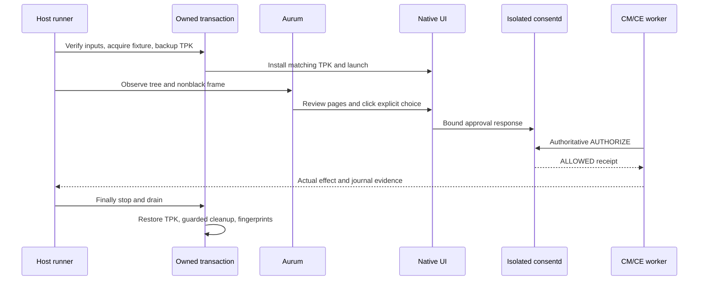

# 가이드 17: 네이티브 승인 UI 검증 실행

[English](17-native-ui-smoke.en.md)

호스트 명령 하나로 Aurum을 통해 실제 .NET NUI 팝업을 검사합니다. 실행 도구가
안내 페이지를 검토하고 화면에서 선택한 뒤 격리 consentd에서 실제 작업 결과를
확인합니다. CM/CE 제공자는 합성 예제이며 화면 대신 API로 승인을 넣지 않습니다.
팝업과 approval-v2 동작은 [가이드 08](08-consent-ui-poc.ko.md)에 있습니다.

## 준비와 실행

같은 Release28 GBS 빌드의 x86_64 `consent-tests`와 `consent-poc` RPM을 쓰세요.
PoC RPM에는 서명한 main TPK와 `.build.json`이 있습니다. CMake가 둘을 출력으로
선언하므로 sidecar가 없으면 다시 생성합니다. 패키지가 있다고 테스트 통과를
판단하지 말고 실제 빌드 로그와 종료 코드를 보관하세요.

호스트에는 Python 3, Pillow, SDB, RPM, rpm2cpio, cpio, readelf와 기존 Aurum CLI가
필요합니다. 에뮬레이터에는 원래 PoC 패키지, 신뢰된 역할 설정과 설치된 Aurum bootstrap 앱이
필요합니다. Bootstrap이 이미 실행 중이면 안 됩니다. 다운로드하거나 도구를 자동 설치하지 않습니다. 기존 cache는 아래의 정확한
구조여야 하며 hash를 기록합니다.

```text
AURUM_CACHE/
  venv/bin/python
  generated/aurum_pb2.py
  generated/aurum_pb2_grpc.py
```

트랜잭션 전에 선택한 타깃이 SDB root 모드인지 확인하세요. 원래 PoC와 feature의
socket/service는 비활성이고 MainPID가 0이어야 합니다. 소유할 UI09 unit 네 개는
not-found이며 이전 환경이 남아 있으면 안 됩니다. 실행 도구가 이를 검사하며
남은 환경을 인수하거나 운영 서비스를 중지하지 않습니다. 기존 bootstrap이나
forward도 충돌입니다.

```sh
python3 scripts/consent-ui-smoke.py \
  --build-dir /path/to/matching/rpms \
  --serial SELECTED_EMULATOR \
  --aurum-cli /path/to/aurum-ui \
  --aurum-cache /path/to/existing/aurum-cache \
  --seed 20261001 \
  --output /path/to/new/evidence
```

새 출력 디렉터리를 지정하세요. `--aurum-cache` 기본값은 `TIZEN_AURUM_CACHE`나
일반 사용자 cache 경로입니다. `--port`로 사용하지 않는 비특권 호스트 port를
지정하거나 실행 도구에 맡길 수 있습니다. 기존 forward나 bootstrap은 충돌입니다.
연결 장치 하나가 실행 중인 로컬 SDK 에뮬레이터 프로세스와 동일 PID의 SDB 로그에
일치할 때만 `--serial`을 생략합니다. 표시 이름이나 x86_64만으로 판단하지 않습니다.

## 2. 결과와 복원 상태 확인하기

아래는 소스가 생성하는 파일의 발췌 예입니다. 실행 결과를 새로 만든 것이 아니며
seed로 정한 순서와 나머지 메타데이터는 실행마다 다릅니다.
`OUTPUT/result.json`에는 전체 종료 코드, 실행 순서와 하위 실행이 있습니다.

```json
{
  "exit": 0,
  "scenario": "all",
  "subruns": [
    {
      "scenario": "functional",
      "exit": 0
    },
    {
      "scenario": "restart",
      "exit": 0
    },
    {
      "scenario": "delete",
      "exit": 0
    },
    {
      "scenario": "generation",
      "exit": 0
    }
  ]
}
```
각 단계 디렉터리에는 `finally.json`이 있습니다.

```json
{
  "errors": [],
  "created_root": true,
  "install_attempted": true,
  "setup_succeeded": true
}
```
전체 종료 0과 모든 단계의 errors=[]를 확인하세요. 취득 플래그는 무엇을 시도했는지
보여 주며 복원을 단독 증명하지는 않습니다. 보관된 복원 지문과 명령 증거도
확인합니다. 실패하면 새 실행 전에 같은 파일을 읽으세요. 남은 저장소를 무조건
지우는 cleanup CLI는 없으며 재시도를 위해 운영 서비스를 바꿀 필요도 없습니다.

| 종료 코드 | 의미 |
| --- | --- |
| 0 | 선택한 모든 시나리오와 복원 성공 |
| 1 | 시나리오·수집·복원 실패 |
| 2 | CLI 인자 오류; 출력 디렉터리가 없을 수 있음 |
| 3 | 사전 조건 부재·사용 불가; 통과 아님 |

출력한 CONSENT_UI_SMOKE_EXIT 값과 프로세스 종료 코드를 함께 확인합니다.
호스트 SDB 상태만으로 원격 성공을 판단하지 마세요. 역사적 `proof.json`은 별도
감사 기록이며 이 명령이 생성한다고 약속하는 파일이 아닙니다.

<a id="결과와-문제-확인"></a>

## 문제 해결과 호스트 테스트

오류의 제한된 명령 로그, 트리·화면과 복원 기록을 확인하세요. 도구나 네이티브
제어 요소를 사용할 수 없으면 unavailable이며 건너뛴 통과가 아닙니다. 복원에
실패하면 불확실한 payload를 조사용으로 유지합니다. 지우거나 종료하지 못한
프로세스 위에 재설치하지 마세요.

호스트 안전성 검사는 CTest에 포함됩니다. 호스트 저장소에서 직접 실행하려면:

```sh
PYTHONDONTWRITEBYTECODE=1 python3 tests/ui_smoke_test.py
```


## 시나리오가 확인하는 동작

`--scenario all`은 기능 단계 다음에 독립 restart/delete/generation 단계를 seed로
정한 순서로 실행합니다. 진단할 때는 한 단계만 고를 수 있습니다. 단계마다 새
환경과 600초 작업 제한을 사용하며 네이티브 안내의 60초 기한은 그대로입니다.

기능 단계는 다음을 확인합니다.

- 기본 해제 상태의 ONCE 승인 뒤 실제 CE 동작 한 번.
- 새 요청 거절 뒤 추가 동작 없음.
- ON/OFF를 각각 새 안내에서 끝까지 검토한 뒤 바꾸고 검토 초기화를 확인합니다.
  거절한 뒤 실행 횟수가 유지돼야 합니다.
- PERSISTENT 선택 후 실행하고, 같은 조건 묶음의 새 operation은 추가 승인
  팝업 없이 새 CE receipt로 실행합니다.
- 철회하면 다시 승인이 필요하고 거절 시 횟수는 유지됩니다.
- ONCE 전용 CM 정책은 체크박스를 비활성화하고 승인된 CM 동작 한 번만 허용합니다.

재시작은 지속 승인을 보존해야 합니다. 중지 중 DB 삭제는 grant0으로 복구하고
다음 동작 전에 새 UI 승인을 요구해야 합니다. 자체 설치 helper의 세대 변경은
저장한 operation을 STALE로 거부하고 새 승인을 요구합니다. 이 변경은 TPK
재설치가 아닙니다. SQLite 검사는 데몬을 중지하고 자식을 회수한 뒤에만 합니다.

성공하려면 현재 coordinator PID와 안정된 epoch, 일치하는 로그, 새 operation과
receipt, 예상 작업자 신원과 정확한 실행 횟수가 필요합니다. 화면이나 클릭 성공만으로
통과하지 않습니다. PERSISTENT를 선택해도 feature-state의 불변 기본 기간은 ONCE입니다.



## 안전 검사

### 실제 제어 요소 관측

매 입력에 최신 접근성 트리와 검은 화면이 아닌 실제 화면을 함께 사용합니다.
선택한 요소는 하나로 식별되고 보여야 하며 활성화돼야 합니다. 알 수 없는 트리,
overlay나 화면 수집 실패는 실행을 막습니다. 좌표만 쓰거나 QMP로 대체하지 않습니다.
전체 검토에는 범위, 목적, 수신자, 접근 기간과 별도 데이터 보관 기간이 필요합니다.

Next는 한 번만 입력합니다. 남은 작업 기한 안에서 최대 15초 동안 같은 페이지
수와 이전 또는 정확히 다음 페이지만 허용합니다. 입력을 반복하거나 페이지를
건너뛰지 않습니다. 거절 직후 최신 트리/화면과 일치하는 거절 콜백을 확인합니다.
실패 때 검증한 자체 GUI PID의 제한된 로그를 보존하며 진단 오류로 원래 오류를
덮지 않습니다. 로그 조회는 `env SYSTEMD_COLORS=0 journalctl`을 사용하고 JSON을
엄격히 해석합니다. ANSI 문자를 제거하거나 허용하지 않습니다.

### 트리 신원과 다른 창

고정 UI 패키지의 `findElements`로 새 ID를 등록하고 해당 ID를 수집합니다.
조사한 서버에서는 빈 ID로 트리를 요청해도 루트를 찾지 않습니다. 관측마다 전체
8초, 개별 RPC 3초를 적용합니다. 깊이1의 보이는 패키지 후보는 8개로 제한하며
패키지, ID, 위치, 크기, 바이트 수, 노드 수와 깊이를 검증합니다. 다른 반환 트리의
실제 자손으로 확인된 루트만 제거합니다.

빠른 dump는 package를 누락할 수 있습니다. 루트마다 패키지를 지정한 전체 조회
`findElements(elementId, packageName, maxDepth=24)`가 모든 노드에 정확히 같은 ID의
기록 하나씩을 제공해야 합니다. 현재 기록에서 package, 상태, 위치, 크기, 문구와
제어 종류를 읽고 dump에서는 구조만 읽습니다. 원본 dump 필드와 연결 ID는 따로
보관합니다. Package 충돌이나 누락/중복/오래된 ID, 루트 변경은 입력을 막습니다.
실패 진단에 외부 본문은 넣지 않습니다.

전역 관측은 깊이1의 최대 32개 기록에서 ID, package, showing, visible, active와
위치/크기만 보존합니다. 직접 자식도 포함하므로 정확한 깊이0 창 목록은 아닙니다.
알 수 없는 외부 active+visible 기록은 입력을 막습니다. 지원하는 시스템 창은
검증된 preload/readonly/system `org.tizen.taskbar` 2.0.1 하나입니다. Main app,
과거 manifest hash, 이름으로 확인한 `tizenglobalapp` 소유자, 심볼릭 링크를 따르지
않는 보호된 파일과 설치 `TaskBar.dll`의 dev/inode를 연결한 `owner` 프로세스를
검사합니다. 실행 중 파일과 프로세스 신원은 같아야 합니다. 설치 신원의 증거이며
DLL이 조사한 소스에서 빌드됐다는 증거는 아닙니다. 관측된 root 소유 0775/root-group
`/usr/apps`는 플랫폼 쓰기 디렉터리로 허용하며 권한을 바꾸지 않습니다.

Aurum ACTIVE는 독점 창 포커스가 아닌 AT-SPI 상태이므로 검증된 taskbar와 UI가
동시에 활성일 수 있습니다. 매 입력에서 같은 트리/화면/정보가 가리키는 요소의
원래 중심점을 씁니다. 이 점은 화면에 잘린 자체 active+visible 창 안에 있고 전체
taskbar를 포함한 모든 외부 active 사각형 밖이어야 합니다. 다른 점을 찾거나 투명
입력 영역을 가정하지 않습니다. 위치나 신원이 불확실하면 증거와 함께 unavailable로
종료합니다.

### 산출물과 프로세스 소유권

설치 전 ELF 아키텍처/의존성, 서명된 TPK의 고정 package/app/executable, 작성자
인증서, DLL과 네이티브 hash를 검사합니다. 유한한 테스트 파일만 추출하며 RPM을
설치하거나 전역 라이브러리를 바꾸지 않습니다. UI09 helper는 실제 신원/초기화/
저장소 검사를 유지합니다. 같은 서명 TPK의 바이트를 임시 main 앱과 전용 unit의
라이브러리 연결에 쓰고 원래 TPK는 실행마다 새로 백업하고 검증합니다.

실행별 nonce, 불변 루트 신원, 보호 설정과 unit hash가 소유권을 증명합니다.
실행 디렉터리의 신원은 나중 관측이 아닌 mkdir 시점에 기록합니다. 기존 외부
환경은 변경 전에 거부합니다. 정리는 디렉터리 FD와 고정 목록을 사용합니다.
알 수 없거나 교체된 파일은 남기고 실패합니다.

임시 unit마다 정확한 명령과 계약을 기록합니다. Finally에서 자체 프로세스와
하위 cgroup을 중지/회수하고 GUI 정지를 확인한 뒤 TPK를 복원하고 자체 상태와
파일을 정리합니다. 전역 패키지/상태/설정/서비스 지문도 검사합니다. 허용된 앱
inode/시각과 실행 상위 디렉터리 시각 변경은 따로 기록하고 보호 정보는 같아야
합니다. 복원 실패는 불확실한 상태를 진단용으로 남깁니다.

긴 고정 Python 검사는 인용 뒤 SDB 명령 길이 제한을 넘을 때만 제한된 무손실
zlib/base64로 전송합니다. 원래 argv, 코드 hash/크기와 실제 전송 명령을 보존하고
복호화한 크기/hash를 확인합니다. 너무 크거나 Python이 아닌 명령은 파일 업로드로
대체하지 않고 실패합니다. 기기 Python에 해당 표준 모듈이 필요합니다.

### 검증한 Release28 단계

GBS r14는 0으로 종료했고 CTest 30개가 통과했으며 root 전용 4개를
건너뛰었습니다. 관리 코드 검사와 호스트 테스트 58개도 통과했습니다. 세대 변경
단독 실행, 전체 실행과 기능 반복 모두 0으로 종료했습니다. 여섯 트랜잭션에서
원래 패키지/서비스를 복원하고 정리했으며 보호된 전역 상태를 유지했습니다.

| 결과 디렉터리 | 시나리오 / seed | 결과 |
| --- | --- | --- |
| `attempt-r14-01` | generation / 20261014 | 0 |
| `attempt-r14-02` | all / 20261015 | 0; 네 단계 모두 통과 |
| `attempt-r14-03` | functional / 20261016 | 0; 반복 통과 |

전체 실행은 `gbs build -A x86_64 --profile tizen_10_1_emulator --include-all`로
만든 `rpms-r14/`와 고정된 `source-r14.json`을 사용했습니다. 명령, 화면, 작업
receipt와 복원 증거는 `/var/tmp/consent-artifacts/consent-ui-smoke-10/`에 있습니다.
단계별 파일은 `scenario.json`과 `finally.json`입니다. 역사적 감사 기록의
실행별 `proof.json`은 별도 파일이며 실행 도구는 `OUTPUT/result.json`을 생성합니다.

r12의 OFF 확인 뒤 거절 실패는 아직 원인을 모릅니다. r13은 Next 전환을 관측하지
못해 실패했습니다. 진단과 제한된 전환 대기로 관측을 개선했지만 네이티브 입력
경합을 해결했다고 증명하지는 않았습니다. 전체 실행과 반복의 성공으로 이전
실패를 지우지 않습니다. 알 수 없는 UI/수집 결과는 실패이며 PENDING을 성공으로
받거나 입력을 반복하거나 검토 페이지를 건너뛰지 않습니다.

[스냅샷 상세와 실패 이력](../history/07-verification-history.ko.md#guide-17-checkpoint)

---

[관련 작업](08-consent-ui-poc.ko.md) · [이어 읽기](07-verification.ko.md) · [역할별
문서](../README.md)
