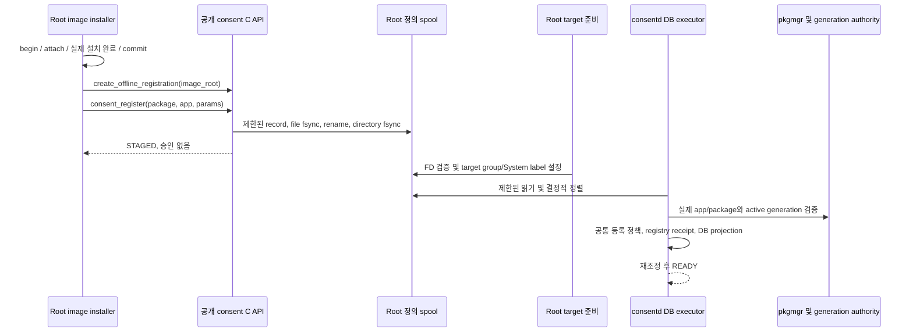

# Offline 정의 등록

이미지 설치 system service는 consentd를 시작하지 않고 공개 `consent_register()`를
호출할 수 있습니다. 먼저 등록 전용 handle을 명시적으로 생성합니다.

```c
consent_client_h client = NULL;
int status = consent_client_create_offline_registration(image_root, &client);
if (!status) {
    /* params: operation_id, expected_generation, 정책/문구 revision과
       번역을 포함한 전체 정의. */
    status = consent_register(client, package_name, app_id, params);
    consent_client_destroy(client);
}
```

`image_root`는 이미 존재하는 root 소유의 보호된 절대 경로입니다. 생성·매 쓰기에서
root 권한이 필요하고 handle은 원래 process/thread에 속합니다. Fork child는 상속된
handle 사용·파기를 할 수 없습니다. 초기 root 전용 writer는 명시적 provisioning
권한이며 shared UID에서 추정한 역할이 아닙니다. Nonroot 제품 system service의
신원이 이미 등록돼 있다고 가정하지 않습니다.

성공0은 **STAGED: 보호된 정의 설치 기록이 내구성 있게 저장됨**을 뜻합니다.
활성화나 사용자 승인을 뜻하지 않습니다. 기존 `consent_client_create()`는 online
계약을 유지하며 socket 부재, 권한·peer 오류, timeout, 불확실 응답으로 offline에
자동 전환하지 않습니다. Offline handle은 `consent_register()`와 파기만 허용합니다.
Update/unregister/request/check/async/detach/UI/session/revoke/data/cleanup은
`CONSENT_ERROR_INVALID_OPERATION`이며 출력 null·async ID0·callback 접수 없음입니다.
독립 params/result/format helper는 사용할 수 있습니다.

## 이미지 설치 generation

Offline handle은 파기까지 배타 lifecycle lock을 유지하므로 generation을 먼저
준비합니다. CLI는 설치 신원만 준비하며 정의는 여전히 C API로 등록합니다.

```sh
# Root가 보호된 빌드 환경을 명시적으로 선택합니다. ROOT는 이미 존재해야 합니다.
ROOT=/opt/consent-image
GEN=$(consent-installation-authority --image-root "$ROOT" \
  begin example.package image-install-1 absent)
consent-installation-authority --image-root "$ROOT" \
  attach example.package example.app image-app-1 "$GEN"
# 실제 이미지 패키지 설치를 완료하고 내구성 있는 완료를 먼저 확인합니다.
consent-installation-authority --image-root "$ROOT" \
  commit example.package image-commit-1 "$GEN"
# 이후 system service가 expected_generation=GEN으로 consent_register를 호출합니다.
```

Begin은 새 generation을 발급·기록하고 attach는 각 app을 기록합니다. Commit은
신뢰된 image installer가 실제 설치의 내구성 있는 완료를 확인한 뒤에만 호출합니다.
Socket 부재로 설치 완료를 추정하지 않습니다. 기존 설치는 예상 이전 generation을
요구하며 안정된 operation ID로 begin/attach/commit/remove 결과를 재시도합니다.
다른 payload는 충돌입니다. 재설치는 generation을 회전하고 제거는 tombstone부터
기록합니다. Register나 시작 경로가 부재한 generation을 만들거나 spool의 과거
generation을 복원하지 않습니다. 운영 Installer transaction/hook은 별도 연동입니다.

`image_root="/"`는 호출자의 현재 filesystem root이며 명시적 image chroot도
포함합니다. 실제 target에서는 daemon과 다른 lifecycle 사용자가 중지돼 있어야
합니다. 같은 EX/SH lock이 image writer와 live daemon의 동시 접근을 막습니다.
Busy이면 기존 lock metadata를 바꾸지 않고 BUSY를 반환합니다. Offline 시스템을
자동 탐지하는 기능이 아닙니다.

## 보호 저장소와 첫 부팅



선택한 이미지 내부 경로는 `/opt/var/lib/consent-authority/registrations`입니다.
Native Parcel v1 record는 `offline_format=1`, package/app, expected generation,
operation ID, 검증된 전체 정의와 `payload_sha256`을 담습니다. 소문자 64자리 hex
해시는 canonical native Parcel Envelope body(`v=1`, `id=1`, `method=register`)를
대상으로 하며 4바이트 frame header와 정확히 두 metadata 필드 `offline_format`,
`payload_sha256`을 제외합니다. 두 필드는 metadata 제거와 import 전에 검증합니다.
버전 누락·미지원, 중복 필드, 해시 변경은 거부하고 metadata도 저장 frame/필드
상한에 포함합니다. 최종 파일명은
SHA256(operation_id)+`.parcel`입니다. 같은 ID/payload 재시도는 성공하고 다른
payload는 CONFLICT입니다. 배타 임시 파일→file fsync→rename→directory fsync로
게시합니다. 게시 후 실패는 OUTCOME_UNKNOWN이며 같은 ID/payload로 재시도합니다.
중단된 유효 임시 파일은 후속 writer가 같은 배타 잠금 안에서 정리합니다.
이미지 경로 생성 중단이 모두 자동 복구되지는 않습니다. 기존 canonical ancestor가
traverse 불가능하면 chmod 없이 거부하므로 신뢰된 builder가 의도한 권한을 명시적으로
복구한 뒤 재시도해야 합니다.

Framed record64KiB, 최종 record128개, 전체 directory entry256개, 임시 파일을
포함한 총4MiB 상한을 적용합니다. 알 수 없는 entry·malformed record·symlink·
hardlink·FIFO·비신뢰 소유자·안전하지 않은 권한은 거부합니다. Directory FD에 고정해
탐색하며 symlink나 `..`를 따라 이미지 밖으로 나가지 않습니다. 새 canonical
`opt/var/lib` ancestor는 umask와 무관하게 root:root0755, authority/spool leaf는0700,
record는0600입니다. 기존 canonical ancestor에도 other-read·other-execute가 필요합니다.
Host NSS 추정 없이 nonroot 데몬이 directory FD를 열 수 있어야 하기 때문입니다.
기존 mode는 몰래 바꾸지 않으며 image-root 자체 host 디렉터리는0700이어도 됩니다.
사용자 쓰기 가능한 build tree 대신 root 보호 image 경로를 사용해야 합니다.

Image mode에는 host SMACK나 target 계정 조회가 필요하지 않습니다. Target 시작
전 root helper가 제한된 관리 파일을 검증하고 root 소유·security_fw group 읽기
(directory0750/record0640)·System SMACK label을 설정합니다. Label 실패는 시작을
차단합니다. 데몬은 root spool을 수정할 수 없으며 자신의 정의 registry와 SQLite는
데몬만 씁니다. Offline 경로는 consent.db/grant/usage/session/permit/artifact를 쓰지
않습니다.

모든 record를 검증합니다. Spool이 비어 있지 않으면 repository를 열기 전에 authority
파싱/schema를 검사합니다. 각 offline 설치 검증은 하나의 보호 FD에서 읽고 분류합니다.
Authority leaf 부재 또는 설치 부재·pending·불일치는 deferred이며 malformed/schema/
보호/I/O 오류는 시작 실패입니다. Strict reconciliation RAII 범위는 repository
Open부터 전체 import와 마지막 Snapshot까지 유지하며 성공·실패 모두 정상 online
검증 상태로 복원합니다. Commit 경계에서도 이 오류 구분을 유지합니다.
그 뒤 package/app/definition/generation, 숫자 policy/text revision,
operation ID 순으로 정렬합니다. DB executor는 Installer Peer를 만들어내지 않고
공통 등록 정책을 사용합니다. 실제 pkgmgr app/package 관계와 보호된 active generation을
재시도 조회 전 및 commit 후 게시 전에 검증합니다. 부재·pending·removed·stale 설치는
deferred로 남기며 다른 package는 처리합니다. 그 밖의 malformed·보호·저장 오류는
진단과 함께 시작을 차단합니다. Spool 재조정은 시작 시에만
실행합니다. 설치 authority를 고치거나 deferred record를 준비한 뒤에는 service를
중지·재시작해야 합니다. 주기적 정책 무효화가 spool을 다시 읽지는 않습니다.

Registry는 SQLite 밖에서 offline operation receipt를 유지합니다. 이미 적용된
receipt는 과거 정의를 다시 반영하지 않고 원결과를 유지합니다. 같은 owner/generation의
기존 정의가 두 revision 축 모두 같거나 높고 하나 이상 더 높거나, 같은 generation의
정의가 inactive라면 처음 보는 seed도 obsolete로 영속 기록하고 같은 재시도에 항상
STALE을 반환합니다. 같은 revision 축의 정책/문구 의미는 같아야 합니다. 교차 revision,
같은 revision의 다른 내용, namespace 변경은 계속 오류입니다. Obsolete receipt에는
offline 전용 tag를 사용하며 기존 online 형식을 바꾸지 않습니다. 실제 새 generation의
정상 등록은 가능하며 DB 삭제는 유효 정의와 retry 보호만 복원하고 승인을 복원하지
않습니다. Record/receipt 상한에서는 명시적으로 오류를 반환하며 자동 pruning은
구현하지 않았습니다.

## 검증과 한계

`scripts/emulator-offline-test.sh`는 socket 없는 실제 C API 등록, malformed/schema authority의 DB 생성 전
시작 거부, 정상 첫 시작, 숫자 revision
순서, 복수 app·다른 package, 재시도·충돌, 지원하지 않는 메서드, live lifecycle 배제,
재시작, DB 소실, unregister 후 미처리 seed, 같은 이름 재설치를 다룹니다. 별도 test
inventory adapter를 사용하며 기존 격리 상태를 보존·복원합니다.
`offline-identity-test`는 실제 보호 reader에서 부재·pending과 malformed·보호·FIFO·
주입 I/O 오류를 구분합니다. Root 소유권·경로·sync
오류 시험과 repository generation·게시 경계 회귀는 별도 실행파일입니다. 운영 adapter의
실제 pkgmgr 검증을 유지하며 격리 inventory 결과만으로 제품 hook 연동을 주장하지
않습니다. 실행 결과와 정확한 snapshot은 [검증 기록](verification.ko.md)에 기재합니다.
구현·시험 파일이 있다는 사실은 실행 통과를 뜻하지 않습니다.

`scripts/emulator-offline-platform-test.sh`는 관측한 실제 설치 app, 잘못된 소속,
stale generation으로 운영 pkgmgr adapter를 별도로 시험합니다. 원래 운영 저장소를
보존·복원하고 역할 설정을 바꾸지 않습니다. 중지한 DB projection과 grant0을 확인하며,
제품 역할을 배포하지 않은 protected C API 권한 판정은 계속 거부합니다.
