# Storage, policy and recovery implementation

This guide describes `src/consentd/repository.{hh,cc}` and its executable tests.
The original CEP remains a proposal. PO decisions are recorded separately in
`decisions.en.md`. This implementation does not store conversation bodies.

## Ownership and durable state

`Repository` belongs to one DB executor thread. Its constructor, public methods
and destructor must run on that owner. It does not invoke client callbacks or
wait for UI responses. All SQL uses bound parameters. Mutations use
`BEGIN IMMEDIATE` and publish results only after `COMMIT` and path validation.

SQLite is configured with `journal_mode=DELETE`, `synchronous=EXTRA` (3),
`foreign_keys=ON`, `secure_delete=ON` and a 100 ms busy timeout. Startup reads
back the journal, synchronization and foreign-key settings and rejects an
unsupported configuration. Schema version 2 is stored in `user_version`.
The version 1 foundation database migrates within one schema transaction by
adding cleanup acknowledgement evidence. Existing definitions and persistent
grants survive; the normal restart policy still invalidates transient state.
An unknown future version fails without erasing or recreating the database.
SQLite's actual flush behavior still depends on the device/filesystem; passing
a process-kill test is not evidence of abrupt power-loss durability.

Three different authorities participate:

| State | Owner and purpose | Contents excluded |
|---|---|---|
| Protected installation-generation authority | Installer adapter; validates installed package/app and current generation | User approvals |
| `definitions.registry` | Repository desired-state authority; complete definitions/messages, package/app/install identity, removal tombstones, operation fingerprints, expected DB device/inode/incarnation | Grants, consumption, sessions, artifacts |
| `consent.db` | Repository projection and durable decisions; schema/revision, definitions, requests, grants, authorizations, sessions, artifacts, provenance and cleanup state | Conversation bodies and artifact contents |

Package/app validation is provided by `SetInstallationValidator`. Production
uses the separate protected generation authority and pkgmgr-info relationship.
Missing validation is denial. `SetPackageGenerationValidator` validates removal
against the current package generation, including an Installer tombstone; an
uninstalled app is not required to remain in pkgmgr-info to permit cleanup.
Direct unit tests supply private callbacks and temporary state. They do not
change production authentication.

Registration requires package and app separately, a stable `operation_id`,
trusted installation identity, definition/enforcement owner, policy and text
versions, allowed modes and default localized messages. A definition cannot be
transferred between package/app owners. A policy rollback or changed meaning
under the same policy version is rejected. Current initial Level 3 policy
permits ONCE only. Source policy values are conservative implementation choices,
not claims that the Context Engine product classification has been finalized.

Removal takes package name and expected installation generation, not an app ID.
All definitions in that package become inactive in one projection transaction;
related grants, authorizations, pending prompts and artifacts are invalidated.
Other packages remain unchanged. A stale removal after reinstallation is
rejected. Same-operation retries have the same payload fingerprint or conflict.

```mermaid
sequenceDiagram
  participant I as Authenticated Installer
  participant R as DB executor / Repository
  participant F as definitions.registry
  participant D as consent.db
  I->>R: package, app, operation, expected generation, definition
  R->>R: Verify installation, ownership, versions and messages
  R->>F: Write unique temporary file; fsync
  R->>F: Atomic rename; fsync directory
  Note over R: Fence authorization until projection succeeds
  R->>D: BEGIN IMMEDIATE; invalidate affected state; update projection/revision
  R->>D: COMMIT
  R->>R: Recheck path identity and installation generation
  R-->>I: Committed response and revision
```

## Recovery and failure behavior

The registry contains a checksum over its canonical contents and is bounded to
4 MiB, 2,048 definitions and 8,192 remembered installation operations. It is not
a cryptographic defense against its trusted owner. Files must be regular,
non-symlink, singly linked, owned by the effective daemon UID and inaccessible
to other users. Parent paths and protected directories are checked. Production
packaging uses service-account-owned protected state; direct tests use an isolated private
directory below sticky `/tmp`.

The expected DB device/inode/incarnation is persisted independently in the registry. Startup
therefore rejects replacement with an older, internally valid DB instead of
reviving its old approvals. Before each operation and before publishing a
successful result, the daemon stats the main DB path; it does not independently
open/close the live DB behind SQLite's POSIX locks. Timer work also checks
integrity and reconciles installation state. The main handle is retired before
quarantining a missing/replaced/corrupt DB's rollback journal, WAL or SHM files.
A surviving hot journal is never applied to a newly created empty main DB.
Each operation captures its epoch immediately after initial recovery checks.
The final response snapshot must still have that epoch: if the snapshot itself
recovers a late deletion, the daemon returns a fresh error without carrying any
old ALLOWED decision, receipt, permit or artifact under the new epoch.

```mermaid
stateDiagram-v2
  [*] --> ValidateAuthority
  ValidateAuthority --> Ready: Valid registry and DB projection
  ValidateAuthority --> Fenced: Missing/corrupt registry or permission/I/O failure
  Ready --> Recovering: Missing/replaced/corrupt DB
  Recovering --> Retire: Stop use of old handle and epoch
  Retire --> Rebuild: Quarantine DB and sidecars; recreate schema
  Rebuild --> Ready: Reconcile validated definitions; no approvals restored
  Rebuild --> Fenced: Recovery cannot establish trusted state
  Ready --> Fenced: Uncertain storage state
```



This detects file replacement and DB incarnation mismatches. Privileged in-place
rollback within the same inode and incarnation would require an independent
per-commit monotonic watermark; the definition authority is not such a watermark.
Unprivileged writers are excluded by the protected filesystem boundary.

Every projection/replay, including startup, first successfully fsyncs the registry
directory. An earlier uncertain rename cannot be trusted merely because it is
readable. SQLite error codes are captured before transaction rollback can alter
the connection's last-error value.

Only explicit SQLite corruption, missing main DB or a detected replacement
permits reconstruction. Generic I/O, permissions, storage-full and unknown
schema failures do not trigger a wipe. Registry loss prevents startup or fences
running authorization; it requires trusted Installer re-registration/recovery,
not fabrication of definitions from a lost DB. Registry rename succeeds before
DB projection: if the projection fails, later startup/job replay applies that
registry revision before authorization becomes available.

A fresh daemon/DB epoch invalidates client caches. Normal restart preserves
PERSISTENT grants if their installation/policy still matches. PENDING requests
become INVALIDATED, nonpersistent grants are revoked, old authorization receipts
are invalidated, sessions enter CLOSING and resident artifacts require cleanup.
No previous session becomes ACTIVE automatically.

After complete DB loss, the daemon cannot reconstruct the lost holder inventory.
`cleanup_reconciliation_required=1` remains durably visible across subsequent
restarts. This is not physical deletion success. Product holders must drop all
old-epoch data and complete their separate reconciliation contract. There is no
API that automatically clears this unknown state without evidence.

## Policy, prompts, sessions and data

Requirements use exact canonical scope matching. Subject/profile delegation is
checked against authenticated peer policy. AUTHORIZE additionally verifies the
registered enforcement owner. All required conditions are evaluated together;
no ONCE grant is consumed unless all conditions are allowed. Stable enforcer,
operation and step identify an authorization retry. A changed payload conflicts,
and revocation, TIMED expiry or invalidation blocks an old receipt. A receipt
is provenance evidence, not a transferable bearer credential.

Only argo requests create prompts. A check never opens UI. UI prompts carry
server-selected policy/text revisions, exact scope, purpose, holder/recipient,
allowed modes and retention. A random token is bound to the request and UI
identity/process instance; a new display rotates it. Expiry, cancellation,
session generation changes and policy changes invalidate old responses.
After an ALLOWED UI response inserts its explicit new grants, the same
transaction rechecks every condition in QUERY mode. It never consumes ONCE.
If a previously satisfied condition expired, was revoked or was consumed while
UI waited, the request finishes INVALIDATED with a reason and current per-row
decisions. The newly approved grant remains available, but no new prompt opens
automatically. DENIED responses also recheck the previously satisfied conditions
and mark only the conditions refused by this prompt as DENIED. A recheck error
rolls back the transaction and leaves the request pending. Once finalized, a
request's recorded outcome is historical; actual execution always needs a new
authoritative check.
Fallback is exact locale, explicit `ko-KR → ko` or `en-US/en-GB → en`, then
registered default. Unregistered general script fallback is not guessed.
Current templates are literal UTF-8: `{...}` placeholders are rejected until a
typed schema and scope-binding formatter are implemented.

Logical sessions are distinct from IPC connections. Session control is bound
to authenticated subject/profile and owner process instance. ACTIVE requires
current generation, idle, absolute and lease deadlines. Explicit suspend and lease expiry use
the requested CONNECTION_BOUND or RESUMABLE_CONVERSATION policy; resume requires
the same owner instance plus a rotated server token and grace deadline.
Heartbeat extends only the connection lease, never idle or absolute lifetime.
The initial implementation has no user-activity refresh API.

Original artifacts require an authoritative receipt bound to session,
generation, scope, purpose, recipient and receiving holder. They are MEMORY_ONLY
metadata, with expiry measured from acquisition, not registration or reuse.
Repeated registration returns the original artifact and deadline. Derived
artifacts retain all parent grant dependencies, the earliest expiry and highest
sensitivity; cross-session/holder/purpose/scope expansion is rejected.
Each derivative materializes the union of its parents' transitive source-grant
dependencies. A shared validator checks exact holder/process/use context,
subject/profile, current session generation/deadlines, artifact state/expiry,
source revocation, current policy and installed generation. Every parent is
checked before derivation; original/derived registration, data checking and the
`check(operation=reuse-data)` alias repeat validation after commit before
publishing success. An external installation change therefore does not depend
on the next timer tick to deny stale provenance. A committed but unpublished
artifact remains recorded and becomes cleanup-pending on reconciliation.

ONCE consumption or TIMED access-grant expiry alone does not erase separately
retained data: the artifact's inherited retention deadline remains the limit.
Deleting a physical parent copy does not by itself revoke a retained child;
the child's transitive grant dependencies and inherited deadline still apply.
Explicit revocation or installation/policy invalidation blocks dependent copies.

Close, revocation and TTL expiry block use before cleanup. A holder's original
process instance can ACK its own artifacts. A restarted process with the same
authenticated stable holder identity can explicitly set `reconcile=1` on
`cleanup_list` and `cleanup_ack`/`data_release`. This cleanup-only path requires
subject/profile delegation and an exact match with the artifact's session
context, and only covers already blocked or deleted artifacts. It does not
change the stored owning instance, transfer use/registration rights, revive a
session/grant, or assume deletion merely because the process restarted.
Acknowledgements record the actual authenticated identity/instance; physical
cleanup remains the trusted holder's responsibility. Failed or absent ACK leaves
CLEANUP_PENDING/CLEANUP_FAILED and CLOSING visible. CLOSED is reached only after
all recorded artifacts are acknowledged deleted. This tracks evidence supplied
by trusted holders; it cannot itself erase another process's data.

PERSISTENT and SESSION allowed request results can opt into short client caching
(up to 500 ms, further bounded by session deadlines). Installation reconciliation,
policy/grant changes and lifecycle mutations change the revision. The server
publishes invalidation, and disconnects or epoch changes require resynchronizing.
AUTHORIZE always accesses current authoritative state. Event delay may leave a
short-lived stale request hint; it does not authorize a protected action.

## Typed localized messages

Definitions may opt into `template_version=1` and declare at most eight named
parameters (names up to 32 bytes). Each `parameter.<name>` binds a type to an
existing source: requirement `scope`, `operation`, `purpose` or `recipient`, or
definition `retention_ms`. Scope accepts string or integer; other request sources
are strings; retention is integer. Integer values use canonical signed int64
decimal and inclusive `min`/`max`. Strings use `max_bytes` between 1 and 512.
Each locale's title/body placeholder union must equal the declared names. Caller
`display_args` and preconstructed argument descriptors are rejected. A displayed
scope of `30` stays the exact query scope; it is never converted to the separate
postacquisition `retention_ms` value.

Typed requests explicitly send matching `rN.policy_version`. Validation precedes
request/authorization retry shortcuts and also covers receipt payloads and each
artifact's original source grant key. The same exact fields form the grant key;
approval for scope `30` cannot authorize scope `90`, create a receipt for it or
broaden an artifact. Original grant validation does not treat consumed ONCE or
expired access duration as expiration of independent retained-data rights.
Schema changes require a higher policy version. For each definition ID, text
revision never decreases, including reinstallation. Changed default locale,
messages or aliases require a higher text revision independently of a policy
bump. Reinstallation with identical text may retain the existing text revision.
Definitions and their typed schemas/aliases survive independent registry replay;
lost approvals are still never reconstructed.

UI asks for a typed prompt with `template_version=1`. The reply carries requested
`locale`, resolved `rN.locale`, and sorted `rN.argM.name/type/value` descriptors
alongside `rN.arg_count` and `rN.template_version`. Selection uses exact registered
locale, an explicit direct `locale_fallback.<requested>` alias, the documented
ko-KR/en-US/en-GB base cases, then the default. No other region/script stripping
is inferred. The requested locale is stored privately with the latest prompt
token and UI instance. Typed responses must return that requested locale and
token; resolved row locales cannot substitute for it. Private locale metadata
is omitted from public pending/final results. Existing literal prompts remain
supported without typed capability negotiation.

Before updating a token, the repository validates the entire response against
240 fields and a 64 KiB frame budget, reserves envelope metadata, and formats
selected title/body into temporary buffers to enforce 8192-byte rendered limits.
An invalid capability/locale or overflow leaves the earlier token usable. Values
containing braces, percent signs or markup are inserted literally once; the UI
must still render the returned text as text. Definition templates remain bounded
to 4096 bytes each. These checks do not reject an otherwise valid schema merely
because its longest possible values could overflow a selected template.

## Executable evidence and limits

`src/tests/repository_test.cc` exercises private repository instances with real
SQLite files. It covers definition ownership/deduplication, multi-app package
removal and reinstall, ONCE consumption and stable retries, all-or-nothing AND,
revocation, stale prompts, session generation/resume, artifact retention, holder
ACK failure/success, persistent restart, valid stale DB replacement, forced live
and stopped DB deletion, surviving journal quarantine and corruption recovery.
It also checks TIMED retry expiry, profile-scoped request lookup, permission
or registry-loss fencing, cache leases, installation generation rotation,
resumable lease expiry, heartbeat/idle separation, multi-parent TTL inheritance,
receipt retry deadlines and cleanup-only reconciliation after holder restart.
It also constructs a version 1 fixture to check migration, persistent approval
preservation, transient restart behavior and refusal of an unknown future schema.
Distinct ONCE contenders and cancel/respond/deadline orders are serialized
repository tests; they do not claim concurrent IPC coverage.
`repository_fault_test.cc` separately interposes `fsync`, `sqlite3_step` and
`sqlite3_close` only inside that test executable. It deterministically verifies
registry directory-sync uncertainty across retry/restart and corruption-code
preservation across rollback. A metadata-corruption fault stays sticky on the
original connection until it is closed, so repeated failing incarnation reads
cannot masquerade as successful recovery. Injected `SQLITE_FULL` and
`SQLITE_IOERR_WRITE` return codes exercise repeated failure and successful retry:
the DB inode, epoch and quarantine inventory stay unchanged, and the existing
persistent approval and definition survive. This tests error classification;
it does not fill a filesystem or reproduce an actual device write failure.
The test exits nonzero on any failed assertion.

`repository_provenance_test.cc` checks B-only installation rotation without a
timer tick through A+B parents and multiple derivative levels, unrelated package
isolation, ONCE/TIMED access versus retention, and inherited deadlines. Its
test-only SQLite interposers rotate the installation authority immediately after
the real COMMIT returns for original/derived registration and both data-check
routes. It requires an error instead of success and verifies that committed
unpublished artifacts remain unusable and discoverable for cleanup.
Two additional cases physically unlink the DB during postcommit validation of
data registration/checking, force recovery in the final snapshot, and require
an error with no old success fields. The unlink asserts that the watched real
COMMIT has returned and SQLite is in autocommit mode. A separate PERSISTENT
grant is proven ALLOWED beforehand; a following call on the same repository
must find its restored definition but require fresh consent.
`repository_ui_test.cc` covers prior-condition changes while UI waits and the
full-AND finalization contract, including rollback on a reevaluation error.
`repository_localization_test.cc` covers schema/value rejection, explicit policy
versions before retries, locale/token binding, bounded expansion and total prompt
size with preservation of the prior token, independent revision rules, literal
compatibility, typed registry recovery and scope widening across receipt/artifact
boundaries. Literal and typed requests with historically accepted `count=01`
produce canonical prompt counts without changing request admission or dedup keys.

`repository_crash_test.cc` pauses a child writer before journal synchronization,
before main-DB synchronization and after successful commit before response,
then sends SIGKILL. It checks persistent revocation rollback or durability and
database integrity after reopening. The main-DB synchronization case verifies
the journal's size and valid header using the documented
[SQLite rollback-journal format](https://www.sqlite.org/fileformat.html#the_rollback_journal).
A fourth case removes the main DB at that boundary before killing the writer:
it tests active-write deletion followed by startup recovery, not recovery while
the original writer continues. A separate fifth case releases that same writer
after deletion. The original operation must not report success; a subsequent
check on the same `Repository` must recover a new epoch with no old approvals.
Both cases also reopen the database and verify integrity. These tests do not
demonstrate abrupt power-loss durability or ONCE-consumption durability across
restart. The validation guide identifies which source snapshot actually passed.
The fixture defaults to `/tmp`, which can be tmpfs on the emulator. To exercise
its persistent filesystem, use
`repository-crash-test --state-root /opt/var/lib/consent-test` after creating
that isolated protected test root. Each scenario creates and removes only its
own `mkdtemp` child. Selecting a persistent path still does not simulate power
loss or force the device's physical cache behavior.

The dedicated `consentd-shutdown-test` adds only
`repository_shutdown_interposer.cc` to the real test daemon. A successful,
nonempty revoke update pauses before COMMIT while the transaction is still
active. The isolated harness observes stop-admission after SIGTERM, releases
the bounded five-second gate, checks normal exit/drain and then verifies the
revocation through the C API after restart. Ready/release files remain under
the daemon-account-owned `/tmp/consent-shutdown-gate` directory. Neither ordinary daemon contains this
gate. Disconnect before reply is an uncertain client outcome; the test's
restart check establishes the accepted mutation's durable result.

GBS builds and emulator execution are recorded in the project validation guide;
this document is not evidence that each acceptance criterion has passed.
Still required beyond these direct tests: abrupt emulator termination/power loss,
actual filesystem exhaustion/device-write failure (distinct from the injected
SQLite FULL/IOERR classification tests),
product Installer transaction integration, holder process-death reconciliation,
remote model cleanup, and sustained load/resource
measurement. Active request/session/artifact admission is bounded. Historical metadata is not automatically
pruned by a finalized retention policy; capacity exhaustion requires explicit
operational handling and never makes a consumed grant reusable.
