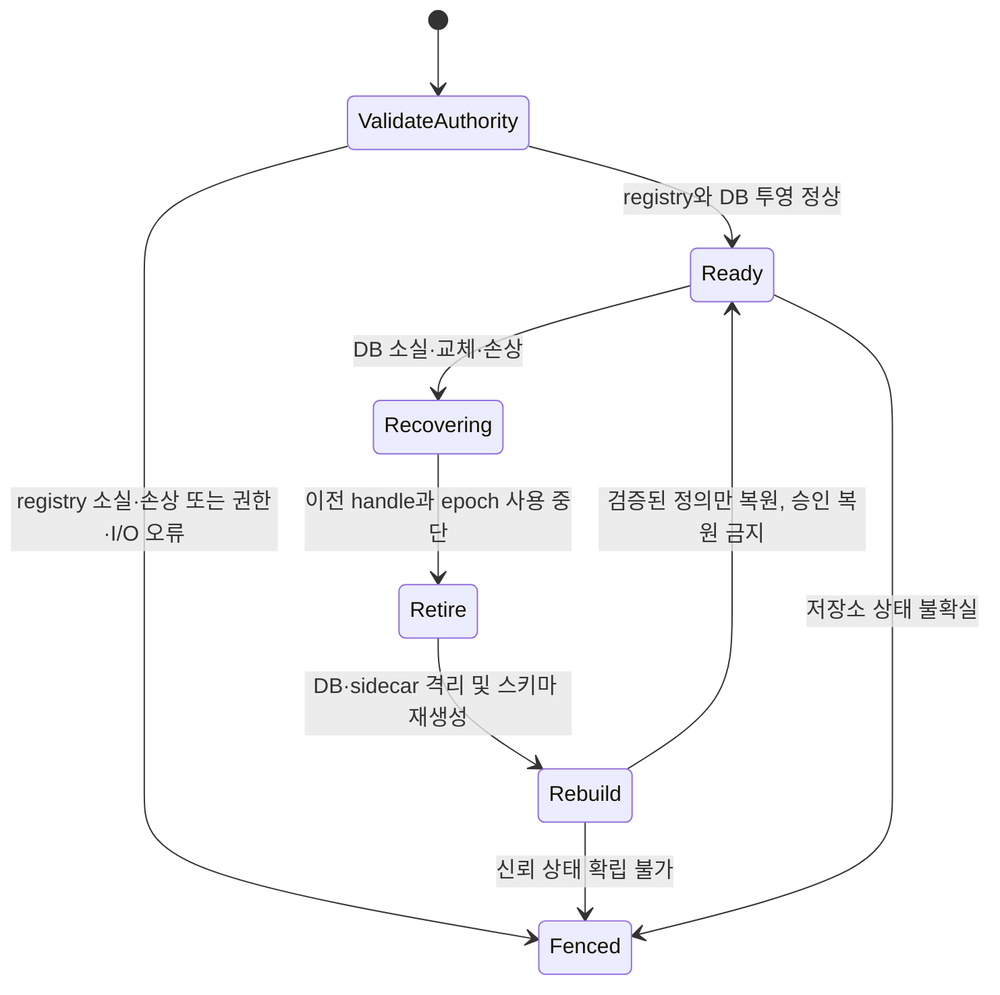

# 저장소·정책·복구 구현

이 문서는 `src/consentd/repository.{hh,cc}`와 실행 테스트의 현재 동작을
설명합니다. 원본 CEP는 설계 제안으로 유지합니다. PO 확정 사항은
`decisions.ko.md`에 별도로 기록합니다. 대화 본문은 저장하지 않습니다.

## 소유권과 영속 상태

`Repository`의 생성·호출·소멸은 하나의 DB executor 스레드가 담당합니다.
저장소는 사용자 응답을 기다리거나 클라이언트 callback을 호출하지 않습니다.
SQL은 바인딩 인자를 사용합니다. 변경은 `BEGIN IMMEDIATE` 트랜잭션으로
처리하고 `COMMIT` 및 경로 신원 재확인이 끝난 뒤 결과를 발행합니다.

SQLite 설정은 `journal_mode=DELETE`, `synchronous=EXTRA`(3),
`foreign_keys=ON`, `secure_delete=ON`, busy timeout 100ms입니다.
시작 시 journal·동기화·외래키 설정을 다시 읽어 지원 여부를 확인합니다.
스키마 버전 1은 `user_version`에 기록합니다. 실제 flush 내구성은 기기와
파일시스템에도 의존합니다. 프로세스 강제 종료 테스트가 돌발 전원 차단의
내구성 증거를 대신하지 않습니다.

서로 다른 세 가지 신뢰 원천을 사용합니다.

| 상태 | 소유자와 목적 | 포함하지 않는 내용 |
|---|---|---|
| 보호된 설치 generation authority | Installer adapter; 설치된 패키지/app 및 현재 세대 검증 | 사용자 승인 |
| `definitions.registry` | Repository의 정의 원본; 정책·문구 전체, 패키지/app/설치 신원, 삭제 tombstone, 작업 fingerprint, 기대 DB device/inode/incarnation | grant·소비·세션·artifact |
| `consent.db` | 정의 투영과 영속 결정; 스키마/revision, 요청·grant·authorization·세션·artifact·출처·정리 상태 | 대화 본문 및 artifact 내용 |

`SetInstallationValidator`가 패키지/app 관계와 설치 신원을 검증합니다.
운영 경로는 별도의 보호된 generation authority와 pkgmgr-info 관계를
사용합니다. 검증기가 없으면 허용하지 않습니다.
`SetPackageGenerationValidator`는 Installer tombstone을 포함한 현재
패키지 generation으로 삭제를 검증합니다. 삭제된 앱이 pkgmgr-info에 남아
있어야만 정리할 수 있는 구조는 아닙니다. 직접 단위 테스트는 임시 경로와
전용 callback을 사용하며 운영 인증을 변경하지 않습니다.

등록은 패키지명과 appid를 각각 받고, 안정된 `operation_id`, 검증된 설치 신원,
정의·집행 소유자, 정책/문구 버전, 승인 방식과 기본 다국어 문구를 요구합니다.
정의 소유권을 다른 패키지/app으로 이전할 수 없습니다. 정책 버전 역행이나
같은 버전에서의 의미 변경은 거부합니다. 초기 Level 3 정책은 ONCE만
허용합니다. 이 제한은 보수적인 구현 선택이며 Context Engine 제품 등급표가
확정되었다는 의미는 아닙니다.

삭제는 패키지명과 기대 설치 generation으로 수행하며 appid는 요구하지
않습니다. 한 트랜잭션에서 패키지 내 모든 앱의 정의를 비활성화하고 관련
승인·authorization·대기 prompt·artifact를 무효화합니다. 다른 패키지에는
영향을 주지 않습니다. 재설치 후 도착한 이전 삭제는 거부합니다. 같은 작업을
재시도하면 payload fingerprint가 같아야 하며, 다르면 충돌로 반환합니다.

```mermaid
sequenceDiagram
  participant I as 인증된 Installer
  participant R as DB executor / Repository
  participant F as definitions.registry
  participant D as consent.db
  I->>R: 패키지, app, 작업, 기대 generation, 정의
  R->>R: 설치·소유권·버전·문구 검증
  R->>F: 임시 파일 작성 및 fsync
  R->>F: 원자적 rename 및 디렉터리 fsync
  Note over R: DB 투영 완료 전 권한 판단 차단
  R->>D: BEGIN IMMEDIATE; 관련 상태 무효화; 정의/revision 투영
  R->>D: COMMIT
  R->>R: 경로 신원·설치 generation 재확인
  R-->>I: 커밋 결과와 revision
```

## 복구와 실패 처리

registry는 정규화된 내용의 checksum을 포함하며 4MiB, 정의 2,048개,
설치 작업 기억 8,192개로 제한합니다. checksum은 신뢰하는 파일 소유자의
변조를 방어하는 서명이 아닙니다. 파일은 symlink가 아닌 단일 hard link의
일반 파일이어야 하며 daemon 유효 UID가 소유하고 타 사용자에게 노출하지
않아야 합니다. 상위 경로와 보호 디렉터리도 검사합니다. 운영 패키징은 root
소유 보호 경로를 사용하고 직접 테스트는 sticky `/tmp` 아래 전용 경로를
사용합니다.

DB의 기대 device/inode와 무작위 incarnation을 registry에 따로 영속화합니다. 따라서 내부적으로
정상인 과거 DB 사본으로 교체하더라도 시작 시 이를 발견해 옛 승인을 되살리지
않습니다. 매 작업 전과 성공 응답 발행 전에 DB 경로를 stat합니다. SQLite의
POSIX 잠금에 영향을 주는 별도 live DB open/close는 하지 않습니다. 타이머는
무결성과 설치 상태를 확인합니다. 기존 handle을 폐기한 후 DB의 rollback
journal·WAL·SHM을 함께 격리합니다. main DB만 없어진 경우 남아 있는 hot
journal을 새 빈 DB에 재생하지 않습니다.



파일 교체와 DB incarnation 불일치를 검출합니다. 권한 있는 주체가 같은 inode와
incarnation을 유지하며 과거 상태로 덮어쓰는 경우에는 별도의 커밋별 단조
watermark가 필요합니다. 정의 authority는 이러한 watermark가 아닙니다.
비인가 쓰기는 보호된 파일시스템 경계에서 차단합니다.

시작을 포함한 모든 투영/재생 경로는 먼저 registry 디렉터리 fsync에 성공해야
합니다. 이전 rename 결과를 읽을 수 있다는 이유만으로 내구성 불확실 상태를
해제하지 않습니다. SQLite 오류 코드는 rollback이 연결의 마지막 오류를 변경하기
전에 보존합니다.

명시적인 SQLite 손상, main DB 소실 또는 교체 감지만 재구성을 허용합니다.
일반 I/O·권한·용량 부족·알 수 없는 스키마 오류로 DB를 지우지 않습니다.
registry가 없어지면 시작을 거부하거나 실행 중 권한 판단을 차단합니다.
신뢰하는 Installer의 재등록·복구가 필요하며 없어진 DB에서 정의를 만들어낼
수 없습니다. registry rename은 DB 투영보다 먼저 완료합니다. 투영 실패 시
다음 시작/작업에서 해당 registry revision을 재생한 뒤 권한 판단을 재개합니다.

새 daemon/DB epoch는 클라이언트 캐시를 무효화합니다. 정상 재시작은 설치·정책이
같은 PERSISTENT 승인을 유지합니다. PENDING은 INVALIDATED가 되고 비지속
승인과 이전 authorization receipt는 무효화됩니다. 세션은 CLOSING으로 전환하고
잔존 artifact 정리를 요구합니다. 이전 세션을 자동 ACTIVE로 복원하지 않습니다.

DB 전체 소실 후에는 과거 holder 목록을 재구성할 수 없습니다.
`cleanup_reconciliation_required=1`을 후속 재시작에도 영속적으로 노출합니다.
이 값은 물리 삭제 성공이 아닙니다. 제품 holder는 이전 epoch 데이터를 차단하고
별도 정합 계약에 따라 정리해야 합니다. 증거 없이 이 불확실 상태를 자동으로
해제하는 API는 없습니다.

## 정책·prompt·세션·데이터

requirement는 정규화된 scope의 정확 일치로 비교합니다. 인증된 peer 정책으로
subject/profile 위임을 검증하고 AUTHORIZE는 등록된 집행 소유자도 확인합니다.
모든 필수 조건을 함께 평가하며 하나라도 부족하면 ONCE를 소비하지 않습니다.
집행 주체·operation·step으로 재시도를 식별합니다. payload가 달라지면 충돌하고,
철회·TIMED 만료·무효화 후에는 과거 receipt로 다시 허용하지 않습니다.
receipt는 출처 증거이며 양도 가능한 bearer 권한이 아닙니다.

argo만 prompt를 생성합니다. check는 UI를 열지 않습니다. prompt에는 서버가
선택한 정책/문구 버전, 정확 scope·목적·holder/recipient·승인 방식·보관 조건이
포함됩니다. 무작위 token은 요청 및 UI 신원/프로세스 인스턴스에 결합되며 다시
표시하면 교체합니다. 기한·취소·세션 generation·정책 변경은 이전 응답을
무효화합니다. locale은 정확 일치, 명시적인 `ko-KR → ko`, `en-US/en-GB → en`,
등록 기본 언어 순서입니다. 임의 script fallback은 추측하지 않습니다. 현재
문구는 literal UTF-8이며 typed schema와 scope 결합 formatter를 구현하기 전에는
`{...}` placeholder를 거부합니다.

논리 세션과 IPC 연결을 분리합니다. 세션 제어는 인증된 subject/profile 및 소유
프로세스 인스턴스에 결합됩니다. ACTIVE 사용은 현재 generation과 idle·절대·lease
기한을 요구합니다. 명시적인 suspend와 lease 만료는 CONNECTION_BOUND 또는
RESUMABLE_CONVERSATION 정책을 적용합니다. resume은 동일 소유 인스턴스,
회전하는 서버 token 및 유예 기한을 검증합니다. heartbeat는 lease만 갱신하며
idle·절대 수명을 연장하지 않습니다. 초기 구현에는 사용자 활동 갱신 API가 없습니다.

원본 artifact 등록은 session·generation·scope·목적·recipient·수신 holder에
결합된 확정 receipt를 요구합니다. MEMORY_ONLY 제어 메타데이터만 저장하며
만료는 등록·재사용 시각이 아닌 취득 시각을 기준으로 합니다. 재등록은 기존
artifact와 기한을 반환합니다. 파생 artifact는 모든 부모의 grant 의존 관계,
가장 빠른 만료, 가장 높은 등급을 상속하며 다른 세션/holder/목적/scope로 확장하지
않습니다.

종료·철회·TTL 만료는 먼저 사용을 차단합니다. 실제 holder 프로세스 인스턴스가
자신의 artifact 정리를 ACK해야 합니다. 실패·무응답은 CLEANUP_PENDING 또는
CLEANUP_FAILED 및 CLOSING으로 남습니다. 기록된 모든 artifact의 삭제 ACK가
확인되어야 CLOSED가 됩니다. 이는 신뢰 holder의 증거를 기록하는 기능이며
다른 프로세스의 데이터를 직접 지우는 기능은 아닙니다.

PERSISTENT와 SESSION 허용 request 결과는 짧은 캐시를 사용할 수 있습니다.
TTL은 최대 500ms이고 세션 기한으로 더 제한합니다. 설치 정합·정책/승인 변경·수명
전이는 revision을 변경합니다. 서버는 무효화 이벤트를 발행하고 연결 종료나
epoch 변경은 재동기화를 요구합니다. AUTHORIZE는 항상 현재 원본 상태를
확인합니다. 이벤트 지연 동안 잠시 오래된 request 힌트가 남을 수 있으나
보호 작업 실행을 허가하지는 않습니다.

## 실행 증거와 남은 범위

`src/tests/repository_test.cc`는 실제 SQLite 파일과 전용 repository 인스턴스로
정의 소유권·중복 방지, 복수 앱 패키지 삭제/재설치, ONCE 및 재시도, AND 원자성,
철회, 오래된 prompt, 세션 generation/resume, artifact 보관, holder ACK
실패/성공, 지속 승인 재시작, 정상 과거 DB 교체, 실행/중지 중 강제 DB 삭제,
남은 journal 격리 및 손상 복구를 검사합니다. TIMED 재시도 만료, profile 단위
요청 조회, 권한 오류와 registry 소실 시 차단도 검사합니다. 실패 시 비영 종료합니다.

GBS 빌드와 emulator 실행 증거는 프로젝트 검증 문서에 기록합니다. 이 문서만으로
모든 수용 기준을 통과했다고 주장하지 않습니다. 각 쓰기 경계의 결정적 강제 종료,
돌발 emulator 종료/전원 차단, 용량 부족/I/O 주입, 제품 Installer 트랜잭션 연동,
holder 프로세스 사망 후 정합, 외부 모델 정리, typed 다국어 인자와 장시간 부하
검증은 별도로 필요합니다. 활성 요청·세션·artifact에는 접수 상한이 있지만 과거 메타데이터의 확정된
보존 정책에 따른 자동 정리는 아직 없습니다. 상한 초과는 운영 조치가 필요하며 이미 소비한
승인을 다시 사용 가능하게 만드는 방식으로 처리하지 않습니다.
